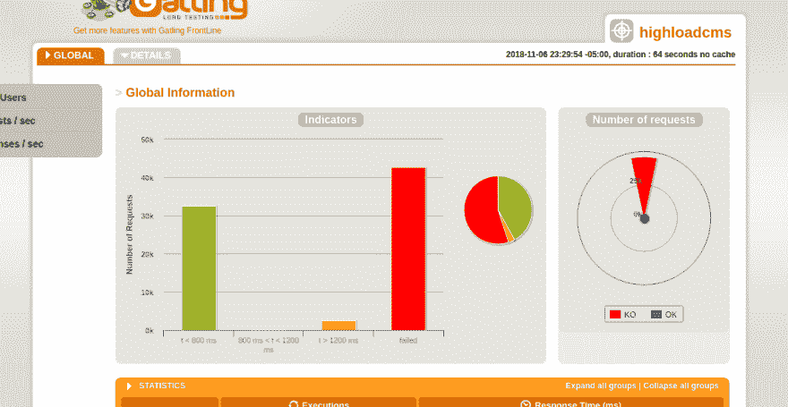
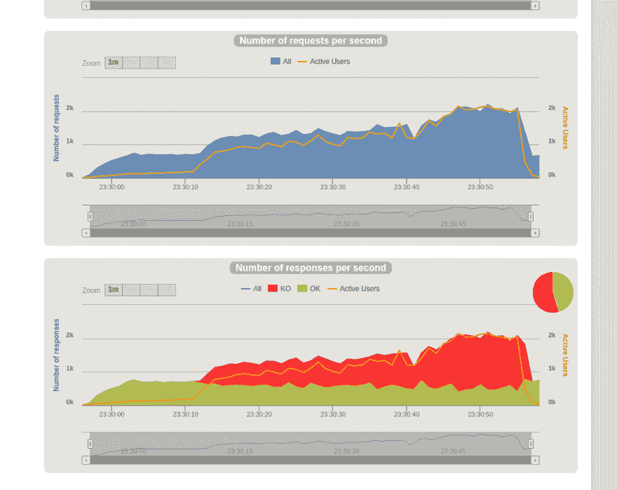
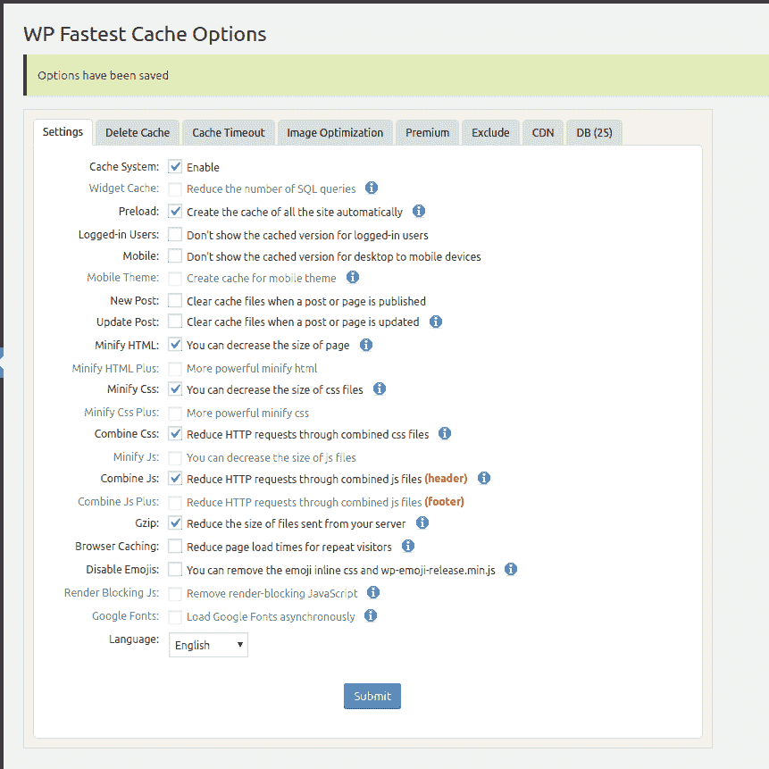
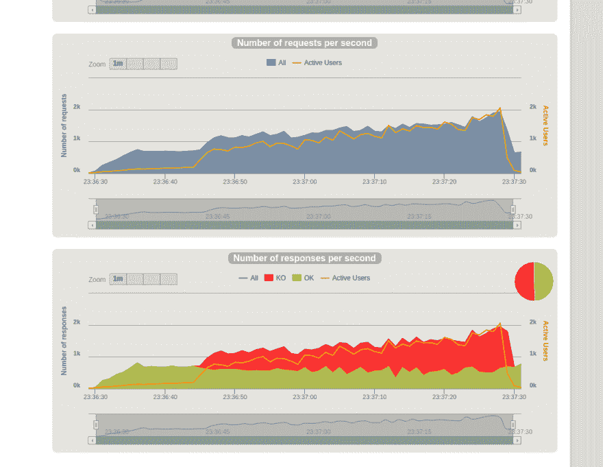
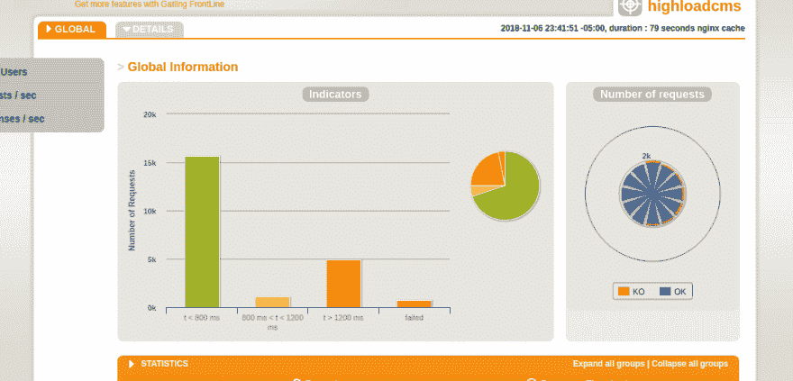
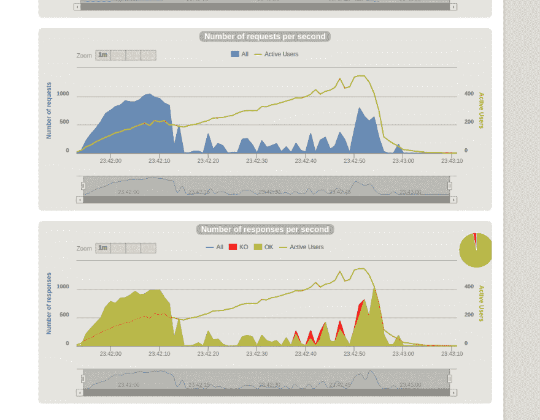

# web 服务器缓存到底有多有效？非常。

> 原文：<https://dev.to/david_j_eddy/just-how-effective-is-web-server-caching-very-4a7c>

运行一个高负荷的网站可以作为长期压力对人体负面影响的测试案例。精神压力大，脱发，睡眠不足，心力交瘁，社交脱节。谢天谢地，事情不必如此。运行一个高负载的 web CMS 并不一定有压力。跟我来，因为我设置和 Wordpress CMS 来处理每分钟 1000 个用户**比午餐的费用少。**

 **注意:这不是 HA(高可用性)配置，也没有准备好投入生产。思想，这是一个坚实的起点。

## 工具带的工具！

这个解决方案利用的工具非常普通。这里没有花哨的具有多云 CDN 边缘位置的 HAProxy 集群。简单才是王道。一个运行 Ubuntu 服务器的基本的底层 Lightsail 实例。运行最小基础设施的总成本:大约 10 美元/月。你会在数据传输上付出多少取决于你自己。

**技术堆栈**:

*   AWS IaaS 提供商
*   Lightsail -计算实例
*   Ansible、Terraform 和 Gatling 用于测试

## 安装所有的东西(程序)

为了尽可能容易地设置和测试不同的配置，我创建了一个简单的 Terraform 配置，并使用 Ansible 来安装和配置不同的。测试中的三个配置是无缓存、Wordpress 插件缓存和 Nginx 微缓存。那里没什么可稀奇的。如果你感兴趣的话，这里有 GiT 回购协议。

## 缓存，hoah，有什么用！

每当用户请求一个页面时，请求由 Nginx(web 服务器)处理，然后解释器处理 Wordpress PHP 逻辑并输出 HTML/JS/CSS。将有效负载传递给 Nginx 以返回给请求用户。这个过程中的两个步骤可以通过缓存大大加速。缓存在给定的时间内保留响应的副本，返回存储的副本，而不是每次都重新处理整个请求。

我们需要实现两个缓存设置:Wordpress 通过 [WP 超级缓存](https://blog.davidjeddy.com/wp-admin/plugin-install.php?tab=plugin-information&plugin=wp-super-cache&TB_iframe=true&width=600&height=550)插件和 Nginx 微缓存。

因为我们将运行 PHP 7.x，缺省情况下 OPcache 是启用的，所以我们现在不需要担心这个问题(不像 PHP 5.x)。

## ~~聚会~~图片时间！

截至 2018 年 11 月 2 日，以下所有配置在运行最新 Nginx、MySQL 和 PHP 的 Ubuntu 18.04 上 1 分钟时间长度内的基线为 1000 名用户。

首先，让我们看一个根本没有缓存的基本 LEMP 安装。

<figure>

<figcaption>Wordpress CMS，无缓存。</figcaption>

</figure>

<figure> 

<figcaption>大约 200 个并发用户后看起来很丑。</figcaption>

</figure>

哇，那太难了。但这给了我们一个底线。看起来在事情变糟之前，这台机器每秒可以处理大约 200 个用户。

用下面的设置安装和配置 Wordpress 缓存，我们测试一种应用程序级别的缓存。

<figure>

<figcaption>Wordpress 缓存插件最高评级，这里是设置。</figcaption>

</figure>

<figure> 

<figcaption>好一点，但真的是希望更好，</figcaption>

</figure>

所以应用级缓存降低了失败率；但还不够重要。

最后，我拆除了设置，并建立了一个新的设置。这一次 Nginx 微缓存只有一分钟的寿命。

<figure> 

<figcaption>现在这还差不多。</figcaption>

</figure>

<figure> 

<figcaption>请求进来，响应出去；很快。</figcaption>

</figure>

嘣！看那个！当然，仍然有一些错误，但哇！用户在一分钟内从 0 线性增长到 1000，就像某些人的生意一样。我注意到，考虑到 Nginx 缓存，最大并发用户数要低得多。深入研究后，我发现这是由于请求正在完成，而不是堵塞系统。

## 结束了，老板。

在一分钟结束时，每秒 1000 个用户，而这个小小的 web 服务器还在滴答作响，就像什么都没发生一样。我会考虑这种高性能，因为它只需要很少的配置工作。

那么，性能对业务有什么作用呢？降低运营成本。每个请求所需的时间和硬件资源越少，给定硬件可以处理的请求就越多。对于给定的工作负载，这直接转化为更低的运营成本。性能为王，在情理之中。

在下面留下评论，让我知道你的想法；或者您在性能调优方面的经验。**