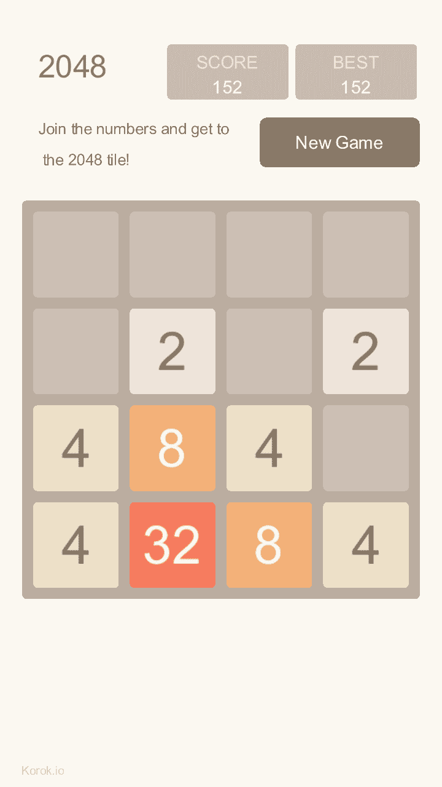
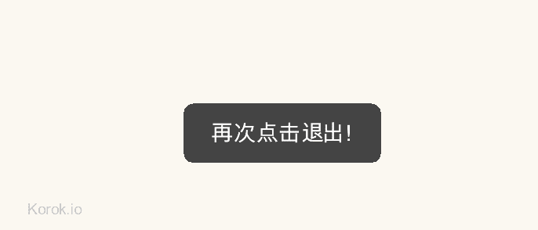

# 只需将 Golang 游戏移植到 Android 上

> 原文：<https://dev.to/ntoooop/just-port-a-golang-game-to-android--3a9f>

几个月前， [@hajimehoshi](https://dev.to/hajimehoshi) 写了一个帖子[我们为我们的游戏](https://dev.to/hajimehoshi/go-packages-we-developed-for-our-games--4cl9)开发的围棋包，他用`gomobile bind`将围棋游戏移植到他的引擎 ebiten 中的 Android 上。但是这里我用`gomobile build`，`gomobile build`可以直接打包`.apk`，不需要其他依赖。

我写了一个游戏引擎来实现一些基本的游戏逻辑。不过我就不说了(对有兴趣的人: [https://korok.io](https://korok.io) )今天我就说说我们在使用‘gomobile build’命令时遇到的问题。

下面是我制作的 2048 游戏:
[](https://res.cloudinary.com/practicaldev/image/fetch/s--fK8NRpqd--/c_limit%2Cf_auto%2Cfl_progressive%2Cq_auto%2Cw_880/https://thepracticaldev.s3.amazonaws.com/i/c4v1s8kz6fs5l879wbyf.png)

可以在 itch . io:[2048 游戏](https://ntop.itch.io/the-2048-game)上获得

## 如何制作全屏/无标题栏屏幕？

第一个问题是要做一个全屏，`gomobile`没有提供任何配置来做到这一点。在阅读了 [gomobile wiki](https://github.com/golang/go/wiki/Mobile) 之后，我知道我可以在我的项目的根目录下创建一个`AndroidManifest.xml`文件。`gomobile`将它包含在安卓 APK 文件中。

这是我在项目中使用的清单文件:

```
<?xml version="1.0" encoding="utf-8"?>
<manifest xmlns:android="http://schemas.android.com/apk/res/android"
          android:versionCode="1" android:versionName="1.0" package="io.korok.ad2048">
    <application android:label="2048 Game">
        <activity android:label="2048 Game"
                  android:name="org.golang.app.GoNativeActivity"
                  android:configChanges="keyboardHidden|orientation"
                  android:theme="@android:style/Theme.NoTitleBar.Fullscreen"
                  android:screenOrientation="portrait">
            <meta-data android:name="android.app.lib_name" android:value="2048" />
            <intent-filter>
                <action android:name="android.intent.action.MAIN" />
                <category android:name="android.intent.category.LAUNCHER" />
            </intent-filter>
        </activity>
    </application>
</manifest> 
```

Enter fullscreen mode Exit fullscreen mode

在文件中，`android:theme="@android:style/Theme.NoTitleBar.Fullscreen"`会使一个全屏。

## 我的游戏数据存放在哪里？

在我的 2048 游戏中，我需要将分数值存储在本地存储中。作为一名 Android 开发人员，我知道有三种方法可以在 Android 中存储数据:

1.  文件
2.  共享首选项
3.  SQLite

Go 中没有包装方法。但是，如果我能找到一个可写的文件目录，我可以使用文件系统。看了`android.go`的源代码，我看到`gomobile`有一个环境值——‘TMPDIR’，代表一个临时文件目录(只在 Android 上有效):

```
var filepath = os.Getenv("TMPDIR") 
```

Enter fullscreen mode Exit fullscreen mode

然后，我可以创建文件和存储数据。

## 如何获取系统语言？

如果你安装了我的 2048 游戏，你会发现它支持多语言(中文和英文)，我通过获取系统语言来实现这一点。获取系统语言比获取可写文件路径更难，需要编写 glue 方法:Go -> Cgo -> Java。我还会学 JNI 从 C 调用 java 方法，幸好 JNI 像 java 反射，很容易！

下面是获取系统语言的代码:

```
/*
#cgo LDFLAGS: -landroid

#include <jni.h>
#include <stdlib.h>
#include <string.h>

// Equivalent to:
// String lan = Locale.getDefault().getLanguage();
char* kk_getLanguage(uintptr_t java_vm, uintptr_t jni_env, jobject ctx) {
    JavaVM* vm = (JavaVM*)java_vm;
    JNIEnv* env = (JNIEnv*)jni_env;

    jclass locale_clazz = (*env)->FindClass(env, "java/util/Locale");
    jmethodID getdft_id = (*env)->GetStaticMethodID(env, locale_clazz, "getDefault", "()Ljava/util/Locale;");
    jobject locale = (*env)->CallStaticObjectMethod(env, locale_clazz, getdft_id);

    jmethodID getlang_id = (*env)->GetMethodID(env, locale_clazz, "getLanguage", "()Ljava/lang/String;");
    jobject lang = (*env)->CallObjectMethod(env, locale, getlang_id);
    const char* str = (*env)->GetStringUTFChars(env, (jstring) lang, NULL);
    char * retString = strdup(str);
    (*env)->ReleaseStringUTFChars(env, (jstring)lang, str);
    return retString;
}
 */
import "C"
import (
    "golang.org/x/mobile/app"
    "unsafe"

)

func Language() string {
    return deviceAttr.Lang(func() string {
        var ret string
        app.RunOnJVM(func(vm, jniEnv, ctx uintptr) error {
            cstring := C.kk_getLanguage(C.uintptr_t(vm), C.uintptr_t(jniEnv), C.jobject(ctx))
            ret = C.GoString(cstring)
            C.free(unsafe.Pointer(cstring))
            return nil
        })
        return ret
    })
} 
```

Enter fullscreen mode Exit fullscreen mode

注意:`app.RunOnJVM`方法是访问 JNI 的一个有用的方法，最新版本的 gomobile 有这个方法。

## 后退键！

当我在 Android 设备上安装我的游戏时，我发现如果我按下 Back 键，它就会退出。我在玩的时候不小心碰到后背，这不是正常的行为。大多数 Android 游戏都有一个“双击退出”机制，以确保你真的想退出游戏。

好消息是你可以从 gomobile 得到关键事件，坏消息是 gomobile 忽略了返回键。`android.go`中有一个名为`convAndroidKeyCode`的函数，将 Back 键映射为 Unknown。为了解决这个问题，我必须改变 gomobile 中的代码，我在一个新的分支中这样做了(谢谢 git！！).

```
// event/key/key.go
// generate different Codes (but the same Rune).
    Code Code

+   // Origin is the original value of the key code.
+   Origin int
+
    // Modifiers is a bitmask representing a set of modifier keys: ModShift,
    // ModAlt, etc.
    Modifiers Modifiers

// app/android.go
k := key.Event{
        Rune: rune(C.getKeyRune(env, e)),
        Code: convAndroidKeyCode(int32(C.AKeyEvent_getKeyCode(e))),
+       Origin: int(C.AKeyEvent_getKeyCode(e)),
    }
    switch C.AKeyEvent_getAction(e) {
    case C.AKEY_STATE_DOWN: 
```

Enter fullscreen mode Exit fullscreen mode

添加一个新的字段“Origin ”,我可以用它来获得原始的键码值。

```
case key.Event:
    if e.Origin == 4 {
           // do something
    } 
```

Enter fullscreen mode Exit fullscreen mode

注意:在 Android 上 Back 键的值是 4。你还需要重建`gomobile`工具来使它工作。

我可以得到 Back 键事件，但游戏仍然存在。要改变 Android 上默认的 Back 键行为，需要覆盖`Acitivty`类中的`OnBackPressed`方法。

gomobile 包中有一个名为`GoNativeActivity.java`的`java`文件，这是活动声明的地方。添加以下方法:

```
 @Override
    public void onBackPressed() {
        Log.e("Go", "Override Back key");
    } 
```

Enter fullscreen mode Exit fullscreen mode

注意:你还需要用`go run gendex.go`重新生成`dex.go`文件，然后重新构建`gomobile`。

## 如何手动退出 app？

现在，我们覆盖了默认的 Back key 事件，并且可以获得 Back key 事件，接下来我们应该做什么呢？一个简单的方法是调用`panic`方法，只需杀死有异常的进程。或者我们可以把`Activity.finish()`方法称为用胶水粘合的方法，我写过一些 JNI 方法，没那么难。

```
/*
#cgo LDFLAGS: -landroid

#include <jni.h>
#include <stdlib.h>
#include <string.h>

// Equivalent to:
// Activity.Finish()
void kk_finish(uintptr_t java_vm, uintptr_t jni_env, jobject ctx) {
    JavaVM* vm = (JavaVM*)java_vm;
    JNIEnv* env = (JNIEnv*)jni_env;
    jclass clazz = (*env)->GetObjectClass(env, ctx);
    jmethodID finish_id = (*env)->GetMethodID(env, clazz, "finish", "()V");
    (*env)->CallVoidMethod(env, ctx, finish_id);
}
 */
import "C"
import (
    "golang.org/x/mobile/app"
    "unsafe"

)

func Quit() {
    app.RunOnJVM(func(vm, jniEnv, ctx uintptr) error {
        C.kk_finish(C.uintptr_t(vm), C.uintptr_t(jniEnv), C.jobject(ctx))
        return nil
    })
} 
```

Enter fullscreen mode Exit fullscreen mode

我还做了一个‘双击退出’:
[](https://res.cloudinary.com/practicaldev/image/fetch/s--UTQPjvQP--/c_limit%2Cf_auto%2Cfl_progressive%2Cq_auto%2Cw_880/https://thepracticaldev.s3.amazonaws.com/i/clrptnqaj2avl0nv82i5.png)

## 保存 eglContext！！

如果我在 Android 设备上按下 Home 键，系统会把我的游戏带回来。然后再次点击游戏图标，系统会把我的游戏带到前面，但是，它是一个白屏！！！什么都没有显示！！！我搜索了很多关于这种可怕的行为，似乎 Android 应用程序暂停时会丢失 eglContext。Ebiten 有一些代码来恢复 eglContext，重新加载所有着色器/纹理...但我认为实现这个太复杂了，SDL2 使用 setPreserveEGLContextOnPause 方法，我也可以在 gomobile 上实现同样的逻辑。

在`android.c`文件中，添加一个新的全局变量`EGLContext context = NULL;`，如果有效就重用它，如果无效就创建它。

```
// app/android.c
 EGLDisplay display = NULL;
 EGLSurface surface = NULL;
+EGLContext context = NULL;

-   const EGLint contextAttribs[] = { EGL_CONTEXT_CLIENT_VERSION, 2, EGL_NONE };
-   context = eglCreateContext(display, config, EGL_NO_CONTEXT, contextAttribs);
+    if (context == NULL) {
+        const EGLint contextAttribs[] = { EGL_CONTEXT_CLIENT_VERSION, 2, EGL_NONE };
+        context = eglCreateContext(display, config, EGL_NO_CONTEXT, contextAttribs);
+    } 
```

Enter fullscreen mode Exit fullscreen mode

这些变化非常有效。现在，我的游戏可以正确暂停和恢复。

注意:您需要重新构建`gomobile`工具！

## 如何设置‘targetSdkVersion’？

我想我已经修复了所有的错误，并成功地建立了一个 APK 文件。但当我将 APK 文件上传到 GooglePlay 时，它总是失败，并显示一条错误消息——“你需要针对 Android 版本 26”！！

作为一名经验丰富的 Android 开发人员，我知道如何修复它，只需在' AndroidManifest.xml '中添加' targetSdkVersion=26 '即可。但是，不幸的是，它失败了，gomoile 抱怨说:

```
manual declaration of uses-sdk in AndroidManifest.xml not supported 
```

Enter fullscreen mode Exit fullscreen mode

Gomobile 在创建 APK 文件时一定做了一些奇怪的逻辑。在深入研究了`build_androidapp.go`和`binres.go`文件之后，我发现 gombile 检查了‘uses-SDK’元素，并且构建过程失败:

```
case "uses-sdk":
    return nil, fmt.Errorf("manual declaration of uses-sdk in AndroidManifest.xml not supported")
case "manifest": 
```

Enter fullscreen mode Exit fullscreen mode

我还找到了“gomobile”设置“minSdkVersion”的地方，但是，它从未设置过`targetSdkVersion`，所以我添加了一些代码:

```
if !skipSynthesize {
    s := xml.StartElement{
        Name: xml.Name{
            Space: "",
            Local: "uses-sdk",
        },
        Attr: []xml.Attr{
            xml.Attr{
                Name: xml.Name{
                    Space: androidSchema,
                    Local: "minSdkVersion",
                },
                Value: fmt.Sprintf("%v", MinSDK),
            },
            xml.Attr{
                Name: xml.Name{
                    Space: androidSchema,
                    Local: "targetSdkVersion",
                },
                Value: fmt.Sprintf("%v", 26),
            },
        },
    } 
```

Enter fullscreen mode Exit fullscreen mode

最后，我不得不说，这是一条漫长的道路，我修复了所有的问题，并上传到 GooglePlay。欢迎下载我的 2048 游戏，99%的 Golang，没有广告，干净的设计，流畅的动画...是啊，只是安装，我很高兴听到这一点。

下面是 itch.io 的链接:[2048 游戏](https://ntop.itch.io/the-2048-game)

我还在 Github 中创建了几个问题，但是现在没有响应:

1.  [x/mobile:不支持手动声明 AndroidManifest.xml 中的使用-SDK](https://github.com/golang/go/issues/27023)
2.  [x/mobile:在 Android 上无法获取返回键事件](https://github.com/golang/go/issues/26985)
3.  [x/mobile:当 Android 上的活动暂停时保留 eglContext】](https://github.com/golang/go/issues/26962)
4.  x/mobile:生命周期。StageDead 在 Android 上永远不可用