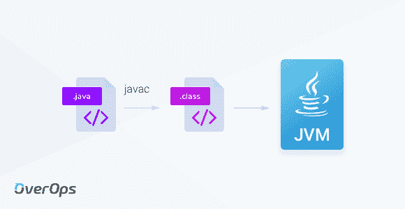
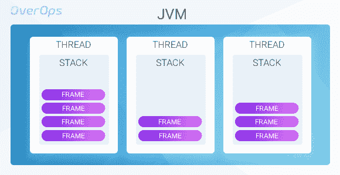
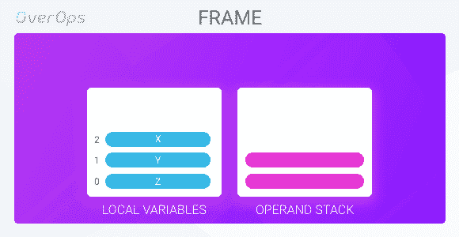
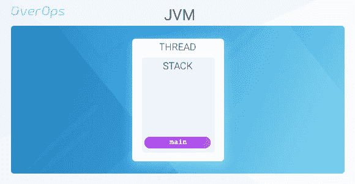
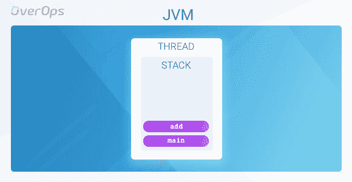

# JVM 架构 101:了解你的虚拟机

> 原文：<https://dev.to/overopshq/jvm-architecture-101-get-to-know-your-virtual-machine-1bcd>

Java 应用程序无处不在，它们在我们的手机、平板电脑和电脑上。在许多编程语言中，这意味着多次编译代码，以便在不同的操作系统上运行。对于我们这些开发人员来说，Java 最酷的地方可能就是它被设计成了平台无关的(就像老话说的那样，“编写一次，在任何地方运行”)，所以我们只需要编写和编译一次我们的代码。

这怎么可能呢？让我们深入 Java 虚拟机(JVM)来寻找答案。

## JVM 架构

这听起来可能令人惊讶，但是 JVM 本身对 Java 编程语言一无所知。相反，它知道如何执行自己的指令集，称为 **Java 字节码**，它被组织在二进制**类文件**中。Java 代码由 ***javac*** 命令编译成 Java 字节码，然后在运行时由 JVM 翻译成机器指令。

[T2】](https://res.cloudinary.com/practicaldev/image/fetch/s--iIoGszS3--/c_limit%2Cf_auto%2Cfl_progressive%2Cq_auto%2Cw_880/https://thepracticaldev.s3.amazonaws.com/i/qw4sirdsc3yjee1cz6lo.png)

#### 螺纹

Java 被设计成并发的，这意味着通过在同一个进程中运行几个线程，可以同时执行不同的计算。当一个新的 JVM 进程启动时，一个新的线程(称为*主线程*)在 JVM 中被创建。从这个*主线程*开始，代码开始运行，并且可以产生其他线程。真正的应用程序可以有成千上万个运行的线程，服务于不同的目的。一些服务于用户请求，另一些执行异步后端任务，等等。

#### 堆栈和框架

每个 Java 线程都与一个框架堆栈一起创建，该框架堆栈用于保存方法框架并控制方法调用和返回。方法框架用于存储其所属方法的数据和部分计算。当方法返回时，它的帧被丢弃。然后，它的返回值被传递回调用程序框架，调用程序框架现在可以使用它来完成自己的计算。

[T2】](https://res.cloudinary.com/practicaldev/image/fetch/s--XK2uuvir--/c_limit%2Cf_auto%2Cfl_progressive%2Cq_auto%2Cw_880/https://thepracticaldev.s3.amazonaws.com/i/111wh4590t4fmcshxw3o.png)

用于执行方法的 JVM 游乐场是方法框架。框架由两个主要部分组成:

1.  **局部变量数组**–存储方法参数和局部变量的地方
2.  **操作数堆栈**–执行方法计算的地方

[T2】](https://res.cloudinary.com/practicaldev/image/fetch/s--jx_zbI74--/c_limit%2Cf_auto%2Cfl_progressive%2Cq_auto%2Cw_880/https://thepracticaldev.s3.amazonaws.com/i/089sf8hd7kussvk2m51u.png)

## 工作原理

让我们通过一个简单的例子来理解不同的元素如何一起运行我们的程序。假设我们有这个简单的程序，它计算 2+3 的值并打印结果:

```
class SimpleExample {
    public static void main(String[] args) {
        int result = add(2,3);
        System.out.println(result);
    }

    public static int add(int a, int b) {
        return a+b;
    }
} 
```

Enter fullscreen mode Exit fullscreen mode

为了编译这个类，我们运行*javac SimpleExample.java*，这将产生编译后的文件 *SimpleExample.class* 。我们已经知道这是一个包含字节码的二进制文件。那么我们如何检查类的字节码呢？使用 **javap** 。

*javap* 是 JDK 自带的命令行工具，可以反汇编类文件。调用 *javap -c -p* 打印出类的反汇编字节码(-c)，包括私有(-p)成员和方法:

```
Compiled from "SimpleExample.java"
class SimpleExample {
  SimpleExample();
    Code:
       0: aload_0
       1: invokespecial #1                  // Method java/lang/Object."<init>":()V
       4: return

  public static void main(java.lang.String[]);
    Code:
       0: iconst_2
       1: iconst_3
       2: invokestatic  #2                  // Method add:(II)I
       5: istore_1
       6: getstatic     #3                  // Field java/lang/System.out:Ljava/io/PrintStream;
       9: iload_1
      10: invokevirtual #4                  // Method java/io/PrintStream.println:(I)V
      13: return

  public static int add(int, int);
    Code:
       0: iload_0
       1: iload_1
       2: iadd
       3: ireturn
} 
```

Enter fullscreen mode Exit fullscreen mode

那么在运行时 JVM 内部会发生什么呢？ *java SimpleExample* 启动一个新的 JVM 进程，主线程被创建。为 main 方法创建一个新的框架，并将其推入线程堆栈。

[](https://res.cloudinary.com/practicaldev/image/fetch/s--uWwSyp5w--/c_limit%2Cf_auto%2Cfl_progressive%2Cq_auto%2Cw_880/https://thepracticaldev.s3.amazonaws.com/i/37gign0o3qajy1hrh6t7.png)T3】

```
public static void main(java.lang.String[]);
  Code:
     0: iconst_2
     1: iconst_3
     2: invokestatic  #2                  // Method add:(II)I
     5: istore_1
     6: getstatic     #3                  // Field java/lang/System.out:Ljava/io/PrintStream;
     9: iload_1
    10: invokevirtual #4                  // Method java/io/PrintStream.println:(I)V
    13: return 
```

Enter fullscreen mode Exit fullscreen mode

主方法有两个变量: *args* 和 *result* 。两者都位于局部变量表中。main 的前两个字节码命令 *iconst_2* 和 *iconst_3* ，将常量值 2 和 3(分别)加载到操作数堆栈中。下一个命令 *invokestatic* 调用静态方法 add。由于该方法期望两个整数作为参数， *invokestatic* 从操作数堆栈中弹出两个元素，并将它们传递给 JVM 为 *add* 创建的新框架。 *main 的*操作数堆栈此时为空。

[](https://res.cloudinary.com/practicaldev/image/fetch/s--wzHfbLWE--/c_limit%2Cf_auto%2Cfl_progressive%2Cq_auto%2Cw_880/https://thepracticaldev.s3.amazonaws.com/i/5ftifjj2j954410024q2.png)T3】

```
public static int add(int, int);
  Code:
     0: iload_0
     1: iload_1
     2: iadd
     3: ireturn 
```

Enter fullscreen mode Exit fullscreen mode

在 *add* 帧中，这些参数存储在局部变量数组中。前两个字节码命令， *iload_0* 和 *iload_1* 将第 0 个和第 1 个局部变量加载到堆栈中。接下来， *iadd* 从操作数堆栈中弹出顶部的两个元素，将它们相加，并将结果推回堆栈。最后， *ireturn* 弹出顶层元素，并将其作为方法的返回值传递给调用框架，框架被丢弃。

```
public static void main(java.lang.String[]);
  Code:
     0: iconst_2
     1: iconst_3
     2: invokestatic  #2                  // Method add:(II)I
     5: istore_1
     6: getstatic     #3                  // Field java/lang/System.out:Ljava/io/PrintStream;
     9: iload_1
    10: invokevirtual #4                  // Method java/io/PrintStream.println:(I)V
    13: return 
```

Enter fullscreen mode Exit fullscreen mode

*main 的*栈现在保存着 *add* 的返回值。 *istore_1* 将其弹出，设置为索引 1 处变量的值，即*结果*。 *getstatic* 将类型 *java/io/PrintStream* 的静态字段 *java/lang/System.out* 推送到堆栈上。 *iload_1* 将索引 1 处的变量(现在等于 5 的结果值)推送到堆栈上。

因此在这一点上，堆栈保存 2 个值:out 字段和值 5。现在 *invokevirtual* 即将调用 *PrintStream.println* 方法。它从堆栈中弹出两个元素:第一个是对 println 方法将被调用的对象的引用。第二个元素是要传递给 println 方法的整数参数，它需要一个参数。这是*主*方法打印*加法*结果的地方。最后，*返回*命令结束该方法。主框架被丢弃，JVM 进程结束。

## “一次编写，随处运行”

那么是什么让 Java 平台无关呢？这一切都在于字节码。

正如我们所见，任何 Java 程序都可以编译成标准的 Java 字节码。JVM 然后在运行时将其翻译成特定的机器指令。我们不再需要确保我们的代码是机器兼容的。相反，我们的应用程序可以在任何配备了 JVM 的设备上运行，JVM 将为我们完成这项工作。JVM 维护者的工作是提供不同版本的 JVM 来支持不同的机器和操作系统。

这种架构使得任何 Java 程序都可以在任何安装了 JVM 的设备上运行。于是奇迹发生了。

## 最后的想法

Java 开发人员可以在不了解 JVM 如何工作的情况下编写出优秀的应用程序。

然而，深入研究 JVM 架构，了解它的结构，并认识到它如何解释您的代码，将有助于您成为更好的开发人员。它还会帮助你不时地解决真正复杂的问题🙂

PS。如果您想更深入地了解 JVM 以及所有这些与 Java 异常的关系，请不要再往下看了！([都在这里了](https://blog.overops.com/the-surprising-truth-of-java-exceptions-what-is-really-going-on-under-the-hood/?utm_source=devto)。)

由[卓菲亚·西福坦](https://twitter.com/tzofias)撰写。首次发表于 OverOps 博客。