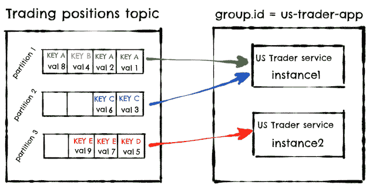
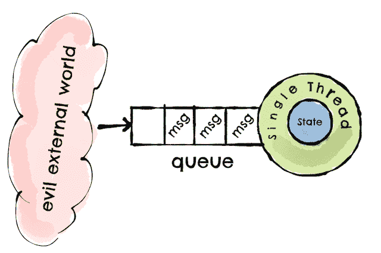

# 卡夫卡、分布式协调和行动者模型

> 原文：<https://dev.to/danlebrero/kafka-distributed-coordination-and-the-actor-model-1hii>

看起来这篇[博文](https://dev.to/danlebrero/simplifying-your-microservices-architecture-with-kafka-and-kafkastreams)并没有恰当地解释用 Kafka 取代 Zookeeper 作为集群服务的协调机制意味着什么。

在这个例子中，我们有一个服务的几个实例，它们必须就哪个实例向哪个客户发送电子邮件达成一致，因此它们必须以某种方式相互协调，以就谁将为哪个客户子集做这项工作达成一致。

这篇博文解释说，KTable 在概念上相当于一个数据库表，有些人认为 KTable 是用来进行协调的机制，通过查询/更新 KTable 状态来通知或锁定记录。

但这远不是我的意思。

## 卡夫卡作为协调者

KTables 建立在 Kafka 之上，除了 Kafka 已经提供的协调机制之外，它们没有提供任何额外的协调机制:一个**领袖选举**机制。

让我们回到基础来理解我们的意思:

1.  一个 Kafka 主题被分成一个或多个分区。
2.  通过[默认](https://kafka.apache.org/documentation/#design_loadbalancing)，具有相同密钥的消息进入相同的分区。
3.  在一个[消费者群体](http://kafka.apache.org/documentation.html#intro_consumers)中，Kafka 将确保只有一个消费者接收特定分区的所有消息。

在一张图中:

[T2】](https://res.cloudinary.com/practicaldev/image/fetch/s--VUlE5oe4--/c_limit%2Cf_auto%2Cfl_progressive%2Cq_auto%2Cw_880/http://danlebrero.cimg/blog/kafka-actors/kafka-partitions.png)

在我们的例子中，如果给定客户的所有交易头寸都以客户 id 为关键字，那么所有消息都将在同一个分区中结束，这意味着它们都将被一个且只有一个服务实例使用，这就相当于说该实例拥有该特定客户或者是该特定客户的“领导者”。

## 行动者、代理和分布式数据网格

此外，实例中的 Kafka 消费者是单线程的，这意味着我们有且只有一个拥有客户端的线程，因此该线程可以对客户端的状态进行本地推理，而不必与其他线程或服务实例进行协调。

这与 [Erlang actors](https://en.wikipedia.org/wiki/Actor_model) 或 [Clojure agents](https://clojure.org/reference/agents) 的并发写模型完全相同:

[T2】](https://res.cloudinary.com/practicaldev/image/fetch/s--gzW-cTA0--/c_limit%2Cf_auto%2Cfl_progressive%2Cq_auto%2Cw_880/http://danlebrero.cimg/blog/kafka-actors/kafka-actor-model.png)

基本上，一些状态由单个线程/进程更新，它从一个队列中读取动作(在 Erlang [中，它不是一个简单的队列](http://www.dalnefre.com/wp/2011/10/erlang-style-mailboxes/))。

这种模型背后的美妙之处在于，它更容易推断状态变化，因为总是有一个线程在操纵状态，所以您的代码不需要担心同步或对数据的并发访问。

此外，当 Kafka 在消费者之间分发分区时，它会在服务集群的实例之间分发所有这些参与者的状态，因此每个实例只需处理数据的一个子集，这与数据网格提供的功能非常相似。

要更新数据网格中的一些数据，您可以遵循读取-更新-保存模式，但大多数数据网格都提供了一种[性能](https://docs.oracle.com/cd/E14526_01/coh.350/e14509/transactionslocks.htm#COHDG116) [优化](http://docs.hazelcast.org/docs/3.9.2/manual/html-single/index.html#data-affinity)，您可以将操作发送给数据，因为它不那么繁琐，而且网格可以优化访问数据所需的任何锁。这种优化的模式是 Kafka 流应用必须遵循的。

请注意，KafkaStream 应用程序提供了与 actors、agent 或数据网格不同的读取模型:您可以将状态推送到任何感兴趣的另一个 Kafka 主题，或者您必须构建自己的 API 来公开该状态。

所以你可以把 Kafka Stream 看成是一个分布式代理模型，内置了持久性，以及 Kafka 的可伸缩性、容错性、分区性和事务性模型。

## 示例:请求的重复数据删除

让我们从[这个评论](http://disq.us/p/1p5usrq)中看到一个实际例子:

我希望多个客户端能够将消息放在一个“运行请求”主题中。如果收到请求时我已经在运行了，我不想做任何事情。如果我没有运行，我想发起(发送消息)一个“运行命令”主题。我相信保存运行状态的 KTable 就是答案。我不知道 kafka streams 处理器在读写“run command”KTable 时会是什么样子。

正如我们之前所说的，因为 KTables 是建立在异步消息传递的基础上的，所以我们不能期望几个客户端对一个 *run 命令*的状态达成一致，并以事务方式改变它。相反，我们需要 Kafka 为一个特定的*运行命令*指定一个领导者，这样这个领导者可以决定运行哪个客户端命令。

我们需要做的第一件事是创建一个密钥，该密钥对于我们要进行重复数据删除的所有命令都是相同的，但不同于其他*运行命令*。这个键将识别领导者/演员。

然后，所有客户端都用相同的密钥发送它们的 run 命令版本，这样所有命令都在同一个 Kafka 分区中结束。

由于该特定分区只有一个消费者，因此该消费者实际上是该分区中所有键(或 *run 命令*)的领导者。该消费者将只对第一个*运行命令*采取行动，更新其状态并忽略其余命令。

代码:

```
(defn  run-first-command  [^KeyValueStore  store  ctx  k  v]  (if  (.putIfAbsent  store  k  true)  (println  "Ignoring command"  v  "for key"  k)  (println  "Running command"  v  "for key"  k)))  (defn  create-kafka-stream-topology  []  (let  [^KStreamBuilder  builder  (KStreamBuilder.)  store  (->  (Stores/create  "run-command-state")  .withStringKeys  (.withValues  (EdnSerde.))  .persistent  .enableCaching  .build)  builder  (->  builder  (.addSource  "raw-data"  (into-array  ["raw-data"]))  (.addProcessor  "run-command-processor"  (processor  run-first-command  "run-command-state")  (into-array  ["raw-data"]))  (.addStateStore  store  (into-array  ["run-command-processor"])))]  builder)) 
```

Enter fullscreen mode Exit fullscreen mode

你可以在这里找到完整的代码。

一些注意事项:

1.  Kafka Streams 只是一个库，所以如果我们认为更合适的话， *run command* 应用程序可以在与客户端相同的进程中运行。
2.  如果您更习惯于 actor 模型，这相当于几个进程分别向一个 actor 发送一个 *run command* 消息。*运行命令*键将是演员的标识符。
3.  Kafka Streams 将在 Kafka 中存储*运行命令*演员/领导者的状态。
4.  如果你需要恰好一次的语义，如果你的*运行命令*的副作用是向另一个 Kafka 主题发送消息，Kafka Streams 将[处理它](https://www.confluent.io/blog/exactly-once-semantics-are-possible-heres-how-apache-kafka-does-it/)。对于其他种类的副作用，你的应用需要[精心设计](https://medium.com/@jaykreps/exactly-once-support-in-apache-kafka-55e1fdd0a35f)。
5.  仅仅因为你能做到这一点，并不意味着这种解决方案对你的特定环境是最好的。也许 Redis [put-if-absent](https://redis.io/commands/setnx) 更适合这种情况。

## 总结

我希望这阐明了如何使用 Kafka 流来设计您的应用程序。

即使卡夫卡只是提供了一个领袖选举机制，也是一个强大的机制。

首先，它简化了状态推理，因为总是只有一个线程处理状态，因此不需要担心同步或分布式锁。卡夫卡溪流使保持这种状态变得轻而易举。

其次，它提供了一种分片机制。由于每个分区只由一个实例拥有，Kafka 有效地将数据分布在您的服务实例中，因此每个实例只需处理其中的一个子集。

除此之外，还有其他卡夫卡式的精致。