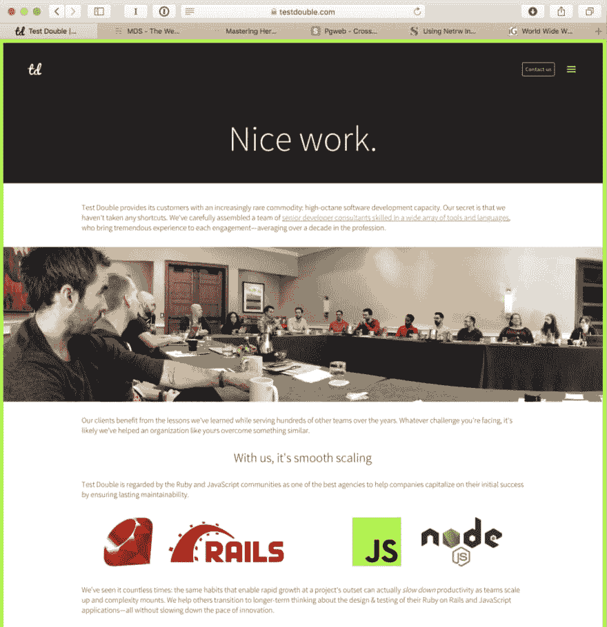
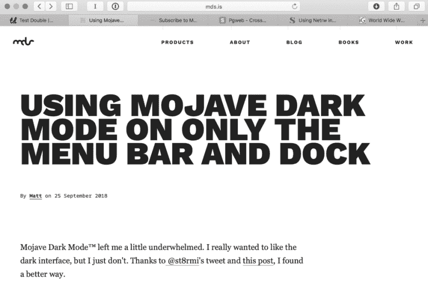
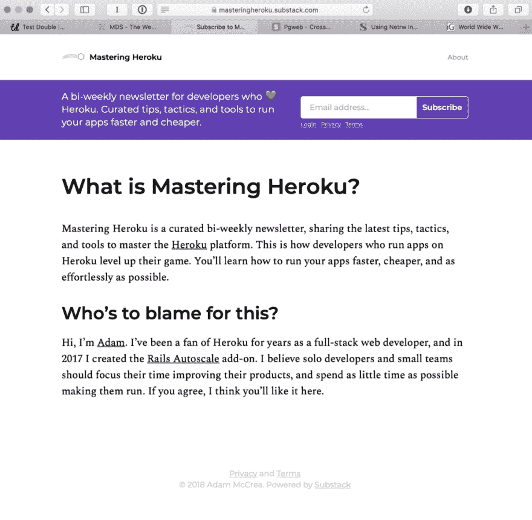
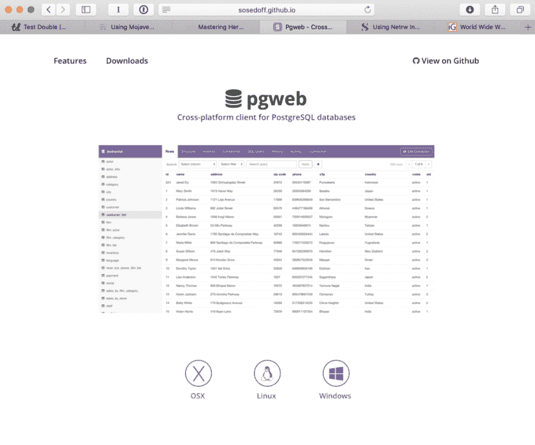
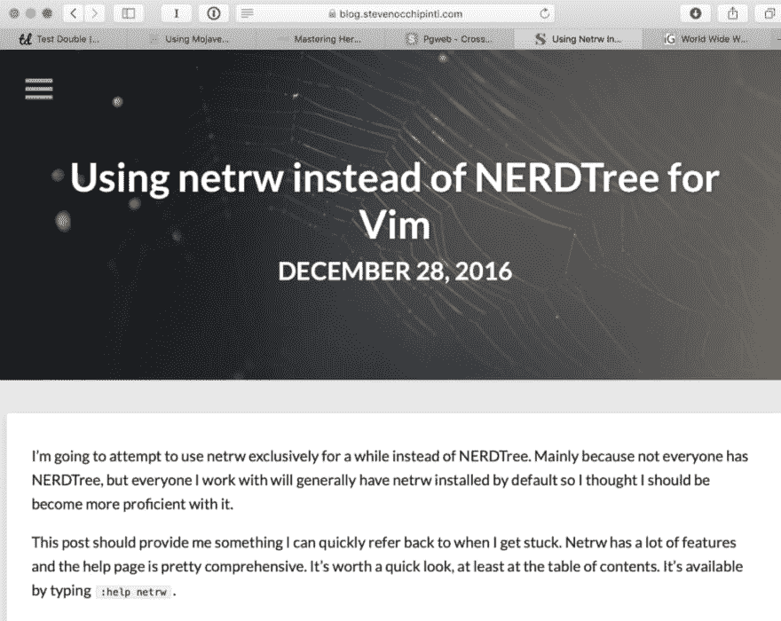
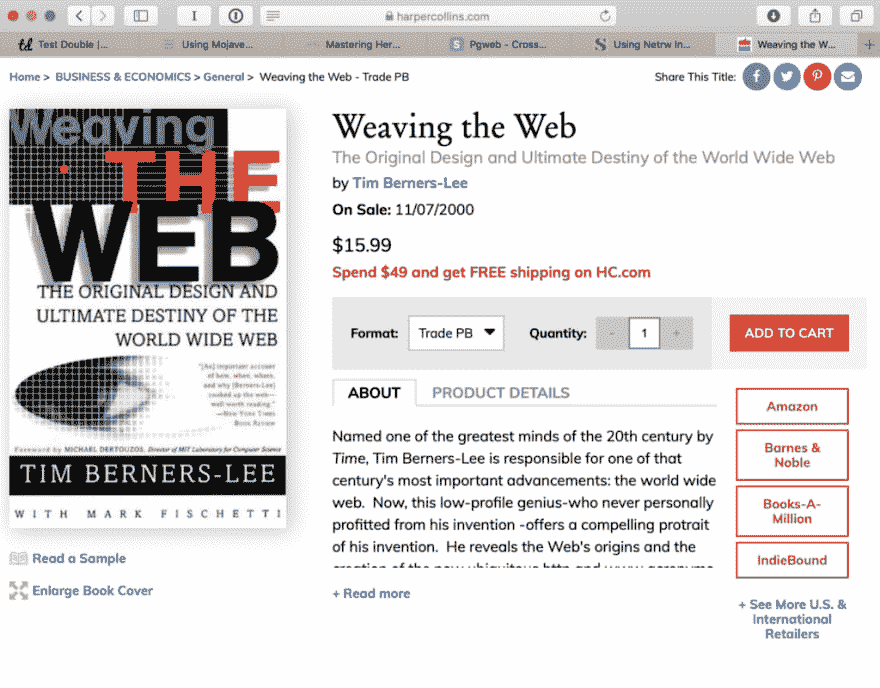

# 保持标签#1

> 原文：<https://dev.to/andrewvida/keepin-tabs-1-4l8i>

作为一名软件开发人员，我一直在研究令人兴奋的新技术，搜索更好的做事方法，观看会议演讲或操作视频。其中的大部分，我会在浏览器标签中停留数天(或数周),直到我发现它们并有时间阅读或观看。在每篇文章中，我将浏览我的浏览器标签，并逐一讨论。

看了一夜《网飞》后，我有了这个想法。我们刚刚完成了新的 [Bert Kreischer](https://www.youtube.com/watch?v=7q4PLdoy3n8) 特别节目，我还不累，所以我去了 YouTube。原来他有自己的[频道](https://www.youtube.com/channel/UCz_sgiKcwX6V52KPn_B6PxQ) (obvs！)，然后你瞧，一个名为“[的节目打开标签页](https://www.youtube.com/watch?v=cqicO0bgDLM&list=PLrUIKtkGMn1ZWXMkbcXw2w6bYGP1tyq-J)，他在那里浏览自己的浏览器历史，其中大部分是娱乐相关的。我认为这听起来是一件很棒的事情，但是对于开发者来说。所以，我们到了。还没有 YouTube 频道——让我们先看看这个博客是如何运作的吧！希望伯特不会关闭我(爱你伯特！).

以下是我这个星期一直记着的记录:

首先也是最重要的，我想对我的 [@testdouble](http://twitter.com/testdouble) 家人大声疾呼。软件坏了。我们是来解决问题的！如果你的团队需要一些额外的帮助，并且你也和我们一样致力于改善人们编写软件的方式，我们很乐意[和你谈谈](https://testdouble.com/contact)！

[T2】](http://testdouble.com)

新的 macOS [Mojave](https://www.apple.com/macos/mojave/) 本周发布，第一天晚上我连夜升级。到目前为止，我还没有遇到任何问题。我的一个遇到操作系统错误的队友说这是最近最好的版本。苹果吹捧的最大变化之一是黑暗模式。自从我去年做了眼部手术，我在使用黑暗编辑器主题时遇到了问题，但作为一个粉丝，我还是打开了它。我是对的。对我来说很难集中注意力。在以前的 OSX/macOS 版本中，你可以选择黑色的菜单栏。我真的希望有某种方法来打开黑暗模式的一些部分——所以我上网从@mds 找到了这个:

[T2】](http://mds.is/using-mojave-dark-mode-on-only-the-menu-bar-and-dock/)

随着我对 Heroku 越来越熟悉，我发现下一个标签非常有用。我的朋友亚当·麦克雷(Adam McCrea)制作了一份时事通讯，帮助你探索一些你肯定会遇到的更高级的话题。在他的帮助下，你很快就会成为英雄大师！我强烈建议去看看，尤其是如果你想做的不仅仅是 git push heroku master:

[T2】](https://res.cloudinary.com/practicaldev/image/fetch/s--ywvQdKYf--/c_limit%2Cf_auto%2Cfl_progressive%2Cq_auto%2Cw_880/https://cdn-images-1.medium.com/max/1024/1%2Av84fnxldDDTDlZ7Eo9PxjA.png)

你应该订阅《掌握 Heroku》的另一个原因是 [Adam](http://twitter.com/adamlogic) 将链接到很酷的工具。下一个标签就是其中之一。这些天来，我倾向于通过 GUI 来查看我的数据库表，而不是使用控制台。也许是主动记录宠坏了我。十年前，我编写超级复杂的查询，但现在我不必了。如果你像我一样，想要快速浏览你的数据库，请查看 [pgweb](http://sosedoff.github.io/pgweb/) :

[T2】](http://sosedoff.github.io/pgweb/)

下一个标签，来自史蒂文·奥奇平蒂，是一个老歌，但是很好听。我是一个习惯性的编辑转换者，任何来自 [Test Double](http://testdouble.com) 的人都可以证明。我将把这个故事放到另一篇文章中。我都用过——从 Spacemacs，到 Sublime Text(我自豪地拥有许可证)，到 Atom 和 Visual Studio 代码。但不管出于什么原因，我就是不能退出维姆·🥁.在过去的几年里，我已经尽可能多地删除插件，只使用简单的 ol' Vim 键绑定。我删除的插件之一是 NERDTree。我开始使用内置的 netrw。Steven 为那些可能也想转行或者只是想要一个好的快速参考的人整理了一个很好的资源:

[T2】](https://blog.stevenocchipinti.com/2016/12/28/using-netrw-instead-of-nerdtree-for-vim/)

我最后的账单其实是我一直在读的一本书。如果你在网上工作，你可能不知道或感觉不到它最初是如何被创造出来的。通过更好地了解网络的历史，超文本的梦想，它的文档模型，将使你今天成为一个更好的开发者。今天的开发人员受益于一个叫做“[概念压缩”](https://m.signalvnoise.com/conceptual-compression-means-beginners-dont-need-to-know-sql-hallelujah-661c1eaed983)的术语。他们并不关心学习互联网或网络是如何创建的——这只是他们的一种生活方式。这本书从创造者蒂姆·伯纳斯·李身上揭示了万维网的起源。

[T2】](https://www.harpercollins.com/9780062515872/weaving-the-web/)

最后，但同样重要的是，我想向你们介绍[这台机器](https://www.youtube.com/watch?v=paG1-lPtIXA)。