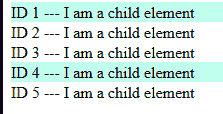

# 跟踪 React 组件的开/关状态

> 原文：<https://dev.to/dance2die/keeping-track-of-onoff-states-of-react-components-1fa9>

Adokiye Iruene 在 StackOverflow 上问了一个关于在被点击的组件而不是所有同级组件上应用样式的问题。

[改变仅点击视图而非所有视图的样式](https://stackoverflow.com/questions/51516825/)

问题是 Asokiye 生成的组件带有一个州的记录列表。

当用户单击一个组件时，不仅被单击的组件应用了样式，而且同级组件也应用了样式。

我们怎样才能只在组件列表中被点击的组件上应用样式呢？

*想知道答案可以作弊*😈*直接按[回答。](https://stackoverflow.com/a/51517907/4035)*

## 🗞前言

我将使用一个简单的网页，显示一个组件中的文本列表，`Child`。

<figure> 

<figcaption>样本代码输出</figcaption>

</figure>

<figure>[https://www.youtube.com/embed/d5OM-cuPWPo](https://www.youtube.com/embed/d5OM-cuPWPo)T3】工作原理 T5】</figure>

当你点击一个项目时，页面将只突出显示被点击的行。通过应用下面的类，`highlight`。