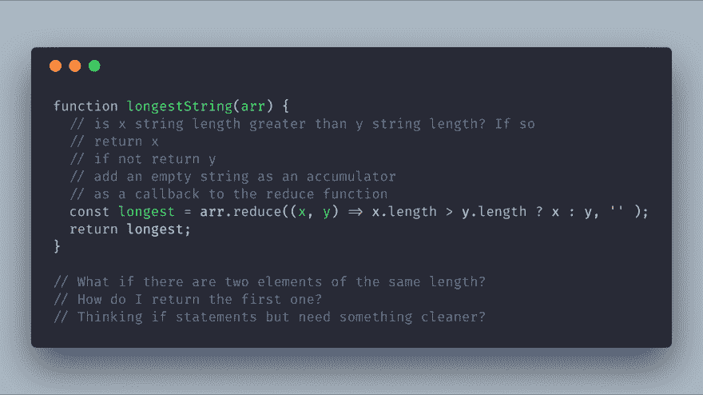

# 保持代码简单

> 原文：<https://dev.to/tiffany/keeping-your-code-simple-44bd>

*这篇文章最初发表在[我的博客](https://tiffanywhite.tech/keeping-your-code-simple/)上。*

作为一名中级开发人员，我试图学到的最重要的一课是*保持我的代码简单*。

我在为我计划参加的训练营研究一些算法。

几周前，我在推特上发布了这个算法:

> 蒂芙尼白🤨⚛️@ tiffanyw _ 412这里需要一点帮助吗？通常我在的空闲频道现在都已经睡着了。😏2018 年 6 月 25 日上午 02:36[](https://twitter.com/intent/tweet?in_reply_to=1011075530022621184)[](https://twitter.com/intent/retweet?tweet_id=1011075530022621184)[](https://twitter.com/intent/like?tweet_id=1011075530022621184)

清洁双衬里。不错吧。

下面我们来看看:

```
function longestString(strs) {
  // is x string length greater than y string length? If so
  // return x
  // if not return y
  // add an empty string as an accumulator
  // as a callback to the reduce function
  const longest = strs.reduce((x, y) => x.length >= y.length ? x : y, '' );
  return longest;
} 
```

Enter fullscreen mode Exit fullscreen mode

这里我试图得到一个数组中最长的字符串。我想我可以用一个函数数组方法很容易地实现这一点，所以我四处寻找。我读了 MDN 上的`map`、`filter`和`reduce`来唤起我的记忆，然后选定了`reduce`。

StackOverflow 上有人有一个类似的算法，他们正在试图解决。我在此基础上修改了我的算法。

正如 Twitter 嵌入显示的那样，由于我的测试没有通过，我在比较时遇到了一点麻烦。我添加了适当的操作符，一切正常。

这是最干净的了。

*但是可读吗*？

## 这就是导师的作用

我的一个朋友兼导师在 Twitter 上给我发了关于这件事的 DM，以及人们在 Twitter 上给我提供的解决方案。他说有一个解决方案一团糟，如果他写了那样的东西，他会被老板骂一顿。

我的第一反应是对那个给我嵌套三元组的家伙窃笑。

但是他说的不是那个。他说的是我聪明的两个眼线。良好的...

## 哑巴代码中的一课

我和我的朋友详细讨论了聪明和写代码给其他人阅读的问题。我在两行解决方案中使用的变量没有任何上下文。相反，我应该把它们分解成这样:

```
let lenX = str1.length;
let lenY = str2.length;

const longest = strs.reduce((str1, str2) => lenX >= lenY ? str1 : str2, ''); 
```

Enter fullscreen mode Exit fullscreen mode

这仍然很简洁，但是可读性更强，更容易理解。

我本可以使用传统的 for 循环，但是我想看看*中的 know* 并轻松进入。我想看起来聪明，在这个过程中使代码不可读，这是中级开发人员的标志。

## 保持简单，愚蠢

当我还是一个新手开发者的时候，我一直不明白为什么有人会写一个像`x`或者`y`这样的变量声明。因为这个原因，我不喜欢像`reduce`这样的函数式编程方法:我发现的大多数例子都使用了这些变量。我一直不明白`x`指的是什么。作为一个更懂英语的人，我陷入了那个*聪明的中级*陷阱。不要这样做。虽然是的，它使你看起来好像你知道你在做什么，但它也使代码不可读，你开始看起来越来越不像是 X 公司的潜在开发候选人。

正如我的一个朋友曾经说过的:

*保持简单，笨蛋*。

* * *

如果你喜欢这个，也许你也想看看我的时事通讯中的一些东西。没有垃圾邮件。50%掺杂含量 50%掺杂链接。如果那不是你的事，不用担心。

[https://buttondown.email/tiffanywhite](https://buttondown.email/tiffanywhite)