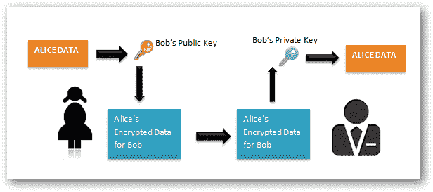
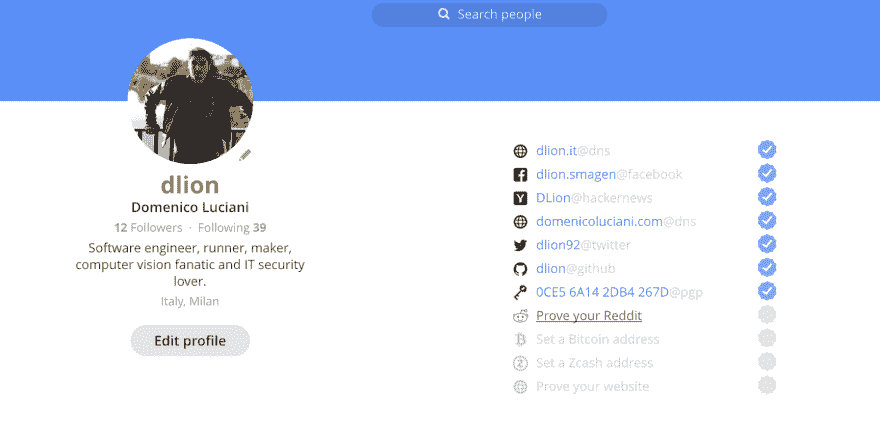
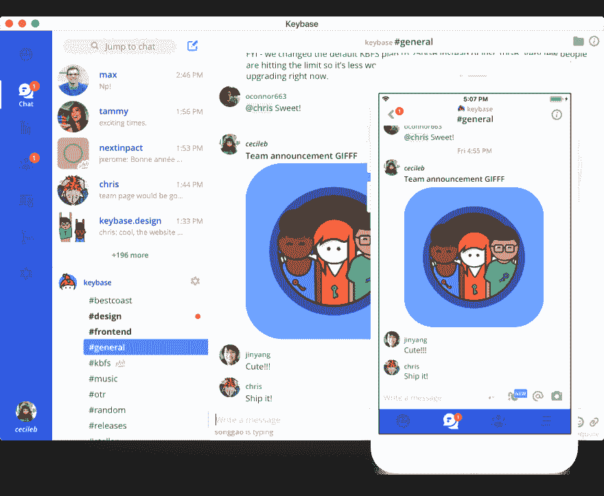
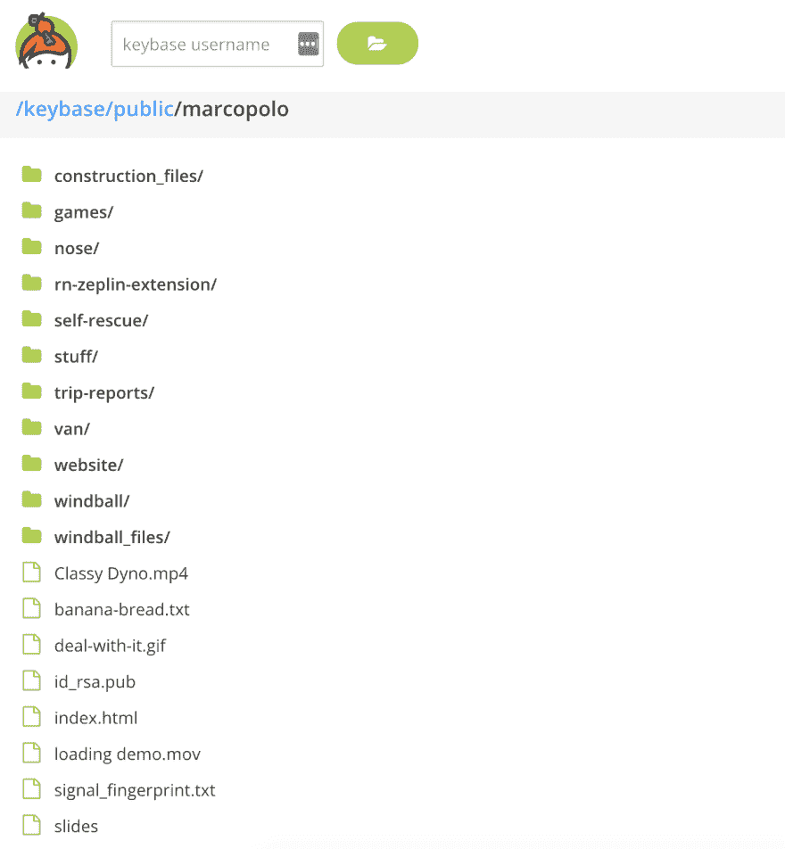
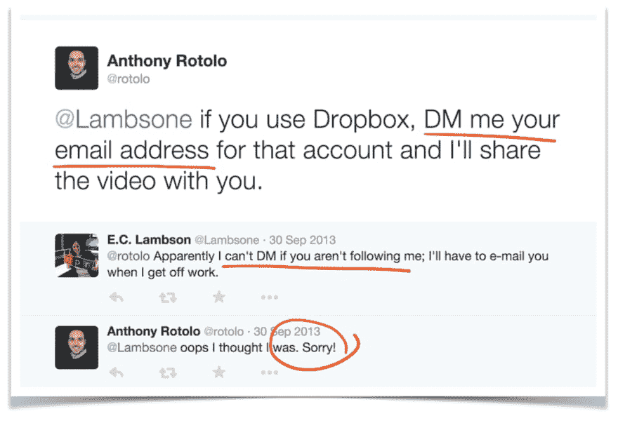
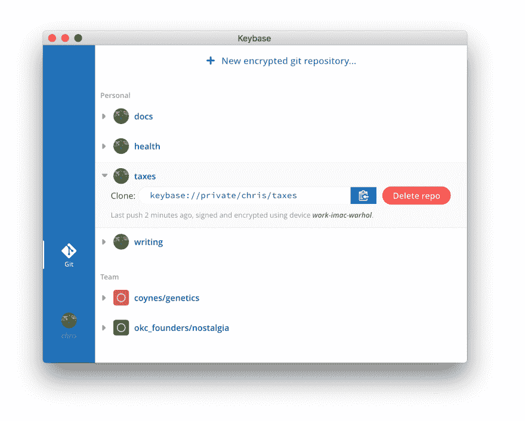

# Keybase -使加密变得简单

> 原文：<https://dev.to/dlion/keybase-crypto-made-simple-1ej0>

多年来，密码学被认为是一种巫术，直到现在！我们来看看 Keybase 是怎么做出来的。

## 历史？

从远古时代起，人类就想彼此交流秘密或敏感信息，我们发明了许多方法来实现这一点，今天我们将看到其中的两种:

## 对称

[T2】](https://res.cloudinary.com/practicaldev/image/fetch/s--jJ64xDUy--/c_limit%2Cf_auto%2Cfl_progressive%2Cq_auto%2Cw_880/https://domenicoluciani.com/asseimg/posts/symmetric_encryption_diagram2.png)

Alice (A)想给 Bob (B)发送一条超密消息，她如何使用对称加密技术来实现？

### 答:

*   用密钥对消息进行加密
*   将加密的消息发送给 Bob

### B:

*   接收来自爱丽丝的加密消息
*   使用 Alice 用于加密消息的相同密钥对消息进行解密。

### CONS:

简单明了，但是你怎么能看出这里有一个问题:Alice 和 Bob 需要使用**同一个密钥**相互通信，并由此衍生出其他问题:

*   爱丽丝如何将*钥匙*传给鲍勃？
*   如果鲍勃丢了钥匙或者被别人偷了，会怎么样？

所有这些假设都允许攻击者读取来自 Alice/Bob/someoneelsewhousethakey 的所有消息。

### 优点:

*   对称加密允许非常快速地加密消息。
*   简单易用

## 不对称

[T2】](https://res.cloudinary.com/practicaldev/image/fetch/s--hwpxJEVG--/c_limit%2Cf_auto%2Cfl_progressive%2Cq_auto%2Cw_880/https://domenicoluciani.com/asseimg/posts/asymmetric_encryption_diagram.png)

Alice (A)想给 Bob (B)发送一条超密消息，她如何使用非对称加密技术来实现？

### 答:

*   生成公钥/私钥对
*   获取 Bob 的公钥
*   使用 Bob 的公钥加密消息
*   将加密的消息发送给 Bob

### B:

*   接收来自爱丽丝的加密消息
*   使用他自己的私钥解密消息

### CONS:

*   非常慢
*   使用起来不那么简单
*   您无法验证您使用的公钥是否是正确的公钥

### 优点:

*   Alice 不需要传递自己的私钥
*   鲍勃共享他的公钥就足够了
*   如果其他人窃取了 Alice 的密钥对，他就无法读取其他人发送给 Bob 的消息

## 何不兼而有之？OpenPGP

目前，这些世界被结合以实现一个聪明的结果，事实上，非对称加密被用来包装使用对称加密加密的消息，它允许共享安全的消息保存速度。

[T2】](https://res.cloudinary.com/practicaldev/image/fetch/s--zCulgtnY--/c_limit%2Cf_auto%2Cfl_progressive%2Cq_auto%2Cw_880/https://domenicoluciani.com/asseimg/posts/pgp.png)

### CONS:

现在使用 PGP 很痛苦，因为:

*   用起来不简单
*   你不能确定你想要使用的公钥是属于你的接收者的

## 键盘

帮助人们在生活中使用更多的密码 [Keybase](https://keybase.io/) 创造一个*魔法*工具来做到这一点！

## 这个公钥是你的吗？

PGP 的一个问题是你不能保证你想要使用的公钥的安全。如果你想给我发信息，你需要我的公钥，对吗？一个攻击者把他的公钥发送给你，你怎么能不说这个公钥是我的而不问我呢？(而如果攻击者通过 Twitter 这样的社交网络上的假账号冒充我呢？你怎么确定那个账号真的是“我”？)

Keybase 很好地解决了这个问题

[T2】](https://res.cloudinary.com/practicaldev/image/fetch/s--zExjhnR6--/c_limit%2Cf_auto%2Cfl_progressive%2Cq_auto%2Cw_880/https://domenicoluciani.com/asseimg/posts/keybaseAccount.png)

Keybase 允许你做很多事情，其中之一就是通过 Twitter、脸书、Github、Reddit 等社交网络验证你的身份。

如何？为了证实这一点，你需要贴一张“证明”，证明这些账户属于你。

验证后 keybase 允许所有想跟你说话的人用你的公钥加密**只用你的昵称**。

例如，我想为我在 twitter 上的一个追随者加密一条消息，但我不知道他的公钥；keybase 来救援:

```
$:> keybase encrypt -m "Hello!" <nick_of_your_follow_who_verified_his_twitter_account> 
```

Enter fullscreen mode Exit fullscreen mode

然后嘭:

```
BEGIN KEYBASE SALTPACK ENCRYPTED MESSAGE. 
kiVagqKWSHjJD0o 7vgiSU0z0qRiJex T9Qn53ePr6tFC77 AlKXbld19b0U0rA V6YesGSqRfzzfNY VhAmXbi6lEkKqLs Xky12T52tcrzfi0
XwTNGuXlAzs2gpu hRdRzEX52eiF6OQ Fu0ZWD7uWqsAxVN oLaMW0qdZcVxVoS 3TpHffNen6Uviqy JMe2omZNOHkTRMM gRxSBg02CyDn1Vp pFbFoVc34kSC7OZ hihp56fBcteu3CS dqQcf9GEWnRJoSK rWRhww2YpwlOJBZ eorvamUcz0BzzcN LeedUtmVl5BKLpU eaf8KFEb8WuRJQ0 owOF0RQUcOfeX5y OzajZqLrEa0nKle ZVCGdEsaXMEaysv jKEyJs9NdNQqvJM YGcxOACBaTBKSn1 QMasCqDrxAE3ELo YQDqmLkTgI95nz8 a7LMtq3SkXGS7B7 b8wMkIJIXbr7lVB FGcpLsjzTdJ2SQs d1P1FM2kapjqijW Dey6knD7YL9WgbX z4vQ6eM3UhbWbW7 5qyuCAPlQxUaELa FXbSbwJX7eHy3PM RhZ3QHonMMXKg8c L3WY2Fo3H8LMphv 4AU01DYRxCqaOjD 7B0GFtQeyW24jpK K42Ocdi2QgyK2et G0ysFqzd3uKYaX9 Q7pVBP96Ekzdyuf 8nLVXQm7vtBZAXS 5037ZJnPnd4kJgP Aj8chce81VB11Rv 5gTRjklrTpDmSCI smZoH4tZkAz3i2b sSkFTQM1GbpbDm3 2OJmaWSrWaS6oeT guGOu8hL31Tm44O KKH6XX6uwmJKqnf PXarEySWwILaHPG NzcJwyTLUGVBZFC zDhzHZN3f62KHe9 bLCQEZw8eb0kCSd 3XvozsiR0N9P5hN G8f2jA0Q42tcUyu I8e8Hy3nDikFaHz dTcyE00Kfekd8aJ L1w3SWIQKxQBRjy QTHyPDAl6xUNqFq MIr8tYBT3957Imy POUpnDBLEGYWwGG 8H6CfGsXk5cfF8k XTkJnLkOdSpMfzd llXR3XbwWMgIe23 yITDC4D2nIFitvx oqtdsqRg4VmGdfV TP0fOzIJEuoR9f2 Zd0aXBTkkaNXP9l mMM0OZ7BQpjTCiK rTmSqeJd2HlOckB 3u2mjbhV89Q954T vc7looDpTsszD36 yEypMMMCmFIH97d cyLlIe99l6lNRfS WDkixQOtPYmTLpy B1dmAKIVzhSGkDK xQTUYNCDJc16oMQ fmH6x8GVv0Bl6Hk 561mRg5hGlDgEwB Hheph31Z7K4Pymx NWGR3qQX9ioYlIk SsCaUJzbn8JJG8J qJtIPFKvN56FR2o 7rK81g8i4ehe1xz 7qHvoGNb1hFD. 
END KEYBASE SALTPACK ENCRYPTED MESSAGE. 
```

Enter fullscreen mode Exit fullscreen mode

我->嘿 keybase，把我和 nick 的朋友的公钥给我`<nick>`，求你- > Keybase 用公钥回答我。

Me ->使用通过 keybase 检索的公钥加密->输出中的加密消息

使用密钥库，我们可以确保公钥真正属于我们的接收者，太好了！

> 好吧，现在我可以信任你了，但为什么在 2018 年我必须使用终端…？

## 密钥库加密聊天

keybase 的一个有趣特性是**加密聊天**

[T2】](https://res.cloudinary.com/practicaldev/image/fetch/s--G083tECQ--/c_limit%2Cf_auto%2Cfl_progressive%2Cq_auto%2Cw_880/https://domenicoluciani.com/asseimg/posts/keybase_chat.png)

你可以创建[团队](https://keybase.io/blog/introducing-keybase-teams)、频道、子团队等等。当然，你的智能手机也有一个应用程序！这是一个端到端的加密聊天内置在 Keybase，所以你可以使用你的*安全*黑客新闻的昵称作为安全地址进行沟通；不需要电话号码或电子邮件。为了更好地理解，请阅读[官方公告](https://keybase.io/blog/keybase-chat)。

## 密钥库加密文件系统

Keybase 的另一个有趣的特性是可以在 Keybase 中内置一个加密的文件系统，它以 3 种方式工作:

### 公共

你可以与全世界的公众、**签名的**目录共享**:你想不想共享一个包，你想不想向你的朋友保证这个文件是你的，这样你就可以用 keybase 共享它(你有 **250GB 的免费空间**，fo real)，Keybase 会为你签名。怎么会？你必须用你的昵称把你的文件放到 keybase 文件系统的公共目录下:甚至一个婴儿都可以做到😄。**

最后但同样重要的是，Keybase 会为你将这些文件托管到一个公共主机中，例如:`https://keybase.pub/dlion/`。

[T2】](https://res.cloudinary.com/practicaldev/image/fetch/s--wsgaHlsx--/c_limit%2Cf_auto%2Cfl_progressive%2Cq_auto%2Cw_880/https://domenicoluciani.com/asseimg/posts/public_dir.png)

### 私人

当然，你可以签署，加密和保存你自己的文件到你的私人目录，没有人能够读取这些文件，怎么做？只需将它们放入正确的目录中。

### 团队合作和私人分享

你可以和你的团队(如前所述，使用 keybase chat 创建)或者只是和你的朋友创建一个共享文件夹，如何创建？只需将您想要共享的文件放在正确的目录中，并使用正确的昵称`keybase/private/dlion,nick_of_my_friend`。

[T2】](https://res.cloudinary.com/practicaldev/image/fetch/s--WyBLvzPJ--/c_limit%2Cf_auto%2Cfl_progressive%2Cq_auto%2Cw_880/https://keybase.img/getting-started/dropbox_sharing.png)

如果你想知道它是如何工作的，你可以找到一个很好的解释。

## 加密的 git 储存库

作为最后一个特性，Keybase 允许每个开发人员在 Keybase 中内置一个加密的 git 存储库。

[T2】](https://res.cloudinary.com/practicaldev/image/fetch/s--toeHnTYp--/c_limit%2Cf_auto%2Cfl_progressive%2Cq_auto%2Cw_880/https://keybase.img/blog/encrypted_git/encrypted_git_ui3.png)

如果你想为你自己的项目使用一个**私有**，而不是一个开源的，或者只是为了你的需要，比如存储你的小说，商业文件等等。你几乎可以用它做任何事情！怎么会？只需打开 Keybase，进入`Git`标签，输入回购协议的名称，然后嘭，你就可以开始了。

### 团队？

是的，你甚至可以创建并与你的团队分享你的回复。

它是端到端加密的。它是托管的，比如说，GitHub，但是只有你(和你的队友)可以解密它。对 Keybase 来说，一切不过是一团乱麻。对你来说，这是一个没有额外步骤的常规结账。甚至您的存储库名称和分支名称都是加密的，因此 Keybase 员工或渗透者无法读取。

如果你想知道更多，请阅读关于它的文章

## 结论

我每天都使用 Keybase，我很高兴使用一个简单的(这是一种委婉的说法)工具，它允许我与朋友交谈而不用担心我的隐私，或者只是与我的队友一起工作而不用担心在哪里分享我们的*秘密文件*。

## 所以跟着我吧！

[T2】](https://res.cloudinary.com/practicaldev/image/fetch/s--zExjhnR6--/c_limit%2Cf_auto%2Cfl_progressive%2Cq_auto%2Cw_880/https://domenicoluciani.com/asseimg/posts/keybaseAccount.png)