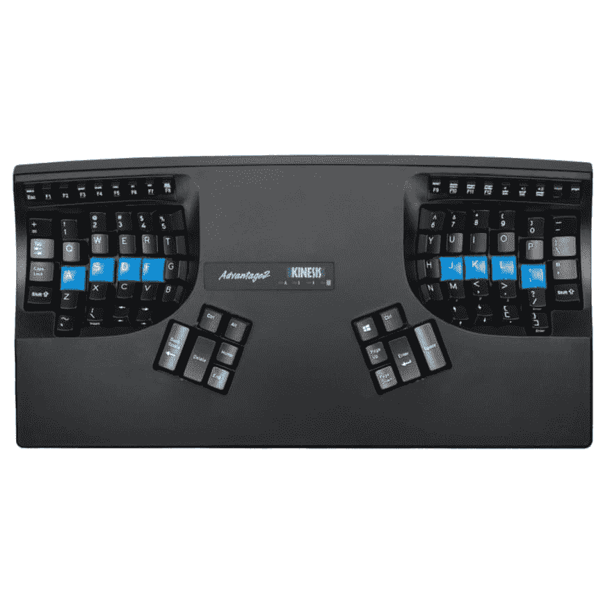

# macOS 中键盘驱动的生产力

> 原文：<https://dev.to/trueneu/keyboard-driven-productivity-in-macos-5hak>

[T2】](https://res.cloudinary.com/practicaldev/image/fetch/s--NqB-lr8N--/c_limit%2Cf_auto%2Cfl_progressive%2Cq_auto%2Cw_880/https://thepracticaldev.s3.amazonaws.com/i/ospp8ymq4hwaifnt0tcn.jpeg)

图片:Kinesis Advantage2 键盘，[https://www.kinesis-ergo.com/shop/advantage2/](https://www.kinesis-ergo.com/shop/advantage2/)。Kinesis 保留所有权利，这是他们的商标，等等。看起来挺酷的，但是我对⇧⌥⌘快捷键的人体工程学有些怀疑

本文原载于 medium.com，[https://medium . com/@ true . neu/keyboard-driven-productivity-in-MAC OS-def 201 b 6 c8 fa](https://medium.com/@true.neu/keyboard-driven-productivity-in-macos-def201b6c8fa)

# 所以嘿，各位开发者。

或者 devops，或者 sysadm，这都不重要。

你有没有想过，当你一整天都在使用你的指针设备时，你浪费了多少时间和精力？

让我们做一个大胆的假设，假设您每天在焦点中改变您的应用程序 100 次。从终端模拟器到 IDE，然后到 messenger，然后到浏览器，再回到终端模拟器，25 个周期，你不使用⌘⇥这样做。所以每次你都必须:

*   将手从键盘的主行移开
*   伸手去抓老鼠
*   查找当前指针位置
*   指向您需要的应用程序，然后单击
*   把你的手放回原位。

假设每个单独的动作需要大约 0.5 秒，我们总共有 2.5 秒。乘以 100，仅仅改变焦点就花了 4 分多一点。你可能会说，与标准的 8 小时工作日相比，这并不算多。每当你需要用鼠标来改变浏览器中的活动标签，或者点击一个菜单项，或者启动一个应用程序，或者在浏览器中聚焦搜索栏，或者从一个终端模拟器中复制文本时，都要加上这个。你可能不会喜欢你的发现。

* * *

# 现在你能做些什么来解决这个问题呢？

虽然我将谈论我个人使用的软件(即 macOS、Jetbrains IDEs、iTerm 和 Google Chrome)，但你可能会发现许多有用的东西，即使我们的最爱不一样。举个例子，

## 键盘

### 触摸打字

关于那件事没有争论或赞成和反对。如果你不知道如何触摸打字和使用 hunt-and-peck 技术，或者只是记住了每个键的位置，而你的手像钢琴演奏者的手，你要么很慢，要么打了很多错别字，或者(最常见的情况)两者兼而有之。当然也有例外，但总的来说你应该尽快学会接触打字。

从长远来看，像我这样的普通打字者，打字速度是每分钟 40-60 字。一个普通的打字者的速度是每分钟 27-37 英里([https://blog.typing.com/hunt-and-peck/](https://blog.typing.com/hunt-and-peck/))。当然，这并不意味着您将产生两倍于今天的代码；但是你有一半的时间需要在闲暇时回应你的同事。如果你每天输入 200 个单词(这一段的两倍多一点)，你将有 2.5 分钟的时间来考虑函数的命名。

### 键盘布局

想想你当前的键盘布局是否最适合你正在做的事情。很可能你用的是标准的 QWERTY。作为一个不喜欢手指离开主行太远，经常使用圆括号、方括号和其他通常需要按 Shift +一个数字的字符的人，我选择了程序员 Dvorak 布局([https://www.kaufmann.no/roland/dvorak/](https://www.kaufmann.no/roland/dvorak/))。你可能会发现普通的 Dvorak 或 Colemak 更有吸引力。

我必须说，选择非标准键盘布局有一些缺点。

你必须学习它，这需要时间和奉献，尽管它不像第一次学习触摸打字那么难，因为你已经知道了一般的技术。在 QWERTY 键盘上打字会有困难，尤其是在 Dvorak 的情况下。Colemak 在这方面要宽容得多，因为它的分歧不是那么大。就我个人而言，我认为这没什么大不了的，因为我通常不会把人们从座位上推下来，然后冒充他们发电子邮件。但是你可能对此有不同的看法。你必须决定如何处理你的快捷方式。例如，macOS 有这种奇特的“德沃夏克+ QWERTY-⌘'”布局，它改变了你的⌘层，仍然使用 QWERTY，所以⌘C 和⌘V 在他们的老地方。我不喜欢这种方式，因为好吧，好吧，那我们怎么处理⌃捷径呢？⌃⌘?无论如何，当你的大脑试图应对新的布局时，最好是全力以赴，让你的 C 和 V 在同一个键上，不管按下了什么修饰键。
你可以使用什么软件来定制这方面的设置？好吧，要制作你自己的、可再发行的键盘布局，有 Ukelele([https://scripts.sil.org/cms/scripts/page.php?site_id=nrsi&id = Ukelele](https://scripts.sil.org/cms/scripts/page.php?site_id=nrsi&id=ukelele))。钩环元素也很有用([https://pqrs.org/osx/karabiner/](https://pqrs.org/osx/karabiner/))，稍后会提到。

### 其他键盘模块

我还喜欢使用一些其他的低级修改。大多数常见的类似 UNIX 的快捷方式，如⌃w、⌃a、⌃e，在 macOS 中都是现成的。但不是⌥的。我真的不喜欢 macOS 中的选项层，因为它产生的符号比我换工作时用得还少。但好消息是，我们可以重新映射，例如，⌥D 向前删除一个单词系统。你可以在 https://github.com/ttscoff/KeyBindings 找到这种修改的详细列表。

另一个灵感来自尼基塔·普罗科波夫的博客文章[http://tonsky.me/blog/cursor-keys/](http://tonsky.me/blog/cursor-keys/)。基本的想法是，将 Caps Lock 键重新映射到 fn，并将 fn+JKLI 映射到光标键。因此，每当你必须使用箭头键导航时，你根本不必将手从 home row 移开。我更进一步，还将 fn+SDFE 映射到⌃a/PgDown/⌃e/PgUp.

你是否在使用标准的 macOS 行为(所谓的字符拾取器)通过按住字母键如“a”，“o”，“e”，“c”来输入重音符号？没有吗？我也没有。让我们把它关掉，否则我们就不能只按一次键就把‘aaaaaaaaaaaaaaaaaaaaaa’作为提交消息键入。看一下这个链接:[http://m10l MAC . blogspot . com/2011/07/OS-x-107-lion-getting-rid-of-character . htm TL](http://m10lmac.blogspot.com/2011/07/os-x-107-lion-getting-rid-of-character.htmtl)

最后，但不是最不重要的，是一个标准的 karabine-elements 修改，将 Caps Lock 映射到“超级修饰符”(⇧⌥⌃⌘)，这通常在任何类型的应用程序中都不会使用。因为大写字母锁已经被箭头 mod 使用，我把它映射到⌥.右边

## 快捷键

您应该看看对您的应用程序最有用的快捷方式，并学会利用它们。每当有两种方法做某事，其中一种是用鼠标，总是选择另一种。当只有一个的时候，花点时间找出合适的。没有鼠标。以防你没想到。

### 系统

不要忘记系统范围的快捷键，比如聚焦菜单栏或 dock。另一个对 Adium 等多窗口应用程序非常有用的方法是“将焦点移到下一个窗口”。

我肯定你在用 Spotlight，这是在你的电脑上查找/运行东西的好方法。然而，我已经用阿尔弗雷德完全取代了我的聚光灯。与我所说的大多数软件不同，它不是免费的，但它有一个特别酷的功能:工作流。实际上，这是一个不同角度的 Automator:您设置一个触发器和一系列要执行的操作，这也可以利用 Alfred 的 omnibar 中提供的输入。我用得最多的工作流相当愚蠢:它在⇧⌥⌃⌘letter 上触发，并启动一个特定的应用程序。我在 a 上有 iTerm，在 d 上有 Chrome，在 g 上有 IDEA 等等。这使我能够在应用程序之间快速切换焦点(因为记得吗，我把⇧⌥⌃⌘映射到了右边的⌥？)

Alfred 有一个广泛的特性列表，这些特性并没有给这个主题带来太多的价值，但是我还是要提到我最喜欢的一个:剪贴板历史。每当我按下⌥⌘V，我就会得到一个最近在我的剪贴板上的东西的列表，omnibar 是活动的。当你必须在标签之间复制粘贴 5-6 个值时，这可以节省很多浏览器标签的切换；你可以成批地做，而不是一个一个地做。

### [这里](#ide)

如果您使用的是功能强大的文本编辑器或 IDE，那么您几乎可以快捷地执行任何可用的操作。例如，有一个一小时长的视频是关于使用 IntelliJ IDEA 快捷方式的，比如[https://www.youtube.com/watch?v=eq3KiAH4IBI](https://www.youtube.com/watch?v=eq3KiAH4IBI)。这个没什么好说的，你只要强迫自己一有可能就用捷径，直到成为第二天性。以下是我对 IDEA 的一些喜爱，如果它有帮助的话:扩展/收缩选择，最近的文件，最近的项目，Git/VCS 命令，跳转到导航栏，聚焦项目工具窗口，VCS 工具窗口，参数信息，跳转到定义，显示用法，搜索文件/符号，在路径中查找，在路径中替换，当然还有查找动作。

### 浏览器

如果你使用谷歌 Chrome，有一个很棒的扩展叫 Vimium([https://Chrome . Google . com/web store/detail/Vimium/dbepggeogbaibhgnhhndojpepiihcmeb？hl=en](https://chrome.google.com/webstore/detail/vimium/dbepggeogbaibhgnhhndojpepiihcmeb?hl=en) )。它能让你用键盘控制浏览器中的几乎每一个动作:打开和滚动页面，跟随链接，在页面视图上快捷地点击下一页/上一页按钮，等等。Firefox 和 Safari 也有类似的扩展，但它们远没有这么强大。不过，如果你受不了谷歌 Chrome，或许值得去看看它们([https://github . com/philc/Vimium/wiki/Alternative-Vimium-for-Other-Browser](https://github.com/philc/vimium/wiki/Alternative-Vimium-for-Other-Browser))。

### 终端

要浏览终端模拟器的输入，如果你必须移动光标超过几个符号，不要使用箭头键或⌃f/⌃b。加入一些⌥f/⌥b 来移动单词边界。总而言之，学习典型的 UNIX 快捷键来移动和编辑文本不会有什么坏处。

我敢肯定，有时，你必须从你的终端模拟器窗口复制一些东西。iTerm 有几个不错的特性:首先，您可以定义快捷方式来向左或向右移动选择边界，其次，您可以启用所谓的 shell 集成，这使得您的本地 Shell 更加智能，因为它的输入和输出是由 iTerm 控制的。

第一个使您能够使用下面的模式从终端输出的任意部分选择和复制文本:⌘f (Find) +您想要复制的部分的开始+(在我的例子中)⌥⇧→(实际上，⇪⌥⇧l，如果我们考虑我前面所说的一切)+ ⌘c.

第二个选项允许你用一个快捷键复制上一个命令或者你正在输入的当前命令的所有输出。

另外，如果你使用 iTerm 并且没有启用 tmux 集成，请现在就启用它。如果出于某种原因，你尝试了，但不喜欢它，这没关系，这很公平。只是，我个人看不出有什么理由使用另一套不同的快捷键，在 screen 或 tmux 之外的任何地方都没有意义，但那就是我。有些人因为某些原因仍然喜欢 vim，你知道的。

学习新的和不寻常的东西需要时间。但是如果你成功地不让自己使用旧的、缓慢但熟悉的方式，很快新的和快速的习惯将成为你的第二天性。我真的不再把手从 home row 移开了，这感觉棒极了。我不把时间花在无用的肌肉活动上(有用的肌肉活动我有乒乓球和贝斯吉他，非常感谢)，看起来就是很酷。说真的。就好像我根本不动我的手，但一切都正常工作。

这篇文章是在一次都没有接触鼠标的情况下写的(尽管我会惩罚一些关于 Medium 的设计决策。就像真的一样，你在左边和右边都有空闲空间，但是没有按钮来插入图像或制作标题？..)

### 奖励等级

我注意到，我有时开始患上我称之为“前 RSI”的综合征。手腕酸痛，轻度疼痛等。所以…如果你使用不止一个键盘，默认情况下，Karabiner-Elements 会将一个键盘上的任何修饰键映射到所有其他键盘上。这意味着你可以同时无缝地使用两个键盘。你知道，就像分离键盘。这正是我所做的:我的左手在笔记本电脑的键盘上打字，我的右手使用标准的 Apple Wired。这样我的双臂都是直的，而不必以不自然的角度弯曲手腕。

是的，就是这样。主场见！

### P.S

当把它复制粘贴到 dev.to 时，我遇到了以下行为:你不能用箭头键滚动你的文章条目文本框。你不能。当您的光标离开可见范围时，查看区域根本不会移动。我*不得不*使用鼠标。与此相比，在 Medium editor 中编写这些内容简直易如反掌。