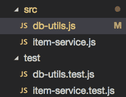

# 知道使用这些方法测试什么:调用数据库的节点服务

> 原文：<https://dev.to/ccleary00/know-what-to-test-using-these-recipes-node-service-that-calls-a-database-1883>

***原载于 [coreycleary.me](https://www.coreycleary.me/know-what-to-test-using-these-recipes-node-service-that-calls-a-database/)** 。这是我的内容博客的交叉帖子。我每一两周发布一次新内容，如果你想直接在收件箱里收到我的文章，你可以[注册我的时事通讯](https://www.coreycleary.me/about/)！我还定期发送备忘单、其他优秀教程的链接(由其他人提供)和其他免费赠品。*

如果你曾经浏览过 JavaScript 或节点单元测试教程，你可能很难找到任何东西来告诉你 ***什么*** 你应该测试- ***什么场景*** 要覆盖， ***什么*** 要编写测试，等等。

很容易找到指导您完成非常基本的示例的教程——比如如何编写加法函数的测试或检查对象属性的测试——但是很难找到超出基础并涵盖真实场景的教程。

作为一名开发人员，你知道如果你想被认为是一名“好的开发人员”，你“应该”写测试。但是如果你不知道你应该寻找的测试场景的种类，那么一开始就很难写出来。如果你完全不熟悉编写测试，那就更令人沮丧了。

当你有了一个需要在工作中实现的特性，截止日期就要到了，而你却陷入了测试，通常这些测试根本不会被写出来。

### 测试配方的应用

当我学习如何为我的代码编写测试时，我也面临这种挫折。但是我学会了用几种不同的方法来报道一些事情:

*   获取我的测试应该覆盖的场景的错误报告
*   通读现有代码库的大量测试，包括工作代码库和开源代码库

我最终注意到很多测试覆盖了相似的场景。根据您正在处理的应用程序的部分，有一些事情需要注意，以确保您的测试——通过扩展，代码——覆盖，这样您就可以确保以后引入到应用程序中的任何新变化都可以在它崩溃时捕捉到。

这些场景被提炼为一组配方，本文将解决您可能会遇到的一个现实世界中的编码问题，因为它非常常见——查询数据库并对该数据执行某些操作的节点服务。

期待更多这样的帖子，包括调用第三方 API，测试你自己的 API 等等。在一篇文章中只能消化这么多场景，所以我打算将来扩展到其他地方。

最终，你不仅会知道要写什么测试，[这些测试还会帮助你设计/实现你的代码](https://www.coreycleary.me/tried-tdd-and-didnt-realize-the-benefits-try-it-the-next-time-you-get-writers-block/)。

### 在我们开始之前，有几点需要注意

菜谱不会让你一路走到那一步——毕竟，每个应用程序和业务领域都是独一无二的——但会给你一个良好的工作基础。就像你不会总是 100%遵循烹饪食谱一样，这些将会给你一个坚实的工作基础，也可以作为测试时要记住的事情的指南。

此外，虽然这些帖子将主要针对单元级别的测试，但是因为它们将首先覆盖**场景**，所以当需要时，它们将不可避免地覆盖集成测试和端到端测试。

最后，我们将针对真实的数据库而不是完全模拟的数据库编写测试(尽管我们将模拟错误)。通常社区在什么是正确的方法上存在分歧——真实数据库还是模拟数据库——但是讨论这个问题超出了本文的范围。不管怎样，值得讨论的场景还是一样的。

### 初始设置

我们将使用 PostgreSQL 数据库，而不是在这里使用 ORM，我们将通过`node-postgres`数据库驱动程序查询数据库。即使您使用的是不同的数据库，本菜谱中涵盖的场景也应该几乎相同。

1.  安装 Postgres(自制软件)
    `brew install postgres`

2.  开始 Postgres
    `pg_ctl -D /usr/local/var/postgres start`

3.  创建数据库
    `createdb autoparts`

现在 PostgreSQL 正在运行，我们已经创建了一个新的数据库，让我们开始我们的第一个场景。

给你一个预览，我们的目录结构最终会是这样的:
[](https://res.cloudinary.com/practicaldev/image/fetch/s--6X3O-PO6--/c_limit%2Cf_auto%2Cfl_progressive%2Cq_auto%2Cw_880/https://www.coreycleary.me/wp-content/uploads/2018/08/Screen-Shot-2018-08-27-at-7.30.07-PM.png)

最终形式的完整代码可以在这里下载[，但是我建议您跟随它，因为您将看到每个测试的代码进度。有时，当我们添加更多的测试和覆盖更多的场景时，我们将不得不回来改变一个函数的实现。](https://github.com/coreyc/test-recipes-service-to-db)

### 问题

场景:
-你的测试覆盖了你将在数据库上执行的基本查询吗？-
-正确的数据回来了吗？-

我们将添加以下函数来调用我们的数据库:

*   ` createTable()'
*   ` dropTable()'
*   ` insert()'
*   ` select()'
*   `选择一个()'

先说`createTable()`。

在`db-utils.js` :

```
const { Client } = require('pg')

const getConnection = () => {
  return {
    host: 'localhost',
    database: 'autoparts',
    password: null,
    port: 5432
  }
}

const createTable = async function (tableName) {
  const client = new Client(getConnection())
  await client.connect()

  return await client.query(`DROP TABLE IF EXISTS ${tableName};
    CREATE TABLE ${tableName} (id SERIAL PRIMARY KEY, name VARCHAR(40) not null, price DECIMAL(10, 2));`)
}

module.exports = {
  createTable
} 
```

Enter fullscreen mode Exit fullscreen mode

首先我们导入`pg`，它是 node-postgres 的 npm 包，并从包中获取`Client`。

接下来我们添加一个`getConnection()`函数，在这里我们指定我们想要使用的 PostgreSQL 数据库，它在哪里运行以及它在哪个端口上。

然后我们添加`createTable()`函数来建立到数据库的连接并创建一个表。

我们应该为此写什么测试？请记住，我们在这里测试的场景是，给定我们的函数，查询执行它们应该执行的操作。因此，我们需要确保该表确实是在数据库中创建的。

在`db-utils.test.js` :

```
const { createTable } = require('../src/db-utils')

describe('Database Utils', () => {
  describe('createTable', () => {
    it('should create the table in the database', async () => {
      const res = await createTable('items')
      // because we just created the table, no rows should exist
      // the first res is actually the result from the DROP TABLE, so we take the second
      expect(res[1].rowCount).to.be.null
    })
  })
}) 
```

Enter fullscreen mode Exit fullscreen mode

在测试中，我们使用了`createTable()`来创建表，然后确认它已经被添加到数据库中，这就涵盖了我们对这个函数的场景。

现在我们有了这个表，我们要确保我们可以向它添加数据，这对应于一个`INSERT INTO`查询:

```
const insert = async function (tableName, itemName, price) {
  const client = new Client(getConnection())
  await client.connect()

  return await client.query(`INSERT INTO ${tableName} (name, price) VALUES ('${itemName}', '${price}');`)
} 
```

Enter fullscreen mode Exit fullscreen mode

和测试，涵盖了我们在表中创建数据的场景:

```
 describe('insert', () => {
    it('should insert an item into the table', async () => {
      const res = await insert('items', 'steering wheel', 62.59)
      expect(res.rowCount).to.equal(1)
    })
  }) 
```

Enter fullscreen mode Exit fullscreen mode

最后，我们要确保我们可以实际获取数据(这对应于一个`SELECT`查询):

```
const select = async function (tableName, limit = 'ALL', columns = '*') {
  const client = new Client(getConnection())
  await client.connect()

  return await client.query(`SELECT ${columns} FROM ${tableName} LIMIT ${limit}`)
} 
```

Enter fullscreen mode Exit fullscreen mode

测试依赖于使用`insert()`测试查询已经在表中创建的数据:

```
 describe('select', () => {
    it('should select items from the table', async () => {
      const res = await select('items')
      expect(res.rows).to.deep.equal([ { id: 1, name: 'steering wheel', price: '62.59' } ])
    })
  }) 
```

Enter fullscreen mode Exit fullscreen mode

### 关闭数据库连接

**场景:**
——当你建立一个客户端到数据库的连接时，它会在查询后关闭那个连接吗？-

在我们继续之前，如果您一直在编写代码并在您的机器上运行测试，那么您可能已经注意到测试并没有退出，它们只是在通过之后挂在那里。这将引导我们进入下一个场景:确保到数据库的连接被关闭！

我曾经继承了一个代码库，它在执行查询后没有关闭到数据库的连接，当我们运行它进行性能测试时，它在大约 2 分钟的运行中遇到了内存泄漏。所以一定要确保关闭你的连接。

这本身很难编写测试代码，但是测试在运行后挂起的事实本身就是测试。现在我们知道连接没有关闭，让我们修复它:

```
const createTable = async function (tableName) {
  const client = new Client(getConnection())
  await client.connect()

  const res = await client.query(`DROP TABLE IF EXISTS ${tableName};
    CREATE TABLE ${tableName} (id SERIAL PRIMARY KEY, name VARCHAR(40) not null, price DECIMAL(10, 2));`)
  // end connection!
  await client.end()
  return res
}

const insert = async function (tableName, itemName, price) {
  const client = new Client(getConnection())
  await client.connect()

  const res = await client.query(`INSERT INTO ${tableName} (name, price) VALUES ('${itemName}', '${price}');`)
  // end connection!
  await client.end()
  return res
}

const select = async function (tableName, limit = 'ALL', columns = '*') {
  const client = new Client(getConnection())
  await client.connect()

  const res = await client.query(`SELECT ${columns} FROM ${tableName} LIMIT ${limit}`)
  // end connection!
  await client.end()
  return res
} 
```

Enter fullscreen mode Exit fullscreen mode

如您所见，调用`await client.end()`结束了连接。现在，当您运行测试时，Mocha 完成并返回到命令提示符。

### 测试清理

场景:
——确保在测试运行后清理你的数据库或表格

我们在编写真实世界的节点->数据库服务时要涉及的下一个场景不是代码场景，而是测试场景。因为我们是针对实际的数据库而不是使用模拟来编写测试，所以我们需要确保在测试运行后进行清理。

您可以删除表或整个数据库，但为了简单起见，我们只删除表。让我们为`db-utils.js` :
添加一个函数

```
const dropTable = async function (tableName) {
  const client = new Client(getConnection())
  await client.connect()

  await client.query(`DROP TABLE IF EXISTS ${tableName};`)
  await client.end()
} 
```

Enter fullscreen mode Exit fullscreen mode

在我们的`db-utils.test.js`中，我们将把`dropTable()`添加到`after`钩子中，这是一个放置清理动作的好地方，因为它在`describe`块运行:
的测试之后运行

```
 after(async () => {
    await dropTable('items')
  }) 
```

Enter fullscreen mode Exit fullscreen mode

您可能已经注意到，`createTable()`本身总是在创建表之前删除它，所以即使我们没有`dropTable()`函数，我们也不会有问题。

但是请记住，这篇文章是针对你应该注意的场景的——为了安全起见，拥有一个像`dropTable()`这样的测试清理功能是一个很好的实践。

### 在节点服务本身上

现在我们已经有了一些数据库查询工具，是时候处理实际的节点服务了，它将是一个项目服务。

该服务的理论应用是针对一家汽车零件商店(一家销售方向盘、机油、挡风玻璃雨刷等产品的商店。).因此，我们可能需要获取所有商品(用于创建目录)、获取商品名称(用于广告目的)和获取商品价格(用于购买)的功能。记住，我们的`items`表的结构是:

id 序列主键，name VARCHAR(40) not null，价格 DECIMAL(10，2)

注意:出于演示目的，这些函数过于简单。这里的想法只是为了了解您想要涵盖的场景。

所以让我们添加第一个商品服务函数，获取所有商品:

```
const { select } = require('./db-utils')

const fetchAllItems = async function () {
  // this is a 'select all' because we aren't passing in a limit argument
  // the db util select function defaults to LIMIT ALL if not limit arg is passed in
  return await select('items')
} 
```

Enter fullscreen mode Exit fullscreen mode

正如我在代码注释中所添加的，这是一个 fetch *all* ，因为我们没有传入一个`LIMIT`数量。

对于测试，我们要确保它确实获取了表中的所有项目。为此，我建议向表中添加少量的条目，这样您可以更容易地检查并验证测试中是否返回了所有的条目。如果你添加了多于几项的东西，在测试中检查会很烦人。在下面的测试中，我们在`before`钩子中添加了两个项目，然后检查这两个项目是否在测试中返回。

```
const { createTable, insert, dropTable } = require('../src/db-utils')
const { fetchAllItems } = require('../src/item-service')

describe('Item Service', () => {
  before(async () => {
    // here we're doing some table setup stuff so that we can perform assertions later
    // this is basically like running a fixture
    await createTable('items')
    await insert('items', 'steering wheel', 62.59)
    await insert('items', 'windshield wiper', 23.39)
  })

  after(async () => {
    await dropTable('items')
  })

  describe('fetchAllItems', () => {
    it('should fetch all items from items table', async () => {
      const items = await fetchAllItems()
      expect(items.rows).to.deep.equal([
        {id: 1, name: 'steering wheel', price: '62.59'},
        {id: 2, name: 'windshield wiper', price: '23.39'}
      ])
    })
}) 
```

Enter fullscreen mode Exit fullscreen mode

### 数据库关闭

**场景:**
——数据库宕机怎么办？-

在我们从这里继续之前，我们需要解决另一个非常重要的场景，您应该注意——如果数据库关闭会发生什么？这通常被称为“不愉快的道路”，现在让我们来解决它。

我们需要将对数据库的调用包装在一个`try/catch`块中，以便捕获这个:

```
const fetchAllItems = async function () {
  // this is a 'select all' because we aren't passing in a limit argument
  // the db util select function defaults to LIMIT ALL if not limit arg is passed in
  try {
    return await select('items')
  } catch(err) {
    throw err
  }
} 
```

Enter fullscreen mode Exit fullscreen mode

这方面的测试代码有点复杂。您*可以在测试运行时通过终止与数据库的连接来手动测试它，但是在正常连接情况下应该通过的测试将会失败，更不用说获得完全正确的时间了，这主要是一个运气问题。*

相反，我们将修改`db-utils.js`中的`getConnection()`,以便能够创建一个包含坏数据的连接，从而“模拟”数据库关闭的情况。在这种情况下，数据库是启动的，但是创建一个坏的连接会模拟这种情况。

注意:你可以使用 Sinon，rewire，mock 等等。但这比我在这里做的要复杂一些。再说一遍，最重要的是理解你想要报道的概念和场景。

`db-utils.js`中的`getConnection()`现在会变成这样:

```
const getConnection = () => {
  if (process.env.UNHAPPY === 'true') {
    return {
      database: 'something that will throw bad connection',
      password: 'this will result in unhappy path',
      port: 3211
    }
  } else {
    return {
      host: 'localhost',
      database: 'autoparts',
      password: null,
      port: 5432
    }
  }
} 
```

Enter fullscreen mode Exit fullscreen mode

项目服务测试看起来像这样:

```
describe('Item Service', () => {
  before(async () => {
    // here we're doing some table setup stuff so that we can perform assertions later
    // this is basically like running a fixture
    await createTable('items')
    await insert('items', 'steering wheel', 62.59)
    await insert('items', 'windshield wiper', 23.39)
  })

  // this resets our environment variable so the next test doesn't fail due to bad db connection
  afterEach(() => {
    process.env.UNHAPPY = false
  })

  after(async () => {
    await dropTable('items')
  })

  describe('fetchAllItems', () => {
    it('should fetch all items from items table', async () => {
      const items = await fetchAllItems()
      expect(items.rows).to.deep.equal([
        {id: 1, name: 'steering wheel', price: '62.59'},
        {id: 2, name: 'windshield wiper', price: '23.39'}
      ])
    })

    // this tests the error path
    it('should catch error if database is down', () => {
      process.env.UNHAPPY = 'true'
      await expect(fetchAllItems()).to.be.rejected
    })
  })
}) 
```

Enter fullscreen mode Exit fullscreen mode

请注意`'should catch error if database is down'`测试。我们通过将`UNHAPPY`环境变量设置为 true 来触发数据库关闭场景，这会导致`getConnection()`使用错误的数据，然后我们在每次测试后重置环境变量，这样下一次测试就不会因为连接不良而失败。

行`await expect(fetchAllItems()).to.be.rejected`是用来检查以确保`fetchAllItems()`函数中的`try/catch`块实际上命中了抛出错误的`catch`路径。

*注意:如果我们想检查错误消息，我们可以使用`await expect(fetchAllItems()).to.be.rejectedWith('Error message here')`，但是在这种情况下，因为我们是在假装错误，所以错误消息不一定是我们在数据库关闭时看到的消息，所以我们只想检查它是否处理了错误。*

`rejectedWith`来自 npm 包[柴如约](https://github.com/domenic/chai-as-promised)。

### 过滤返回的数据

**场景:**
-是否从查询结果中过滤出合适的数据？-

当您在*服务*级别工作时，它的目的不仅仅是调用数据库，而是以一种对调用该服务的客户端有意义的方式返回数据。假设您有一个包含许多不同列的表，但是客户端只需要其中的几列。在服务中，您需要过滤结果查询，这是我们需要涵盖的下一个常见测试场景。

在`item-service.js`中，我们来添加`fetchItemNames()`函数。

```
const fetchItemNames = async function () {
  try {
    const items = await select('items')
    return items.rows.map(({name}) => name.toUpperCase())
  } catch(err) {
    throw err
  }
} 
```

Enter fullscreen mode Exit fullscreen mode

这里我们只需要来自`autoparts`表的项目名称，所以我们返回一个只有名称的数组。

```
 describe('fetchItemNames', () => {
    it('should return item names in upper case from items table', async () => {
      const items = await fetchItemNames()
      expect(items).to.deep.equal([
        'STEERING WHEEL',
        'WINDSHIELD WIPER'
      ])
    })

    it('should catch error if database is down', () => {
      process.env.UNHAPPY = 'true'
      await expect(fetchItemNames()).to.be.rejected
    })
  }) 
```

Enter fullscreen mode Exit fullscreen mode

另一个场景是确保数据按照您需要的格式进行格式化，为了简单起见，我在这里跳过了这个场景。在这种情况下，名称是大写的，但是您也可以构造一个对象，将一些属性附加到该对象上，或者甚至执行一些其他的业务逻辑，以便以对客户端更有用的形式获得数据。

### 错误的查询

**场景:**
——如果查询没有返回数据怎么办？-
-物品不存在怎么办？-

最后，让我们向项目服务添加一个函数——一个`getPrice()`函数:

```
const getPrice = async function (itemName) {
  try {
    const items = await selectOne('items', itemName)
    if (items.rows.length) {
      return items.rows.map(({price}) => price).pop()    
    } else {
      throw Error('Either no items, or item name was wrong/does not exist')
    }
  } catch(err) {
    throw err
  }
} 
```

Enter fullscreen mode Exit fullscreen mode

对于这个函数，如果我们传入一个不存在的项目名称会怎样？服务应该如何处理呢？如果查询没有返回数据怎么办？我们可以在测试中涵盖这些场景:

```
 describe('getPrice', () => {
    it('should return price for one item', async () => {
      const price = await getPrice('windshield wiper')
      expect(price).to.equal('23.39')
    })

    it('should catch error if item does not exist', async () => {
      await expect(getPrice('oil')).to.be.rejectedWith(
        'Either no items, or item name was wrong/does not exist'
      )
    })

    it('should catch error if database is down', async () => {
      process.env.UNHAPPY = 'true'
      await expect(getPrice()).to.be.rejected
    })
  }) 
```

Enter fullscreen mode Exit fullscreen mode

第一个考验——`'should return price for one item'`——是我们的“幸福之路”。

下一个——`'should catch error if item does not exist'`——顾名思义，就是我们的场景，如果这个项目不存在的话。在这里，我们不像在“数据库关闭”的场景中那样只是检查承诺是否被拒绝，而是显式地检查错误消息。

现在，在实现函数本身的代码时，您需要做出一个决定。您可以吞下错误并返回一个空的数据结构，或者您可以抛出错误并让客户端处理它。如何实现它将取决于您的应用程序的需求。客户端可能想知道错误，也可能不想知道。在这种情况下，它可能不需要返回任何内容。

无论如何，测试*场景*将保持不变，只有功能代码(通过扩展，测试代码会有一点变化)。

### 包扎

我们讨论了几种不同的场景，您可以使用它们来帮助指导您的单元测试。下一次您编写与数据库交互的节点服务时，如果您不确定要测试什么，请使用这个“诀窍”作为参考指南。当然，您可能会发现更多与您的应用程序相关的场景，但是本食谱将涵盖许多最常见的场景(以及有时被忽略的场景)。

这里有[完整代码](https://github.com/coreyc/test-recipes-service-to-db)的链接和[的链接，如果你觉得这个教程有帮助的话，可以再次注册我的简讯](https://www.coreycleary.me/about/)。