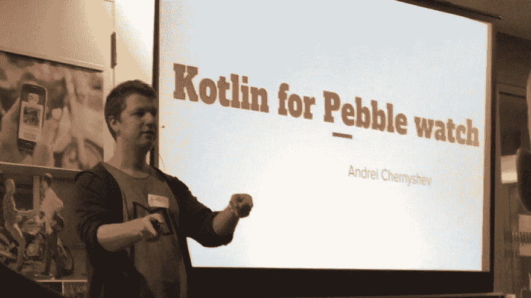

# 卵石的科特林

> 原文：<https://dev.to/gimlet2/kotlin-for-pebble-1idl>

最好的智能手表是 [**Pebble**](https://www.pebble.com/) 。即使考虑到生产它们的公司已经被出售，并且不会再有新的设备，它仍然是你能买到的最好的智能手表。

[T2】](https://res.cloudinary.com/practicaldev/image/fetch/s--xIvO9wUb--/c_limit%2Cf_auto%2Cfl_progressive%2Cq_auto%2Cw_880/https://cdn-images-1.medium.com/max/1024/1%2AKB-De6zghaKa6iaQcgmVkA.jpeg)

如果你是一名软件开发人员或者只是喜欢玩代码，那就更是如此。 **Pebbles** 为您提供强大而简单的 **SDK** 用于 **C** 和 **Javascript** 。以及酷派 web IDE—[**cloud pebble**](https://cloudpebble.net/)。因此，开发应用程序和 watchfaces 非常容易。

但你可能知道我是 [**科特林**](http://kotlinlang.org/) 的忠实粉丝，所以 **C** 和 **Javascript** 对我来说绝对不够！由于 **Kotlin-native** 目前不支持 **Pebble** 中使用的平台，我决定使用 **KotlinJS** 。

KotlinJS 是一种将 **Kotlin** 代码转换成 **Javascript** 的方法。作为起点，我拿这个回购——[https://github.com/pebble/pebblejs](https://github.com/pebble/pebblejs)。这个 repo 为你提供了在本地用 **Javascript** 为 **Pebble** 开发应用的方法。

首先，你需要按照这个[https://developer.pebble.com/sdk/install/](https://developer.pebble.com/sdk/install/)指令来设置 **PebbleSDK** 。此外，您需要设置 Kotlin 命令行工具。我用 [**SDKMan**](http://sdkman.io/) 来说明。一旦你拥有了一切，你就可以走了。

所以，我做了一个 **pebblejs** 回购——【https://github.com/gimlet2/pebblekt】T2 的分叉。这里首先要检查的是 **build.sh** 脚本。它有三个步骤:

1.  用 **kotlinc-js** 将 Kotlin 代码编译成 Javascript
2.  借助 **kotlin-dce-js** 删除未使用的代码
3.  和 **pebble build** 来为 pebble 实际生产工件
4.  最后一步不是脚本的一部分——安装——您可以使用 **pebble install** 命令的不同选项。

最后要关注的— **src** 文件夹:

1.  在 **js** 文件夹中你会发现原来的 **PebbleJS** SDK。同样，**kot Lin**trans filling 的结果也可以在这里的 **app.js** 文件中找到。
2.  KotlinJs 标准库可以在 **kotlinjs** 文件夹中找到。这是个大问题，但是 **kotlin-dce-js** 会解决这个问题。
3.  最后， **kotlin** 文件夹包含 js 代码的绑定(例如**ui . kt**),**pebble . kt**和 **app.kt** 中的一些帮助函数——应用程序代码。

如果您构建并运行这段代码，您将得到典型的 *Hello world* 应用程序。

通过这个项目，我想尝试将 Kotlin 扩展到一个新的平台。值得一提的是最新发布的**kot Lin-native**([0 . 6 . 0](https://github.com/JetBrains/kotlin-native/releases/tag/v0.6))，支持 **STM32** 芯片。但这是另一个帖子的故事。