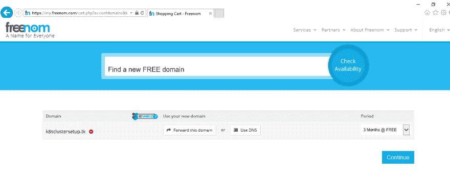
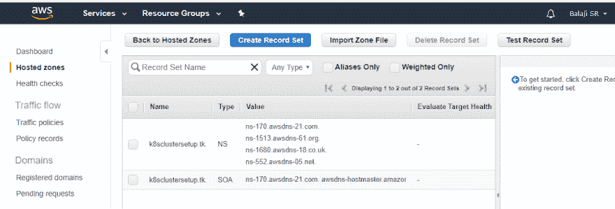
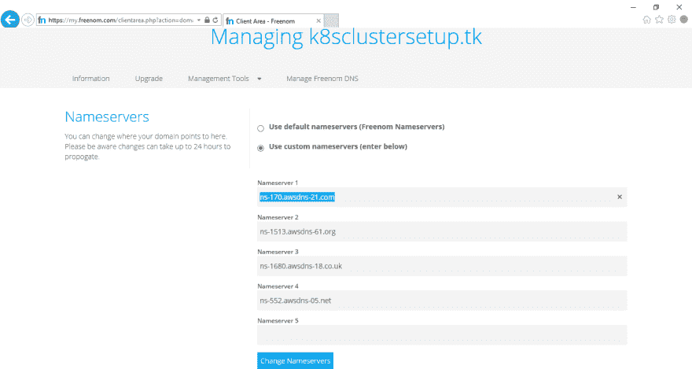

# AWS 上的 Kubernetes 集群设置

> 原文：<https://dev.to/sr_balaji/kubernetes-cluster-setup-on-aws-13m6>

# Kubernetes

它是一个开源系统，用于跨多个主机管理容器化的应用程序，为应用程序的部署、维护和扩展提供了基本机制。

在本文中，我将在 AWS 云环境上设置一个 Kubernetes 集群，为此我将使用一个名为 KOPS 的工具。

什么是 KOPS？kops 是一个自以为是的供应系统

*   全自动安装
*   使用 DNS 识别集群
*   自我修复:一切都在自动扩展组中运行
*   有限的操作系统支持(首选 Debian，支持 Ubuntu 16.04，早期支持 CentOS 和 RHEL)
*   高可用性支持
*   直接供应或 terraform 清单生成

### 先决条件

作为设置的一部分，我需要一个最新更新的 Ubuntu 或 Debian 实例和其他支持工具/工具，如 AWS-CLI，S3 桶，53 号公路上的托管区和注册域。在本文中，我将使用 Ubuntu 实例来启动我的集群。

#### Ubuntu EC2-实例

让我启动一个 AWS EC2 Ubuntu 实例，并用最新的包进行更新。

```
$sudo apt-get update

$sudo apt-get -y upgrade 
```

Enter fullscreen mode Exit fullscreen mode

#### kops 安装

我已经下载了 kops 的最新版本，并在移动到/usr/local/bin
之前更改了权限

```
$ wget -O kops https://github.com/kubernetes/kops/releases/download/$(curl -s https://api.github.com/repos/kubernetes/kops/releases/latest | grep tag_name | cut -d '"' -f 4)/kops-linux-amd64

$ chmod +x kops

$ sudo mv kops /usr/local/bin/ 
```

Enter fullscreen mode Exit fullscreen mode

#### 立方安装

我已经下载了最新版本的 kubectl，并在将它移动到/usr/local/bin
之前更改了权限

```
$ curl -LO https://storage.googleapis.com/kubernetes-release/release/$(curl -s https://storage.googleapis.com/kubernetes-release/release/stable.txt)/bin/linux/amd64/kubectl
$ chmod +x kubectl
$ sudo mv kubectl /usr/local/bin/ 
```

Enter fullscreen mode Exit fullscreen mode

#### AWS CLI

我已经安装了 AWS CLI 来从命令行访问 AWS 实例，以创建 Kubernetes 集群。

```
$ sudo apt-get install python-pip
$ pip install --upgrade pip
$ sudo pip install awscli 
```

Enter fullscreen mode Exit fullscreen mode

#### IAM 用户创建

在 AWS 控制台上，我创建了一个具有完全访问权限的新 IAM 用户(例如 kops ),并保存了访问密钥，因为它将用于配置 AWS CLI。然后，我复制了 AWS 访问密钥 ID 和 AWS 秘密访问密钥，供以后使用。

在 EC2 实例上，我用以下命令配置了新创建的 AWS IAM 用户

```
$aws configure

AWS Access Key ID [None]:  AWS Secret Access Key [None]: Default region name [None]: < Optional : Please enter the region or blank for default>
Default output format [None]: < Optional : Please enter the output format or blank for default> 
```

Enter fullscreen mode Exit fullscreen mode

在同一个 EC2 实例上，我为 AWS EC2 用户生成了一个密钥对。它将用于连接到我将要创建的 kubernetes 集群。在我的例子中，由于是 Ubuntu 用户，ssh 密钥默认存储在。用户主目录的 ssh 文件夹。

```
$ ssh-keygen 
```

Enter fullscreen mode Exit fullscreen mode

#### 域创建

我为集群用户“kops”创建了一个域，并为 discovery 创建了 DNS，它将在集群内部使用，并从客户端到达 kubernetes API 服务器。它应该有一个有效的 DNS 名称。我建议对集群配置使用子域。

可以使用现有的域或新域。在这个例子中，我创建了一个新的域名，并将其托管在免费域名提供商 dot.tk 上。

##### dot . tk/freenom . com 上的域名注册:

我在 freenom.com 上注册了一个名为 k8sclustersetup.tk 的新域，我将把它用于我的 Kubernetes 集群。

[T2】](https://res.cloudinary.com/practicaldev/image/fetch/s--3IdLnKgh--/c_limit%2Cf_auto%2Cfl_progressive%2Cq_auto%2Cw_880/https://thepracticaldev.s3.amazonaws.com/i/ec6chd6us2ozi4963xrb.png)

#### 创建托管区域

在 AWS 控制台上，我在路由器 53 上创建了一个新的托管区域。我已登录 AWS 控制台，导航到路由器 53 DNS 管理并创建了新的托管区域。建议创建一个子域。这将创建一组名称服务器，可以复制供以后使用。我已经复制了域名服务器的详细信息，从 ns-xxx.awsdns-xx.com、ns-xxx.awsdns-xx.co.uk、ns-xxx.awsdns-xx.org、ns-xxx.awsdns-xx.net 开始。

[T2】](https://res.cloudinary.com/practicaldev/image/fetch/s--INZLU-Db--/c_limit%2Cf_auto%2Cfl_progressive%2Cq_auto%2Cw_880/https://thepracticaldev.s3.amazonaws.com/i/u25buxcbudxxqzd83x8l.png)

这些名称服务器(NS)值应该在域服务提供商上更新。在这个设置中，我已经更新了 freenom.com 的 NS 细节。

[T2】](https://res.cloudinary.com/practicaldev/image/fetch/s--iFBCFxt8--/c_limit%2Cf_auto%2Cfl_progressive%2Cq_auto%2Cw_880/https://thepracticaldev.s3.amazonaws.com/i/5dppiy652bd4a5w7sqtq.png)

#### S3 斗创作

我创建了一个新的 S3 存储桶，它有一个有意义的名称(例如“kopsclusterdemo”)，用于存储集群状态。Kubernetes 使用 S3 来存储集群细节，如配置、密钥等。

至此，所有先决条件都已设置完毕，环境已经准备好创建和启动 Kubernetes 集群。

#### Kubernetes 集群创建

出于学习的目的，我选择了 t2.micro，这是一个免费的 EC2 实例。我已经执行了下面的命令来创建带有一个主节点和两个工作节点的 kubernetes 集群。

```
$ kops create cluster --name=k8sclustersetup.tk --state=s3://kopsclusterdemo --zones=eu-west-2a --node-count=2 --node-size=t2.micro --master-size=t2.micro --dns-zone=k8sclustersetup.tk

$kops update cluster k8sclustersetup.tk --yes --state=s3://kopsclusterdemo 
```

Enter fullscreen mode Exit fullscreen mode

创建 Kubernetes 集群需要几分钟时间。为了确认是否创建了 Kubernetes 集群，我使用了下面的命令来列出集群的详细信息。

```
$kops get cluster --state=s3://kopsclusterdemo 
```

Enter fullscreen mode Exit fullscreen mode

发出以下命令可以列出集群节点的详细信息。

```
$kubectl get node 
```

Enter fullscreen mode Exit fullscreen mode

### 结论

本文提供了在 AWS 上安装和配置 Kubernets 集群的细节。