# 使用 Cloudflare 部署 Kubernetes

> 原文：<https://dev.to/circleci/kubernetes-deployments-with-cloudflare-4gjm>

*这篇文章是关于多云部署的系列文章的第二篇。第一篇文章“用 CircleCI 和 Jib 对 Java 应用程序进行 Dockerizing”，使用谷歌的 Jib 项目来简化在 Docker 中包装 Java 应用程序。这篇文章介绍了全局负载平衡器背后的多云部署。*

在第一篇[帖子](https://dev.to/circleci/dockerizing-java-apps-with-circleci-and-jib-2af8)中，我们讨论了构建容器化的应用程序，并发布了一个简单的带有 Google Jib 的 Java Spring Boot 应用程序。该过程在构建和组装我们的应用程序时是有效的，但是我们没有解决分发问题。在本帖中，我们将了解一种将 Docker 应用程序部署到 Kubernetes 并通过 Cloudflare 的域名系统(DNS)和代理服务实现全球访问的方法。

我们将在这个博客中使用几种技术，并且需要对 CircleCI 有一个基本的了解。如果你是 CircleCI 的新手，我们有[介绍性内容](https://circleci.com/docs/2.0/basics/)帮助你入门。

本文中使用的代码位于 Github 上的一个示例库中。你可以参考[https://github.com/eddiewebb/circleci-multi-cloud-k8s](https://github.com/eddiewebb/circleci-multi-cloud-k8s)获得完整的代码样本，或者跟随。以下是我们将要构建的工作流:

[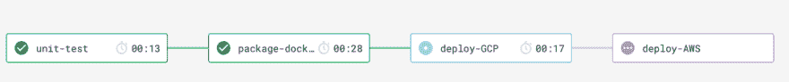T2】](https://res.cloudinary.com/practicaldev/image/fetch/s--NNmpzPzT--/c_limit%2Cf_auto%2Cfl_progressive%2Cq_auto%2Cw_880/https://thepracticaldev.s3.amazonaws.com/i/i8b8sdqd6lnyowdjldh9.png)

## 凭证管理

我将凭证管理放在这篇关于部署的文章的最前面，因为它是成功的 [CI/CD](https://circleci.com/continuous-integration/) 管道的基础。在我们开始推送我们的配置之前，我们将设置我们对 Docker Hub(可选)、谷歌云平台(GCP)和 Cloudflare 的访问。

### 向 Docker Hub 认证

我的示例工作流使用 Docker Hub 作为容器化应用程序的注册中心。或者，你可以将它们推送到谷歌或亚马逊的注册中心。如何进行身份验证将取决于您的应用。这个示例应用程序使用 Maven 加密来验证 Google Jib 与 Docker Hub 的连接，正如我们在第一篇[帖子](https://dev.to/circleci/dockerizing-java-apps-with-circleci-and-jib-2af8)中所描述的。

### 向谷歌云平台认证

GCP 是我们选择托管 Kubernetes 集群的 IaaS 提供商。要开始使用 GCP 认证，你需要创建一个服务用户密钥，如[谷歌文档](https://cloud.google.com/iam/docs/creating-managing-service-account-keys)中所述。当提示您下载密钥时，选择新的`.json`格式。您还需要为服务帐户分配角色。要成功创建集群和部署，您的服务帐户需要“Kubernetes 引擎集群管理”和“Kubernetes 引擎开发人员”这些角色可以在 Google 控制台的主身份和访问管理(IAM)选项卡上授予。

密钥文件包含敏感信息。我们从不希望将敏感信息签入源代码。为了向我们的工作流公开它，我们将把文件编码成一个字符串，并保存为一个环境变量:

```
base64 ~/Downloads/account-12345-abcdef1234.json 
```

Enter fullscreen mode Exit fullscreen mode

复制输出并将其保存为 CircleCI 项目配置中的环境变量:

[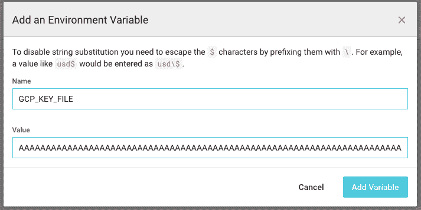T2】](https://res.cloudinary.com/practicaldev/image/fetch/s--NcWTFICh--/c_limit%2Cf_auto%2Cfl_progressive%2Cq_auto%2Cw_880/https://thepracticaldev.s3.amazonaws.com/i/woakyy0p0bemd4bm5cl8.png)

稍后，当我们在部署工作中需要它时，我们可以再次用 base64 将其解码回一个文件:

```
echo "${GCP_KEY_FILE}" | base64 --decode >> gcp_key.json 
```

Enter fullscreen mode Exit fullscreen mode

我觉得有必要发布标准预防措施:base64 不是加密，它没有增加安全性，也没有对敏感值进行真正的混淆。我们使用 base64 作为将文件转换成字符串的手段。对 base64 值的保护级别与密钥文件本身的保护级别相同，这一点非常重要。

### 使用 Cloudflare 进行认证

我们部署的最后一步是使用 Cloudflare 将 [justademo.online](https://justademo.online) 的流量路由回我们的各个集群。我们需要一个 Cloudflare API 密钥、一个 DNS 区域和一个电子邮件地址。因为这些都是简单的字符串，所以可以按原样添加。

*   `CLOUDFLARE_API_KEY` -可在个人资料和域仪表板中找到
*   `CLOUDFLARE_DNS_ZONE` -可在域仪表板上找到
*   `CLOUDFLARE_EMAIL` -用于创建 Cloudflare 帐户的电子邮件

## 使用 CircleCI 将 Docker 容器部署到 Kubernetes

我发现谷歌云的 Kubernetes 支持直观且易于上手。他们的`gcloud`命令行界面(CLI)甚至提供了将所需配置注入 Kubernetes `kubectl` CLI 的方法。有很多提供商，尽管这篇博客文章中没有提到，但是[样本代码](https://github.com/eddiewebb/circleci-multi-cloud-k8s)确实包含了使用`kops`部署到亚马逊网络服务(AWS)的内容。

### 配置命令行工具

CircleCI 更喜欢确定性和显式配置，而不是插件。这使我们能够控制在我们的配置中使用的环境和版本。我们要做的第一件事是安装我们的 CLI 工具:

[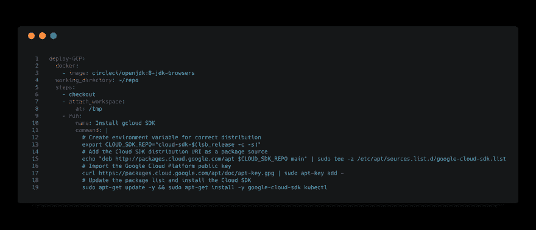T2】](https://res.cloudinary.com/practicaldev/image/fetch/s--tHOxasT9--/c_limit%2Cf_auto%2Cfl_progressive%2Cq_auto%2Cw_880/https://thepracticaldev.s3.amazonaws.com/i/5tsc0zcs2o71gttbiuge.png)

记住:您可以从我们的[示例项目的](https://github.com/eddiewebb/circleci-multi-cloud-k8s/blob/master/.circleci/config.yml)配置中复制文本。

因为上面的步骤在每次构建时都要安装 CLI，所以我们的工作会增加大约 10-15 秒。对于您经常使用的工具，值得花时间[打包您自己的定制 Docker 图像](https://circleci.com/docs/2.0/custom-images/)。

安装了`gcloud`和`kubectl`工具后，我们可以开始创建集群和部署。GCP Kubernetes 环境中的一般流程是:

1.  创建一个定义虚拟机数量和大小的集群来运行我们的工作负载。
2.  创建一个部署，它定义了用作我们的工作负载的[容器映像](https://circleci.com/docs/2.0/custom-images/)。
3.  创建一个负载平衡器服务，将 IP 和端口映射到我们的集群。

在`gcloud`做这些之前，我们需要向它提供凭证和项目信息。这是我们将 GCP 密钥“再水合”成可读文件的步骤:

[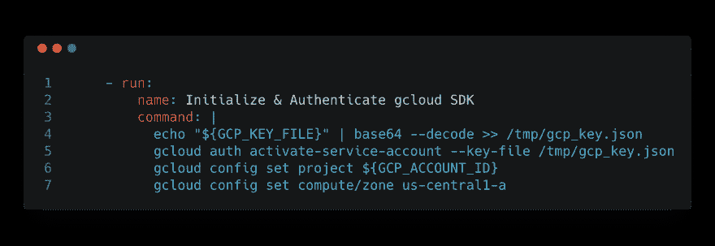T2】](https://res.cloudinary.com/practicaldev/image/fetch/s--lNatl59u--/c_limit%2Cf_auto%2Cfl_progressive%2Cq_auto%2Cw_880/https://thepracticaldev.s3.amazonaws.com/i/plz3haciqzwa8jb0qpv7.png)

### 运行您的首次部署

CLI 现在可以访问我们的服务帐户。我们将使用该访问来创建我们的集群:

```
gcloud container clusters create circleci-k8s-demo --num-nodes=2 
```

Enter fullscreen mode Exit fullscreen mode

该命令应该一直阻塞，直到集群创建成功。这允许我们将容器映像作为工作负载提供。`gcloud` CLI 也会自动为我们将所需权限保存到`kubectl`中:

```
kubectl run circleci-k8s-demo --image=${DOCKER_IMAGE} --port 8080 
```

Enter fullscreen mode Exit fullscreen mode

变量`DOCKER_IMAGE`以标准注册表格式定义了我们的容器的完整坐标。如果你关注了我们之前关于用 Jib 版本化 Java 容器的[文章](https://circleci.com/blog/dockerizing-java-apps-with-circleci-and-jib/)，那么`DOCKER_IMAGE`将会是:`eddiewebb/circleci-k8s-demo:0.0.1-b8`。

与 create cluster 命令不同，创建或更新部署的命令是异步的。我们需要对我们的集群进行一些基本的冒烟测试。我们使用 rollout status 命令等待成功部署。这个命令非常完美，因为它等待最终状态，并在成功部署时以 0 退出:

```
kubectl rollout status deployment/circleci-k8s-demo 
```

Enter fullscreen mode Exit fullscreen mode

我们的容器现在运行在几个节点上，在端口 8080 上有不同的 IP。在我们离开 GCP 之前，要做的最后一件事是设置本地负载平衡器，将流量从单个 IP 发送到集群中的所有容器。我们使用`kubectl`的`expose`命令:

```
kubectl expose deployment circleci-k8s-demo --type=LoadBalancer --port 80 --target-port 8080 
```

Enter fullscreen mode Exit fullscreen mode

为了确保一切都已启动并且路由成功，我们可以运行一个基本的健康检查:

[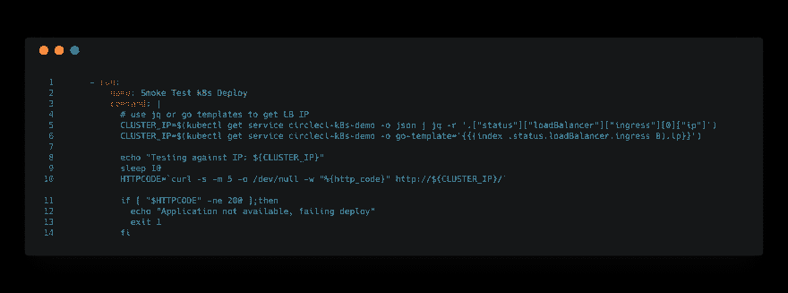T2】](https://res.cloudinary.com/practicaldev/image/fetch/s--Fv8MoRYF--/c_limit%2Cf_auto%2Cfl_progressive%2Cq_auto%2Cw_880/https://thepracticaldev.s3.amazonaws.com/i/jvnt7pre69bhlf4nmdr6.png)

正如你在上面的冒烟测试工作中可能注意到的，我们不知道 Google 将提前分配的 IP 地址。在生产环境中，您可能会选择购买和分配保留 IP，而不是使用浮动 IP。你可以在我们的 [AWS 部署](https://circleci.com/docs/2.0/deployment-integrations/#aws)中看到这样的例子，它是[样本项目](https://github.com/eddiewebb/circleci-multi-cloud-k8s/blob/master/.circleci/config.yml)的一部分。

### 使用 Cloudflare 路由您的域

每个云提供商都公开了将动态集群 IP 分配给已知域名的方法。我想展示我们如何为来自多个云提供商的应用提供服务，并动态解决分布和负载问题。除了提供简单的 API 来管理我们的 DNS，Cloudflare 还允许我们通过他们的代理路由流量，以获得额外的缓存和保护。此外，由于这是在它自己的步骤中运行，我们需要再次从`kubectl`中获取`CLUSTER_IP`。然后，我们将在对 Cloudflare 的 DNS 的`POST`调用中使用该 IP:

[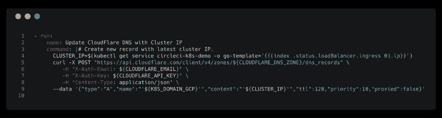T2】](https://res.cloudinary.com/practicaldev/image/fetch/s--DHoCtH3L--/c_limit%2Cf_auto%2Cfl_progressive%2Cq_auto%2Cw_880/https://thepracticaldev.s3.amazonaws.com/i/lwckx4v98e2bos80t7lv.png)

**注意:**因为我们以后要在负载平衡器中使用这个子域，所以禁用“代理”很重要。

这将把 GCP 集群映射到一个子域。我们的全球负载平衡器将使用该子域在多个云提供商之间分配流量。

[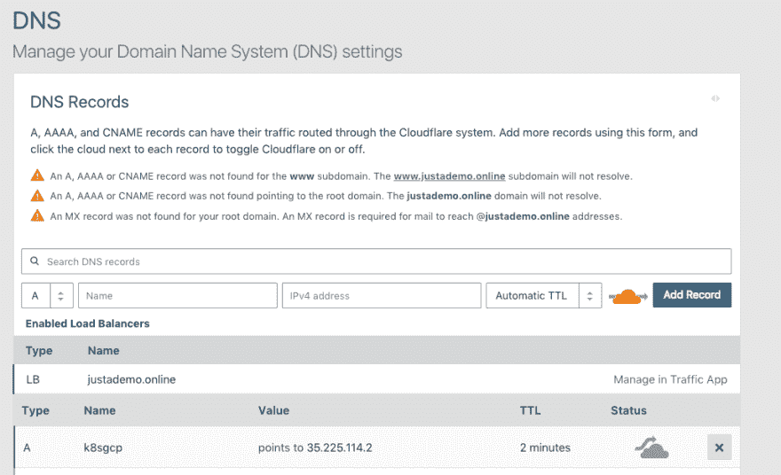T2】](https://res.cloudinary.com/practicaldev/image/fetch/s--wD1fLxiq--/c_limit%2Cf_auto%2Cfl_progressive%2Cq_auto%2Cw_880/https://thepracticaldev.s3.amazonaws.com/i/atpqr7bl17fm44tr96k8.png)

酷！成功了吗？如果您已经完成了，您将拥有一个类似于 [k8sgcp.justademo.online](http://k8sgcp.justademo.online/) 的活动子域，通过 Cloudflare 路由到您在 Google Cloud 中的 Kubernetes 集群。

## 使用 CircleCI 更新 GCP 上现有的 Kubernetes 部署

我们上面的例子创造了一切新鲜的东西。如果您尝试重新运行该部署，将会失败！Google 不会创建已经存在的集群、部署或服务。为了使我们的工作流正常运行，我们必须增加我们的原始解决方案来考虑当前的状态。

我们可以使用`get`和`describe`命令来确定我们的栈是否已经存在，并运行适当的更新命令。

创建群集或获取凭据:

[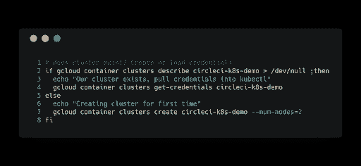T2】](https://res.cloudinary.com/practicaldev/image/fetch/s--0k6mRF6R--/c_limit%2Cf_auto%2Cfl_progressive%2Cq_auto%2Cw_880/https://thepracticaldev.s3.amazonaws.com/i/j0t6lw4w0vf7fwjshg98.png)

运行部署或更新映像:

[T2】](https://res.cloudinary.com/practicaldev/image/fetch/s--R8562Gy---/c_limit%2Cf_auto%2Cfl_progressive%2Cq_auto%2Cw_880/https://thepracticaldev.s3.amazonaws.com/i/6gbv3smph8qixeloek37.png)

我们的[示例项目](https://github.com/eddiewebb/circleci-multi-cloud-k8s)使用的逻辑将根据当前状态创建或更新所有方面。

或者，对于更健壮的部署，您将希望探索可以定义和应用的 Kubernetes 部署定义的使用，将配置捕获为一个`.yml`文件。更多信息可以在 [Kubernetes 示例](https://kubernetes.io/docs/tasks/run-application/run-stateless-application-deployment/)中找到。

## 添加 AWS 部署

AWS 为部署容器提供了几个选项，包括 Fargate、ECS 和从 EC2 实例构建自己的集群。您可以查看我们的[示例项目](https://github.com/eddiewebb/circleci-multi-cloud-k8s/blob/master/.circleci/config.yml)中的`deploy-AWS`作业来探索一种方法。我们使用`kops` [项目](https://github.com/kubernetes/kops)从 EC2 和弹性负载平衡器(ELB)提供一个集群，将流量路由到该集群。

与这篇博文的主题密切相关的是，我们现在有了跨多个云提供商运行的相同应用程序。接下来，我们将实现一个全局负载平衡器，在它们之间分配流量并设置我们的 DNS。由于`kops`为我们创建了一个 ELB，设置 DNS 会有所不同。

## 用 Cloudflare 绑在一起

与 Cloudflare 的 DNS 服务一样，他们的流量服务公开了用于管理负载平衡器配置的完整 API。这使得我们可以在 CircleCI 中直接自动化这项任务。

### 在 Cloudflare 中创建负载平衡器

我选择不写这个部分，因为这真的是一次性的事情。创建一个负载平衡器，它与您希望位于所有云前面的主域相关联:

[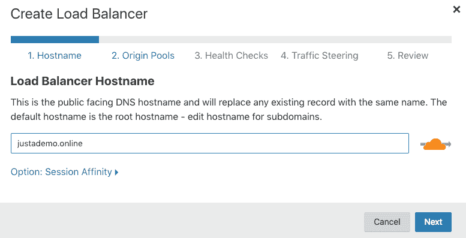T2】](https://res.cloudinary.com/practicaldev/image/fetch/s--lnJaOUHB--/c_limit%2Cf_auto%2Cfl_progressive%2Cq_auto%2Cw_880/https://thepracticaldev.s3.amazonaws.com/i/vluwus0g5qvwt6iq9r83.png)

您需要创建至少一个源池。如果您已经运行了部署，您可以指定我们在上面为 GCP 集群创建的子域:

[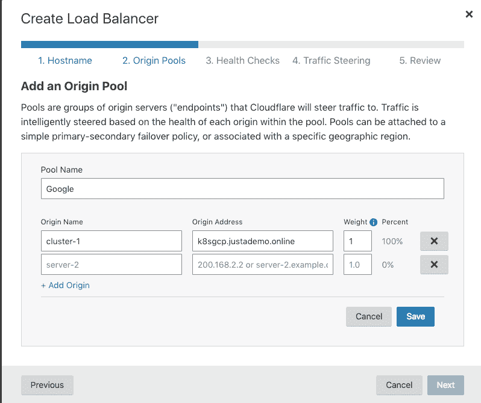T2】](https://res.cloudinary.com/practicaldev/image/fetch/s--T-H_PGP0--/c_limit%2Cf_auto%2Cfl_progressive%2Cq_auto%2Cw_880/https://thepracticaldev.s3.amazonaws.com/i/ux97ya5keixx76g9hvbv.png)

您还将被要求定义一个健康监视器。我选择了一个简单的`GET`到应用程序上的`/build-info`端点，期望得到 200 响应:

[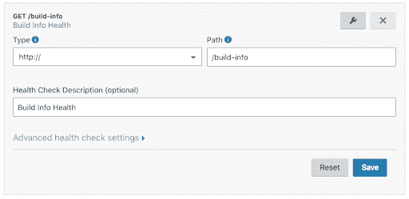T2】](https://res.cloudinary.com/practicaldev/image/fetch/s--M8_tttn8--/c_limit%2Cf_auto%2Cfl_progressive%2Cq_auto%2Cw_880/https://thepracticaldev.s3.amazonaws.com/i/g0kjdq4mz1ddaqdc73q3.png)

一旦创建了初始负载平衡器和 GCP 原始池，我们就可以继续编写 AWS 集成的脚本，使用在每个部署上创建的动态 AWS ELB 来更新第二个原始池。

### 在部署时更新我们的 Cloudflare 源池

如上所述，在 AWS 中使用`kops`时，它会自动创建一个路由到 Kubernetes 集群的 ELB。我们不需要在 Cloudflare 中设置 AWS 域，而是使用 Amazon 提供的域。我们需要将它传递给 Cloudflare。使用`kubectl get service`可以获得 ELB 的名称:

[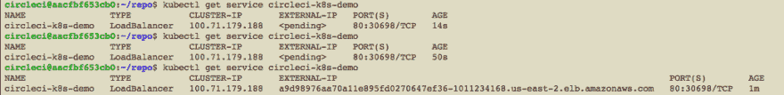T2】](https://res.cloudinary.com/practicaldev/image/fetch/s--mbXy0tj3--/c_limit%2Cf_auto%2Cfl_progressive%2Cq_auto%2Cw_880/https://thepracticaldev.s3.amazonaws.com/i/9hzcm9n5ick5tx7nhijt.png)

因为 ELB 可能不会立即准备好，所以我们将该逻辑放在一个循环中:

[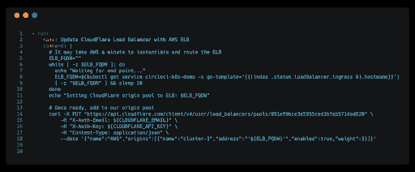T2】](https://res.cloudinary.com/practicaldev/image/fetch/s--t4mFdnIq--/c_limit%2Cf_auto%2Cfl_progressive%2Cq_auto%2Cw_880/https://thepracticaldev.s3.amazonaws.com/i/y12b9gblsis7qkhf2mwz.png)

结果应该是两个健康的源池，在单独的云提供商中运行，都在单个域后面:

[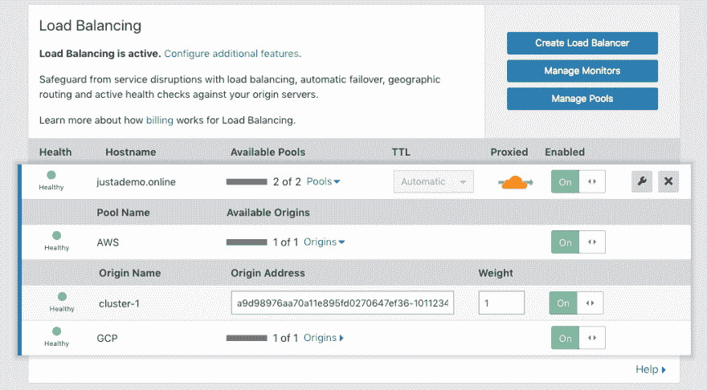T2】](https://res.cloudinary.com/practicaldev/image/fetch/s--a7UFXoJx--/c_limit%2Cf_auto%2Cfl_progressive%2Cq_auto%2Cw_880/https://thepracticaldev.s3.amazonaws.com/i/1k8dt2crfsor6lg22gbx.png)

我们在顶级域名上使用代理和 SSL 强制，所以请继续查看[https://justademo.online/](https://justademo.online)。

## 总结

这篇文章探讨了 Docker 应用程序的创建和跨多个云提供商的部署。我们使用 Google 对 Kubernetes 集群的原生支持，而在 AWS 中，我们从头开始创建集群。最后，我们使用 Cloudflare 作为全局负载平衡器和 DNS 提供商，使我们能够实现对最终用户透明的多云部署。请查看[示例项目](https://github.com/eddiewebb/circleci-multi-cloud-k8s),其中包含这篇文章中涉及的所有内容的完整示例代码。

航运愉快！