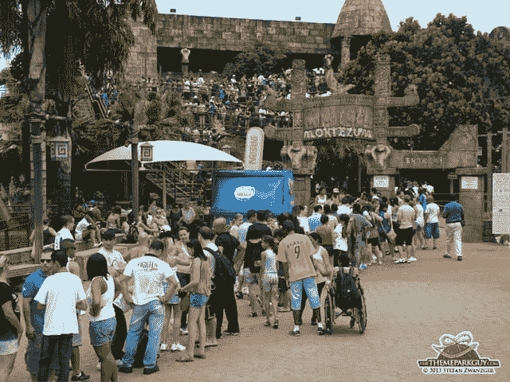
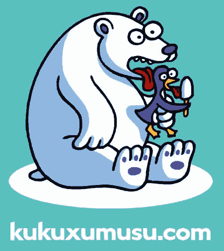

# Kubernetes 解释说:主题公园类比:自动缩放，污点和亲和力

> 原文：<https://dev.to/danlebrero/kubernetes-explained-the-theme-park-analogy-auto-scaling-taints-and-affinities-2ced>

在[的前一篇文章](https://dev.to/danlebrero/kubernetes-explained-in-pictures-the-theme-park-analogy-3d99)中，我们用主题公园的比喻解释了 Kubernetes 的概念:容器、pod、部署、容器端口、cpu 和内存资源、探针、服务、入口、标签、节点和节点池。

在这篇文章中，我们将继续主题公园的类比，讨论自动缩放、污点和亲缘关系。

你也可以阅读下一篇关于 [Kubernetes StatefulSets](https://dev.to/danlebrero/kubernetes-explained-in-pictures-statefulsets-persistent-volumes-and-headless-services-5do9) 的帖子。

## 成功！

这是不可能的，KubePark 是一个巨大的成功。人们涌向大门，渴望享受 KubePark 的体验，但人太多了:队伍开始增长，脾气暴躁的游客在热门网站上留下难看的评论。

[T2】](https://res.cloudinary.com/practicaldev/image/fetch/s--ERw6wsKD--/c_limit%2Cf_auto%2Cfl_progressive%2Cq_auto%2Cw_880/https://danlebrero.cimg/blog/kubernetes-explained/queues-to-the-parks-main-roller-coaster-big.jpg)

<small>图像归属:【http://www.thethemeparkguy.com/】T2。</small>

您可以通过首先增加您的游乐骑行计划中的景点数量，然后在包裹变满时增加租赁包裹的数量来控制队列。

如果每天不得不摆弄有趣的乘坐计划和包裹合同还不够糟糕，你很快就会注意到，1909 年的旋转木马在早上非常受欢迎，但在晚上很少使用，而过山车则相反，让我们不要谈论那些疯狂的凌晨 4 点康加线！此外，周末的游客数量比工作日多几个数量级。

你只是在浪费大量的金钱和时间。

为了解决这个问题，你为你的控制团队设计了一套额外的指令(每个景点一套)，这样如果一个景点的所有复制品的平均使用率很高，控制团队将安装更多的这些景点，当使用率低时将它们移除 **(k8s [pod 水平自动缩放](https://kubernetes.io/docs/tasks/run-application/horizontal-pod-autoscale/) )** 。使用情况可以用不同的方法来衡量，但是你决定功耗 **(k8s，CPU 使用)**是一个足够好的代理，可以知道一个景点有多忙。

除此之外，与您的房东签订的租赁协议中增加了一项新条款，允许您的控制团队在未经您同意的情况下租赁额外的地块(最高限额)。这样，在周末公园可以增长，在工作日可以收缩 **(k8s [集群自动缩放](https://cloud.google.com/kubernetes-engine/docs/concepts/cluster-autoscaler) )** 。

从现在开始，KubePark 将总是以最少的所需资源运行，您只需付出很少的额外努力。

## 更多景点！

现在 KubePark 运行顺利，是时候提供更广泛的景点了。

一项市场研究表明，溜冰场和滑雪场将是下一个大事件。

由于他们需要下雪和寒冷的天气，你签署了一份新的租赁合同 **(k8s [节点池](https://danlebrero.com/2018/07/09/kubernetes-explained-in-pictures-the-theme-park-analogy/#node-pool) )** 为你提供北极地区的包裹，大小为 500x200，功率为 250kW，你将它们标记为“平原”和“北极天气”。

在趣味骑行模板上，您添加了一个新的可选部分:*必须拥有和美好拥有包裹标签*，溜冰场和滑雪坡趣味骑行计划都包括“必须拥有的北极天气”。控制人员将确保这些景点总是安装在具有北极天气 **(k8s [节点亲和力](https://kubernetes.io/docs/concepts/configuration/assign-pod-node) )** 的地块上。

注意:没有地块要求的景点可以安装在北极地块中。大多数时候，你可以接受这个，1909 年的旋转木马在雪中看起来更漂亮。但是有些特殊情况，比如那些极其昂贵的零重力包裹，你想把所有的景点都挡在外面，除了那些专门为它们设计的 **(k8s [污点和公差](https://kubernetes.io/docs/concepts/configuration/taint-and-toleration/) )** 。

## 前方有难

考虑到白雪包裹，你开始吸引新的景点:圆顶冰屋过夜、企鹅比赛、北极熊观光、裸体男子冰上钓鱼比赛...但是，在急于拥有所有这些新景点的时候，你忽略了一个非常重要的细节，灾难发生了，严重损害了 KubePark 的声誉。

下面这张照片在网上疯传，但请注意，你会发现它非常令人不安:

[T2】](https://res.cloudinary.com/practicaldev/image/fetch/s--BNPDTGV8--/c_limit%2Cf_auto%2Cfl_progressive%2Cq_auto%2Cw_880/https://danlebrero.cimg/blog/kubernetes-explained/kubernetes-explained-pod-affinity.jpg)

<small>图像归属:[舔](http://26anibestiario.kukuxumusu.com/resultados-animals/#) by [Kukuxumusu](http://www.kukuxumusu.com/) 。</small>

一个偶然的机会，一个北极熊观光景点被安装在一个企鹅比赛旁边。这可不是什么好景象。

为了确保这种情况不再发生，企鹅比赛被标记为*美味小吃*，并且景点模板中添加了一个新选项，以便您可以指定北极熊观光不得与标记为*美味小吃*的景点在同一个包裹中。

预见到未来可能的用途，您决定也添加选项来指定*必须具有同包 X 标签吸引力*、*同包 X 标签吸引力*和*同包 X 标签吸引力*、 **(k8s [pod 亲和力和反亲和力](https://kubernetes.io/docs/concepts/configuration/assign-pod-node/#inter-pod-affinity-and-anti-affinity-beta-feature) )** 。

你的控制团队至少需要雇佣一名俄罗斯方块世界冠军。

## 就这些？

你又想了！

我们可以在下一篇文章的[中读到关于复制、守护进程和有状态集、持久卷、作业和 Cron 作业、秘密、配置映射的内容。](https://dev.to/danlebrero/kubernetes-explained-in-pictures-statefulsets-persistent-volumes-and-headless-services-5do9)