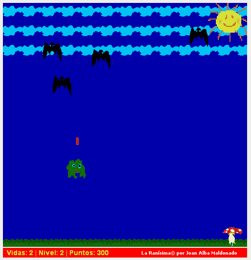

# la rani Sima——JavaScript 中的太空入侵者游戏(2006 年 2 月)

> 原文：<https://dev.to/jalbam/la-ranisima--space-invaders-alike-game-in-javascript-february-2006-5ek5>

“La Ranisima”是一款完全用 DHTML (HTML、CSS 和 JavaScript)编写的开源游戏，其灵感来自经典的《太空入侵者》,尽管使用了会受到最小孩子喜爱的幼稚图形。

[T2】](https://res.cloudinary.com/practicaldev/image/fetch/s--Kpd7ZOm6--/c_limit%2Cf_auto%2Cfl_progressive%2Cq_66%2Cw_880/http://dhtmlgames.com/ranisima/ranisima.gif)

这是我的第一个 DHTML 游戏，它是在 2006 年初基于 DOM 操纵制作的，当时几乎没有人知道 JavaScript 在游戏开发中的强大功能，大多数喜欢使用 Flash 甚至 Java 开发游戏的开发人员也不知道与之相关的所有技术。

你也可以通过编辑脚本开头的配置变量来改变游戏行为。要改变游戏图像，你只需要用其他图像替换它们。

官方语言是西班牙语和英语。

你可以在互联网上找到这个游戏的其他修改和改编版本，包括一个 Opera widget。

这款游戏已经在 BeOS、Linux、NetBSD、OpenBSD、FreeBSD、Windows、Mac OS X 等平台下测试过。

在线英语游戏:[http://ranisima.tuxfamily.org/ranisima_english/](http://ranisima.tuxfamily.org/ranisima_english/)

英语在线游戏(镜像):[http://www.dhtmlgames.com/ranisima/ranisima_english/](http://www.dhtmlgames.com/ranisima/ranisima_english/)

西班牙语在线游戏:[http://ranisima.tuxfamily.org/ranisima_spanish/](http://ranisima.tuxfamily.org/ranisima_spanish/)

西班牙语在线游戏(镜像):[http://www.dhtmlgames.com/ranisima/ranisima_spanish/](http://www.dhtmlgames.com/ranisima/ranisima_spanish/)

官方网站:[http://ranisima.tuxfamily.org/](http://ranisima.tuxfamily.org/)(镜像在[http://www.dhtmlgames.com/ranisima/](http://www.dhtmlgames.com/ranisima/))。

也可以在 GitHub 上找到:[https://github.com/jalbam/ranisima](https://github.com/jalbam/ranisima)