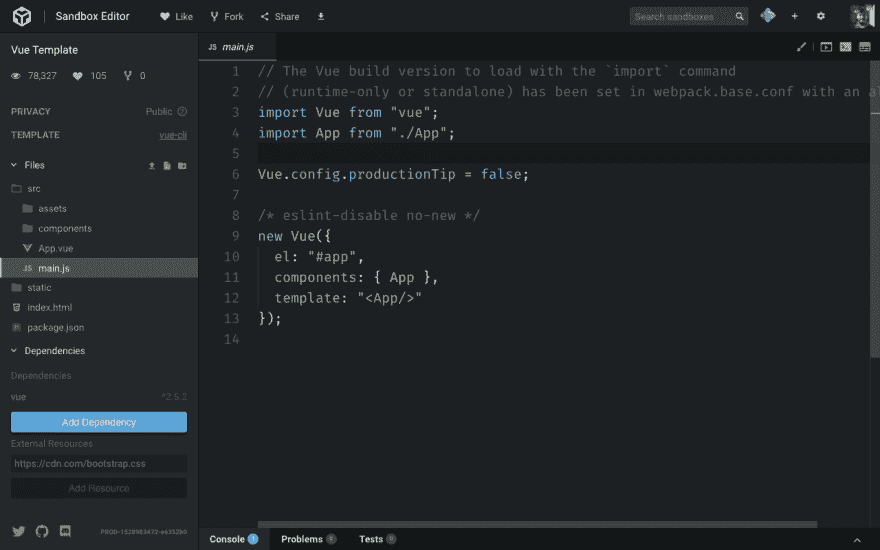
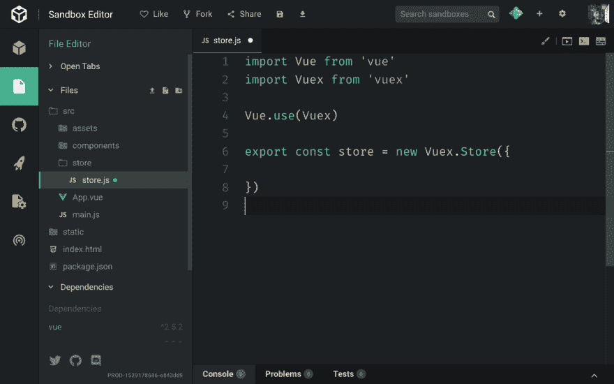

# Vuex，the vue . js state manager，vuex，vista . vuex，vuex，vista . vuex，vuex，vuex，vista . vuex，vuex，vuex，vuex，vuex，vuex，vuex，vuex，

> 原文:# t0]https://dev . to/flaviocopes/vuex-the-vuej-state manager-lgh

> 我正在学习 Vue.js 课程。如果你对学习 Vue 感兴趣，[上名单](https://flaviocopes.com/course/vue/)下周就能获得一本 100 多页的关于 Vue 基础知识的免费电子书！

## vuex 简介

Vuex 是 Vue.js 的官方状态管理库。

它的工作是在应用程序的组件之间共享数据。

Vue.js 中现成的组件可以使用

*   **props** ，将状态从父组件传递给子组件
*   **事件**，从子组件改变父组件的状态
*   使用定制事件(使用`$emit`和`$on`)仍然可以在没有父子关系的组件之间使用事件

有时事情会变得比这些简单选项所允许的更复杂。

在这种情况下，一个好的选择是将状态集中在单个存储中。这就是 Vuex 所做的。

## 为什么要用 Vuex

Vuex 并不是你在 Vue 中可以使用的唯一状态管理选项(你也可以使用 Redux)，但它的主要优势是它是官方的，它与 Vue.js 的集成是它闪光的地方。

有了 React，你就不得不从众多可用的库中选择一个，因为生态系统是巨大的，并且没有事实上的标准。最近 Redux 是最受欢迎的选择，MobX 紧随其后。有了 Vue，我甚至可以说，除了 Vuex，你不需要四处寻找任何东西，尤其是在开始的时候。

Vuex 从 React 生态系统中借用了许多想法，因为这是 Redux 推广的流量模式。

如果你已经知道 Flux 或者 Redux，Vuex 会很熟悉。如果你没有，没问题-我会从头开始解释每一个概念。

Vue 应用程序中的组件可以有自己的状态。例如，输入框将在本地存储输入的数据。这很好，即使使用 Vuex，组件也可以有本地状态。

当你开始做大量工作来传递一个状态时，你知道你需要像 Vuex 这样的东西。

在这种情况下，Vuex 为状态提供了一个中央存储库，您可以通过请求存储库来改变状态。

依赖于特定状态的每个组件都将使用存储上的 getter 来访问它，这确保了一旦状态发生变化，它就会得到更新。

使用 Vuex 会给应用程序带来一些复杂性，因为事情需要以某种方式设置才能正确工作，但如果这有助于解决无组织的道具传递和事件系统，如果太复杂，可能会变得一团糟，那么这是一个很好的选择。

## 我们开始吧

在本例中，我从一个 [Vue CLI](https://dev.to/flaviocopes/the-vuejs-cli-learn-how-to-use-it-1df4-temp-slug-9952649) 应用程序开始。Vuex 也可以通过直接加载到脚本标签中来使用，但由于 Vuex 更适合大型应用程序，所以您更有可能在更结构化的应用程序中使用它，比如那些可以通过 Vue CLI 快速启动的应用程序。

我使用的例子是 put CodeSandbox，这是一个很棒的服务，它有一个 Vue CLI 示例，可以在[https://codesandbox.io/s/vue](https://codesandbox.io/s/vue)使用。我推荐用它来玩一玩。

[T2】](https://res.cloudinary.com/practicaldev/image/fetch/s--VnEoIrSY--/c_limit%2Cf_auto%2Cfl_progressive%2Cq_auto%2Cw_880/https://flaviocopes.com/vuex/codesandbox.png)

一旦你在那里，点击**添加依赖关系**按钮，输入“vuex”并点击它。

现在 Vuex 将被列在项目依赖项中。

要在本地安装 Vuex，只需在项目文件夹中运行`npm install vuex`或`yarn add vuex`即可。

## 创建 Vuex 商店

现在我们准备创建我们的 Vuex 商店。

这个文件可以放在任何地方。一般建议放在`src/store/store.js`文件中，我们就这么做。

在这个文件中，我们初始化 Vuex，并告诉 Vue 使用它:

```
import Vue from 'vue'
import Vuex from 'vuex'

Vue.use(Vuex)

export const store = new Vuex.Store({

}) 
```

Enter fullscreen mode Exit fullscreen mode

[T2】](https://res.cloudinary.com/practicaldev/image/fetch/s--Mh4Orf3I--/c_limit%2Cf_auto%2Cfl_progressive%2Cq_auto%2Cw_880/https://flaviocopes.com/vuex/vuex-store.png)

我们导出一个 Vuex store 对象，它是使用`Vuex.Store()` API 创建的。

## 商店的一个用例

现在我们已经有了一个框架，让我们为 Vuex 想出一个好的用例，这样我就可以介绍它的概念了。

例如，我有两个兄弟组件，一个带有输入字段，另一个打印输入字段内容。

当输入字段被更改时，我想同时更改第二个组件中的内容。非常简单，但这将为我们做的工作。

## 介绍我们需要的新组件

我删除了 HelloWorld 组件，并添加了一个表单组件和一个显示组件。

```
<template>
    <div>
        <label for="flavor">Favorite ice cream flavor?</label>
        <input name="flavor">
    </div>
</template>

<template>
    <div>
        <p>You chose ???</p>
    </div>
</template> 
```

Enter fullscreen mode Exit fullscreen mode

## 将那些组件添加到应用程序中

我们将它们添加到 App.vue 代码中，而不是 HelloWorld 组件:

```
<template>
  <div id="app">
    <Form/>
    <Display/>
  </div>
</template>

<script>
import Form from './components/Form'
import Display from './components/Display'

export default {
  name: 'App',
  components: {
    Form,
    Display
  }
}
</script> 
```

Enter fullscreen mode Exit fullscreen mode

## 给商店添加状态

有了这些，我们回到 store.js 文件，向存储添加一个名为`state`的属性，这是一个包含`flavor`属性的对象。最初这是一个空字符串。

```
import Vue from 'vue'
import Vuex from 'vuex'

Vue.use(Vuex)

export const store = new Vuex.Store({
  state: {
    flavor: ''
  }
}) 
```

Enter fullscreen mode Exit fullscreen mode

当用户在输入字段中输入内容时，我们会更新它。

## 添加一个突变

除非使用**突变**，否则无法操纵状态。我们设置了一个突变，将在表单组件中使用它来通知商店状态应该改变。

```
import Vue from 'vue'
import Vuex from 'vuex'

Vue.use(Vuex)

export const store = new Vuex.Store({
  state: {
    flavor: ''
  },
  mutations: {
    change(state, flavor) {
      state.flavor = flavor
    }
  }
}) 
```

Enter fullscreen mode Exit fullscreen mode

## 添加一个 getter 来引用一个状态属性

有了这个设置，我们需要添加一个查看状态的方法。我们使用**吸气剂**来实现。我们为`flavor`属性设置了一个 getter:

```
import Vue from 'vue'
import Vuex from 'vuex'

Vue.use(Vuex)

export const store = new Vuex.Store({
  state: {
    flavor: ''
  },
  mutations: {
    change(state, flavor) {
      state.flavor = flavor
    }
  },
  getters: {
    flavor: state => state.flavor
  }
}) 
```

Enter fullscreen mode Exit fullscreen mode

注意 getters 是一个对象。`flavor`是这个对象的一个属性，它接受状态作为参数，并返回状态的`flavor`属性。

## 将 Vuex 商店添加到应用程序

现在商店已经可以使用了。我们回到我们的应用程序代码，在 main.js 文件中，我们需要导入状态，并使它在我们的 Vue 应用程序中可用。

我们加上

```
import { store } from './store/store' 
```

Enter fullscreen mode Exit fullscreen mode

我们将它添加到 Vue 应用程序:

```
new Vue({
  el: '#app',
  store,
  components: { App },
  template: '<App/>'
}) 
```

Enter fullscreen mode Exit fullscreen mode

一旦我们添加了这个，因为这是主要的 Vue 组件，每个 Vue 组件中的`store`变量将指向 Vuex 商店。

## 使用提交更新用户动作的状态

让我们在用户输入内容时更新状态。

我们通过使用`store.commit()` API 来做到这一点。

但是首先让我们创建一个当输入内容改变时调用的方法。我们使用`@input`而不是`@change`，因为后者只有当焦点离开输入框时才会被触发，而`@input`在每次按键时都会被调用。

```
<template>
  <div>
    <label for="flavor">Favorite ice cream flavor?</label>
    <input @input="changed" name="flavor">
  </div>
</template>

<script>
export default {
  methods: {
    changed: function(event) {
      alert(event.target.value)
    }
  }
}
</script> 
```

Enter fullscreen mode Exit fullscreen mode

现在我们有了风味的值，我们使用 Vuex API:

```
<script>
export default {
  methods: {
    changed: function(event) {
      this.$store.commit('change', event.target.value)
    }
  }
}
</script> 
```

Enter fullscreen mode Exit fullscreen mode

看看我们如何使用`this.$store`引用商店？这要归功于主 Vue 组件初始化中包含了 store 对象。

`commit()`方法接受一个变异名称(我们在 Vuex 存储中使用了`change`)和一个有效载荷，它将作为回调函数的第二个参数传递给变异。

## 使用 getter 打印状态值

现在我们需要使用`$store.getters.flavor`在显示模板中引用这个值的 getter。`this`可以被删除，因为我们在模板中，而`this`是隐式的。

```
<template>
  <div>
    <p>You chose {{ $store.getters.flavor }}</p>
  </div>
</template> 
```

Enter fullscreen mode Exit fullscreen mode

## 包装完毕

对 Vuex 的介绍就到此为止！

完整的工作源代码可以在 https://codesandbox.io/s/zq7k7nkzkm[获得](https://codesandbox.io/s/zq7k7nkzkm)

这个难题中仍然缺少许多概念:

*   行动
*   模块
*   助手
*   插件

但是你有基本的知识去阅读官方文件。

编码快乐！

> 我正在学习 Vue.js 课程。如果你对学习 Vue 感兴趣，[上名单](https://flaviocopes.com/course/vue/)下周就能获得一本 100 多页的关于 Vue 基础知识的免费电子书！