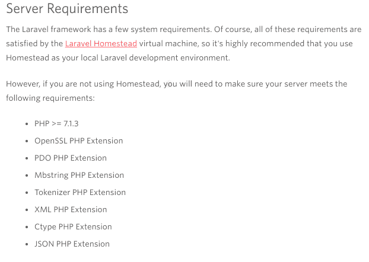
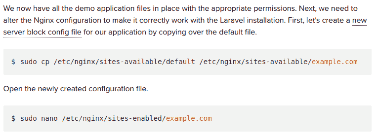

# 数字海洋上的 Laravel 5.6

> 原文：<https://dev.to/alchermd/laravel-56-on-digital-ocean-2i33>

因此，我试图在[数字海洋](https://m.do.co/c/1da7a7ef7eda)(参考链接)上部署一个项目，在这个项目中，我使用了 [Laravel 5.6](https://laravel.com/) 框架来启动项目。现在我想做的就是在我们继续开发应用程序的同时，放一个简单的*【即将推出】*页面。现在，我找到了这个指南([如何在 Ubuntu 16.04 上使用 Nginx 部署 Laravel 应用程序](https://www.digitalocean.com/community/tutorials/how-to-deploy-a-laravel-application-with-nginx-on-ubuntu-16-04))，并尝试按照它来设置我的服务器。但是男孩很难！本文将列出我希望在开始设置 DO 服务器之前就知道的所有事情:

## 1。使用 PHP 7.2

DO 教程希望我们用下面的命令安装`PHP 7.0`:

```
$ sudo apt-get install php7.0-mbstring php7.0-xml composer unzip 
```

Enter fullscreen mode Exit fullscreen mode

但是根据 [Laravel 的服务器要求](https://laravel.com/docs/5.6#installation)

[T2】](https://res.cloudinary.com/practicaldev/image/fetch/s--39Y8Faxh--/c_limit%2Cf_auto%2Cfl_progressive%2Cq_auto%2Cw_880/https://i.imgur.com/l62Xz9e.png)

我们需要 PHP 版本`7.1.3`或更高版本。我说我们不妨去找最新的版本，PHP `7.2.*`对吗？这里有一个快速简单的[指南](https://jakelprice.com/article/php-70-to-php-72-how-to-upgrade-your-server)在你的 DO 服务器上安装 PHP `7.2`。

### 得到“ascii 编解码器无法解码”错误？

如果您在添加`ppa:ondrej/php`库时遇到了这个错误，请尝试安装一个语言包:

```
$ sudo apt-get install language-pack-en 
```

Enter fullscreen mode Exit fullscreen mode

这应该可以修复您可能遇到的任何 ascii 编码错误。

## 2。生成应用密钥

DO 教程希望我们创建一个`.env`文件，并放入以下内容:

```
APP_ENV=production
APP_DEBUG=false
APP_KEY=b809vCwvtawRbsG0BmP1tWgnlXQypSKf
APP_URL=http://example.com

DB_HOST=127.0.0.1
DB_DATABASE=laravel
DB_USERNAME=laraveluser
DB_PASSWORD=password 
```

Enter fullscreen mode Exit fullscreen mode

嗯，我不想要一篇来自网上文章的`APP_KEY`。所以我做的是将`.env.example`复制到`.env`T3 中

```
$ sudo cp .env.example .env 
```

Enter fullscreen mode Exit fullscreen mode

...并用
生成新的`APP_KEY`

```
$ php artisan key:generate 
```

Enter fullscreen mode Exit fullscreen mode

但是这将引发某种类型的*拒绝*许可错误。为了解决这个问题，让我们用
给`.env`文件写权限

```
$ sudo chmod -R 777 .env
$ php artisan key:generate 
```

Enter fullscreen mode Exit fullscreen mode

这应该会消除错误，并给您一个新的应用程序密钥！

## 3。错别字预警！

在我们配置 Nginx 的部分，有一个偷偷摸摸的打字错误，如果不被注意到，它会打乱你的一天(至少我是这样的):

[T2】](https://res.cloudinary.com/practicaldev/image/fetch/s--ECoFMmzn--/c_limit%2Cf_auto%2Cfl_progressive%2Cq_auto%2Cw_880/https://i.imgur.com/b5CR7Jy.png)

看到了吗？您应该打开`/etc/nginx/sites-avaiable/example.com`而不是打开`/etc/nginx/sites-enabled/example.com`，因为这是我们复制的新服务器块。小心这个！

## 4。我什么都做对了，但是我得了 502 分！

这很可能是因为第一步。我们现在使用 PHP `7.2`，但是我们的服务器块仍然被配置为使用 PHP 扩展`php7.0-fpm`。要更新我们的配置，打开`/etc/nginx/sites-available/example.com`并更改下面的行:

```
server {
        ...

        location ~ \.php$ {
                include snippets/fastcgi-php.conf;

                # Change the line below and update to use php7.2-fpm
                # fastcgi_pass unix:/run/php/php7.0-fpm.sock;

                fastcgi_pass unix:/run/php/php7.2-fpm.sock;
        }

        ...
} 
```

Enter fullscreen mode Exit fullscreen mode

给 Nginx 一个重启

```
$ sudo systemctl reload nginx 
```

Enter fullscreen mode Exit fullscreen mode

...而且你的 app 应该是活的！

## 奖励:克服 TLS 问题

虽然我们的应用程序现在已经上线，但它仍然使用的是普通的 HTTP。为了给我们的客户带来信心，让我们用 HTTPS 来服务我们的应用程序，并在地址栏中获得那个花哨的*安全*锁。(开玩笑，HTTPS 不能替代良好的安全实践)

第六步——用 TLS 保护你的应用程序是我安装服务器时的一个棘手问题。当验证一个网站时，我甚至达到了[让我们加密](https://letsencrypt.org/)执行的每小时限制，因为我不能让它工作。

然后我找到了一个简单的解决方法。我所做的是完全忽略教程，并遵循这个关于让我们加密来保护 Nginx 的文档。确保你是项目的根。运行命令时。您现在应该有一个 HTTPS 安全应用程序了！