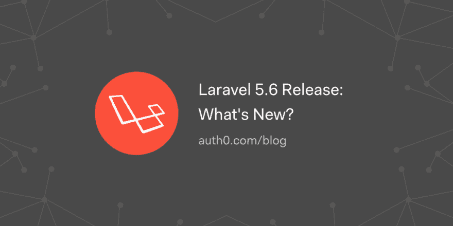

# Laravel 5.6 版本:有什么新内容？

> 原文：<https://dev.to/auth0/laravel-56-release-whats-new-4ih4>

2018 年 2 月 7 日星期三，Laravel 5.6 向公众发布。在撰写本文时，这是 GitHub 上最流行的 PHP 框架的主要版本。此外，Spark 6.0 也与 Laravel 5.6 一同发布。根据 Taylor 和核心团队制定的政策，Laravel 框架的主要版本每六个月发布一次(二月和八月)。

在本文中，我将介绍 Laravel 5.6 中的新特性，以及其他一些变化和弃用。

[读下去💻](https://auth0.com/blog/laravel-5-6-release-what-is-new/?utm_source=dev&utm_medium=sc&utm_campaign=laravel5_new)

[T2】](https://res.cloudinary.com/practicaldev/image/fetch/s--ABFYyCuU--/c_limit%2Cf_auto%2Cfl_progressive%2Cq_auto%2Cw_880/https://thepracticaldev.s3.amazonaws.com/i/ih10p9z56z53iskgthcf.png)