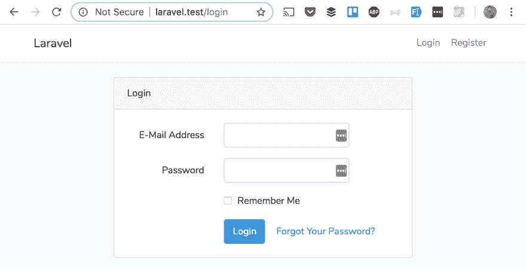
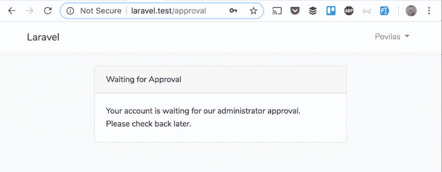
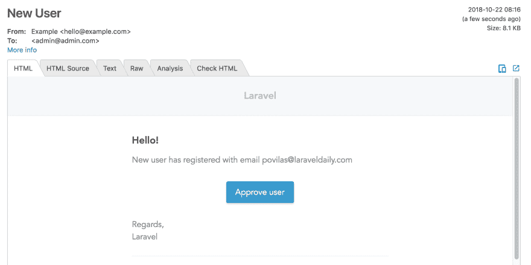
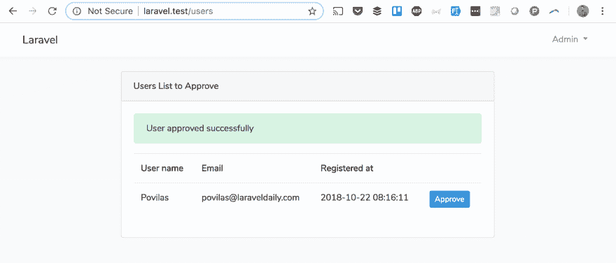

# Laravel:批准来自管理员的新注册用户

> 原文：<https://dev.to/povilaskorop/laravel-approve-new-registered-users-from-administrator-3nbh>

Laravel 框架自带内置 Auth 系统，相当不错。但它并没有涵盖所有的情况，最常见的是管理员批准每个新注册用户。在本文中，我将向您展示如何在 fresh Laravel 5.7 项目中实现这一点。

我们将涵盖的内容:

1.  准备数据库结构:迁移、模型和种子
2.  限制新用户访问仪表板
3.  通知管理员有关新用户的信息
4.  管理员批准新用户

* * *

首先，让我们创建一个新的 Laravel 项目:

```
laravel new laravel 
```

Enter fullscreen mode Exit fullscreen mode

然后你需要配置我们的**。带有数据库凭证的 env** 文件。

接下来，让我们生成我们的登录/注册链接:

```
php artisan make:auth 
```

Enter fullscreen mode Exit fullscreen mode

所以我们可以用这个表单登录:

[T2】](https://res.cloudinary.com/practicaldev/image/fetch/s--kRGBnIo---/c_limit%2Cf_auto%2Cfl_progressive%2Cq_auto%2Cw_880/https://laraveldaily.com/wp-content/uploads/2018/10/Screen-Shot-2018-10-22-at-11.12.32-AM.png)

从`users` DB 表的角度来看，我们需要添加两个字段:

*   `admin` (boolean，0/1) -您可能有更复杂的角色/权限逻辑
*   `approved_at`(时间戳，可空)-批准后将被设置为当前时间戳

所以:

```
php artisan make:migration add_admin_to_users_table 
```

Enter fullscreen mode Exit fullscreen mode

然后是迁移本身:

```
Schema::table('users', function (Blueprint $table) {
    $table->boolean('admin')->default(false);
    $table->timestamp('approved_at')->nullable();
}); 
```

Enter fullscreen mode Exit fullscreen mode

此外，我们需要将这些字段添加到`app/User.php`模型中的`$fillable`数组中:

```
protected $fillable = [
    'name', 'email', 'password', 'admin', 'approved_at'
]; 
```

Enter fullscreen mode Exit fullscreen mode

## 播种管理员用户

这个命令将帮助我们:

```
php artisan make:seeder AdminSeeder 
```

Enter fullscreen mode Exit fullscreen mode

它将在`database/seeds`文件夹中生成一个新文件，我们这样填充:

```
class AdminSeeder extends Seeder
{
    /**
     * Run the database seeds.
     *
     * @return void
     */
    public function run()
    {
        \App\User::create([
            'name' => 'Admin',
            'email' => 'admin@admin.com',
            'email_verified_at' => now(),
            'password' => bcrypt('verysafepassword'),
            'admin' => 1,
            'approved_at' => now(),
        ]);
    }
} 
```

Enter fullscreen mode Exit fullscreen mode

最后，我们需要将这个类添加到主`database/seeds/DatabaseSeeder.php`文件中。

```
public function run()
{
    $this->call(AdminSeeder::class);
} 
```

Enter fullscreen mode Exit fullscreen mode

现在，我们已经准备好了我们的数据库结构，可以运行它了:

```
php artisan migrate --seed 
```

Enter fullscreen mode Exit fullscreen mode

此时，如果我们使用凭证`admin@admin.com` - `verysafepassword`登录，我们应该会看到我们的空主页仪表板，默认为 Laravel。

[T2】](https://res.cloudinary.com/practicaldev/image/fetch/s--QMVkIK1f--/c_limit%2Cf_auto%2Cfl_progressive%2Cq_auto%2Cw_880/https://laraveldaily.com/wp-content/uploads/2018/10/Screen-Shot-2018-10-22-at-10.37.17-AM.png)

* * *

## 从仪表板限制新用户

好了，现在我们可以注册新用户了，新用户不会被批准。让我们限制他们访问实际的仪表板。

首先，我们创建一个单独的刀片文件，该文件将包含类似“等待批准”的文本。这将是一个页面，我们将重定向到，每一个未经批准的用户的请求。

所以，`resources/views/approval.blade.php` :

```
@extends('layouts.app')

@section('content')
    <div class="container">
        <div class="row justify-content-center">
            <div class="col-md-8">
                <div class="card">
                    <div class="card-header">Waiting for Approval</div>

                    <div class="card-body">
                        Your account is waiting for our administrator approval.
                        <br />
                        Please check back later.
                    </div>
                </div>
            </div>
        </div>
    </div>
@endsection 
```

Enter fullscreen mode Exit fullscreen mode

接下来，我们创建一个指向它的控制器。或者，实际上，我们在同一个`HomeController` :
中创建一个方法

```
public function approval()
{
    return view('approval');
} 
```

Enter fullscreen mode Exit fullscreen mode

它看起来是这样的:

[T2】](https://res.cloudinary.com/practicaldev/image/fetch/s---Fi5cip8--/c_limit%2Cf_auto%2Cfl_progressive%2Cq_auto%2Cw_880/https://laraveldaily.com/wp-content/uploads/2018/10/Screen-Shot-2018-10-22-at-11.16.24-AM.png)

最后，我们需要一条**路线**给它。让我们把它放在`auth`中间件下，我们的`routes/web.php`会是这样的:

```
Route::middleware(['auth'])->group(function () {
    Route::get('/approval', 'HomeController@approval')->name('approval');
    Route::get('/home', 'HomeController@index')->name('home');
}); 
```

Enter fullscreen mode Exit fullscreen mode

现在，我们需要限制未经批准的用户对那个`/home` URL 的访问。我们创建一个新的**中间件** :

```
php artisan make:middleware CheckApproved 
```

Enter fullscreen mode Exit fullscreen mode

它生成一个文件`app/Http/Middleware/CheckApproved.php`，我们像这样填充它:

```
namespace App\Http\Middleware;

use Closure;

class CheckApproved
{
    /**
     * Handle an incoming request.
     *
     * @param  \Illuminate\Http\Request  $request
     * @param  \Closure  $next
     * @return mixed
     */
    public function handle($request, Closure $next)
    {
        if (!auth()->user()->approved_at) {
            return redirect()->route('approval');
        }

        return $next($request);
    }
} 
```

Enter fullscreen mode Exit fullscreen mode

我们需要在`$routeMiddleware`数组中的`app/Http/Kernel.php`中注册那个中间件:

```
protected $routeMiddleware = [
    'auth' => \App\Http\Middleware\Authenticate::class,
    // ...
    'verified' => \Illuminate\Auth\Middleware\EnsureEmailIsVerified::class,
    'approved' => \App\Http\Middleware\CheckApproved::class,
]; 
```

Enter fullscreen mode Exit fullscreen mode

最后，我们将`home`路由添加到该中间件下的块中，因此我们的`routes/web.php`现在看起来像这样:

```
Route::middleware(['auth'])->group(function () {
    Route::get('/approval', 'HomeController@approval')->name('approval');

    Route::middleware(['approved'])->group(function () {
        Route::get('/home', 'HomeController@index')->name('home');
    });
}); 
```

Enter fullscreen mode Exit fullscreen mode

所以现在，每一个新用户，在登录之后，或者在任何动作上，都会被重定向到`approval page`。

* * *

## 通知管理员有新用户

我们将使用框架自带的 [Laravel Notifications](https://laravel.com/docs/5.7/notifications) 函数。

让我们生成一个新的通知类:

```
php artisan make:notification NewUser 
```

Enter fullscreen mode Exit fullscreen mode

然后我们填写一个新生成的`app/Notifications/NewUser.php` :

```
namespace App\Notifications;

use App\User;
use Illuminate\Bus\Queueable;
use Illuminate\Notifications\Notification;
use Illuminate\Contracts\Queue\ShouldQueue;
use Illuminate\Notifications\Messages\MailMessage;

class NewUser extends Notification
{
    use Queueable;

    private $new_user;

    /**
     * Create a new notification instance.
     *
     * @return void
     */
    public function __construct(User $new_user)
    {
        $this->new_user = $new_user;
    }

    /**
     * Get the mail representation of the notification.
     *
     * @param  mixed  $notifiable
     * @return \Illuminate\Notifications\Messages\MailMessage
     */
    public function toMail($notifiable)
    {
        return (new MailMessage)
            ->line('New user has registered with email ' . $this->new_user->email)
            ->action('Approve user', route('admin.users.approve', $this->new_user->id));
    }

} 
```

Enter fullscreen mode Exit fullscreen mode

这里需要注意一些事情:

*   我们将通过`__construct()`方法传递一个新注册的用户作为对象，然后它变成一个本地私有变量，我们将在`toMail()`方法中使用它作为`$this->new_user`；
*   我们指定了批准用户的途径，稍后我们将在下面创建该功能。

现在，为了使用这个通知，我们将扩展一个控制器`app/Http/Controllers/Auth/RegisterController.php`，特别是方法`create()` :

```
// Don't forget to add this
use App\Notifications\NewUser;

// ...

/**
 * Create a new user instance after a valid registration.
 *
 * @param  array  $data
 * @return \App\User
 */
protected function create(array $data)
{
    $user = User::create([
        'name' => $data['name'],
        'email' => $data['email'],
        'password' => Hash::make($data['password']),
    ]);

    $admin = User::where('admin', 1)->first();
    if ($admin) {
        $admin->notify(new NewUser($user));
    }

    return $user;
} 
```

Enter fullscreen mode Exit fullscreen mode

为了测试电子邮件的发送，我推荐使用[邮件陷阱](https://mailtrap.io/)，并将其凭证放入 Laravel `.env`文件:

```
MAIL_DRIVER=smtp
MAIL_HOST=smtp.mailtrap.io
MAIL_PORT=2525
MAIL_USERNAME=54043xxxxxxxxxx
MAIL_PASSWORD=a7d17xxxxxxxxx
MAIL_ENCRYPTION=null 
```

Enter fullscreen mode Exit fullscreen mode

因此，对于每个新用户，管理员都会得到类似这样的信息:

[T2】](https://res.cloudinary.com/practicaldev/image/fetch/s--QhJintHQ--/c_limit%2Cf_auto%2Cfl_progressive%2Cq_auto%2Cw_880/https://laraveldaily.com/wp-content/uploads/2018/10/Screen-Shot-2018-10-22-at-11.16.39-AM.png)

* * *

## 管理员审批新用户

在上一步中，我们已经使用了一个路由:`route('admin.users.approve', $this->new_user->id)`，现在让我们实际实现它。

我们实际上需要两条路线:列出用户，并批准其中一条。
此外，我们需要限制它只供管理员用户使用，所以让我们生成另一个中间件:

```
php artisan make:middleware CheckAdmin 
```

Enter fullscreen mode Exit fullscreen mode

我们填充新文件`app/Http/Middleware/CheckAdmin.php` :

```
namespace App\Http\Middleware;

use Closure;

class CheckAdmin
{
    /**
     * Handle an incoming request.
     *
     * @param  \Illuminate\Http\Request  $request
     * @param  \Closure  $next
     * @return mixed
     */
    public function handle($request, Closure $next)
    {
        if (!auth()->user()->admin) {
            return redirect()->route('home');
        }

        return $next($request);
    }
} 
```

Enter fullscreen mode Exit fullscreen mode

我们还需要将它添加到`app/Http/Kernel.php`数组中，如上:

```
protected $routeMiddleware = [
    'auth' => \App\Http\Middleware\Authenticate::class,
    // ...
    'approved' => \App\Http\Middleware\CheckApproved::class,
    'admin' => \App\Http\Middleware\CheckAdmin::class,
]; 
```

Enter fullscreen mode Exit fullscreen mode

最后，这里是我们最后的`routes/web.php`版本:

```
Route::middleware(['auth'])->group(function () {
    Route::get('/approval', 'HomeController@approval')->name('approval');

    Route::middleware(['approved'])->group(function () {
        Route::get('/home', 'HomeController@index')->name('home');
    });

    Route::middleware(['admin'])->group(function () {
        Route::get('/users', 'UserController@index')->name('admin.users.index');
        Route::get('/users/{user_id}/approve', 'UserController@approve')->name('admin.users.approve');
    });
}); 
```

Enter fullscreen mode Exit fullscreen mode

我们需要做的最后一件事是实现实际的批准。

```
php artisan make:controller UserController 
```

Enter fullscreen mode Exit fullscreen mode

下面是`app/Http/Controllers/UserController.php` :
的代码

```
namespace App\Http\Controllers;

use App\User;

class UserController extends Controller
{

    public function index()
    {
        $users = User::whereNull('approved_at')->get();

        return view('users', compact('users'));
    }

    public function approve($user_id)
    {
        $user = User::findOrFail($user_id);
        $user->update(['approved_at' => now()]);

        return redirect()->route('admin.users.index')->withMessage('User approved successfully');
    }

} 
```

Enter fullscreen mode Exit fullscreen mode

因此方法`approve()`将批准用户并重定向回列表。在`resources/views/users.blade.php` :
中实现

```
@extends('layouts.app')

@section('content')
    <div class="container">
        <div class="row justify-content-center">
            <div class="col-md-8">
                <div class="card">
                    <div class="card-header">Users List to Approve</div>

                    <div class="card-body">

                        @if (session('message'))
                            <div class="alert alert-success" role="alert">
                                {{ session('message') }}
                            </div>
                        @endif

                        <table class="table">
                            <tr>
                                <th>User name</th>
                                <th>Email</th>
                                <th>Registered at</th>
                                <th></th>
                            </tr>
                            @forelse ($users as $user)
                                <tr>
                                    <td>{{ $user->name }}</td>
                                    <td>{{ $user->email }}</td>
                                    <td>{{ $user->created_at }}</td>
                                    <td><a href="{{ route('admin.users.approve', $user->id) }}"
                                           class="btn btn-primary btn-sm">Approve</a></td>
                                </tr>
                            @empty
                                <tr>
                                    <td colspan="4">No users found.</td>
                                </tr>
                            @endforelse
                        </table>
                    </div>
                </div>
            </div>
        </div>
    </div>
@endsection 
```

Enter fullscreen mode Exit fullscreen mode

最终视觉效果:

[T2】](https://res.cloudinary.com/practicaldev/image/fetch/s--VrlZXIOa--/c_limit%2Cf_auto%2Cfl_progressive%2Cq_auto%2Cw_880/https://laraveldaily.com/wp-content/uploads/2018/10/Screen-Shot-2018-10-22-at-11.19.10-AM.png)

因此，这可能是在 Laravel 中批准新注册用户的最快方法。很简单，是吧？