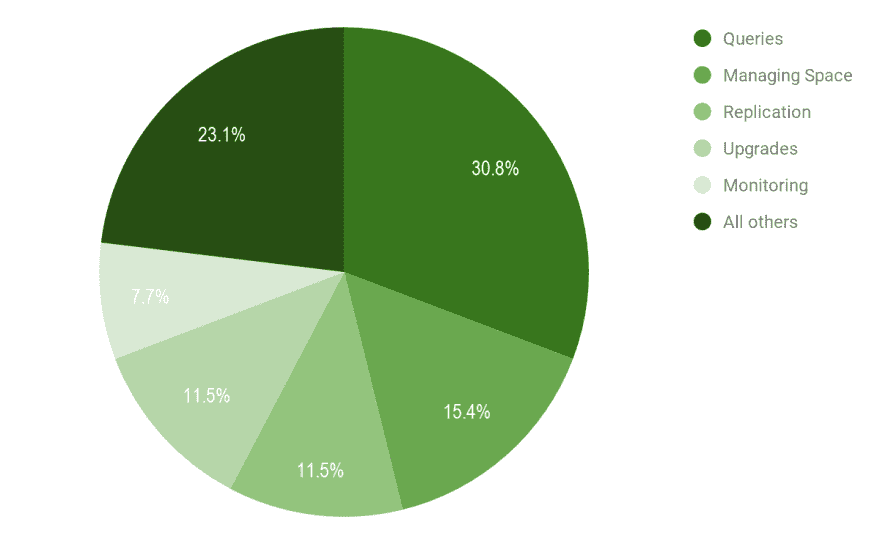
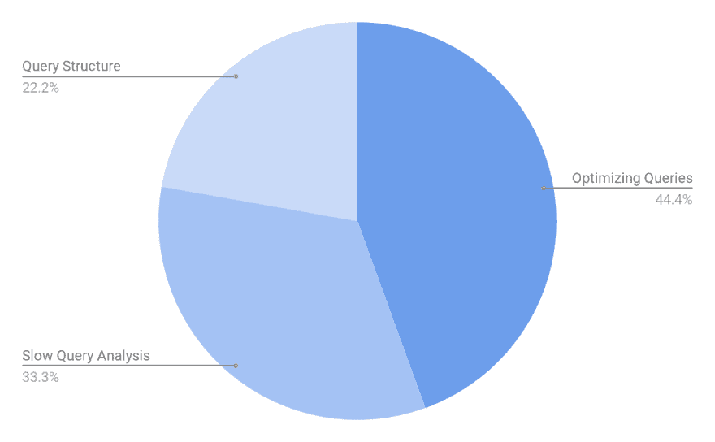
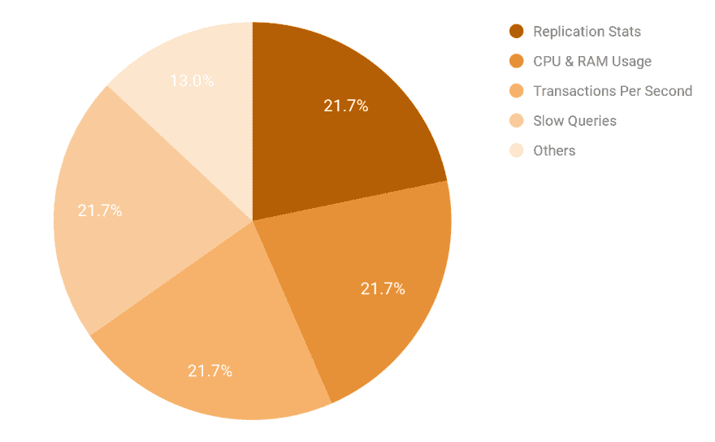

# 最新的 PostgreSQL 趋势:最耗时的任务&需要跟踪的重要指标

> 原文：<https://dev.to/scalegrid/latest-postgresql-trends-most-time-consuming-tasks--important-metrics-to-track-4p47>

[T2】](https://scalegrid.io/blog/latest-postgresql-trends-most-time-consuming-tasks-important-metrics-to-track/)

[PostgreSQL](https://www.postgresql.org/) ，在 [2017](https://db-engines.com/en/blog_post/76) 年度最受欢迎的数据库和 DBMS 中排名第四，在世界各地的开发和数据库社区中广受欢迎。 [PostgreSQL hosting](https://scalegrid.io/postgresql.html "PostgreSQL Hosting & Management") 从领先的 Oracle、MySQL 和 Microsoft SQL Server 那里窃取市场份额，同时也被物联网、电子商务、SaaS、分析等令人兴奋的领域中的新业务充分利用。

## 那么 PostgreSQL 管理的趋势是什么呢？

上个月，我们参加了在旧金山举行的 PostgresOpen，从专家们那里了解最新的趋势。阅读完整的[最新 PostgreSQL 趋势](https://scalegrid.io/blog/latest-postgresql-trends-most-time-consuming-tasks-important-metrics-to-track/)帖子。

### 最耗时的 PostgreSQL 管理任务

那么，在 PostgreSQL 管理方面，是什么占用了您的时间？虽然管理 PostgreSQL 生产部署涉及数千项任务，但管理查询是强有力的领导者，超过 30%的受访者这样认为。

[T2】](https://scalegrid.io/blog/wp-content/uploads/2018/10/Most-Time-Consuming-PostgreSQL-Management-Tasks-ScaleGrid-Blog.png)

管理空间远远排在第二位，15%的 PostgreSQL 用户认为这是他们最困难的任务，其次是复制、升级和监控。23%的 PostgreSQL 用户属于“所有其他”类别，包括修补、恢复、分区和迁移等任务。

### 管理 PostgreSQL 查询细分

在管理 PostgreSQL 查询方面遥遥领先的情况下，我们更深入地查看哪些特定任务消耗了他们的时间。结果分布在管理查询的整个过程中，从设置时的结构化到分析后的优化。

[T2】](https://scalegrid.io/blog/wp-content/uploads/2018/10/Most-Time-Consuming-PostgreSQL-Management-Tasks-Managing-Queries-Breakdown-ScaleGrid-Blog.png)

为了进一步解释这一点，让我们从查询管理过程的开始说起:

#### 查询结构

最小的部分是管理查询结构，占选择查询作为最耗时管理任务的 PostgreSQL 用户回答的 22%。

在开始之前，您需要围绕您的集群创建一个 PostgreSQL [查询计划](https://www.postgresql.org/docs/9.4/static/using-explain.html)，以将您的查询结构与您的数据属性相匹配。这些由节点组成，从底层的扫描节点(用于原始行表返回)到非表行(如值)。

#### 慢速查询分析

建立了结构之后，下一步是分析查询，以识别可能影响应用程序性能的运行缓慢的查询。默认情况下，“慢速查询”被定义为耗时超过 100 毫秒的查询。

#### 优化查询

既然已经确定了慢速查询，那么真正的工作就要开始了——优化 PostgreSQL 查询。Postgres 性能调优可能是一项可怕的任务，但是通过正确的识别和分析，您可以找出瓶颈，进行必要的查询更改，并在需要的地方添加索引以提高执行效率。这里有一篇很棒的关于 PostgreSQL 中性能调优查询的文章。

### 跟踪 PostgreSQL 性能的最重要指标

现在，我们已经确定了最耗时的 PostgreSQL 管理任务，让我们更深入地了解 PostgreSQL 用户跟踪的重要指标，以优化他们的性能。

最重要的 PostgreSQL 指标结果明显比管理任务更均匀，从而在复制统计、CPU 和 RAM 使用、每秒事务(TPS)和慢速查询之间形成了四向平局:

[T2】](https://scalegrid.io/blog/wp-content/uploads/2018/10/Most-Important-Metrics-to-Track-for-PostgreSQL-Performance-ScaleGrid-Blog.png)

#### 复制统计

监控 PostgreSQL 复制状态是一项至关重要的任务，可确保正确执行复制并保持生产部署的高可用性。复制过程应该定制为最适合您的应用程序需求，持续的终端监控是确保您的数据安全并为恢复做好准备的最佳方式。

在备用服务器和主服务器上跟踪指标很重要。应该监视备用服务器的传入复制和恢复状态，应该监视主服务器的传出复制和复制插槽。如果您使用的是 [PostgreSQL 流复制](https://scalegrid.io/blog/getting-started-with-postgresql-streaming-replication/ "Getting Started with PostgreSQL Streaming Replication")，复制槽并不总是必需的。流式复制确保备用服务器上的数据立即可用，非常适合低 TPS 服务器。

#### CPU 和 RAM 的使用

跟踪 CPU 和 RAM(内存)的使用是监控的关键指标，以确保 PostgreSQL 服务器的健康。如果你的 CPU 使用率太高，你的应用程序将会变慢，让你的用户痛苦不堪。这通常是查询优化不佳的结果，甚至是高查询并行性的结果。监控 RAM 对于确保您有足够的磁盘空间，以及准确了解 RAM 的用途非常重要。建议将大约 25%的内存分配给 shared_buffers。PostgreSQL 还将工作内存缓冲区大小默认为 [4MB](https://dzone.com/articles/is-your-postgres-query-starved-for-memory) ，这通常太小，导致执行时间过长。

#### 每秒事务数

通过监视每秒的事务数量，您可以确定系统负载和当前吞吐量。通过分析这一指标，可以决定相应地扩展系统，以实现所需的吞吐量。您还可以确定配置设置或系统资源的变化如何影响吞吐量。

#### 慢速查询

即使系统配置了足够的资源，低效的查询也会降低 PostgreSQL 的性能。分析这些低效的查询并修复它们总是一个好的做法。PostgreSQL 提供了名为*log _ min _ duration _ statement*的参数。设置此选项后，如果语句至少运行了指定的毫秒数，就会记录每个已完成语句的持续时间。一旦获得慢速查询，就可以运行解释分析来理解执行计划。这将使您能够跟踪问题并相应地优化查询。因此，定期监控慢速查询将避免性能降低。

下周在硅谷 2018PostgresConf[活动上找到我们，我们希望在那里发现更多关于 PostgreSQL 管理领域趋势的见解。如果您有任何问题或意见，请在我们的评论中或在 Twitter 上与我们分享，地址是](https://postgresconf.org/conferences/SiliconValley2018) [@scalegridio](https://twitter.com/scalegridio) 。