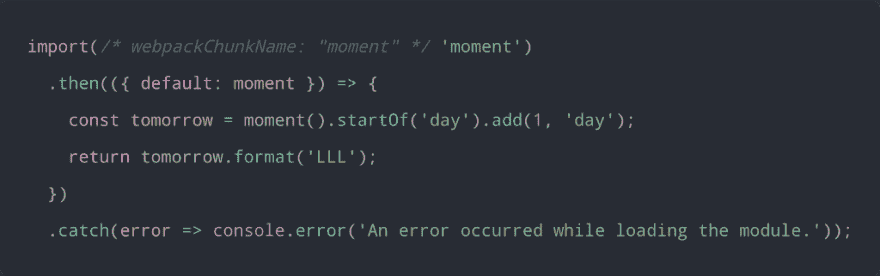
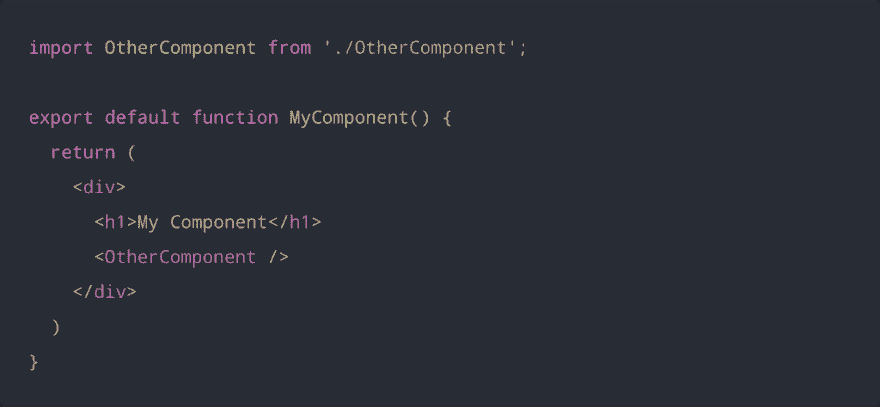
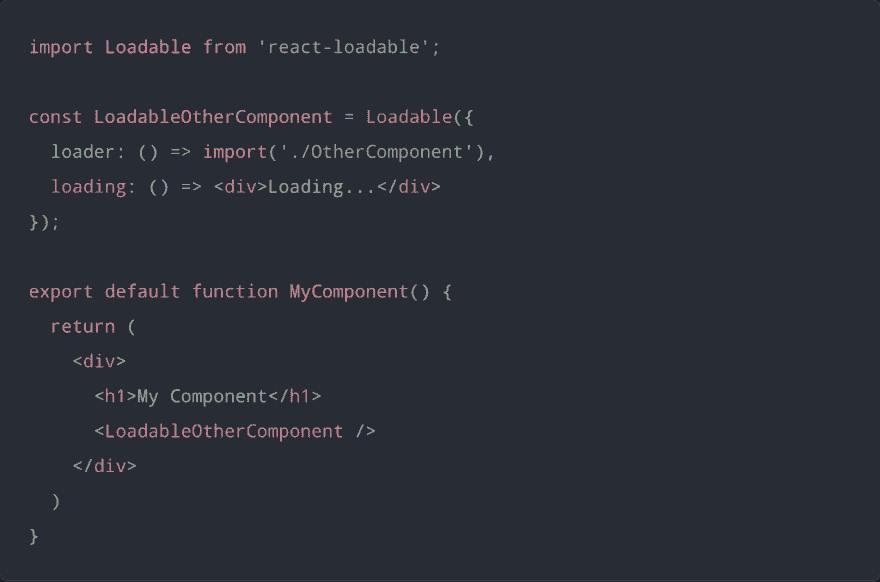
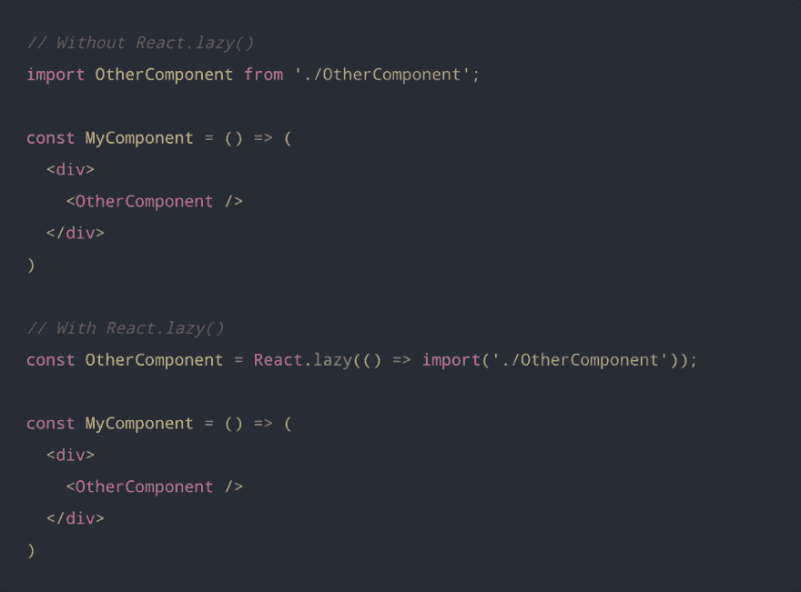
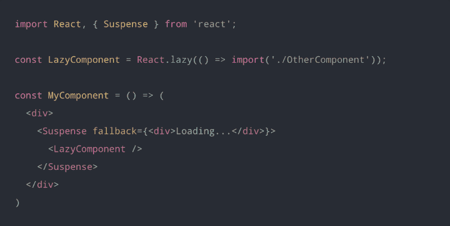
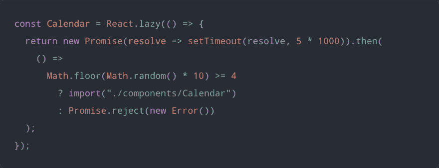
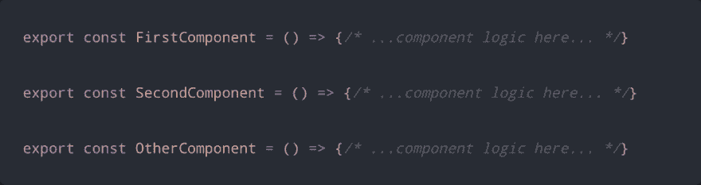

# React 16.6 中的延迟加载组件

> 原文：<https://dev.to/bnevilleoneill/lazy-loading-components-in-react-16-6-48n0>

#### 代码拆分和惰性加载 React 组件用 Suspense 和 React.lazy()

[T2】](https://res.cloudinary.com/practicaldev/image/fetch/s--1rTPJ5xc--/c_limit%2Cf_auto%2Cfl_progressive%2Cq_auto%2Cw_880/https://cdn-images-1.medium.com/max/1024/1%2AwZpPfI7nCNckZR2MZkfT2A.jpeg)

新发布的 **React 16.6** 推出了一些新功能，可以用来增加更多的力量，以轻松应对组件。

这些新特性中有两个是 React。悬念和 React.lazy()，这使得对 React 组件应用代码分割和延迟加载变得非常容易。

本文主要讨论如何在 React 应用程序中使用这两个新特性，以及它们为 React 开发人员带来的新潜力。

### 代码分割

编写 JavaScript 应用程序在过去的几年里有了很大的发展。随着 **ES6** (模块)、像 [**巴别塔**](https://babeljs.io/) 这样的编译器，以及像 [**Webpack**](https://webpack.js.org/) 和 [**Browserify**](http://browserify.org/) 这样的捆绑器的出现，JavaScript 应用程序现在可以用完全模块化的模式编写，以便于维护。

通常，每个模块都被导入并合并到一个名为 ***捆绑包*** 的文件中，然后该捆绑包被包含在网页上以加载整个应用程序。然而，随着应用程序的增长，包的大小开始变得太大，因此开始影响页面加载时间。

像 Webpack 和 Browserify 这样的捆绑器提供了对*代码拆分的支持，这涉及到将代码拆分成不同的捆绑包，这些捆绑包可以按需加载( ***【延迟加载】*** )，而不是一次性加载，从而提高了应用程序的性能。*

 *### 动态导入

拆分代码的主要方式之一是使用动态导入。动态导入利用了 **import()** 语法，这还不是 JavaScript 语言标准的一部分，但仍是一个有望很快被接受的提议。

调用 import()来加载模块依赖于 JavaScript 承诺。因此，它返回一个承诺，该承诺由加载的模块来实现，或者如果模块不能被加载，则该承诺被拒绝。

> *对于老一点的浏览器，应该用一个类似*[*es6-Promise*](https://github.com/stefanpenner/es6-promise)*的 polyfill 来填补* Promise。

以下是为与 Webpack 捆绑在一起的应用程序动态导入模块的样子:

[T2】](https://res.cloudinary.com/practicaldev/image/fetch/s--fywdmGiw--/c_limit%2Cf_auto%2Cfl_progressive%2Cq_auto%2Cw_880/https://cdn-images-1.medium.com/max/1024/1%2ApPlzZBu5mfrpwRYEfNH3pw.png)

当 Webpack 看到这个语法时，它知道为 moment 库动态创建一个单独的包文件。

对于 React 应用程序来说，如果使用了像 [create-react-app](https://facebook.github.io/create-react-app/) 或 [Next.js](https://nextjs.org/) 这样的样板文件，那么使用 dynamic import()的代码拆分就会在运行中发生。

但是，如果正在使用定制的 Webpack 设置，那么您需要查看 [Webpack 指南](https://webpack.js.org/guides/code-splitting/)来设置代码分割。对于 Babel transpiling，您还需要[Babel-plugin-syntax-dynamic-import](https://yarnpkg.com/en/package/babel-plugin-syntax-dynamic-import)插件，以允许 Babel 正确解析 dynamic import()。

### 代码分解反应组件

有几种技术已经被用于代码分割 React 组件。一种常见的方法是将动态导入()应用于应用程序的延迟加载路由组件——这通常被称为基于 ***路由的*** *代码分割*。

但是，有一个非常流行的用于代码拆分 React 组件的包叫做[**【React-loaded】**](https://github.com/jamiebuilds/react-loadable)。它提供了一个高阶组件(HOC ),利用动态导入()语法加载带有承诺的 React 组件。

考虑以下名为 MyComponent 的 React 组件:

[T2】](https://res.cloudinary.com/practicaldev/image/fetch/s--__GePJ5---/c_limit%2Cf_auto%2Cfl_progressive%2Cq_auto%2Cw_880/https://cdn-images-1.medium.com/max/1024/1%2AfqiB8MnSLC65lS8VW61ulg.png)

这里，在 MyComponent 被呈现之前，不需要 OtherComponent。但是，因为我们是静态导入 OtherComponent，所以它与 MyComponent 捆绑在一起。

我们可以使用 **react-loadable** 来延迟加载其他组件，直到我们呈现 MyComponent 时，从而将代码分割成单独的包。这是使用**延迟加载的另一个组件 react-loadable** 。

[T2】](https://res.cloudinary.com/practicaldev/image/fetch/s--qWyYmHxF--/c_limit%2Cf_auto%2Cfl_progressive%2Cq_auto%2Cw_880/https://cdn-images-1.medium.com/max/1024/1%2AGTH1erosjH6zpmFk54bkqQ.png)

在这里，您可以看到组件是使用 dynamic import()语法导入的，并被分配给 options 对象中的 loader 属性。

**React-loadable** 也使用一个 loading 属性来指定一个 fallback 组件，该组件将在等待实际组件加载时呈现。

在这个 [*文档*](https://github.com/jamiebuilds/react-loadable/blob/master/README.md) 中，你可以了解更多关于你可以用**react-loaded***完成的事情。*

### 利用悬念和 React.lazy()

在 **React 16.6** 中，通过 **React.lazy()** 和 **React 增加了对基于组件的代码拆分和延迟加载的支持。悬疑**。

> React.lazy()和悬念还不能用于服务器端渲染。对于服务器端代码分割，React Loadable 仍然应该使用。

### React.lazy()

React.lazy()使创建使用 dynamic import()加载但呈现为常规组件的组件变得容易。这将自动导致在呈现组件时加载包含该组件的包。

React.lazy()将一个函数作为其参数，该函数必须通过调用 import()加载组件来返回一个*承诺*。**返回的承诺解析为一个模块，其默认导出包含 React 组件。**

下面是使用 React.lazy()的情况:

[T2】](https://res.cloudinary.com/practicaldev/image/fetch/s--Cdde5_hQ--/c_limit%2Cf_auto%2Cfl_progressive%2Cq_auto%2Cw_880/https://cdn-images-1.medium.com/max/1024/1%2AX-GxPa-CDjPGzeJwcMKqpg.png)

### 悬念

> 使用 React.lazy()创建的组件只有在需要渲染时才会被加载。

因此，在加载惰性组件时，需要显示某种形式的占位符内容——可能是加载指示器。这正是**的反应。悬念**是为。

做出反应。悬念是一个用来包装懒惰组件的组件。您可以用一个暂记组件在不同的层次级别包装多个惰性组件。

悬念组件接受一个后备道具，该道具接受您希望呈现为占位符内容的 React 元素，同时加载所有惰性组件。

[T2】](https://res.cloudinary.com/practicaldev/image/fetch/s--c2CEbp8R--/c_limit%2Cf_auto%2Cfl_progressive%2Cq_auto%2Cw_880/https://cdn-images-1.medium.com/max/1024/1%2AmgL3noFcWjUZRoA5ZfynFw.png)

> 如果惰性组件加载失败，可以在惰性组件上方的任何地方放置一个错误边界，以显示良好的用户体验。

我在 **CodeSandbox** 上创建了一个非常简单的演示，演示如何使用 React.lazy()和悬念来延迟加载组件。
[https://codesandbox.io/embed/5ym1vlpmjl](https://codesandbox.io/embed/5ym1vlpmjl)
下面是微缩 app 代码的样子:

```
import React, { Suspense } from "react";
import Loader from "./components/Loader";
import Header from "./components/Header";
import ErrorBoundary from "./components/ErrorBoundary";

const Calendar = React.lazy(() => {
  return new Promise(resolve => setTimeout(resolve, 5 * 1000)).then(
    () =>
      Math.floor(Math.random() * 10) >= 4
        ? import("./components/Calendar")
        : Promise.reject(new Error())
  );
});

export default function CalendarComponent() {
  return (
    <div>
      <ErrorBoundary>
        <Header>Calendar</Header>

        <Suspense fallback={<Loader />}>
          <Calendar />
        </Suspense>
      </ErrorBoundary>
    </div>
  );
} 
```

这里，创建了一个非常简单的加载器组件，用作惰性日历组件的后备内容。当 lazy Calendar 组件加载失败时，还创建了一个错误边界来显示一个不错的错误。

我已经用另一个承诺包装了惰性日历导入，以模拟 5 秒的延迟。为了增加 Calendar 组件加载失败的机会，我还使用了一个条件来导入 Calendar 组件，或者返回一个拒绝的承诺。

[T2】](https://res.cloudinary.com/practicaldev/image/fetch/s--Nqe-mz54--/c_limit%2Cf_auto%2Cfl_progressive%2Cq_auto%2Cw_880/https://cdn-images-1.medium.com/max/1024/1%2A4-3rME82xnmjuK-5Q2K2aQ.png)

下面的屏幕截图展示了组件呈现后的样子。

[](https://res.cloudinary.com/practicaldev/image/fetch/s--KsfPoz7J--/c_limit%2Cf_auto%2Cfl_progressive%2Cq_66%2Cw_880/https://cdn-images-1.medium.com/max/1024/1%2A6mhWJ3Ke1lKjiXrL_SUbhw.gif) 

<figcaption>使用 React.lazy()和悬念演示延迟加载组件</figcaption>

### 命名出口

> 目前，React.lazy()不支持对 React 组件使用命名导出。

如果您希望使用包含 React 组件的命名导出，那么您需要在单独的中间模块中将它们重新导出为默认导出。

假设您有一个 OtherComponent 作为模块中的命名导出，并且您希望使用 React.lazy()加载 OtherComponent，那么您将创建一个中间模块，用于将 OtherComponent 重新导出为默认导出。

**Components.js**

[T2】](https://res.cloudinary.com/practicaldev/image/fetch/s--A27W-s-n--/c_limit%2Cf_auto%2Cfl_progressive%2Cq_auto%2Cw_880/https://cdn-images-1.medium.com/max/1024/1%2AYdSieVyQLY7lPyFDK3s0Ng.png)

**OtherComponent.js**

[T2】](https://res.cloudinary.com/practicaldev/image/fetch/s--RwOzKPag--/c_limit%2Cf_auto%2Cfl_progressive%2Cq_auto%2Cw_880/https://cdn-images-1.medium.com/max/1024/1%2AyUcJeg4t8SEkG-Ot-bmc7w.png)

然后，现在可以使用 React.lazy()从中间模块加载 OtherComponent。

### 懒人装货路线

有了 React.lazy()和悬念，现在不需要使用任何其他外部包就可以轻松地执行基于路径的代码分割。您可以简单地将应用程序的路线组件转换为惰性组件，并用悬念组件包装所有路线。

下面的代码片段显示了使用 [Reach Router](https://reach.tech/router) 库的基于路由的代码分割。

```
import React, { Suspense } from 'react';
import { Router } from '@reach/router';
import Loading from './Loading';

const Home = React.lazy(() => import('./Home'));
const Dashboard = React.lazy(() => import('./Dashboard'));
const Overview = React.lazy(() => import('./Overview'));
const History = React.lazy(() => import('./History'));
const NotFound = React.lazy(() => import('./NotFound'));

function App() {
  return (
    <div>
      <Suspense fallback={<Loading />}>
        <Router>
          <Home path="/" />
          <Dashboard path="dashboard">
            <Overview path="/" />
            <History path="/history" />
          </Dashboard>
          <NotFound default />
        </Router>
      </Suspense>
    </div>
  )
} 
```

### 结论

有了新的 **React.lazy()** 和 **React。悬念**，代码分割和延迟加载 React 组件变得非常容易。

*更新到* ***React 16.6*** 就可以开始享受 React 新特性了。

#### 拍拍&跟着

如果你觉得这篇文章很有见地，如果你不介意的话，请随意鼓掌。

你也可以在 Medium ( [Glad Chinda](https://medium.com/u/ddcd0e9719e5) )上关注我，获取更多对你有帮助的有见地的文章。你也可以在推特上关注我( [@gladchinda](https://twitter.com/@gladchinda) )。

***享受编码……***

* * *

### Plug: [LogRocket](https://logrocket.com/signup/) ，一款适用于网络应用的 DVR

[](https://logrocket.com/signup/)

<figcaption>[https://logrocket.com/signup/](https://logrocket.com/signup/)</figcaption>

LogRocket 是一个前端日志工具，可以让你回放问题，就像它们发生在你自己的浏览器中一样。LogRocket 不需要猜测错误发生的原因，也不需要向用户询问截图和日志转储，而是让您重放会话以快速了解哪里出错了。它可以与任何应用程序完美配合，不管是什么框架，并且有插件可以记录来自 Redux、Vuex 和@ngrx/store 的额外上下文。

除了记录 Redux 操作和状态，LogRocket 还记录控制台日志、JavaScript 错误、堆栈跟踪、带有头+正文的网络请求/响应、浏览器元数据和自定义日志。它还使用 DOM 来记录页面上的 HTML 和 CSS，甚至为最复杂的单页面应用程序重新创建像素级完美视频。

免费试用。

* * *

React 16.6 中的延迟加载组件的帖子[最先出现在](https://blog.logrocket.com/lazy-loading-components-in-react-16-6-6cea535c0b52/)[博客](https://blog.logrocket.com)上。*