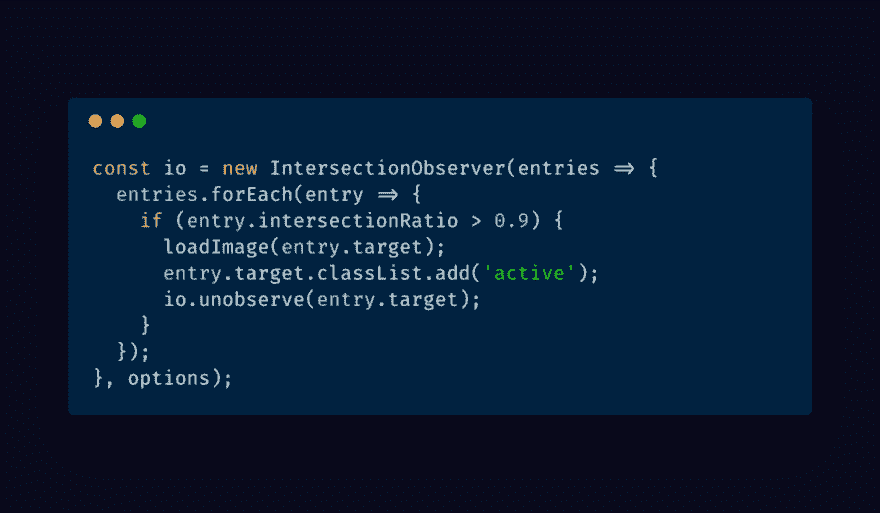

# 使用交叉点观察器延迟加载图像

> 原文：<https://dev.to/mrfrontend/lazy-loading-images-with-the-intersection-observer-55j2>

[T2】](https://res.cloudinary.com/practicaldev/image/fetch/s--xmAcXOYu--/c_limit%2Cf_auto%2Cfl_progressive%2Cq_auto%2Cw_880/https://cdn-images-1.medium.com/max/1024/1%2AHzI6z9f-Hy5_ZxzyY_wuMA.png)

去年，我试图越来越多地关注网站和网络应用的性能。在所有大型框架和库的世界中，这是一个相当大的挑战。

希望您知道加载图像会耗费更多的时间和数据。但是幸运的是，有一种技术叫做延迟加载图像。

### 加载图像

加载带有普通``标签的图像，让浏览器等待，直到所有的图像都加载完毕。

```
 
```

特别是如果你有一个有很多图片的网站，在用户有一个互动页面之前，可能需要 10 秒钟。

在移动连接上，情况会更糟。如果连接不好或速度慢，用户有时会等待几十秒甚至几分钟。

但是我们都知道那些用户想等那么久！他们会在几秒钟后离开！

### 懒人加载图片

我们希望尽可能快地加载我们的页面。我们的目标应该是 0-5 秒，这是用户能够耐心等待页面加载的时间。

因此，如果我们避免普通的``，那么我们的页面将加载得更快。

如果我们使用一个数据属性来放入图像的 url，我们可以将它放入 src 属性中，以便当它在视口中时加载它们。

大多数开发人员将使用延迟加载的库，这些库在 scroll 事件上使用 eventListener 来检查元素是否在 viewport 中。但是我们需要更好的东西，因为卷轴上的 eventListener 在某些设备上有点重！

### 路口观察者

交叉点观察器在检测某个元素是否在浏览器的可见部分中做得很好。

> 交叉点观察器 API 提供了一种异步观察目标元素与祖先元素或顶级文档的视口的交叉点变化的方法。**来源:** [**Mozilla Docs**](https://developer.mozilla.org/en-US/docs/Web/API/Intersection_Observer_API)

有了这个 API，我们可以监听一个元素是否在视口中，如果它们与视口相交的话。

### 配置路口观察者

在配置观察器时，我们有几个选项。

```
const options = { root: document.querySelector('#container'), rootMargin: '0px', threshold: 1.0 }

const observer = new IntersectionObserver(callback, options); 
```

#### 根

在 root 属性中定义将被设置为视口的元素。请记住，如果您的目标是一个元素(或身体)，当它的高度是自动的，那么所有的元素将被设置为可见。所以如果你设置一个元素，设置一个不是 auto 的高度，否则它不会像预期的那样工作。如果你不定义这个属性，它将自动使用浏览器视窗。

#### 根缘

如果 rootMargin 值设置为 0，它将不会查看根元素之外的内容。如果你输入 10px，它会提前检查一个元素是否被滚动到它的 rootelement 中。

#### 阈值

如果 threshold 的值为 0，那么当元素的 1px 在根元素内部时，它将运行回调。当值为 1.0 时，当它 100%位于根元素内部时，将触发回调。但是如果您希望回调在元素位于根元素内部 50%时被调用，请输入值 0.5。

### 目标元素

为了使用交集观察器，我们需要元素来观察一些元素！

我们想要观察的元素有一个类名“fake-image ”,我们将遍历这些元素，为每个 fake-image 元素启动一个观察器。

我们还想确定，当元素在我们的根元素中时，观察将被停止。这可以节省电脑或设备的一些电量。

```
const io = new IntersectionObserver((entries) => { entries.forEach((entry) => { if (entry.intersectionRatio > 0) { io.unobserve(entry.target); } }); }, options);

const targetElements = document.querySelector('.fake-image'); for(let element of targetElements) { io.observe(element); } 
```

[https://medium . com/media/32b 567 eede 7146781 e 35 da 37 ef 081 b 8 c/href](https://medium.com/media/32b567eede7146781e35da37ef081b8c/href)

### 演示

让我们试试这个！

我已经创建了一个小演示，向您展示交集观察员工程真的很顺利。

开始滚动，每当一个元素 100%可见时，它将变成绿色，文本将“加载！”。

### 浏览器支持

对交叉点观察器的[支持非常好。它在 Chrome(桌面&移动)、Firefox、Edge、Android 浏览器中实现。所以在 IE11 和 Safari(桌面&移动)里是没有的。](https://caniuse.com/#feat=intersectionobserver) [webkit 团队正在努力工作](https://webkit.org/status/#specification-intersection-observer)，因为它被标记为“开发中”👍，所以希望它能很快在 Safari 中得到支持(2018 年 3 月)。

为了支持不支持这个很酷的 API 的浏览器，我们可以使用 polyfill。我们可以通过 npm 得到:[交集-观察者](https://www.npmjs.com/package/intersection-observer) npm 安装交集-观察者-保存。

### 让我们构建懒惰加载的映像

现在我们知道了如何使用交叉点观察器，我们将使我们的图像在可见视口中异步加载到浏览器中。

在这篇博文的开始，我已经向你展示了大部分的延迟加载功能是如何在去年构建的。因此，让我们为交叉点观察器替换滚动事件监听器。

### HTML

如果您还记得我们在之前的例子中使用的 HTML，那么您会看到我们只需要添加一个带有数据属性 data-src 的``标签。

数据属性是放入 url 的完美解决方案，因此我们可以将 url 放入它们的。

```
<div class="fake-image"> <h2>Fake image</h2>  </div> 
```

### JavaScript

对于 JavaScript，我们只需要一个函数来加载我们的图像。调用交叉点观察器内部的函数。

```
const io = new IntersectionObserver(entries => { entries.forEach(entry => { // console.log('entry: ', entry); if (entry.intersectionRatio > 0.9) { loadImage(entry.target); entry.target.classList.add('active'); // entry.target.innerHTML = '<h2>Loaded!</h2>'; io.unobserve(entry.target); } }); }, options); function loadImage(imageElement) { setTimeout(() => { console.dir(imageElement.querySelector('img')); imageElement.querySelector('img').src = imageElement.querySelector('img').dataset.src; }, 1000); } 
```

我们在函数中唯一需要做的事情是，将 url 从 data-src 属性放入 src 属性。

当 src 属性出现时，图像将加载到浏览器中。

在 JavaScript 代码中，我设置了 1 秒钟的超时时间来观察加载过程。

### 举例

让我们来看看这个例子。向下滚动视图，这样您就可以看到它是如何工作的。

[https://medium . com/media/Abd 8222 a 0096 cab 0350 e 994 F4 edd 1947/href](https://medium.com/media/abd8222a0096cab0350e994f4edd1947/href)

### 感谢

如果您从 querySelectorAll 学到了一些东西或者有其他方法来循环遍历 NodeList 对象，请在 twitter 上告诉我😉: [@rsschouwenaar](https://twitter.com/rsschouwenaar)

*原载于*[*https://raymonschouwenaar . nl/lazy-loading-images-intersection-observer/*](https://raymonschouwenaar.nl/lazy-loading-images-intersection-observer/)