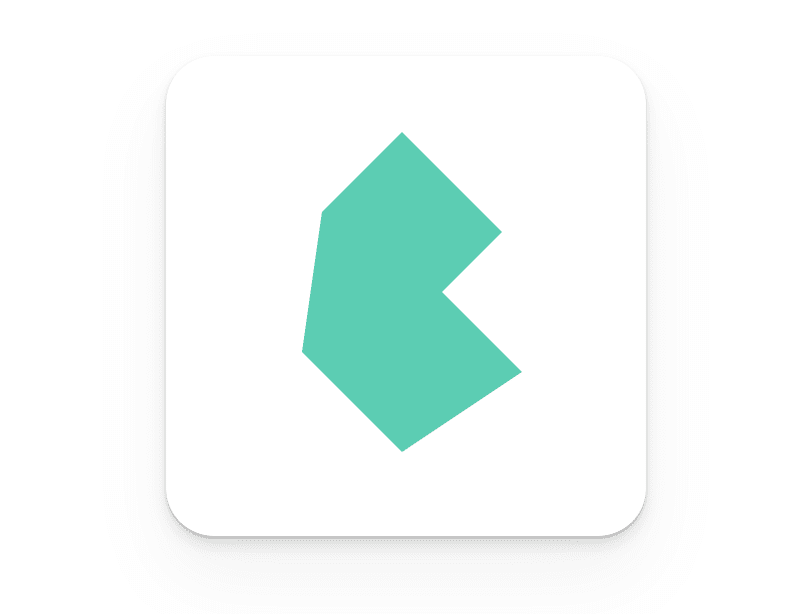
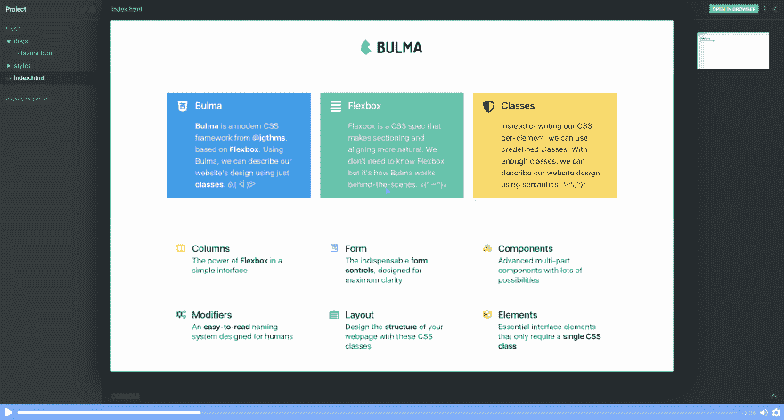
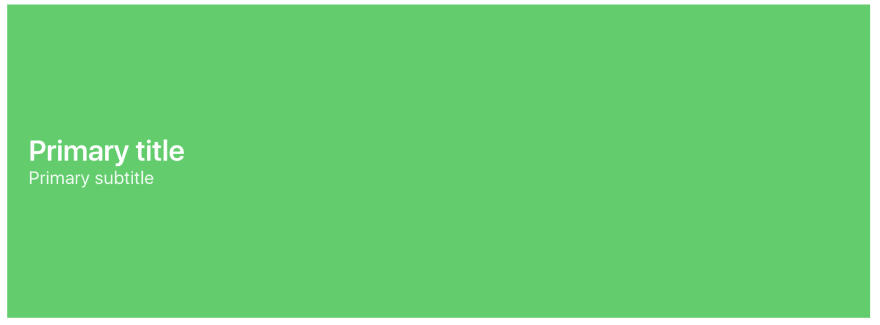

# 5 分钟学会布尔玛 CSS

> 原文：<https://dev.to/scrimba/learn-bulma-css-in-5-minutes-31nj>

## 流行 CSS 框架的入门教程。

[T2】](https://res.cloudinary.com/practicaldev/image/fetch/s--zd1ZukHH--/c_limit%2Cf_auto%2Cfl_progressive%2Cq_auto%2Cw_880/https://cdn-images-1.medium.com/max/1600/1%2A-rRVJ7pa3DUFN4Bul4e_CA.png)

布尔玛是一个简单、优雅、现代的 CSS 框架，比起 Bootstrap，很多开发人员更喜欢它。我个人认为布尔玛默认有一个更好的设计，它也感觉更轻。

在本教程中，我将给你一个超级快速的图书馆介绍。

> 我们还在 Scrimba 上创建了免费的布尔玛课程。[点击这里查看。](https://scrimba.com/g/gbulma?utm_source=dev.to&utm_medium=referral&utm_campaign=gbulma_5_minute_article)T3】

 [
T4】](https://scrimba.com/g/gbulma?utm_source=dev.to&utm_medium=referral&utm_campaign=gbulma_5_minute_article)

### 设置

设置布尔玛超级简单，你可以用几种不同的方式来完成，无论你喜欢 [NPM](https://www.npmjs.com/package/bulma) ，直接从文档下载[，还是使用](https://bulma.io/) [CDN](https://cdnjs.cloudflare.com/ajax/libs/bulma/0.6.2/css/bulma.min.css) 。我们将从 HTML 文件中链接到一个 CDN，如下所示:

这将使我们能够进入布尔玛的课堂。这实际上就是布尔玛的全部:一个类的集合。

### 修饰语

关于布尔玛你应该学习的第一件事是修改器类。这些允许你为几乎所有的布尔玛元素设置不同的风格。它们都以`is-*`或`has-*`开头，然后你用你想要的风格替换`*`。

为了正确理解这个概念，让我们从按钮开始。

### 按钮

为了把一个普通的按钮变成布尔玛按钮，我们简单地给它一个`button`类。

```
<button class="button">Click here</button> 
```

Enter fullscreen mode Exit fullscreen mode

这导致了以下样式:

[T2】](https://res.cloudinary.com/practicaldev/image/fetch/s--8DvvmOJk--/c_limit%2Cf_auto%2Cfl_progressive%2Cq_auto%2Cw_880/https://cdn-images-1.medium.com/max/1600/1%2A03TOy6dVBDCPvrlardUBHw.png)

如你所见，默认情况下，它有一个漂亮的平面设计。为了改变样式，我们将使用布尔玛修改器。让我们从把按钮做得更大、绿色、圆角开始:

```
<button class="button">Click here</button> 
```

Enter fullscreen mode Exit fullscreen mode

这段代码的结果是一个看起来很不错的按钮:

[T2】](https://res.cloudinary.com/practicaldev/image/fetch/s--pwvUKN0R--/c_limit%2Cf_auto%2Cfl_progressive%2Cq_auto%2Cw_880/https://cdn-images-1.medium.com/max/1600/1%2A3p5bTMdQbPYx_DeNQo7sgA.png)

您还可以使用修饰符来控制按钮的状态。让我们以添加类`is-focused`为例，它在它周围添加了一个边框:

[T2】](https://res.cloudinary.com/practicaldev/image/fetch/s--Gb0vctN6--/c_limit%2Cf_auto%2Cfl_progressive%2Cq_auto%2Cw_880/https://cdn-images-1.medium.com/max/1600/1%2Amk04rubImZHTpMNPhsn-TQ.png)

最后，让我们也使用一个`has-*`修饰符。这些通常控制元素内部的内容。在我们的例子中，文本。再加上`has-text-weight-bold`吧。

结果如下:

[T2】](https://res.cloudinary.com/practicaldev/image/fetch/s--lHbMQolV--/c_limit%2Cf_auto%2Cfl_progressive%2Cq_auto%2Cw_880/https://cdn-images-1.medium.com/max/1600/1%2AH30F0Q92eL_IGipfEE3lWg.png)

我建议您尝试一下各种类的组合，以便理解这个系统有多灵活。组合几乎是无穷无尽的。查看文档中的[按钮部分](https://bulma.io/documentation/elements/button/)了解更多信息。

### 列

任何 CSS 框架的核心都是它们如何解决列的问题，因为这与你将要建立的几乎每个网站都相关。布尔玛基于 Flexbox，所以创建列非常简单。让我们创建一个包含四列的行。

首先我们创建一个容器`<div>`和一个类`columns`，然后我们给每个孩子一个类`column`。它会导致以下结果:

[](https://res.cloudinary.com/practicaldev/image/fetch/s--b3XLo0qd--/c_limit%2Cf_auto%2Cfl_progressive%2Cq_auto%2Cw_880/https://cdn-images-1.medium.com/max/2000/1%2Ap0XiWjzp00GGdgrmrCtwYA.png) 
我还在柱子周围添加了边框，让它们看起来更明显。

请注意，您可以添加任意多的列。Flexbox 负责在它们之间平均分配空间。

为了给列添加颜色，我们可以用一个`<p>`标签替换其中的文本，并给它一个`notification`类和一个`is-*`修饰符。像这样举个例子:

```
<p class="notification is-success">First column</p> 
```

Enter fullscreen mode Exit fullscreen mode

让我们使用`is-info`、`is-success`、`is-warning`和`is-danger`修饰符来做这件事，结果如下:

[T2】](https://res.cloudinary.com/practicaldev/image/fetch/s--IeDy3NMN--/c_limit%2Cf_auto%2Cfl_progressive%2Cq_auto%2Cw_880/https://cdn-images-1.medium.com/max/2000/1%2A7c9Ygeq5NbrBYQfnVUFDwA.png)

`notification`类实际上是为了提醒用户一些事情，因为它允许你使用`is-*`修改器用一种颜色填充背景。在这里，它可以很好地分离列。

我们也可以很容易地控制一列的宽度。让我们将`is-half`
修改器添加到绿色栏中。

```
<p class="notification is-success">Second column</p> 
```

Enter fullscreen mode Exit fullscreen mode

这导致第二列现在占据一半的宽度，而其他三列各占据剩余一半的三分之一。

[T2】](https://res.cloudinary.com/practicaldev/image/fetch/s--n2Sto5X5--/c_limit%2Cf_auto%2Cfl_progressive%2Cq_auto%2Cw_880/https://cdn-images-1.medium.com/max/2000/1%2A2oogxdeNyRZ7Y9oxLXNqBg.png)

以下是可用于控制列宽的选项:

*   `is-three-quarters`
*   `is-two-thirds`
*   `is-half`
*   `is-one-third`
*   `is-one-quarter`
*   `is-four-fifths`
*   `is-three-fifths`
*   `is-two-fifths`
*   `is-one-fifth`

### 英雄

最后，让我们也学习如何在布尔玛创造一个英雄。我们将使用语义`<section>`，并给它一个类`hero`和`is-info`来给它一些颜色。我们还需要用类`hero-body`添加一个`<div>`孩子。

```
<div class="hero-body"></div> 
```

Enter fullscreen mode Exit fullscreen mode

[T2】](https://res.cloudinary.com/practicaldev/image/fetch/s--bwLRVyh2--/c_limit%2Cf_auto%2Cfl_progressive%2Cq_auto%2Cw_880/https://cdn-images-1.medium.com/max/2000/1%2AmRUKo5nMrlRmNRlFhFxXqA.png)

为了让这个英雄做一些有意义的事情，我们将在主体中添加一个容器元素，并添加一个标题和副标题。

```
<div class="container">
  <h1 class="title">
    Primary title
  </h1>
  <h2 class="subtitle">
    Primary subtitle
  </h2>
</div> 
```

Enter fullscreen mode Exit fullscreen mode

[T2】](https://res.cloudinary.com/practicaldev/image/fetch/s--Q0HN9CYs--/c_limit%2Cf_auto%2Cfl_progressive%2Cq_auto%2Cw_880/https://cdn-images-1.medium.com/max/2000/1%2AzgiaCn1QmbMn-r4d-p9exA.png)

现在开始好看了！如果我们希望它更大，我们可以简单地在`<section>`标签上添加`is-medium`。

```
<section class="hero is-info is-medium">
  ...
</section> 
```

Enter fullscreen mode Exit fullscreen mode

[T2】](https://res.cloudinary.com/practicaldev/image/fetch/s--iw4O6gm0--/c_limit%2Cf_auto%2Cfl_progressive%2Cq_auto%2Cw_880/https://cdn-images-1.medium.com/max/2000/1%2A7jJFSeUFbzSuavVUpVV7Zw.png)

就是这样！

你现在已经对布尔玛的工作方式有了基本的了解。最棒的是，这个库的其余部分就像你到目前为止看到的概念一样直观和简单。所以，如果你理解了这一点，你就会毫不费力地理解它的其余部分。

所以，如果你想正确地学习这个框架，一定要去看看我们免费的布尔玛课程。

* * *