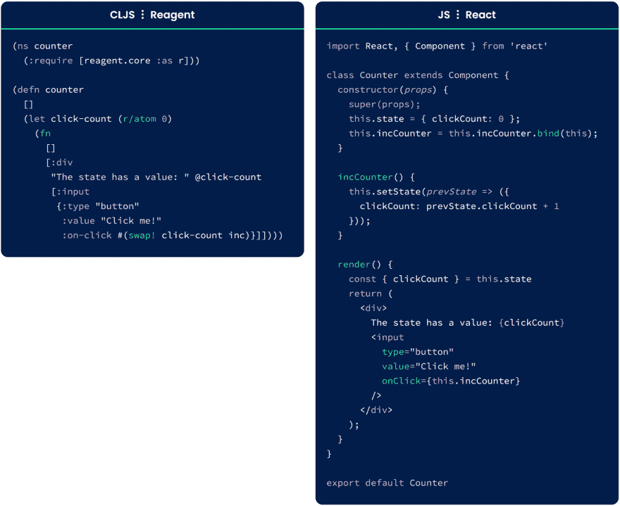
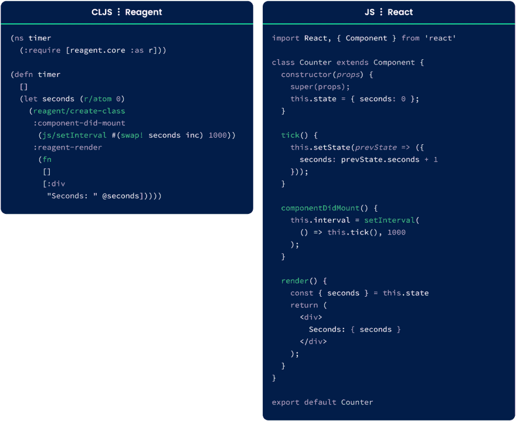

# 了解如何使用 ClojureScript 和 React 构建功能性前端。

> 原文：<https://dev.to/jacekschae/learn-how-to-build-functional-front-ends-with-clojurescript-and-react-58oc>

你可能听说过 React，你听说过 Reagent 吗？试剂是封闭描述和反应之间的最小界面。

ClojureScript，就像 Elm，ReasonML 和 EcmaScript 编译/trans file 到 JavaScript。

使用 Reagent，您可以只使用普通的 ClojureScript 函数和数据结构来定义组件。

让我们来看几个例子，看看它们是如何比较的。这不是对 React 的咆哮。React 太牛逼了！也不是对 JS 的咆哮。JS 也很牛逼！这是为了展示 React 在具有不可变和持久数据结构的语言中的表现。

## 一个无状态组件

试剂和反应中最简单的成分就是一个函数。

[T2】](https://res.cloudinary.com/practicaldev/image/fetch/s--MkVE_VFn--/c_limit%2Cf_auto%2Cfl_progressive%2Cq_auto%2Cw_880/https://thepracticaldev.s3.amazonaws.com/i/tcmokg12qhoh1kbmhhaa.png)

在 JavaScript 中，你经常会看到它们是`const`一行:

```
const HelloMessage = props => <div>Hello {props.name}</div>; 
```

Enter fullscreen mode Exit fullscreen mode

## 有状态的组件

由于 Reagent 构建在 CLJS (ClojureScript)不可变数据结构之上，因此不需要额外的库(Redux、MobX)或语法(`this.setState`)来处理您的状态。在 CLJS 中，你可以使用`atoms`(CLJS 中的引用类型)来处理你的状态。

[T2】](https://res.cloudinary.com/practicaldev/image/fetch/s--QLl71Gla--/c_limit%2Cf_auto%2Cfl_progressive%2Cq_auto%2Cw_880/https://thepracticaldev.s3.amazonaws.com/i/pbawqtekf05177d2sq0e.png)

在这个例子中，我们为函数`defn`内部的`atom`创建了一个`let`绑定。`let`绑定仅在函数范围内可用，然后我们通过使用`inc`(增量)函数将值与`on-click`进行`swap!`。

## 采用生命周期方法的一类构件

此示例显示了具有生命周期方法的类组件。

[T2】](https://res.cloudinary.com/practicaldev/image/fetch/s--S62BpnZu--/c_limit%2Cf_auto%2Cfl_progressive%2Cq_auto%2Cw_880/https://thepracticaldev.s3.amazonaws.com/i/r5pfooe1bluljnqgogge.png)

在试剂中，我们将使用少于 1%的量。原因是——原子——它们会跟踪它们应该更新的时间。在试剂中，我们可以写出这个成分，而不需要`componentDidMount` :

```
(defn  timer  []  (let  [seconds  (r/atom  0)]  (fn  []  (js/setInterval  #(swap!  seconds  inc)  1000)  [:div  "Seconds: "  @seconds]))) 
```

Enter fullscreen mode Exit fullscreen mode

## 想了解更多？

如果您想了解更多关于 ClojureScript 和试剂的信息，请尝试此[免费](https://www.learnreagent.com/)视频课程并创建 GIGGIN 应用程序。

> ### More information about learnreagent.com [Stadium](https://www.learnreagent.com/)

* * *

如果你喜欢这篇文章，你应该在 DEV 和 [Twitter](https://twitter.com/JacekSchae) 上关注我，我只写/发关于编程和技术的文章。