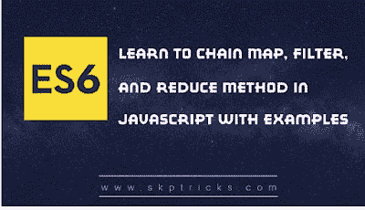

# 学习在 Javascript 中链接 Map、Filter 和 Reduce 方法

> 原文：<https://dev.to/skptricks/learn-to-chain-map-filter-and-reduce-method-in-javascript-18fk>

帖子链接:[学习 Javascript 中的链式映射、过滤、归约方法](https://www.skptricks.com/2018/11/learn-to-chain-map-filter-and-reduce-in-javascript.html)

本教程解释了如何在 Javascript 中链接 Map、Filter 和 Reduce 方法。你可能在 Jquery、java 等编程语言中看到过方法链接的例子。因为这三个函数都是在数组上调用的，而且 map()和 filter()都返回数组，所以我们可以很容易地将调用链接起来。

[学习 Javascript 中的链式映射、过滤和归约方法](https://www.skptricks.com/2018/11/learn-to-chain-map-filter-and-reduce-in-javascript.html)

[T2】](https://res.cloudinary.com/practicaldev/image/fetch/s--GhxvCRKv--/c_limit%2Cf_auto%2Cfl_progressive%2Cq_auto%2Cw_880/https://1.bp.blogspot.com/-m098Uxk6aD8/W_GmkXCPQ5I/AAAAAAAACKA/QSET9tdeHcQXRiEEMCP4h5JnpMvOjBt9ACLcBGAs/s400/chain.png)

[阅读更多...](https://www.skptricks.com/2018/11/learn-to-chain-map-filter-and-reduce-in-javascript.html)