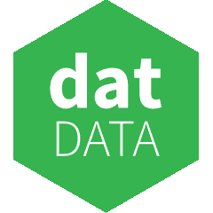
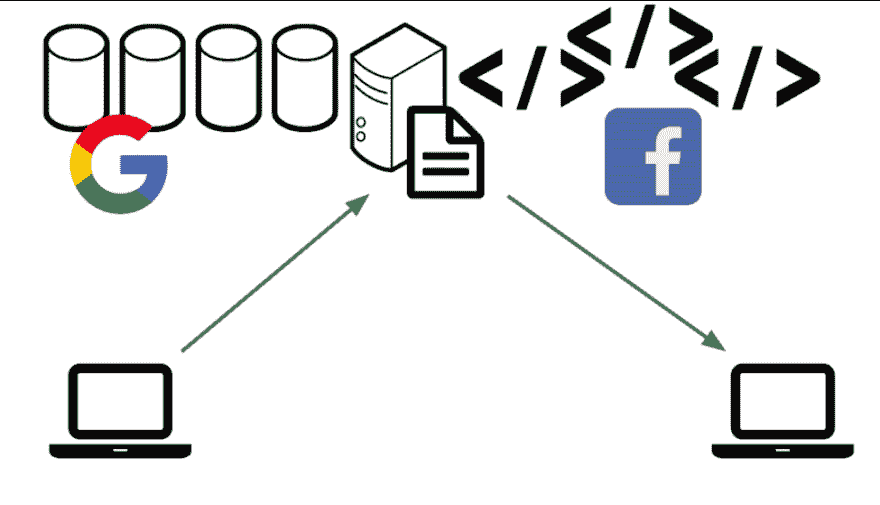
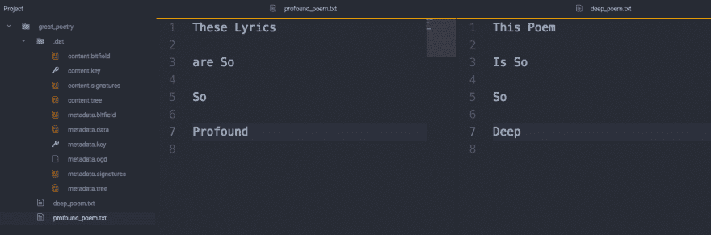

# 了解 Dat 协议和分散化

> 原文：<https://dev.to/jaybeekeeper/learning-about-dat-protocol-and-decentralization--1ghi>

上周日，也就是 6 月 15 日，我参加了由分布式医疗网络倡议组织举办的技能分享会。这次会议包括一个由杰西卡·林恩牵头的关于黑人女性主义艺术批评的研讨会，以及一个由香农·芬尼根牵头的关于无障碍的研讨会。在最后一部分[中，Callil Capuozzo](https://twitter.com/_callil) 用 20 分钟简要介绍了如何使用 [Dat 协议](https://www.datprotocol.com/)，所以我将尝试快速总结一下我从这次研讨会中学到的东西。

[T2】](https://res.cloudinary.com/practicaldev/image/fetch/s--GdZT83xF--/c_limit%2Cf_auto%2Cfl_progressive%2Cq_auto%2Cw_880/https://upload.wikimedia.org/wikipedia/commons/a/a4/Dat-data-logo-2017.svg)

因此，对 web 当前形式的(非常)快速和肮脏的概括是，大多数信息是以自上而下的分层方式从服务器到客户端共享的。像应用程序这样的东西被托管在远程服务器(云)上，这使得浏览器仅仅作为一个接口来访问保存在其他地方的数据。我们通常使用 http 协议来访问这些数据。这在很多事情上都很有效，通常是一个成功的模式，但也不是没有缺点。将数据保存在其他地方的不利之处在于，可能会缺乏对所保存数据的所有权或隐私。对于用户之间固有的事情，如发送电子邮件或发送文件，我们涉及第三方(服务器)。

[T2】](https://res.cloudinary.com/practicaldev/image/fetch/s---XZL7-Vd--/c_limit%2Cf_auto%2Cfl_progressive%2Cq_auto%2Cw_880/https://thepracticaldev.s3.amazonaws.com/i/04wu9fkbtucsmzwzid31.png)

> ##### [This picture is from Paul Frazee's presentation on the Peer 2 Peer Web in PDXNode on September 14th, 2017\.](https://www.youtube.com/watch?v=-ep0ZIe6i10)

Dat 协议可以被认为是 http 协议的一种替代方案，它在一个分散的 Web 上工作，以避免服务器集中的问题。去中心化以多种形式出现，著名的有 WebRTC、区块链或 IFPS 协议。

用外行人的话来说，Dat 就像 git 和 bittorrent 有了一个孩子。

Dat 白皮书的摘要如下:

> Dat 是一种为同步文件夹数据而设计的协议，即使它们很大或不断变化。Dat 使用加密的安全变更寄存器来证明所请求的数据版本是分布式的。任何文件版本的字节范围都可以通过网络连接从 Dat 存储库中有效地传输。消费者可以选择完全或部分复制远程 Dat 存储库的内容，也可以订阅实时更改。为了确保作者和读者的隐私，Dat 使用公钥加密来加密网络流量。一组 Dat 客户端可以相互连接，形成一个公共或私有的分散式网络，以便相互交换数据。JavaScript 中提供了参考实现。

Dat 文件是对等分发的，网络用户通过对文件进行重新托管来贡献带宽，任何人都可以从他们的本地机器上发布。像 bittorrent 一样，越多的人通过网络托管一个文件，网络群就越大，群之间共享的带宽负载就越多——这允许另一方有更多的资源(更多的服务器)来接收相同数据集的位。

任何人都可以很快学会使用 dat:

如果您已经安装了 node 和 npm，安装 dat 相当简单——在您的终端中运行以下命令，在您的系统上安装 dat:

```
npm install -g dat 
```

然后你会想要共享一个文件。假设我想和我的朋友布拉德分享一个文件夹，里面有我所有的诗。很快的，从我的终端让我做一个文件夹。txt 文件。

```
$ mkdir great_poetry
$ cd great_poetry
$ touch deep_poem.txt
$ profound_poem.txt 
```

让我们假设我已经用深奥的文本填充了文本文件。我现在想分享它们。对于 dat，在目录中，我只需输入“dat share”即可共享它

```
$ dat share

dat v13.11.3
Created new dat in /Users/jarretbryan/great_poetry/.dat
dat://71978b78f44efe013e3d34642bd8e4efb7b40e1a83202408ecaa06d5fef4357e
Sharing dat: 2 files (62 B)

0 connections | Download 0 B/s Upload 0 B/s

Watching for file updates

Ctrl+C to Exit 
```

这将为我初始化一个 dat 存储库。实际上，dat share 已经创建了一组隐藏的元数据文件，如下所示，这些文件将保存加密的密钥和版本历史记录——实际上，如果文件被更改的话。它将同时让我的电脑作为一个微型服务器来存放文件。

[T2】](https://res.cloudinary.com/practicaldev/image/fetch/s--1q1JI_Q7--/c_limit%2Cf_auto%2Cfl_progressive%2Cq_auto%2Cw_880/https://thepracticaldev.s3.amazonaws.com/i/14w8nsxuwjt2iok08zg3.png)

如果文件从源位置发生了更改，则数据会为每个重新托管该特定文档或文档集的人进行更新，但不会保留以前的数据版本——只保留数据被更改的事实，从而使 dat 成为动态的，而不会给用户带来过重的负担。只有源用户可以编辑这些文件，但是任何联网的用户都可以复制、编辑这些文件，然后用不同的加密密钥重新托管它们。

现在重要的是这条线

```
dat://71978b78f44efe013e3d34642bd8e4efb7b40e1a83202408ecaa06d5fef4357e 
```

这是直接指向文件的加密密钥。如果布拉德想看我的诗，他只需要在他的终端里运行-

```
dat clone dat://71978b78f44efe013e3d34642bd8e4efb7b40e1a83202408ecaa06d5fef4357e 
```

他将直接从我的托管计算机上接收文件，同时也开始对它们进行托管。现在我们分享带宽。现在让我们说，我们的朋友亚历克斯已经听到了所有关于这些深刻的诗歌大惊小怪，也想收到文件。亚历克斯所要做的就是运行相同的“dat clone”命令，只要我们都在托管，她就会从布拉德和我那里接收文件。然后，她也将开始转移文件。如果我们的朋友 Kurt 也想访问这些文件，这个过程会重复，他会从 Brad、Alex 和我那里收到一些数据。因此，这个过程会随着用户的增加而扩展——网络群越大，共享的带宽就越多。

我们可以在我上面的代码块中看到，有 1 个连接，但这个数字将反映当前连接的用户数量。

在这个过程中的任何一点，文件都不是托管在一个中央服务器上，而是分布在联网的用户之间。只要有人在托管这些文件，它们就可以被访问——所以我，作为最初的托管者，可以暂时停止托管，但理论上仍然可以访问联网的文件，即使它们没有反映我在本地所做的更改。

我给出的例子相当简单，只使用了。txt 文件，但想象一下，如果我代替主机。html 文件？我可以托管一个完整的网站，或者通过一个分散的网络托管一个完整的应用程序。