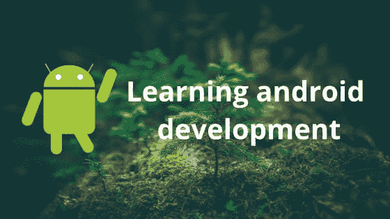

# 学习 android 开发

> 原文：<https://dev.to/gauravchaddha1996/learning-android-development--2o47>

 
这篇[原帖](https://www.chaddhag.com/learningAndroidDevelopment)是为我的博客写的。去看看我写的更多疯狂的东西。

Android 开发令人兴奋，看到那些闪亮的动画让人会心一笑。这篇文章是为那些想开始 android 开发的人写的，也是为那些已经掌握了基础知识，现在想提高自己的人写的。我会提供我在学习 android 开发时遇到的资源。

# Android 开发入门

*   **学习必备技能**

我认为在进入 android 开发之前，应该学习一点 Java 语言。你可以上 Udacity 的课程，或者看 Youtube 视频或者一本书。我是从两个渠道了解到的:《Java(初学者)编程教程》TheNewBoston Youtube 视频播放列表(提示:不要安装 Eclipse。和一本名为《Java:初学者指南》的书，作者是 Herbert Schildt。

我建议安装 Ubuntu 或任何其他 Linux 发行版作为 Android studio，如果你没有 SSD，用于开发 Android 应用程序的 IDE 在 Windows 上非常慢。这将有助于你学习 Linux。此外，如果你有时间，可以在 Git 上参加课程或观看视频来学习它的基础知识。学习 git 肯定会让你受益。

*   **学习基础知识**

现在你已经知道了先决条件，我们可以开始学习 android 开发的基础知识了。我建议使用这两种资源(做一些研究，找出哪一种最适合你)

1.  [谷歌开发人员培训](https://developers.google.com/training/)
2.  [Udacity 与谷歌的合作关系](https://www.udacity.com/google)
3.  [入门- Android 开发者](https://developer.android.com/index.html)
4.  (我由此了解到)[TheNewBoston 为初学者开发的 Android 应用程序](https://www.youtube.com/playlist?list=PL6gx4Cwl9DGBsvRxJJOzG4r4k_zLKrnxl)

虽然新波斯顿的视频很不错，但我还是建议使用其他资源，因为它们来自谷歌。

* * *

在您学习了 android 开发的基础知识之后，您应该能够熟练使用 Android Studio IDE、logcat、调试器，并且应该了解活动生命周期、片段、屏幕导航、视图分页、通知、RecyclerView、SharedPreferences、上下文、对话框、基本线程、服务等。

# 提高自己的技能

接下来，为了提高你的技能，我建议你一个接一个地或者在需要的时候学习下面的东西(记住，这个列表并不是一个完整的指南，它仅仅是我从我的经验中感觉到的重要的东西，学习它们需要很长的时间) :

*   MVP 架构、MVVM 架构、Android 代码风格和指南、材料设计、设计支持库、基本动画、约束布局。
*   第三方图书馆，如 ButterKnife、Glide、Picasso、Timber。
*   网络使用 OkHttp，Gson，凌空，改造或任何其他。
*   数据库和 ORM 的。示例:房间、SQLlite、领域、ORMLite、greenDOA 等。
*   自定义视图和加载器。
*   设计模式，测试，FindBugs，PMD，函数式编程概念，Firebase，RxJava，RxAndroid，Dagger，固体原理。(这些都很高级，所以尽量不要跳到这些。慢慢来。)

* * *

# 资源

我遇到的最好的学习资源，甚至比课程还要好的是博客文章。我学到的大部分东西都是通过阅读博客，然后实施。

*   关于媒体上 android 开发的伟大出版物: [AndroidPub](https://android.jlelse.eu/) 、[minderks](https://mindorks.com/)、 [Google 开发者专家](https://medium.com/google-developer-experts)、 [Ribot Labs](https://labs.ribot.co.uk/) 、[媒体工程](https://medium.engineering/)、 [FreeCodeCamp](https://medium.freecodecamp.org/) 、 [Hackernoon](https://hackernoon.com/) 、 [Upday Devs](https://medium.com/upday-devs) 、 [ProAndroidDev](https://proandroiddev.com/) 、[侧视图](https://medium.com/lateral-view)、[为 Android 加油](https://medium.com/fueled-android)
*   [谷歌开发者代码实验室](https://codelabs.developers.google.com/)
*   在这里和 twitter 上关注在这些出版物中写作的人，以获得他们所发布内容的更新。这是跟上新事物和提高自己的好方法。
*   订阅简讯，获得精选的好帖子和新闻列表: [Android Weekly](http://androidweekly.net/) ， [Android Dev Digest](https://www.androiddevdigest.com/) ， [Infinum Android team](https://infinum.co/our-stuff) ， [Android Pub 简讯](https://android.jlelse.eu/)等。
*   定期访问 subreddit [/r/androiddev](https://www.reddit.com/r/androiddev/) 获取关于 android 开发的更新和新闻。
*   创建一个 Twitter 帐户，关注一些 android 开发人员。我在 reddit 上写了一篇关于一些 android 开发者的评论。

* * *

# 软件开发技巧

*   关心代码质量——阅读模块化、关注点分离、MVP、MVC、MVVM、函数长度、类大小、变量名等等。应用你在这方面读到的好的实践。
*   发展需要时间。在开始之前，您首先需要学习基本的语法和一些基本的组件。
*   慢慢增加每个 2-3 个项目的项目复杂性。学习新事物并应用它们。
*   明智地选择你使用的技术或库或框架，并先阅读文档。谷歌一下这个问题，而不是先问别人。尝试每一个可能的堆栈溢出，你将学会“不做”一个任务的方法，这是非常重要的。
*   如果你觉得有必要让自己多样化，请阅读 2016 年的 shek har Gulati 52 Technologies。

* * *

你也可以参考这个来自**minworks**的牛逼[指南](https://blog.mindorks.com/how-to-learn-android-development-f33dd6dba40d)。

* * *