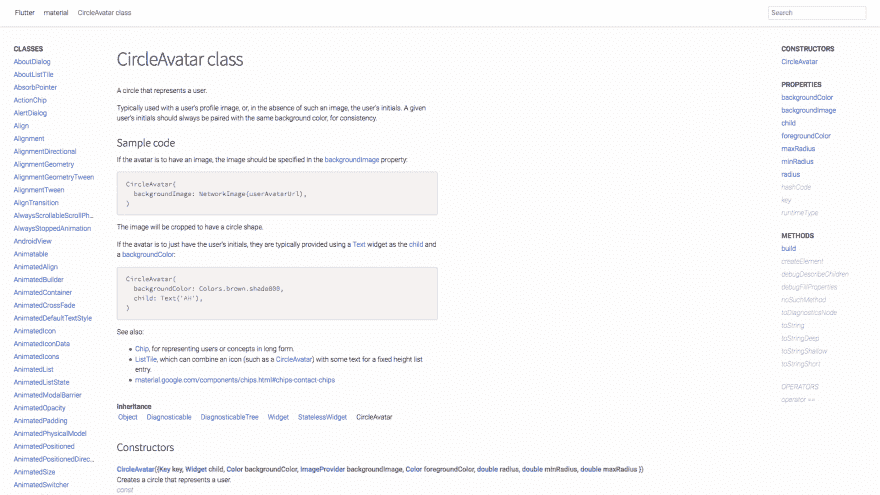
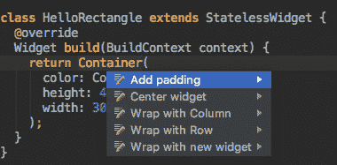
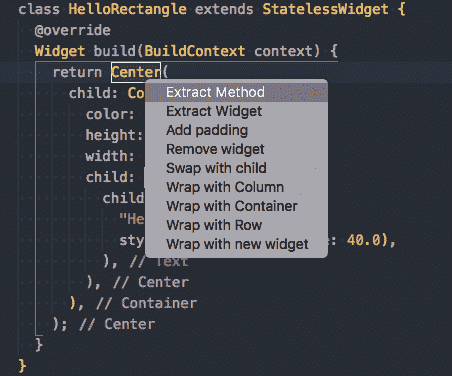

# 学习颤振-第 2 部分-失望

> 原文：<https://dev.to/rhymes/learning-flutter---part-2---disappointment-hg7>

*这是一系列关于旋舞的文章，我花了很少的时间来抓住它，你可以在这里找到 [part 1。](https://dev.to/rhymes/learning-flutter---day-1-4fki)*

[在线颤振文档](https://docs.flutter.io/)还好。嗯，不是很好。有很多白底蓝字，很多空白空间(感觉一点都不协调)，没有语法亮点，而且为了所有[北欧神](https://en.wikipedia.org/wiki/Norse_mythology)的爱，没有小部件的图片或截图！作为一个移动开发的新手，我该如何弄清楚一个 [CircleAvatar](https://docs.flutter.io/flutter/material/CircleAvatar-class.html) (好吧，也许是个错误的例子)是什么样子的呢？？我不想创建一个应用程序，苦读前面提到的文档，弄清楚如何使用这个小部件，只是为了看到我确实不需要它，因为它不是我想的那样。

给我图片，给我 gif。

是的，有一个名为 [Flutter Gallery](https://play.google.com/store/apps/details?id=io.flutter.demo.gallery) 的 Android 应用程序展示了一些控件，但是...你知道的。

看看这看起来有多可悲:

[T2】](https://res.cloudinary.com/practicaldev/image/fetch/s--OMJ0DdNp--/c_limit%2Cf_auto%2Cfl_progressive%2Cq_auto%2Cw_880/https://thepracticaldev.s3.amazonaws.com/i/fo0n0k1p7ybro6q0tkm9.png)

在关注 Flutter 的 Udacity(更多的失望即将到来，不要担心)时，我发现了一个很好的 Android Studio~~IDE 插件，这是 Flutter 的 Visual Studio 代码~~扩展中完全没有的:

[T2】](https://res.cloudinary.com/practicaldev/image/fetch/s--p75O_SJC--/c_limit%2Cf_auto%2Cfl_progressive%2Cq_auto%2Cw_880/https://thepracticaldev.s3.amazonaws.com/i/ir5lcihxyg305xazkwa5.png)

**Update-2018-10-21**:Visual Studio 的 [Dart/Flutter 插件](https://github.com/Dart-Code/Dart-Code)也有同样的功能，按`Cmd/Ctrl + .`触发:

[T2】](https://res.cloudinary.com/practicaldev/image/fetch/s--QHRetVqg--/c_limit%2Cf_auto%2Cfl_progressive%2Cq_auto%2Cw_880/https://thepracticaldev.s3.amazonaws.com/i/oibm7xcxz27amu4rrj32.png)

*感谢[@丹图普](https://dev.to/dantup)给我指了正确的方向*

因为所有东西(边框、布局、填充等等)都是一个小部件，这些漂亮的快捷方式可以节省时间。

转移到 Android - iOS 和 Flutter，我认为如果你想要一个看起来像本地的应用程序，你需要构建你的代码，让每个平台都有独立的部件集。它仍然节省时间，而不是有两个独立的应用程序，但我认为 Flutter 有一套独特的小部件，可以根据它运行的平台进行自然渲染。就像上一层的抽象层。终极抽象。我猜这几乎是科幻小说。公平地说:除了谷歌应用程序之外，我手机上的所有应用程序看起来都不“重要”，你可以通过巧妙的编程来最小化两个平台之间的差异。即使是课程搭建的演示 app，也会定制小部件，让它们看起来不那么“基础”。

继续学习这门课程，你会发现屏幕转换真的很容易(但也许使用原生 SDK 也很容易，我不知道):Flutter 有一个导航器，你可以在这个导航器的堆栈上推送小部件。让我想起了很多 Vue 路由器。额外收获:如果你添加一个 AppBar，你可以免费获得返回按钮，返回到上一个屏幕。基本上像 Vue 路由器和容器浏览器。干得好，没有失望。

另一件让我想起 Vue ( *或者让我想起你的事？*)就是[有状态小部件](https://docs.flutter.io/flutter/widgets/StatefulWidget-class.html)的概念。如果你写的正确，Flutter 会知道什么时候重画，什么时候不画。当你不需要操作状态时，无状态窗口小部件中有一个相反的部分(我猜像 Vue 的功能组件)。

对 Dart 的评论和我在教程中看到的很多代码:我不喜欢`this`是隐式的。我看到的是局部变量还是类属性，应该一目了然。尽管如此，你仍然可以使用它，你只是需要对它有所约束。另一个认为我不爱是“默认”导入样式:

```
import 'package:flutter/material.dart'; 
```

Enter fullscreen mode Exit fullscreen mode

这会将整个包导入到模块的名称空间中。在 Python 中的等价形式是:

```
from flutter.material import * 
```

Enter fullscreen mode Exit fullscreen mode

这对新手没多大帮助。如果你有很多这样的导入，那么使用搜索引擎来知道一个类来自哪里就不好笑了。好在 Dart 支持[别名进口](https://www.dartlang.org/guides/language/effective-dart/style#do-name-import-prefixes-using-lowercase_with_underscores)，比如:

```
import 'package:flutter/material.dart' as material; 
```

Enter fullscreen mode Exit fullscreen mode

只是我周围看到的代码没有用到它们。

通过学习这门课程，我得到的另一个感受是，在某些时候，有人会编写一个 UI 设计工具，生成带有钩子的脚手架代码，以便在子类中覆盖。手动编写整个代码是很好的，但是作为一个在 UI 设计方面没有什么技能的非设计师，当课程说:“现在让我们重构它”的时候，我想开枪自杀。这是一个单位转换器。我无法想象一个复杂的应用程序。如果没有这样的工具，这就需要**大量**的训练和代码分离。

虽然这篇文章的主要失望是相对于课程本身。正如我提到的，它分为两节课。第二课让我想起了一些大学课程，其中的主题是“不符合主题第一部分的一切，但解释较少”。你从教程到“这是你的一大堆 50 个我没告诉过你的小部件，现在重构应用”只需要 5 秒钟。这门课程是免费的，但挫折和失望却不是。

他们本可以提到但被认为是理所当然的两件事:如何设计下拉菜单的样式或如何使用它们，为什么业务逻辑完全沉浸在小部件的状态中。这是一场无法解释的小部件的盛宴，你不知道如何使用，除非你谷歌一下，这会把你带到 stackoverflow，如果你幸运的话，有人会解释。老实说，过了一段时间后，我觉得很无聊，开始编译练习的最终版本，而不是去做。你可以想象我实际学到了多少...

我甚至在某些时候变得很恼火。我可以对一段代码进行逆向工程，因为我必须这样做，但这应该是一个教程，所以我真的不想这样做。例如，在[背景练习](https://github.com/flutter/udacity-course/tree/master/course/07_backdrop/solution_07_backdrop)中，我只通过运行应用程序来理解 WTF。我确信我对这门课程的态度是好的，但是，嘿，我不是那个写下唯一要求是[“你应该有至少一年的编程经验，最好是用面向对象的语言，比如 Java、Python 或 Swift。”](https://www.udacity.com/course/build-native-mobile-apps-with-flutter--ud905)。

这还不是全部:-D 这些是我在那一课之后的笔记:*有一个 3 分 41 秒的视频，在视频中他们快速键入一些代码，快速向你解释响应式设计的三种方法。最后，他们甚至说“太好了，现在你可以为不同的屏幕方向和大小设计和构建你的应用程序了”。什么？！你真的让我在不到 4 分钟的时间里成为了 Flutter 里的移动响应式设计大师？我不这么认为，因为我已经忘了你打的一半了。*

我在不归的边缘。在几个视频中，Udacity 课程从“嘿，小猫咪”到“吃了这个药丸，我会让你看到黑色屏幕矩阵风格的绿色单词滚动”。

老实说，我有点走神，决定快速浏览剩下的几集，直到结束。所以我想我必须在未来找到一个更好的颤振课程，因为这不值得。

我在愤怒的时候发现了 Flutter 的一个优点:它在编译过程中使用树抖动来删除包中未使用的代码。我觉得 Flutter 整合了很多来自 JS 世界的概念，这是一件好事。当你看到不同的世界融合了彼此最好的部分，这总是一件好事。

在课程中有一个“特别的插曲”,旨在让学习者熟悉 JSON 解析、资产和其他东西，在这方面，速度是人性化的。他们只会向你灌输未来和异步编程，而不做任何解释(好在他们在任何地方都一样工作，所以我在学习:D 时没有任何问题)。好吧，有一个解释，只是它出现在之后的课程中。谢谢你什么都没做。

给未来自己的提示:先学飞镖再学扑。

嗯，这是所有的东西。失望更多的是关于 Udacity 课程，而不是 Flutter 本身。