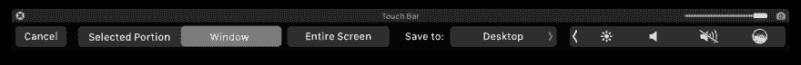

# 从开源中学习

> 原文：<https://dev.to/onmyway133/learning-from-open-source-3j1>

以下是我从一些开源项目中学到的东西

[T2】](https://res.cloudinary.com/practicaldev/image/fetch/s--HX7fUjLN--/c_limit%2Cf_auto%2Cfl_progressive%2Cq_auto%2Cw_880/https://cdn-images-1.medium.com/max/3200/0%2AG11MqPA1ecHTaPf-.jpeg)

## 纯:仿制工厂

from[devxoul/Pure:Sources/Pure/factory module . swift @ master](https://github.com/devxoul/Pure/blob/master/Sources/Pure/FactoryModule.swift)

```
public protocol FactoryModule: Module {

  /// A factory for `Self`.
  associatedtype Factory = Pure.Factory<Self>

  /// Creates an instance of a module with a dependency and a payload.
  init(dependency: Dependency, payload: Payload)
} 
```

Enter fullscreen mode Exit fullscreen mode

from[devxoul/Pure:Sources/Pure/factory . swift @ master](https://github.com/devxoul/Pure/blob/master/Sources/Pure/Factory.swift)

```
open class Factory<Module: FactoryModule> {
  private let dependencyClosure: () -> Module.Dependency

  /// A static dependency of a module.
  open var dependency: Module.Dependency {
    return self.dependencyClosure()
  }

  /// Creates an instance of `Factory`.
  ///
  /// - parameter dependency: A static dependency which should be resolved in a composition root.
  public init(dependency: @autoclosure @escaping () -> Module.Dependency) {
    self.dependencyClosure = dependency
  }

  /// Creates an instance of a module with a runtime parameter.
  ///
  /// - parameter payload: A runtime parameter which is required to construct a module.
  open func create(payload: Module.Payload) -> Module {
    return Module.init(dependency: self.dependency, payload: payload)
  }
} 
```

Enter fullscreen mode Exit fullscreen mode

from[devxoul/Pure:Tests/Pure Tests/Pure spec . swift @ master # L72](https://github.com/devxoul/Pure/blob/master/Tests/PureTests/PureSpec.swift#L72)

```
let factory = FactoryFixture<Dependency, Payload>.Factory(dependency: .init(
  networking: "Networking A"
))
let instance = factory.create(payload: .init(id: 100))
expect(instance.dependency.networking) == "Networking A"
expect(instance.payload.id) == 100 
```

Enter fullscreen mode Exit fullscreen mode

## 改造:制作延期

来自[JakeWharton/retro fit 2-kotlin-coroutines-adapter:src/main/Java/com/JakeWharton/retro fit 2/adapter/kotlin/coroutines/experimental/coroutinecaladapterfactory . kt @ master # L86](https://github.com/JakeWharton/retrofit2-kotlin-coroutines-adapter/blob/master/src/main/java/com/jakewharton/retrofit2/adapter/kotlin/coroutines/experimental/CoroutineCallAdapterFactory.kt#L86)

```
override fun adapt(call: Call<T>): Deferred<T> {
  val deferred = CompletableDeferred<T>()

  deferred.invokeOnCompletion {
    if (deferred.isCancelled) {
      call.cancel()
    }
  }

  call.enqueue(object : Callback<T> {
    override fun onFailure(call: Call<T>, t: Throwable) {
      deferred.completeExceptionally(t)
    }

    override fun onResponse(call: Call<T>, response: Response<T>) {
      if (response.isSuccessful) {
        deferred.complete(response.body()!!)
      } else {
        deferred.completeExceptionally(HttpException(response))
      }
    }
  })

  return deferred
} 
```

Enter fullscreen mode Exit fullscreen mode

## 开:带有关联类型协议的通用扩展

我喜欢扩展，我喜欢将它们归入一个公共属性下，以便于访问。这也清楚地表明，这些都属于同一功能，不要与苹果属性混淆。

### 分组所有相关分机

这是我在[主播](https://github.com/onmyway133/Anchors)和的[中的做法](https://github.com/onmyway133/On)

```
activate(
  a.anchor.top.left,
  b.anchor.top.right,
  c.anchor.bottom.left,
  d.anchor.bottom.right
)

textField.on.text { text in
  print("textField text has changed")
}

textField.on.didEndEditing { text in
  print("texField has ended editing")
} 
```

Enter fullscreen mode Exit fullscreen mode

### 通用分机

对于 On，这有点棘手，因为它需要适应不同的 NSObject 子类。为了使自动完成工作，这意味着每种类型的子类都有自己的函数提示，我们需要使用泛型和关联类型协议。

你可以看看[集装箱](https://github.com/onmyway133/On/blob/master/Sources/Shared/Core/Container.swift)和 [OnAware](https://github.com/onmyway133/On/blob/master/Sources/Shared/Core/OnAware.swift)

```
public class Container<Host: AnyObject>: NSObject {
  unowned let host: Host

  init(host: Host) {
    self.host = host
  }
}

public protocol OnAware: class {
  associatedtype OnAwareHostType: AnyObject

  var on: Container<OnAwareHostType> { get }
} 
```

Enter fullscreen mode Exit fullscreen mode

### RxCocoa

RxSwift 的 RxCocoa 也有这个功能，所以你可以直接声明

```
button.rx.tap
textField.rx.text
alertAction.rx.isEnabled 
```

Enter fullscreen mode Exit fullscreen mode

力量在于结构[反应](https://github.com/ReactiveX/RxSwift/blob/0b66f666ba6955a51cba1ad530311b030fa4db9c/RxSwift/Reactive.swift)和反应兼容协议

```
public struct Reactive<Base> {
    /// Base object to extend.
    public let base: Base

    /// Creates extensions with base object.
    ///
    /// - parameter base: Base object.
    public init(_ base: Base) {
        self.base = base
    }
}

public protocol ReactiveCompatible {
    /// Extended type
    associatedtype CompatibleType

    /// Reactive extensions.
    static var rx: Reactive<CompatibleType>.Type { get set }

    /// Reactive extensions.
    var rx: Reactive<CompatibleType> { get set }
}

extension ReactiveCompatible {
    /// Reactive extensions.
    public static var rx: Reactive<Self>.Type {
        get {
            return Reactive<Self>.self
        }
        set {
            // this enables using Reactive to "mutate" base type
        }
    }

    /// Reactive extensions.
    public var rx: Reactive<Self> {
        get {
            return Reactive(self)
        }
        set {
            // this enables using Reactive to "mutate" base object
        }
    }
} 
```

Enter fullscreen mode Exit fullscreen mode

在这里 [UIButton+Rx](https://github.com/ReactiveX/RxSwift/blob/master/RxCocoa/iOS/UIButton%2BRx.swift) 你可以看到它是如何应用于 UIButton 的

```
extension Reactive where Base: UIButton {

    /// Reactive wrapper for `TouchUpInside` control event.
    public var tap: ControlEvent<Void> {
        return controlEvent(.touchUpInside)
    }
} 
```

Enter fullscreen mode Exit fullscreen mode

## BackchannelSDK-iOS:使用协调器

[协调器](http://khanlou.com/2015/10/coordinators-redux/)模式对于管理依赖关系和处理视图控制器的导航非常有用。从 [BackchannelSDK-iOS](https://github.com/backchannel/BackchannelSDK-iOS) 可以看出，比如看一下[BAKCreateProfileCoordinator](https://github.com/backchannel/BackchannelSDK-iOS/blob/611de61611a9609d708920e2b602b2edbcc26b20/Source/Authentication/BAKCreateProfileCoordinator.m)

```
@implementation BAKCreateProfileCoordinator

- (instancetype)initWithUser:(BAKUser *)user navigationController:(UINavigationController *)navigationController configuration:(BAKRemoteConfiguration *)configuration {
    self = [super init];
    if (!self) return nil;

    _navigationController = navigationController;
    _user = user;
    _profileViewController = [[BAKProfileFormViewController alloc] init];
    [self configureProfileForm];
    _configuration = configuration;

    return self;
}

- (void)start {
    [self.profileViewController updateDisplayName:self.user.displayName];
    [self.navigationController pushViewController:self.profileViewController animated:YES];
}

- (void)profileViewControllerDidTapAvatarButton:(BAKProfileFormViewController *)profileViewController {
    BAKChooseImageCoordinator *imageChooser = [[BAKChooseImageCoordinator alloc] initWithViewController:self.navigationController];
    imageChooser.delegate = self;
    [self.childCoordinators addObject:imageChooser];
    [imageChooser start];
}

- (void)imageChooserDidCancel:(BAKChooseImageCoordinator *)imageChooser {
    [self.childCoordinators removeObject:imageChooser];
} 
```

Enter fullscreen mode Exit fullscreen mode

看看它如何将 navigationController 作为根元素进行导航，以及它如何管理 childCoordinators

## Kickstarter:管理依赖关系

关于 ios-oss 的另一个很酷的事情是它如何管理依赖关系。通常你有很多依赖项，把它们放在一个地方很好，把它注入到需要的对象。

[环境](https://github.com/kickstarter/ios-oss/blob/master/Library/Environment.swift)是一个简单的结构，包含整个应用程序的所有依赖关系

```
/**
 A collection of **all** global variables and singletons that the app wants access to.
 */
public struct Environment {
  /// A type that exposes endpoints for fetching Kickstarter data.
  public let apiService: ServiceType

  /// The amount of time to delay API requests by. Used primarily for testing. Default value is `0.0`.
  public let apiDelayInterval: DispatchTimeInterval

  /// A type that exposes how to extract a still image from an AVAsset.
  public let assetImageGeneratorType: AssetImageGeneratorType.Type

  /// A type that stores a cached dictionary.
  public let cache: KSCache

  /// ...
} 
```

Enter fullscreen mode Exit fullscreen mode

还有一个名为 [AppEnvironment](https://github.com/kickstarter/ios-oss/blob/master/Library/AppEnvironment.swift) 的全局对象，它管理堆栈中的所有这些环境

```
public struct AppEnvironment {
  /**
   A global stack of environments.
   */
  fileprivate static var stack: [Environment] = [Environment()]

  /**
   Invoke when an access token has been acquired and you want to log the user in. Replaces the current
   environment with a new one that has the authenticated api service and current user model.

   - parameter envelope: An access token envelope with the api access token and user.
   */
  public static func login(_ envelope: AccessTokenEnvelope) {
    replaceCurrentEnvironment(
      apiService: current.apiService.login(OauthToken(token: envelope.accessToken)),
      currentUser: envelope.user,
      koala: current.koala |> Koala.lens.loggedInUser .~ envelope.user
    )
  }

  /**
   Invoke when we have acquired a fresh current user and you want to replace the current environment's
   current user with the fresh one.

   - parameter user: A user model.
   */
  public static func updateCurrentUser(_ user: User) {
    replaceCurrentEnvironment(
      currentUser: user,
      koala: current.koala |> Koala.lens.loggedInUser .~ user
    )
  }

  public static func updateConfig(_ config: Config) {
    replaceCurrentEnvironment(
      config: config,
      koala: AppEnvironment.current.koala |> Koala.lens.config .~ config
    )
  }

  // Invoke when you want to end the user's session.
  public static func logout() {
    let storage = AppEnvironment.current.cookieStorage
    storage.cookies?.forEach(storage.deleteCookie)

    replaceCurrentEnvironment(
      apiService: AppEnvironment.current.apiService.logout(),
      cache: type(of: AppEnvironment.current.cache).init(),
      currentUser: nil,
      koala: current.koala |> Koala.lens.loggedInUser .~ nil
    )
  }

  // The most recent environment on the stack.
  public static var current: Environment! {
    return stack.last
  }

} 
```

Enter fullscreen mode Exit fullscreen mode

每当有事件触发依赖关系更新，我们称之为

```
self.viewModel.outputs.logIntoEnvironment
  .observeValues { [weak self] accessTokenEnv in
    AppEnvironment.login(accessTokenEnv)
    self?.viewModel.inputs.environmentLoggedIn()
} 
```

Enter fullscreen mode Exit fullscreen mode

环境最酷的一点是我们可以存储和检索它们

```
// Returns the last saved environment from user defaults.
public static func fromStorage(ubiquitousStore: KeyValueStoreType,
                                 userDefaults: KeyValueStoreType) -> Environment {
  // retrieval

} 
```

Enter fullscreen mode Exit fullscreen mode

我们可以在测试中模仿

```
AppEnvironment.replaceCurrentEnvironment(
  apiService: MockService(
    fetchDiscoveryResponse: .template |> DiscoveryEnvelope.lens.projects .~ [
      .todayByScottThrift,
      .cosmicSurgery,
      .anomalisa
    ]
  )
) 
```

Enter fullscreen mode Exit fullscreen mode

## Kickstarter:使用游乐场

我喜欢 kickstarter-ios 的一点是他们如何使用 Playground 快速原型化视图。

> 我们使用 Swift Playgrounds 进行迭代开发和设计。应用程序中的大多数主要屏幕都有相应的操场，我们可以在那里实时看到各种各样的设备、语言和数据。

这样我们就不再需要[注入](http://johnholdsworth.com/injection.html)或者使用 React Native 了。看看所有页面[Kickstarter/IOs-OSS:Kickstarter-IOs . playground/Pages @ master](https://github.com/kickstarter/ios-oss/tree/master/Kickstarter-iOS.playground/Pages)

## Touchbar 模拟器:用代码制作 macOS app

当我创建新的 macOS 项目时，我熟悉 Xcode 给我的整个应用程序结构，以及故事板。前几天我在读 [touch-bar-simulator](https://github.com/sindresorhus/touch-bar-simulator) ，看它如何只用代码声明 app。看到这个 [main.swift](https://github.com/sindresorhus/touch-bar-simulator/blob/master/Touch%20Bar%20Simulator/main.swift)

```
let app = NSApplication.shared
let delegate = AppDelegate()
app.delegate = delegate
app.run()

final class AppDelegate: NSObject, NSApplicationDelegate, NSWindowDelegate {
  let controller = IDETouchBarSimulatorHostWindowController.simulatorHostWindowController()!
  lazy var window: NSWindow = self.controller.window!
} 
```

Enter fullscreen mode Exit fullscreen mode

## Kickstarter:输入输出容器

这是 ios-oss 中一个非常漂亮的技巧，它是围绕 MVVM 模式构建的。它使用协议来定义输入和输出，并使用容器协议来包含它们。以[kickstarter/IOs-OSS:Library/ViewModels/loginviewmodel . swift @ 1f 5643 f](https://github.com/kickstarter/ios-oss/blob/1f5643f6a769995ccd1bb3826699745e64597ab7/Library/ViewModels/LoginViewModel.swift)为例

```
public protocol LoginViewModelInputs {

}

public protocol LoginViewModelOutputs {

}

public protocol LoginViewModelType {
  var inputs: LoginViewModelInputs { get }
  var outputs: LoginViewModelOutputs { get }
}

public final class LoginViewModel: LoginViewModelType, LoginViewModelInputs, LoginViewModelOutputs {
  public var inputs: LoginViewModelInputs { return self }
  public var outputs: LoginViewModelOutputs { return self }
} 
```

Enter fullscreen mode Exit fullscreen mode

看看 LoginViewModel 是怎么符合 3 个协议的。当您访问它的 input 或 outputproperties 时，您只能访问 LoginViewModelInputs 和 LoginViewModelOutputs

## Suas:迅速观察对象定义

*   今天我浏览了 Suas-iOS 和另一个对象生命周期的订阅链接

    subscription.linkLifeCycleTo(对象:self)

它观察另一个工作的定义，有趣的方法👍，看看[zendesk/Suas-iOS:Sources/storedeinitcallback . swift @ master](https://github.com/zendesk/Suas-iOS/blob/master/Sources/StoreDeinitCallback.swift)

```
var deinitCallbackKey = "DEINITCALLBACK_SUAS"

//MARK:registration
扩展 Suas {

static func onObjectDeinit(for object object:ns object，
 callbackId: String，
callback:@ escaping()->(){
let rem = deinitCallback(for object:object)
rem . callbacks . append(callback)

静态文件私有函数反呼叫(forobject:nsobject)->反呼叫{ 
如果让反呼叫= objc _ getassotedobject(object，&反呼叫键)为？反呼叫{ 
反呼叫
 } else { 
 let rem =反呼叫()
objc _ setassociation tedobject(object，&反呼叫金钥，rem，。objc _ association _ retain _ non atomic)
return rem
}
}

@ objc file private class DeinitCallback:ns object {
var 回调:[() - > ()] = []

deinit {
callbacks . foreach({ $ 0()})
}
} 
```

Enter fullscreen mode Exit fullscreen mode

## 
  
Touchbar 模拟器:从私有框架中取出一个 app

前几天我在浏览[sindresorhus/touch-bar-simulator](https://github.com/sindresorhus/touch-bar-simulator)时，他从 DFRSupportKit.framework 中提取 IDETouchBarSimulatorHostWindowController 的做法非常高明，值得一试

[T2】](https://res.cloudinary.com/practicaldev/image/fetch/s--H0UddGyx--/c_limit%2Cf_auto%2Cfl_progressive%2Cq_auto%2Cw_880/https://cdn-images-1.medium.com/max/4000/0%2Au1ZYB06tiKEjKjlk.png)