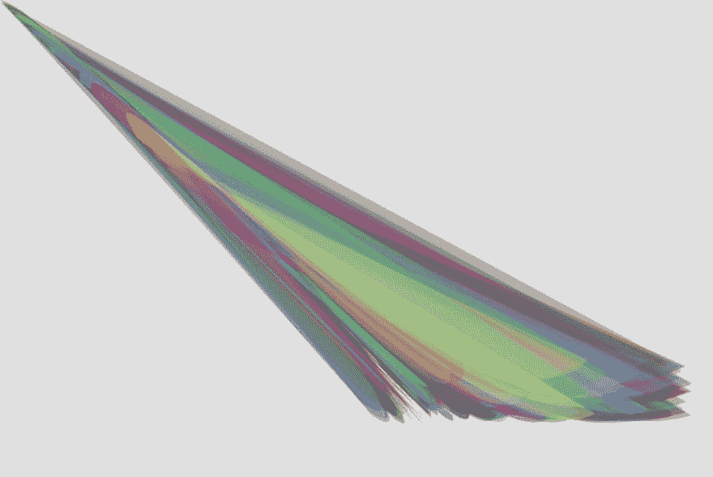
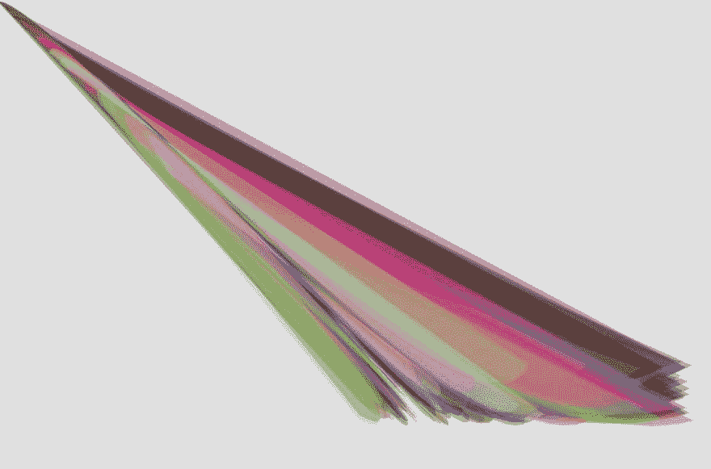

# 学习生成艺术；第二天“羽毛”🐦

> 原文：<https://dev.to/ohbarye/learning-generative-art-day-2-feather--4ma0>

延续[我学习生成艺术的第一步](https://dev.to/ohbarye/my-first-step-in-learning-generative-art-3674)。

## 【羽毛】

我画了一幅表现羽毛的图像；这是地球上任何生物都没有的美好事物。

[T2】](https://res.cloudinary.com/practicaldev/image/fetch/s--THrBQRER--/c_limit%2Cf_auto%2Cfl_progressive%2Cq_auto%2Cw_880/https://user-images.githubusercontent.com/1811616/39481377-353be79c-4da6-11e8-9746-6f8a4cc4e12e.png)

[](https://res.cloudinary.com/practicaldev/image/fetch/s--5ljwmXSx--/c_limit%2Cf_auto%2Cfl_progressive%2Cq_auto%2Cw_880/https://user-images.githubusercontent.com/1811616/39481690-3c932dce-4da7-11e8-9659-00ba54532ba9.png)T3】

```
function setup() {
  createCanvas(600, 400);
  background(224)
  noStroke();
  for (var i = 0; i < 300; i++) {
    var r = random(0,200);
    fill(color(random(i),random(i),random(i), 77)); 
    bezier(random(300, 580), random(300, 350), 400, 400, 44, 0, r, r);
    bezier(600, 600, random(r), random(350), 400, 400);
  }
}

function draw() {
} 
```

Enter fullscreen mode Exit fullscreen mode

## 到

随机数字增加了创造艺术的乐趣，因为相同的代码产生不同的图像。