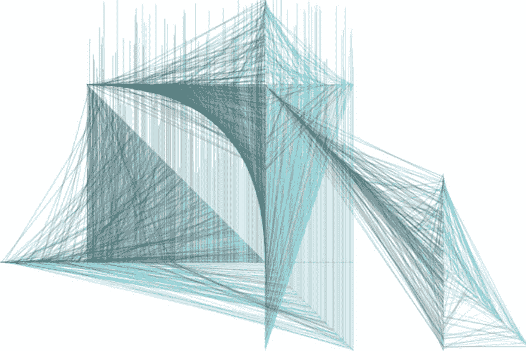
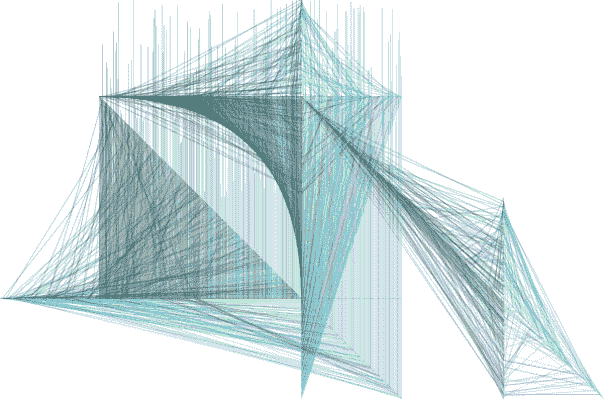

# 学习生成艺术；第三天“弦乐”🎻

> 原文：<https://dev.to/ohbarye/learning-generative-art-day-3-strings--jb4>

(不小心把这篇文章更新了另一个内容。我尽可能地检索了原始内容...😢)

延续[我学习生成艺术的第一步](https://dev.to/ohbarye/my-first-step-in-learning-generative-art-3674)。

## 【琴弦】

[](https://res.cloudinary.com/practicaldev/image/fetch/s--p0C1vK-I--/c_limit%2Cf_auto%2Cfl_progressive%2Cq_auto%2Cw_880/https://thepracticaldev.s3.amazonaws.com/i/urzdi9c51hiztg77bvdx.png)
[T6】](https://res.cloudinary.com/practicaldev/image/fetch/s--c1kOqud4--/c_limit%2Cf_auto%2Cfl_progressive%2Cq_66%2Cw_880/https://thepracticaldev.s3.amazonaws.com/i/5syeudev9pqdd36fomkv.gif)

我画了一个表达“弦”的形象；一根弦是迟钝的，脆弱的，短暂的。但是一旦它聚集起来，就可能是成串的和持久的。我们可以用绳子编织任何东西。

可能西方人有句谚语叫“三足鼎立”之类的？我们日本人说“三支箭”。

```
function setup() {
  createCanvas(600, 400);
  frameRate(4)
}

function draw() {
  background(255)
  for (var i = 100; i < 400; i++) {
    var r = random(200);
    stroke(color(random(r),random(i),random(i), 60));   
    line(300, r, i, 100)
    line(300, i, i, 100)

    line(i, i, i, 300)
    line(i, i, r, 300)
    line(i, r, i, 300)

    line(500, r + 200, i + 200, i)
  }
} 
```

Enter fullscreen mode Exit fullscreen mode

## 到

`line`功能只是画一条简单的线。但是，它在生成艺术世界里有着无限的可能性。