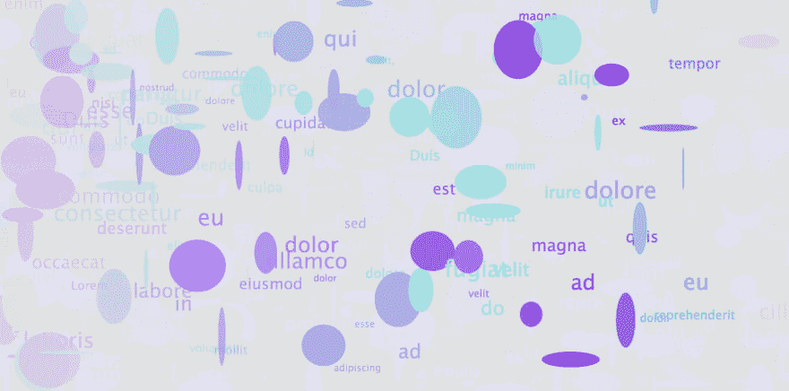

# 学习生成艺术；第五天“未知语言”👁‍🗨

> 原文：<https://dev.to/ohbarye/learning-generative-art-day-5-unknown-language--1fn1>

延续[我学习生成艺术的第一步](https://dev.to/ohbarye/my-first-step-in-learning-generative-art-3674)。

## 【未知语言】

[T2】](https://res.cloudinary.com/practicaldev/image/fetch/s--cgRGaw4V--/c_limit%2Cf_auto%2Cfl_progressive%2Cq_66%2Cw_880/https://thepracticaldev.s3.amazonaws.com/i/2fp6w693c6t5bgowaxrn.gif)

[T2】](https://res.cloudinary.com/practicaldev/image/fetch/s--eutCJShn--/c_limit%2Cf_auto%2Cfl_progressive%2Cq_auto%2Cw_880/https://thepracticaldev.s3.amazonaws.com/i/8u1v4re8l7oup6xuv3b2.png)

我试图表达我在面对一种未知语言的情况下的感受。那种场合，我从来不懂陌生人说什么，想什么，感受什么。然后我感到难以置信的孤立，我的视力变成灰色。

```
var xoff = 0.0;
var words = ["Lorem", "ipsum", "dolor", "sit", "amet,", "consectetur", "adipiscing", "elit,", "sed", "do", "eiusmod", "tempor", "incididunt", "ut", "labore", "et", "dolore", "magna", "aliqua.", "Ut", "enim", "ad", "minim", "veniam,", "quis", "nostrud", "exercitation", "ullamco", "laboris", "nisi", "ut", "aliquip", "ex", "ea", "commodo", "consequat.", "Duis", "aute", "irure", "dolor", "in", "reprehenderit", "in", "voluptate", "velit", "esse", "cillum", "dolore", "eu", "fugiat", "nulla", "pariatur.", "Excepteur", "sint", "occaecat", "cupidatat", "non", "proident,", "sunt", "in", "culpa", "qui", "officia", "deserunt", "mollit", "anim", "id", "est", "laborum"];

function setup() {
  createCanvas(800, 400);
  background(220);
  noStroke();
}

function draw() {
  fill(220, 4); // Create an alpha blended background
  rect(0, 0, width, height);

  // Get a noise value based on xoff and scale 
  // it according to the window's width
  var n = xoff * xoff * width;
  // var n = random(0,width);  // another expression

  xoff += 0.01; // With each cycle, increment xoff
  if (n > width) {
    xoff = 0.0; // reset
  }

  fill(color(random(100, 133), random(250), random(200, 255), random(200, 255)));
  ellipse(n, random(height), random(64), random(64));
  text(random(words), n, random(height));
  textSize(random(8, 24));
} 
```

Enter fullscreen mode Exit fullscreen mode

## 到

### `noise`

[`noise`函数](https://p5js.org/examples/math-noise1d.html)是将随机性引入生成艺术的另一种方式`noise`使用[柏林噪声](https://en.wikipedia.org/wiki/Perlin_noise)不像`random`。意味着我们可以表达比`random`更自然的质感或行为。

(顺便说一下，我不知道`random`函数接受一个数组作为它的参数。)