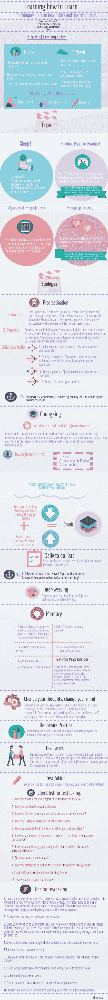

# 学习如何学习！

> 原文：<https://dev.to/kauresss/learning-how-to-learn-1dkf>

很久以前我博客上的一张信息图。由 Terrence Sejnowski 和 Barbara Oakley 根据 Coursera 的“学习如何学习”课程制作。

[T2】](https://res.cloudinary.com/practicaldev/image/fetch/s--m8ekr9cS--/c_limit%2Cf_auto%2Cfl_progressive%2Cq_auto%2Cw_880/https://thepracticaldev.s3.amazonaws.com/i/m160n15170j5tpov4133.jpg)