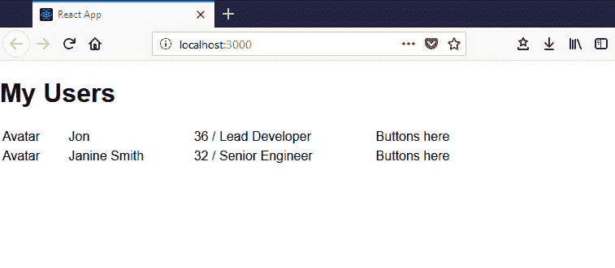
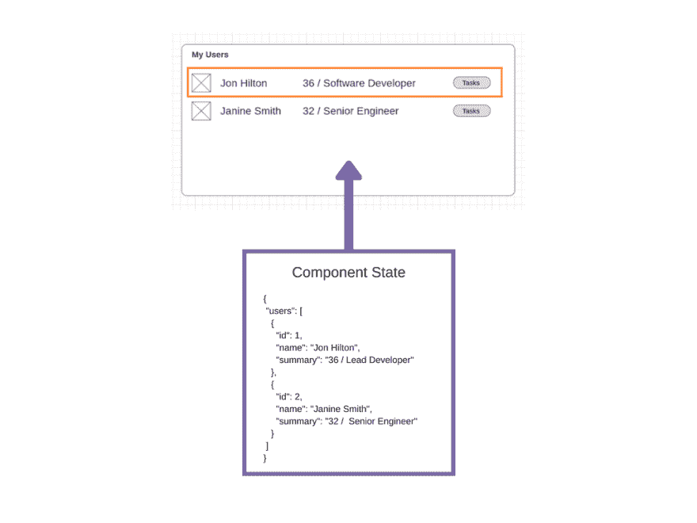
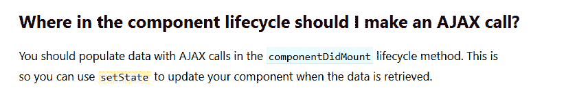
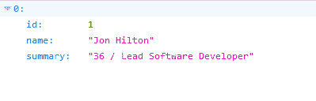
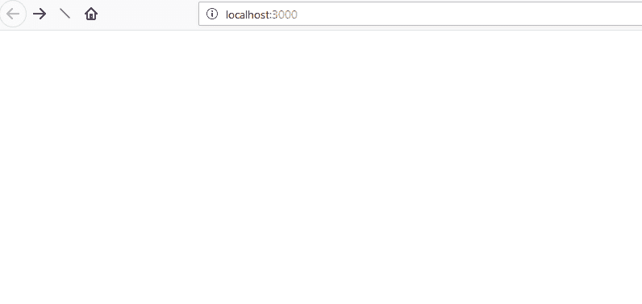

# 学习 React——如何将 React 组件连接到 ASP.NET 核心 Web API

> 原文：<https://dev.to/jonhilt/learning-react---how-to-connect-react-components-to-your-aspnet-core-web-api-1jl>

我们首次涉足 React。JS 进行得相当顺利。

我们已经决定[学习 React](https://dev.to/jonhilt/diary-of-a-net-developer---learning-react-4o5f) ，从一些[基本 UI 组件构建](https://dev.to/jonhilt/learning-react---building-up-the-user-interface-using-components-and-dummy-data--106d)开始，进展出乎意料的顺利。

我们尝试的前几件事真的成功了！用户界面正在整合。我开始觉得自己像个老板了！

然后不可避免的事情发生了，我们撞上了医生有效地说“现在你只能靠自己了”的地方。

我们需要将我们羽翼未丰的前端组件与来自 ASP.NET 核心 Web API 的一些真实数据挂钩。

毫不奇怪，在 React 文档中没有关于如何做到这一点的**具体的**建议(确实有意义，React 将与任何后端 API 一起工作，这不是他们深入研究细节的地方)。

好消息是什么？经过一段时间的挥舞手臂和失败的实验后，我们找到了最简单的方法来实现这一点，但首先我们必须了解一下 React 是如何处理状态的。

在我们继续之前，如果你想看看这个系列的源代码，请点击这里:-)

## 从哪里获取数据？

这就是我们要去的地方...

[T2】](https://res.cloudinary.com/practicaldev/image/fetch/s--5sWp9W9k--/c_limit%2Cf_auto%2Cfl_progressive%2Cq_auto%2Cw_880/https://jonhilton.net/img/diary-of-a-net-developer-part-2/2018-05-29-22-18-35.png)

有点简陋，但它显示了我们需要的数据。

问题在于这些数据的静态性质...

```
private getUserData() {
    return [
        { id: 1, name: 'Jon', summary: '36 / Lead Developer' },
        { id: 2, name: 'Janine Smith', summary: '32 / Senior Engineer' }
    ];
} 
```

Enter fullscreen mode Exit fullscreen mode

我们需要通过调用我们的 API 来替换它。

还记得我们的渲染函数是这样的吗...

```
public render() {
    return (
        <div>
            <h1>My Users</h1>
            <table className="user-list">
                <tbody>
                    {this.getUserData().map(user => 
                        <UserRow key={user.id} user={user} />)}
                </tbody>
            </table>
        </div>
    );
} 
```

Enter fullscreen mode Exit fullscreen mode

React 在这个组件第一次被加载时调用`render`(在其他时候，用来处理状态改变等。这一点我们将会谈到)。

我们的`render`方法将调用`getUserData`，然后为每个用户呈现一个用户行。

所以，天真地说，我们可以更新`getUserData`来进行 AJAX 调用，对吗？

```
private getUserData() {
    // ajax call to get data
    // return the data
} 
```

Enter fullscreen mode Exit fullscreen mode

这可能行得通，但是这有点违背 React 的精神。

我们与 React 合作得越多，我们就越开始欣赏构建组件的**声明方式。**

这个想法是，您构建一个对组件中的状态变化做出反应(是的，真的)的用户界面。

因此，React 方法不是调用 render 方法直接获取数据，而是在组件生命周期的某个时刻调用 Ajax，更新组件的状态，并让 UI 自动更新以反映更改后的状态。

[T2】](https://res.cloudinary.com/practicaldev/image/fetch/s--Ey0IUdoH--/c_limit%2Cf_auto%2Cfl_progressive%2Cq_auto%2Cw_880/https://jonhilton.net/img/diary-of-a-net-developer-part-3/2018-06-07-12-34-15.png)

每当我们修改这个状态时，UI 应该自动反映并显示新的数据。

## 渲染状态

要声明初始状态(在进行任何 AJAX 调用之前，您的组件将从一开始就使用的状态)，您可以像这样简单地声明它...

```
export default class MyUsers extends React.Component<any, any>{

    public state = {
        "users": [
            { "id": 1, "name": "Jon Hilton", "summary": "36 / Lead Developer" },
            { "id": 2, "name": "Janine Smith", "summary": "32 /  Senior Engineer" }
        ]
    };

    // rest of class omitted
} 
```

Enter fullscreen mode Exit fullscreen mode

实际上，我们只是将硬编码的数据转移到了反应状态。

现在我们可以取消我们的`getUserData`调用，改为绑定到状态...

```
public render() {
    return (
        <div>
            <h1>My Users</h1>
            <table className="user-list">
                <tbody>
                    {this.state.users.map(user => 
                        <UserRow key={user.id} user={user} />)}
                </tbody>
            </table>
        </div>
    );
} 
```

Enter fullscreen mode Exit fullscreen mode

对`this.state.users`的引用让奇迹发生了。现在，每当该状态改变时，用户界面的相关部分将自动更新。

## AJAX 调用

这就给我们留下了谜题的最后一部分。何时何地以及如何将组件连接到我们的 API。

[T2】](https://res.cloudinary.com/practicaldev/image/fetch/s--26f7PXO0--/c_limit%2Cf_auto%2Cfl_progressive%2Cq_auto%2Cw_880/https://jonhilton.net/img/diary-of-a-net-developer-part-3/2018-06-07-15-21-20.png)

react 文档为我们指出了正确的方向...

[T2】](https://res.cloudinary.com/practicaldev/image/fetch/s--7tcvxmAC--/c_limit%2Cf_auto%2Cfl_progressive%2Cq_auto%2Cw_880/https://jonhilton.net/img/diary-of-a-net-developer-part-3/2018-06-07-12-39-54.png)

组件加载后，React 会自动调用`ComponentDidMount`。我们可以在这里进行 ajax 调用。

```
public async componentDidMount() {
    const result = await fetch('https://localhost:44348/api/user');
    const users = await result.json();
    this.setState({ users });
} 
```

Enter fullscreen mode Exit fullscreen mode

Fetch 在现代浏览器中是“开箱即用”的，React 通过使用一个 [polyfill](https://remysharp.com/2010/10/08/what-is-a-polyfill) (其他 ajax 库也是可用的)来确保它能在旧浏览器中工作。

顺便说一句，下面是等价的。

```
this.setState({ users })
this.setState({ users:users }) 
```

Enter fullscreen mode Exit fullscreen mode

如果属性名与变量名相同，则不必指定属性名(“users”)。

**异步/等待**

Javascript(和 Typescript)支持 async/await 模式。

在这种情况下，这意味着在从`await fetch()`调用返回响应之前，不会调用`const users`行。

引擎盖下获取实际上是返回一个承诺。如果你不想使用 async/await，你可以直接与 promise 交互。

```
public componentDidMount() {
    fetch('https://localhost:44348/api/user')
        .then(res => res.json())
        .then(users =>
            this.setState({ users })
        );
} 
```

Enter fullscreen mode Exit fullscreen mode

## API 方法

就这样，现在将使用 API 调用返回的数据来呈现组件。

为了让这段代码正常工作，API 调用中返回的属性名称必须与 javascript 中使用的名称相匹配。

这里有一个可以在这里工作的 API 的粗略例子。

```
using System.Collections.Generic;
using Microsoft.AspNetCore.Mvc;

namespace UsersAPI.Controllers
{
    [Route("api/[controller]")]
    [ApiController]
    public class UserController : ControllerBase
    {
        [HttpGet]
        public ActionResult<IEnumerable<User>> List()
        {
            // in real life - retrieve from database
            var users = new List<User>{
                new User {
                    Id = 1,
                    Name = "Jon Hilton",
                    Summary = "36 / Lead Software Developer" }
            };

            return Ok(users);
        }
    }

    public class User
    {
        public int Id { get; set; }
        public string Name { get; set; }
        public string Summary { get; set; }
    }
} 
```

Enter fullscreen mode Exit fullscreen mode

下面是浏览器中的响应(注意，ASP.NET 使用 camel case 属性名返回数据，这与我们在 React 组件中使用的情况相匹配)。

[T2】](https://res.cloudinary.com/practicaldev/image/fetch/s--Gz48tu1J--/c_limit%2Cf_auto%2Cfl_progressive%2Cq_auto%2Cw_880/https://jonhilton.net/img/diary-of-a-net-developer-part-3/2018-06-07-15-09-29.png)

## 下一步

这些都可以工作，但是在 React 组件的顶部有一个奇怪的副作用，即初始硬编码状态。

```
public state = {
    "users": [
        { "id": 1, "name": "Jon Hilton", "summary": "36 / Lead Developer" },
        { "id": 2, "name": "Janine Smith", "summary": "32 /  Senior Engineer" }
    ]
}; 
```

Enter fullscreen mode Exit fullscreen mode

在浏览器中查看它，我们会在从 API 加载“真实”数据之前看到这些硬编码的数据。

[T2】](https://res.cloudinary.com/practicaldev/image/fetch/s--6OwDPzGN--/c_limit%2Cf_auto%2Cfl_progressive%2Cq_66%2Cw_880/https://jonhilton.net/img/diary-of-a-net-developer-part-3/ReactFlicker.gif)

下一篇文章看我们如何移除这个初始数据，并更好地利用 Typescript 来指定从 API 返回的数据的结构。

在你离开之前，记得你可以在这里找到这个系列的源代码:-)

*图片来源:pressleasefinder[SABIC 创新塑料:SABIC 创新塑料 Valox](http://www.flickr.com/photos/42136457@N05/5098635157)* ENH 树脂可用于制造电气设备，包括通过 [photopin](http://photopin.com) [(许可证)](https://creativecommons.org/licenses/by-nc-nd/2.0/) *