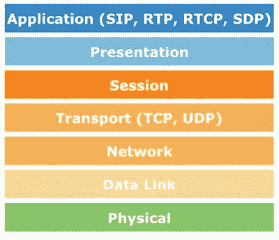
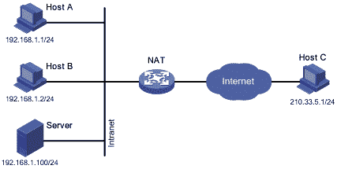
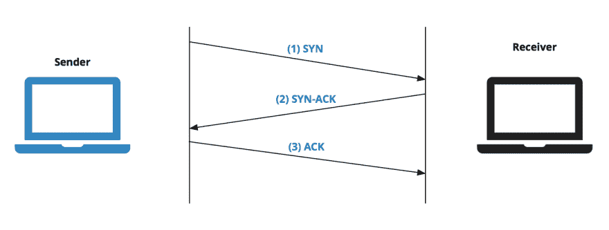
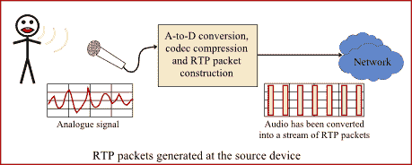
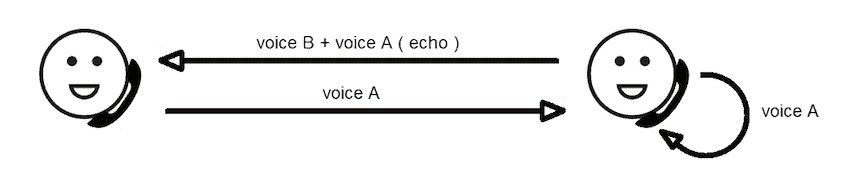
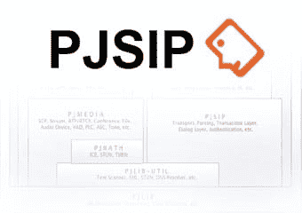
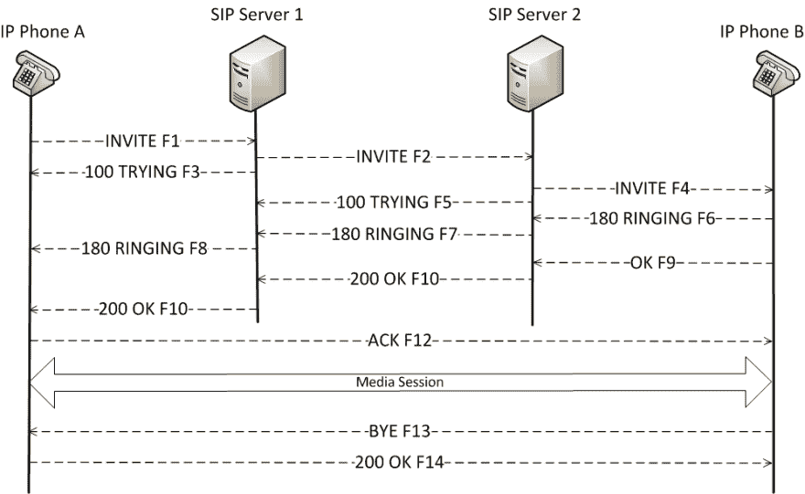
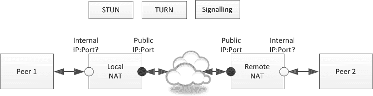
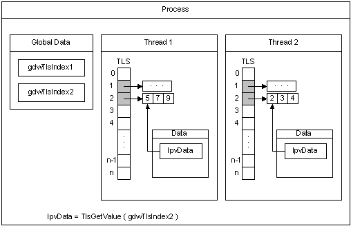
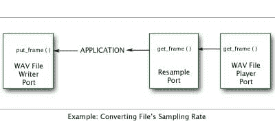

# 学习 VoIP、RTP 和 SIP(又名 awesome pjsip)

> 原文：<https://dev.to/onmyway133/learning-voip-rtp-and-sip-aka-awesome-pjsip-9d1>

# 学习 VoIP、RTP 和 SIP(又名牛逼 pjsip)

在使用 Windows Phone 和 iOS 之前，我的生活涉及研究 VoIP。那是为一个非常流行的应用程序建立一个语音 IP 功能的 C 库，这就是我如何开始开源的。

我工作的库是 [Linphone](https://www.linphone.org/) 和 [pjsip](http://pjsip.org/) 。我学到了很多 UDP 和 SIP 协议，如何在 iOS、Android 和 Windows Phone 中构建供消费的 C 库，在 Windows Phone 8 中支持 C++组件和线程池是多么具有挑战性，如何在 OpenSSL 中调整熵功能使其在 Windows Phone 8 中编译，用 Android NDK 调试 C 代码有多难。是时候需要同时打开 Visual Studio、Xcode 和 Eclipse IDE，加入[邮件列表](https://www.google.no/search?q=lists.pjsip.org+onmyway133&oq=lists.pjsip.org+onmyway133)，关注 [gmane](http://dir.gmane.org/gmane.comp.voip.pjsip) 了。很多美好的回忆。

今天我发现我做的那些书签在 Safari 上还能看到，所以我觉得应该在这里分享一下。我需要在许多文章过时或不再可用之前删除它们。这些是我实际阅读和使用的资源，而不是一些随机的链接。希望你能找到有用的东西。

这篇文章展示了客户端上 pjsip 的更多资源，以及如何在有/没有代理服务器的情况下直接对话。

## 首先

这里是我写的一些关于 VoIP 的文章和开放源码，希望对你有用

*   [rtpproxy](https://github.com/onmyway133/rtpproxy) :我从 http://www.rtpproxy.org/[分叉](http://www.rtpproxy.org/)，改代码使其支持 IP 切换。这意味着代理可以处理 IP 从 3G、4G 到 Wifi 的变化，并减少攻击的机会

*   [VoIP 中的抖动缓冲器](https://github.com/onmyway133/blog/issues/157)

*   [如何计算 VoIP 中的数据包大小](https://github.com/onmyway133/blog/issues/155)

## 网络电话概述

> **基于互联网协议的语音**(也称为**基于 IP 的语音**、 **VoIP** 或 **IP 电话**)是用于通过[互联网协议](https://en.wikipedia.org/wiki/Internet_Protocol) (IP)网络(例如[互联网](https://en.wikipedia.org/wiki/Internet))交付[语音通信](https://en.wikipedia.org/wiki/Voice_communication)和[多媒体](https://en.wikipedia.org/wiki/Multimedia)会话的方法和技术组

*   [IP 语音概述](http://toncar.cz/Tutorials/VoIP/index.html):VoIP 概念介绍，H.323 和 SIP 协议

*   [网络电话](https://en.wikipedia.org/wiki/Voice_over_IP)维基百科的文章包含非常基础的知识

*   [开源 VOIP 软件](https://www.voip-info.org/open-source-voip-software):这是必读的。许多关于客户端和服务器功能、SIP、TURN、RTP 和许多开源框架的基础文章

*   [VOIP 通话带宽](https://planetcalc.com/3144/):VOIP 应用中一个非常关键的因素是带宽消耗，最好不要超出可接受的极限

*   路由器 SIP ALG :这是最烦人的，因为有 NAT 和许多类型的 NAT，还有带 SIP ALG 的路由器

*   SIP 简单客户端软件开发工具包(SIP SIMPLE Client SDK):对 SIP 核心库的介绍，但它给出了如何

## 啜饮

> **会话发起协议** ( **SIP** )是[通信协议](https://en.wikipedia.org/wiki/Communications_protocol)，用于[网络电话](https://en.wikipedia.org/wiki/Internet_telephony)的语音和视频呼叫应用中的[信令](https://en.wikipedia.org/wiki/Signaling_(telecommunications))和控制多媒体[通信会话](https://en.wikipedia.org/wiki/Communication_session)，以及在[互联网协议](https://en.wikipedia.org/wiki/Internet_Protocol) (IP)网络上的[即时消息](https://en.wikipedia.org/wiki/Instant_messaging)。

[T2】](https://res.cloudinary.com/practicaldev/image/fetch/s--CCgTPZ2z--/c_limit%2Cf_auto%2Cfl_progressive%2Cq_auto%2Cw_880/https://cdn-images-1.medium.com/max/2000/0%2AQBmsgWtKc5q30xgb.jpeg)

*   [会话发起协议](https://en.wikipedia.org/wiki/Session_Initiation_Protocol)

*   [RFC 3261](https://www.ietf.org/rfc/rfc3261.txt) :要理解 SIP，我们需要阅读它的标准。这个 RFC 我不知道看了多少遍。

*   OpenSIPS 是一个多功能、多用途的信令 SIP 服务器

*   [SIP 协议结构通过一个例子](http://www.tech-invite.com/fo-sip/tinv-fo-sip-archi.html):这是一本必读的书，它展示了非常基本但必要的知识

*   [呼叫、对话、事务&消息](http://www.siptutorial.net/SIP/relation.html)之间的关系:呼叫、对话、事务和消息的基本概念

*   [microSIP](https://www.microsip.org) :基于 PJSIP 栈的 Windows 开源便携式 SIP 软电话。在为移动设备构建 pjsip 优化库之前，我曾用它来测试它

*   [什么是 SIP](https://code.google.com/archive/p/csipsimple/wikis/WhatIsSIP.wiki):csip simple 作者写的 SIP 介绍

*   [什么是 SIP 代理服务器](https://www.onsip.com/blog/sip-proxy-server)

*   [Wireshack 写的 SIP](https://wiki.wireshark.org/SIP):Wireshack 写的 SIP 介绍。我经常使用 Wireshack 来拦截和调试 SIP 会话

*   [解决 SIP 的防火墙/NAT 穿越问题](http://www.ingate.com/files/Solving_Firewall-NAT_Traversal.pdf):这展示了 NAT 如何成为 SIP 应用的一个问题，以及 NAT 穿越是如何工作的

*   [面向 Java、C#和 VB 开发人员的 SIP 简介](https://www.codeproject.com/Articles/97657/Introduction-to-SIP-for-Java-C-and-VB-Developers)

*   用 Javascript 编写的 SIP 客户端

*   SIP 重传:什么和如何处理重传

*   [draft-IETF-sipping-Dialog usage-06](https://tools.ietf.org/html/draft-ietf-sipping-dialogusage-06):这是一份关于会话发起协议中多种对话用法的草案

*   创建和发送邀请和取消 SIP 文本消息 : SIP 还支持发送文本消息，而不仅仅是音频和视频包。这是一个很好的聊天应用

## SIP 服务器

*   Kamailio :这是我用过的服务器，它可以很好地与许多标准 SIP 客户端兼容，包括 pjsip。在这台服务器上调试也是一个有趣的故事

[T2】](https://res.cloudinary.com/practicaldev/image/fetch/s--iNzoAuwB--/c_limit%2Cf_auto%2Cfl_progressive%2Cq_auto%2Cw_880/https://cdn-images-1.medium.com/max/2000/0%2A2bnrKUxdiJMuqO1D.png)

*   [使用 Kamailio 3.1 和 Rtpproxy 服务器配置 NAT 穿越](http://nil.uniza.sk/sip/nat-fw/configuring-nat-traversal-using-kamailio-31-and-rtpproxy-server):我不知道我已经读了这个帖子多少次了

*   [如何在 Windows 上设置和使用 SIP 服务器](http://www.thewindowsclub.com/set-up-sip-server-windows):我用这个测试了一个在 Windows 上工作的 SIP 服务器

*   [建立自己的网络电话系统](https://www.sipwise.org/news/technical/byov-system-spce-as-sbc/)

*   [OpenSIPS/Kamailio 服务远端 nat 穿越](https://puck.nether.net/pipermail/voiceops/2011-May/002512.html):讨论 Kamailio 如何应对 NAT 穿越

*   [NAT 穿越模块](http://kamailio.org/docs/modules/3.0.x/modules_k/nat_traversal.html):NAT 穿越如何在 Kamailio 中作为一个模块工作

## RFC

RTP、SIP 客户端和服务器需要符合一些预定义协议，以满足标准并能够彼此对话。除了需要阅读一些草稿，你还需要大量阅读 RFC。

*   RFC 3550 - RTP:实时应用的传输协议

*   [RFC 3261 - SIP:会话发起协议](https://tools.ietf.org/html/rfc3261)

*   [使用 STUN 的对称 NAT 穿越](https://tools.ietf.org/id/draft-takeda-symmetric-nat-traversal-00.txt)

*   [RFC 3842 -会话发起协议(SIP)](https://tools.ietf.org/html/rfc3842) 的消息摘要和消息等待指示事件包

## NAT

NAT 解决了缺少 IP 的问题，但是它给 SIP 应用程序带来了很多问题，对我也是如此😂

[T2】](https://res.cloudinary.com/practicaldev/image/fetch/s--DaHH5X16--/c_limit%2Cf_auto%2Cfl_progressive%2Cq_66%2Cw_880/https://cdn-images-1.medium.com/max/2000/0%2ACyseeMdKG6RWTsoM.gif)

*   [网络地址转换](https://en.wikipedia.org/wiki/Network_address_translation):网络地址转换(NAT)是一种将一个 IP 地址空间重新映射到另一个 IP 地址空间的方法，方法是在数据包通过流量路由设备传输时修改数据包 IP 报头中的网络地址信息

*   SIP 和 NAT:为什么会有问题？

*   [配置端口地址转换(PAT)](http://www.freeccnaworkbook.com/workbooks/ccna/configuring-port-address-translation-pat-many-to-one) :如何配置端口转发

*   [解释 NAT 的类型(端口受限 NAT 等)](http://www.think-like-a-computer.com/2011/09/16/types-of-nat/):这是必读内容。我没想到现实生活中有这么多种 NAT，以及每种 NAT 以自己的方式影响 SIP 应用程序

*   [单向音频 SIP 解决方案](http://www.think-like-a-computer.com/2011/03/14/one-way-audio-voip/):有时我们会遇到只有一个人可以说话的问题，这是为什么

*   [SIP 协议的 NAT 穿越](http://freshmeat.sourceforge.net/articles/nat-traversal-for-the-sip-protocol):解释 RTP、SIP 和 NAT

*   [UDP 和 TCP 中对称 NAT 穿越的新方法](http://www.goto.info.waseda.ac.jp/~wei/file/wei-apan-v10.pdf)

*   [SIP NAT 穿越](https://voipstudio.com/sip-nat-traversal/):这是必读。如何让 SIP 在 NAT 下工作

*   [用 STUN / TURN / ICE 穿越 NAT 和防火墙](http://www.viagenie.ca/publications/2008-09-24-astricon-stun-turn-ice.pdf) : pjsip 和 Kamailio 实际上支持 STUN、TURN 和 ICE 协议。了解这些概念以及如何让它发挥作用

*   [网络地址转换(NAT)和 NAT 穿越简介](http://www.pjsip.org/pjnath/docs/html/group__nat__intro.htm)

## TCP

了解 TCP 如何帮助 SIP 启动会话，并打开 TCP 模式发送数据包

[T2】](https://res.cloudinary.com/practicaldev/image/fetch/s--z6XZ_eVw--/c_limit%2Cf_auto%2Cfl_progressive%2Cq_auto%2Cw_880/https://cdn-images-1.medium.com/max/2826/0%2AOKLXqTzL1z4-OhZO.png)

*   [传输控制协议](https://en.wikipedia.org/wiki/Transmission_Control_Protocol):传输控制协议(TCP)是互联网协议族的主要协议之一。它起源于最初的网络实施，其中它补充了互联网协议(IP)

*   [数据报套接字](https://en.wikipedia.org/wiki/Network_socket#Datagram_socket):数据报套接字是一种网络套接字，为发送或接收数据包提供无连接点。[2]在数据报套接字上发送或接收的每个数据包都被单独寻址和路由

*   [TCP RST 数据包详情](https://stackoverflow.com/questions/7735618/tcp-rst-packet-details):了解 RST 位的重要性

*   [当 TCP 连接未正常关闭时，应用程序发送的 RST 数据包](https://stackoverflow.com/questions/11410754/rst-packet-sent-from-application-when-tcp-connection-not-getting-closed-properly?rq=1)

*   [为什么 TCP 服务器在接受连接后会立即发送 FIN？](https://stackoverflow.com/questions/3870260/why-will-a-tcp-server-send-a-fin-immediately-after-accepting-a-connection)

*   [重置从何而来？(不，鹳鸟没有带来它们。)](https://blogs.technet.microsoft.com/networking/2009/08/12/where-do-resets-come-from-no-the-stork-does-not-bring-them/):了解 TCP 连接中的 3 种握手方式

*   [TCP listen()积压](http://www.linuxjournal.com/files/linuxjournal.com/linuxjournal/articles/023/2333/2333s2.html)

*   [插座和端口](http://www.freesoft.org/CIE/Course/Section4/6.htm):不要混淆插座和端口

*   [TCP 唤醒:减少移动 IPv4 和 IPsec NAT 穿越中的保活流量](http://www.pasieronen.com/publications/NRCTR2008002.pdf)

*   [仅使用 tcp 注册失败](https://code.google.com/archive/p/csipsimple/issues/1582)

*   [TCP vs UDP](https://code.google.com/archive/p/csipsimple/issues/705)

## TLS

了解[传输层安全性](https://en.wikipedia.org/wiki/Transport_Layer_Security)和 SSL，尤其是 openSSL 如何保护 SIP 连接。有趣的是阅读 pjsip 中的代码，了解它如何使用 openSSL 来加密消息

*   [用 TLS 配置 PJSIP】](https://trac.pjsip.org/repos/wiki/TLS)

*   [为什么为 SIP 选择 TLS](https://stackoverflow.com/questions/8178963/why-tls-for-sip)

*   [通过 TLS 的 SIP 信令](http://excelsupport.dialogic.com/imgpubs/webhelp/sip_over_tls_ov.htm)

*   [SSL/TLS 证书:您需要了解的内容](https://www.techrepublic.com/blog/data-center/ssl-tls-certificates-what-you-need-to-know/)

*   [在 Kamailio 3.1 中配置 TLS 支持— Howto](http://nil.uniza.sk/network-security/tls/configuring-tls-support-kamailio-31-howto) :了解如何在 Kamailio 中启用 TLS 模式

*   [SIP TLS](https://www.voip-info.org/sip-tls) :如何在 Asterisk 中配置 TLS

## 冰

了解另一种解决 NAT 的方法[交互式连接建立](https://en.wikipedia.org/wiki/Interactive_Connectivity_Establishment)

*   [SIP 2012:: ICE —媒体 NAT 穿越](https://www.slideshare.net/oej/sip-2012-ice-nat-traversal-for-media)

*   [介绍 pjnath —开源 ICE、STUN 和 TURN 进行 NAT 穿越](https://blog.pjsip.org/2007/04/06/introducing-pjnath-open-source-ice-stun-and-turn/)

*   [冰介质运输](http://www.pjsip.org/pjmedia/docs/html/group__PJMEDIA__TRANSPORT__ICE.htm)

## 击晕并转身

了解用于 NAT 的[会话遍历实用程序和使用 NAT](https://en.wikipedia.org/wiki/STUN) 周围中继的[遍历，这是另一种解决 NAT 的方法](https://en.wikipedia.org/wiki/Traversal_Using_Relays_around_NAT)

*   STUN(UDP 通过 NAT 的简单遍历(网络地址转换))是一种协议，用于帮助 NAT 防火墙或路由器后面的设备进行数据包路由。RFC 5389 将术语 STUN 重新定义为“NAT 的会话遍历实用程序”。

*   什么是 STUN，它需要端口转发服务器吗？

*   [转服务器](http://turnserver.sourceforge.net)

## ALG

了解[应用层网关](http://Application%20Layer%20Gateway)及其如何影响您的 SIP 应用。该组件知道如何处理和修改您的 SIP 消息，因此它可能会引入意外的行为。

*   什么是 SIP ALG，为什么 Gradwell 建议我关闭它？

*   [了解 SIP 算法](https://www.juniper.net/documentation/software/junos-security/junos-security95/junos-security-swconfig-security/sip-alg-understanding.html)

*   [什么是 Sip ALG(应用层网关)Voip 防火墙](http://www.voiptuts.com/2011/02/what-is-sip-alg-application-layer.html)

*   [关于 SIP ALG](http://www.watchguard.com/help/docs/wsm/11/en-us/content/en-us/proxies/sip/sip_proxy_about_c.html)

*   [了解带网络地址转换(NAT)的 SIP](https://www.juniper.net/documentation/software/junos-security/junos-security96/junos-security-swconfig-security/id-60290.html):这是一份必读的、非常全面的文档

## 语音质量

了解音频中的语音质量、带宽和固定延迟

[T2】](https://res.cloudinary.com/practicaldev/image/fetch/s--ZMB8aIVM--/c_limit%2Cf_auto%2Cfl_progressive%2Cq_auto%2Cw_880/https://cdn-images-1.medium.com/max/2000/1%2AGst1j53g8PaqkBuP6RbZZg.png)

*   [VoIP —固定语音质量](https://www.voipmechanic.com/phoneandvoicequality_2.htm)

*   [什么是 VoIP 中的延迟？](https://www.lifewire.com/delay-in-voip-3426312)

*   [了解分组语音网络中的延迟](https://www.cisco.com/c/en/us/support/docs/voice/voice-quality/5125-delay-details.html)

*   [减少 VoIP 中 SIP 数据包的大小](https://hubpages.com/technology/Reducing-the-SIP-Packet-Size-in-VoIP)

*   [什么会影响 VoIP 通话的语音质量](https://www.lifewire.com/what-affects-voice-quality-in-voip-calls-3426724)

*   【VoIP 通话质量差的 5 个可治愈原因

*   [VoIP 中的 RTP、抖动和音频质量](https://kb.smartvox.co.uk/voip-sip/rtp-jitter-audio-quality-voip/):了解抖动和 RTP 的重要性

*   [基于 SIP 的 VoIP 的自适应编解码器切换方案](https://www.comsys.rwth-aachen.de/fileadmin/papers/2012/2012-aktas-new2an-codecswitching.pdf):解释基于 SIP 的 VoIP 中呼叫期间的编解码器切换

*   [如何掌握 VoIP 带宽基础知识](https://searchunifiedcommunications.techtarget.com/tutorial/VoIP-bandwidth-fundamentals)

*   [IP 语音—每次通话的带宽消耗](https://www.cisco.com/c/en/us/support/docs/voice/voice-quality/7934-bwidth-consume.html)

## 呼应

这是 VoIP 中一个很常见的问题，有时我们会听到对方和自己的声音。了解回声是如何产生的，以及如何有效地消除回声

[T2】](https://res.cloudinary.com/practicaldev/image/fetch/s--BqlCVp_8--/c_limit%2Cf_auto%2Cfl_progressive%2Cq_auto%2Cw_880/https://cdn-images-1.medium.com/max/2000/0%2AGyZHcz0TKL_UHdYJ.png)

*   [IP 语音的回声分析](https://www.cisco.com/c/en/us/td/docs/ios/solutions_docs/voip_solutions/EA_ISD.html)

*   [回声消除](https://www.speex.org/docs/manual/speex-manual/node7.html#SECTION00740000000000000000):如何使用 Speex 消除回声

*   [回声抑制和消除](https://en.wikipedia.org/wiki/Echo_suppression_and_cancellation)

*   回声和侧音:电话是一种双工设备，这意味着它在同一对电线上发送和接收信号。电话网络必须确保不会有太多呼叫者的声音反馈到他或她的接收器中

*   [VoIP 回声及如何纠正](https://www.voipmechanic.com/echo-technical.htm)

*   [回声的原因](https://www.voip-info.org/causes-of-echo)

*   软件回声消除器是如何工作的？:我问的是我们如何使用软件来消除回声

## 双音

学习如何产生双音，使电信信号

*   [DTMF(双音多频)](https://www.mediacollege.com/audio/tone/dtmf.html)

*   [DTMF 之舞，SIP & RFC 2833 —简介](https://www.3cx.com/blog/voip-howto/dtmf-rfc2833/)

*   如何发送带内双音多频音？

## pjsip

> PJSIP 是一个免费的开源多媒体通信库，用 C 语言编写，实现了基于标准的协议，如 SIP、SDP、RTP、STUN、TURN 和 ICE。它将信令协议(SIP)与丰富的多媒体框架和 NAT 穿越功能结合到高级 API 中，该 API 是可移植的，适用于从桌面、嵌入式系统到移动手机的几乎任何类型的系统。

[T2】](https://res.cloudinary.com/practicaldev/image/fetch/s---yWn882r--/c_limit%2Cf_auto%2Cfl_progressive%2Cq_auto%2Cw_880/https://cdn-images-1.medium.com/max/2000/0%2AE82pcZW_6lhy8l1H.jpg)

*   [PJSUA API —高级软电话 API](http://www.pjsip.org/pjsip/docs/html/group__PJSUA__LIB.htm):pj sip 的高级使用

*   [pjsip 库架构](https://www.scribd.com/document/55939030/Suresh-Report-Voip1)

*   [pjsip 文件](https://trac.pjsip.org/repos/)

[T2】](https://res.cloudinary.com/practicaldev/image/fetch/s--bXhTO5ZE--/c_limit%2Cf_auto%2Cfl_progressive%2Cq_auto%2Cw_880/https://cdn-images-1.medium.com/max/2000/0%2Ae4Lr7TxJlSdQhA-b.png)

*   [有状态操作](http://www.pjsip.org/pjsip/docs/html/group__PJSIP__TRANSACT__UTIL.htm):有状态发送请求的常用函数

*   [消息创建和无状态操作](http://www.pjsip.org/pjsip/docs/html/group__PJSIP__ENDPT__STATELESS.htm):与发送和接收消息相关的功能

*   [了解媒体流](https://trac.pjsip.org/repos/wiki/media-flow#IncomingRTPRTCPPackets):这是必读。媒体层非常重要，它控制声音、编解码器和会议桥。

[T2】](https://res.cloudinary.com/practicaldev/image/fetch/s--0YGj9nya--/c_limit%2Cf_auto%2Cfl_progressive%2Cq_auto%2Cw_880/https://cdn-images-1.medium.com/max/2000/1%2AoEs7lMDuaSG-En-R7ig-og.png)

*   [入门:构建和使用 PJSIP 和 PJMEDIA](http://www.pjsip.org/using.htm) :本文描述了如何下载、定制、构建和使用开源的 PJSIP 和 PJMEDIA SIP 和媒体堆栈

*   [编解码器框架](http://www.pjsip.org/pjmedia/docs/html/group__PJMEDIA__CODEC.htm) : pjsip 支持多种编解码器

*   自适应抖动缓冲区:这需要一些时间来理解，但它在使 pjsip 在缓冲区处理方面正常工作中起着重要的作用

*   [PJSUA-API 账户管理](http://www.pjsip.org/pjsip/docs/html/group__PJSUA__LIB__ACC.htm):如何在 PJSUA 中注册账户

*   [构建动态链接库(DLL/DSO)](http://www.pjsip.org/pjlib/docs/html/group__pj__dll__target.htm) :如何将 pjsip 构建为动态库

*   [编译时配置](http://www.pjsip.org/pjmedia/docs/html/group__PJMEDIA__CONFIG.htm):我们可以将许多配置应用到 pjsip

*   [快速内存池](http://www.pjsip.org/pjlib/docs/html/group__PJ__POOL__GROUP.htm) : pjsip 有自己的内存池。查看源代码并学习新的东西是非常有趣的

*   [SIP 和媒体功能](http://www.pjsip.org/sip_media_features.htm)

*   [使用 SIP TCP 传输](https://trac.pjsip.org/repos/wiki/Using_SIP_TCP):如何在 SIP 中启用 TCP 模式并发起 SIP 会话

*   [单声道和多声道音频帧转换器](http://www.pjsip.org/pjmedia/docs/html/group__PJMEDIA__STEREO.htm):关于单声道和多声道的有趣阅读

*   IOQueue:使用 Proactor 模式的 I/O 事件分派:它的代码非常有趣，是 pjsip 处理事件的基础

*   [DNS 异步/缓存解析引擎](http://www.pjsip.org/pjlib-util/docs/html/group__PJ__DNS__RESOLVER.htm):pjsip 如何自行处理 DNS 解析

[T2】](https://res.cloudinary.com/practicaldev/image/fetch/s--nteNahaT--/c_limit%2Cf_auto%2Cfl_progressive%2Cq_auto%2Cw_880/https://cdn-images-1.medium.com/max/2000/0%2AVBotMl-b9232q1JL.png)

*   安全套接字 I/O:如果你想学习如何在幕后使用 SSL，这里的代码很重要

*   [多频音发生器](http://www.pjsip.org/pjmedia/docs/html/group__PJMEDIA__MF__DTMF__TONE__GENERATOR.htm):我了解了很多 pjsip 是如何利用正弦波来产生音调的

*   [SIP SRV 服务器解析(RFC 3263 —定位 SIP 服务器)](http://www.pjsip.org/pjsip/docs/html/group__PJSIP__RESOLVE.htm):了解 pjsip 如何找到特定 SIP 服务器的机制

*   [异常处理](http://www.pjsip.org/pjlib/docs/html/group__PJ__EXCEPT.htm):如何在 C 中进行 Try Catch

*   互斥锁在 PJSUA-LIB 中的顺序:每一层的多重锁如何帮助确保正确性和避免死锁。我有很多用 pjsip 调试死锁的噩梦😱

## 穿线

pjsip 使用[本地线程存储](https://en.wikipedia.org/wiki/Thread-local_storage)，这引入了非常酷的行为

[T2】](https://res.cloudinary.com/practicaldev/image/fetch/s--kdbsLJpm--/c_limit%2Cf_auto%2Cfl_progressive%2Cq_auto%2Cw_880/https://cdn-images-1.medium.com/max/2000/0%2ArD0iy3joZsBXsMYo.png)

*   [线程——依赖于操作系统的功能](http://www.pjsip.org/pjlib/docs/html/group__PJ__THREAD.htm)

*   [线程问题](http://lists.pjsip.org/pipermail/pjsip_lists.pjsip.org/2009-April/006997.html):pjlib 如何处理线程

*   [使用线程本地存储](https://msdn.microsoft.com/en-us/library/windows/desktop/ms686991(v=vs.85).aspx):如何在 Windows 中使用 TlsAlloc 和 TlsFree

*   [Windows 进程和线程 8](http://www.installsetupconfig.com/win32programming/windowsthreadsprocessapis7_7.html)

*   [示例:Pthread 程序中的线程本地存储](https://www.ibm.com/support/knowledgecenter/ssw_ibm_i_61/rzahw/rzahwex1.htm):Pthread 如何工作

*   [线程本地存储](http://www.pjsip.org/pjlib/docs/html/group__PJ__TLS.htm):了解 pj_thread

## 重采样

如何处理媒体流的采样速率

[T2】](https://res.cloudinary.com/practicaldev/image/fetch/s--Xbll0liW--/c_limit%2Cf_auto%2Cfl_progressive%2Cq_auto%2Cw_880/https://cdn-images-1.medium.com/max/2000/0%2ADkP_SZQGZaSdvZAF.jpg)

*   [重采样端口](http://www.pjsip.org/pjmedia/docs/html/group__PJMEDIA__RESAMPLE__PORT.htm):如何在 pjmedia 中进行重采样

*   重采样算法:执行重采样的代码

*   [Samples:使用重采样端口](http://www.pjsip.org/pjmedia/docs/html/page_pjmedia_samples_resampleplay_c.htm):改变媒体流采样率的非常简单的例子

## 记忆和表现

*   [内存分配策略](http://comments.gmane.org/gmane.comp.voip.pjsip/14219)

*   [PJSIP —高性能开源 SIP 堆栈](http://www.pjsip.org/high-performance-sip.htm)

## 音频

*   [如何用 pjsua 录制音频](https://trac.pjsip.org/repos/wiki/audio-how-to-record):如何用 pjsua 录制音频。

*   [基于内存/缓冲区的捕获端口](http://www.pjsip.org/pjmedia/docs/html/group__PJMEDIA__MEM__CAPTURE.htm):相信我，你会跳到 pjmedia_mem_capture_create 一大堆

*   [文件写入器(记录器)](http://www.pjsip.org/pjmedia/docs/html/group__PJMEDIA__FILE__REC.htm):记录音频到。wav 文件

*   [使用 pjsua 创建 mp3 流](http://lists.pjsip.org/pipermail/pjsip_lists.pjsip.org/2008-February/001838.html)

*   [AMR 音频编码](https://www.codeproject.com/Articles/332109/AMR-Audio-Encoding):理解 AMR 编码

*   [音频设备 API](http://www.pjsip.org/pjmedia/docs/html/group__audio__device__api.htm):pjsip 如何检测和使用音频设备

*   [声音设备端口](http://www.pjsip.org/pjmedia/docs/html/group__PJMED__SND__PORT.htm):声音设备的媒体端口连接抽象

*   [音频突发](http://lists.pjsip.org/pipermail/pjsip_lists.pjsip.org/2009-December/009719.html)

*   [缓冲问题](http://comments.gmane.org/gmane.comp.voip.pjsip/11623)

*   【PJMEDIA 的播放回调问题

*   [音频操作算法](http://www.pjsip.org/pjmedia/docs/html/group__PJMEDIA__FRAME__OP.htm):很多用 C 写的很酷的音频操作算法。最难也是最重要的一个可能是[自适应抖动缓冲器](http://www.pjsip.org/pjmedia/docs/html/group__PJMED__JBUF.htm)

*   运行操作系统 3.0 的 iphone 2G 质量差:现在没人会用 iPhone 2G，但是知道老手机是好的

*   [得到下溢，buf_cnt=0，将连续生成 1 帧](http://lists.pjsip.org/pipermail/pjsip_lists.pjsip.org/2009-April/007265.html):如何处理 pjmedia 中的下溢

*   [测量声音延迟](https://trac.pjsip.org/repos/wiki/MeasuringSoundLatency):这篇文章描述了如何测量 pjsua 的声音设备延迟和整体(端到端)延迟

*   [检查输入 RTP 包的网络损伤](https://trac.pjsip.org/repos/wiki/audio-check-packet-loss)

*   [Master/sound](http://lists.pjsip.org/pipermail/pjsip_lists.pjsip.org/2013-January/015647.html):Master sound 如何工作以及如何处理麦克风输入端口没有声音

## 视频

我学到了很多关于视频捕捉、ffmpeg 和色彩空间的知识，尤其是 YUV

*   siphon—video support . wiki:siphon 在 pjsip 2.0 之前是如何处理视频的

*   [视频设备 API](http://www.pjsip.org/pjmedia/docs/html/group__video__device__api.htm)；PJMEDIA 视频设备 API 是一个跨平台的视频 API，适用于 VoIP 应用程序和许多其他类型的视频流应用程序。

*   [PJSUA-API Video](http://www.pjsip.org/pjsip/docs/html/group__PJSUA__LIB__VIDEO.htm) :在 pjsip 2.1.0 的 PJSUA 中使用视频 API

*   [PJSIP 视频用户指南](https://trac.pjsip.org/repos/wiki/Video_Users_Guide):关于 PJSIP 中的视频支持，你需要知道的一切

*   [视频流](http://www.pjsip.org/pjmedia/docs/html/group__PJMED__VID__STRM.htm):我永远也忘不了 pjmedia_vid_stream_create

*   [视频源复制器](http://www.pjsip.org/pjmedia/docs/html/group__PJMEDIA__VID__TEE.htm):复制流中的视频数据。

*   [AVI 文件播放器](http://www.pjsip.org/pjmedia/docs/html/group__PJMEDIA__FILE__PLAY.htm):播放 AVI 文件的视频和音频

*   [PJSIP 2.0 版本发布说明](https://trac.pjsip.org/repos/wiki/ReleaseNotes-2.0):从 2.0 开始，PJSIP 支持视频。值得一读

*   [pj SUA-LIB 的视频 API](https://trac.pjsip.org/repos/ticket/1263)

*   [如何使用 AVI 文件进行环回视频通话？](http://lists.pjsip.org/pipermail/pjsip_lists.pjsip.org/2012-July/014959.html)

*   [ffmpeg 程序员用 lib Swscale 做什么？](https://stackoverflow.com/questions/3367187/what-is-lib-swscale-used-for-by-ffmpeg-programers)

*   [FFmpeg-iOS-build-script](https://github.com/dmcrodrigues/FFmpeg-iOS-build-script) :详细介绍如何为 iOS 构建 FFmpeg

## 芯片实例

手机和桌面的 SIP 客户端有很多， [microSIP](https://www.microsip.org/) ， [Jitsi](https://jitsi.org/) ， [Linphone](https://www.linphone.org/technical-corner/linphone/overview) ， [Doubango](https://www.doubango.org/) ，…它们都严格遵循 SIP 标准，可能有自己的 SIP 核心，例如 microSIP 使用 pjsip，Linphone 使用 liblinphone，…

其中，我从 Android 客户端 [CSipSimple](https://code.google.com/archive/p/csipsimple/) 学到了很多，它提供了非常好的界面和良好的功能。不幸的是[谷歌代码被关闭](https://github.com/r3gis3r/CSipSimple/issues/6)，所以我不知道作者是否有计划在 GitHub 上做开发。

我也在谷歌论坛上为[用户](https://groups.google.com/forum/#!searchin/csipsimple-users/onmyway133%7Csort:date)和[开发者](https://groups.google.com/forum/#!searchin/csipsimple-dev/onmyway133%7Csort:date)参与了很多。感谢 Regis，我学到了很多关于开源的知识，这让我对开源产生了兴趣。

你可以阅读[什么是品牌版本](https://groups.google.com/forum/#!topic/csipsimple-dev/ihZN8s_-g_4)

> 我根本不从 csipsimple 赚钱。这是一个纯粹的开源和免费的语音项目。我在业余时间开发它，只是为了让用户受益。
> 这就是这个项目在 GPL 许可条款下发布的原因。我建议你仔细阅读许可证(你会学到很多关于许可证和项目精神的东西):【http://www.gnu.org/licenses/gpl.html
> T2】总而言之，GPL 的精神是用户应该总是被允许看到他们使用的软件的源代码，以他们想要的方式使用它并重新发布它。

## RTP 代理

因为 NAT 或者万一用户想通过代理说话，那么就需要一个 [RTP 代理](http://www.rtpproxy.org/)。RTPProxy 遵循标准，与 Kamailio 配合良好

*   [使 RTPproxy 工作](https://saevolgo.blogspot.no/2012/03/making-rtpproxy-work.html)

*   [Sippy B2BUA 和 RFC3261 SIP 堆栈](https://sourceforge.net/p/sippy/rtpproxy/ci/master/tree/)

*   [rtpproxy(8) — Linux 手册页](https://linux.die.net/man/8/rtpproxy)

*   [RTP 代理地址填充](https://lists.kamailio.org//pipermail/sr-users/2008-April/062814.html)

## 其他相关文章

*   [采样率和比特率:数字音频的内脏](https://thestereobus.com/2008/01/12/sample-rate-and-bitrate-the-guts-of-digital-audio/)

*   [VoIP 数据包大小](http://webcache.googleusercontent.com/search?q=cache:http://www.techexams.net/forums/ccnp/48768-voip-packet-size.html)

*   [如何测量 rtp 流消耗的品牌价值？](https://lists.freedesktop.org/archives/gstreamer-devel/2012-August/036865.html)

*   [发送可靠的临时响应](https://docs.microsoft.com/en-us/previous-versions/office/developer/communication-server-2007/bb759215(v=office.12))

*   [SILK 音频编解码器包装器实现](https://trac.pjsip.org/repos/ticket/1586)

*   [会议桥问题](http://lists.pjsip.org/pipermail/pjsip_lists.pjsip.org/2008-July/003843.html)

*   [多种音频设备、多种通话、会议、录音以及上述所有功能的混合](http://lists.pjsip.org/pipermail/pjsip_lists.pjsip.org/2012-January/014037.html)

*   [如何知道线下通话](http://lists.pjsip.org/pipermail/pjsip_lists.pjsip.org/2010-January/010089.html)

*   [对称 RTP](http://lists.pjsip.org/pipermail/pjsip_lists.pjsip.org/2008-May/002857.html)

*   [账户特定的 NAT 设置:眩晕、ICE 和 TURN](https://trac.pjsip.org/repos/ticket/1412)

*   [SIP 故事，第 3 部分:邀请转发](https://technfun.wordpress.com/2008/11/06/sip-stories-part-3-invite-retransmission/)

*   [TCP/TLS 重新连接](http://lists.pjsip.org/pipermail/pjsip_lists.pjsip.org/2010-February/010329.html)

*   [配置 TCP 保持活动和连接寿命](https://lists.kamailio.org//pipermail/sr-users/2010-May/063880.html)

*   [最大 TCP 连接数](http://lists.opensips.org/pipermail/users/2012-September/023057.html)

*   [VAD 检测场景](http://comments.gmane.org/gmane.comp.voip.pjsip/836)

*   [处理原生捕获预览](https://trac.pjsip.org/repos/ticket/1340)

*   [视频定向支持](https://trac.pjsip.org/repos/ticket/1360)

*   [TCP 和 TLS 传输的保活机制](https://trac.pjsip.org/repos/ticket/95)

*   [在静默状态下周期性发送 RTP 包](https://trac.pjsip.org/repos/ticket/56)

*   [当电平为零时，会议桥应发送静音帧](https://trac.pjsip.org/repos/ticket/87)

*   [给媒体流添加用户自定义的 NAT 打孔和保活机制](https://trac.pjsip.org/repos/ticket/883)

## IP 变更

通话过程中 IP 变更可能会导致问题，例如当用户从 Wifi 模式切换到 4G 模式时

*   [Android 中处理 Ip 地址变更的正确方法](http://comments.gmane.org/gmane.comp.voip.pjsip/16134)

*   [同时支持 WiFi 和 3G](https://code.google.com/archive/p/csipsimple/issues/1423)

## RTP 和 RTCP

了解[实时传输控制协议](http://Real-time%20Transport%20Protocol)以及它如何与 RTP 一起工作

*   [IP 语音:RTP/RTCP——传输层](http://disi.unitn.it/locigno/didattica/AdNet/10-11/05-5_VoIP-RTP_H.pdf)

*   [RTCP，RTP 控制协议](http://www.networksorcery.com/enp/protocol/rtcp.htm)

*   [协议概述:RTP 和 RTCP](http://www.netlab.tkk.fi/opetus/s38130/k99/presentations/4.pdf)

*   [多媒体控制协议 RTCP](http://www.cs.odu.edu/~cs778/jeffay/Lecture6.pdf)

*   [使用会议桥](http://www.pjsip.org/pjmedia/docs/html/page_pjmedia_samples_confsample_c.htm)

*   [SIP 和 RTP 堆栈](http://docs.huihoo.com/telecom/sip_rtp_stack.html)

*   [媒体传输](http://www.pjsip.org/pjmedia/docs/html/group__PJMEDIA__TRANSPORT.htm)

*   [RTP 会话和封装(RFC 3550)](http://www.pjsip.org/pjmedia/docs/html/group__PJMED__RTP.htm)

## 编解码器

为了减少有效载荷的大小，我们需要对音频和视频包进行编码和解码。我们通常用 [Speex](https://www.speex.org/) 和 [Opus](https://opus-codec.org/) 。此外，理解。wav 格式

*   [数字音频—创建 WAV (RIFF)文件](http://www.topherlee.com/software/pcm-tut-wavformat.html)

*   [从 WAV 文件流式传输数据](https://docs.microsoft.com/en-us/previous-versions/windows/xna/ff827591(v=xnagamestudio.41))

*   [用 Speex(libspeex API)编程](https://www.speex.org/docs/manual/speex-manual/node7.html)

*   [Speex 窄带模式](https://www.speex.org/docs/manual/speex-manual/node10.html)

*   [用 libopus (API 参考)开发](http://www.opus-codec.org/docs/)

## 为 Windows Phone 8 构建 pjsip

Windows Phone 8 引入 C++组件，线程、VoIP 和音频背景模式的变化。为此，我需要找到另一个线程池组件，并对 openSSL 进行一些调整，使其能够在 Windows Phone 8 上编译。我丢失了源代码，所以无法将代码上传到 GitHub😢。此外，由于诺基亚不在这里，许多环节都中断了

*   [建造其他平台](https://trac.pjsip.org/repos/wiki/Getting-Started/Other-Platforms)

*   [入门:为 UWP 和 Windows Phone 8.x 构建](https://trac.pjsip.org/repos/wiki/Getting-Started/Windows-Phone)

*   [移植到新的 CPU 架构](http://www.pjsip.org/docs/latest/pjlib/docs/html/porting_pjlib_pg.htm) : pjlib 是 pjsip 的基础。了解如何将其移植到另一个平台

*   【Windows Phone 8 的 VoIP 应用

*   [如何在 Windows Phone 8 上实现 VoIP 通话的音频流](https://docs.microsoft.com/en-us/previous-versions/windows/desktop/apps/jj207046(v=vs.105))

*   [进程内、进程外和远程服务器](http://docs.embarcadero.com/products/rad_studio/delphiAndcpp2009/HelpUpdate2/EN/html/devwin32/oocinprocessoutofprocessandremoteservers_xml.html)

*   [IDL 文件的基础知识](https://www.codeproject.com/Articles/19605/Basics-of-an-IDL-file)

## 将 OpenSSL 移植到 Windows Phone 8

首先，学习如何编译，使用 OpenSSL。如何从 pjsip 调用，如何在 Windows Phone 8 的 Visual Studio 中使其编译。我也学到了 Winsock 的重要性，如何移植一个库。我在将 openSSL 移植到 Windows RT，然后移植到 Windows Phone 8 的过程中挣扎了很久

很多环节都被打破了😢所以不能全贴在这里。

*   [OpenSSL 编程简介](https://www.linuxjournal.com/article/4822)

*   [Windows Phone 中的 SSL 套接字支持](https://mikaelkoskinen.net/post/ssl-socket-support-in-windows-phone)

*   [构建安全的 Windows Phone 8 应用——API 和技术](http://www.markarteaga.com/building-secure-windows-phone-8-apps-apis-and-techniques/)

*   Windows Phone 8 上有 Winsock 吗？

*   [为什么我不能使用开源 openssl 库](https://social.msdn.microsoft.com/Forums/windowsapps/en-US/2662cac1-fbb6-4ac4-8553-06375d798720/why-i-am-not-been-able-to-use-all-the-header-files-egsslh-under-open-source-openssl-library-)下的所有头文件(如- > ssl.h)

*   【Winsock 入门

*   [为 Visual Studio 构建 OpenSSL】](http://developer.covenanteyes.com/building-openssl-for-visual-studio/)

*   [如何为 Visual Studio 2010/2012 编译 OpenSSL】](http://eran.geek.co.il/wp/archives/3897)

*   【Windows 版 OpenSSL】

*   【Windows RT 的 OpenSSL】

*   [2911:增强请求:Windows RT 支持](https://rt.openssl.org/Ticket/Display.html?id=2911&user=guest&pass=guest)

*   [需要一个用于 c++的快速随机生成器](https://stackoverflow.com/questions/1640258/need-a-fast-random-generator-for-c)

*   [windows C/c++加密 API 示例和提示](https://stackoverflow.com/questions/4796590/window-c-c-crypto-api-examples-and-tips)

*   [CryptGenRandom 函数](https://msdn.microsoft.com/en-us/library/windows/desktop/aa379942(v=vs.85).aspx)

*   EGD:熵收集守护进程

## C 和 C++

由于 pjsip、rtpproxy 和 kamailio 都是 C 和 C++代码。我需要很好地理解它们，尤其是指针和内存处理。我们还需要了解调试和发布版本的编译标志，如何使用 Make，如何创建静态和动态库。

*   [C 和 C++中的 const 指针对指针是什么意思？](https://stackoverflow.com/questions/336585/what-does-a-const-pointer-to-pointer-mean-in-c-and-in-c)

*   常见问题解答:关于 C 有很多我们不知道的事情

*   [什么是外部联动和内部联动？](https://stackoverflow.com/questions/1358400/what-is-external-linkage-and-internal-linkage)

*   [Bit Twiddling Hacks](http://graphics.stanford.edu/~seander/bithacks.html) :如何用 Bit 操作符应用巧妙的 Hacks。非常非常好的读物

*   [c++ 11 中更好的类型——null ptr、enum 类(强类型枚举)和 cstdint](https://www.cprogramming.com/c++11/c++11-nullptr-strongly-typed-enum-class.html)

*   [微软 Visual C++静态和动态库](https://www.codeproject.com/Articles/85391/Microsoft-Visual-C-Static-and-Dynamic-Libraries)

*   [托管 C++ —通过实例学习](https://www.codeproject.com/Articles/11634/Managed-C-Learn-by-Example-Part-1)

*   [预处理指令](http://www.cplusplus.com/doc/tutorial/preprocessor/)

支持我的应用程序

*   [推送 Hero -测试推送通知的纯 Swift 原生 macOS 应用](https://onmyway133.com/pushhero)
*   [PastePal -粘贴板、便笺和快捷方式管理器](https://onmyway133.com/pastepal)
*   [快速检查-智能待办事项管理器](https://onmyway133.com/quickcheck)
*   [Alias - App 和文件快捷方式管理器](https://onmyway133.com/alias)
*   [我的其他应用](https://onmyway133.com/apps/)

❤️❤️😇😍🤘❤️❤️