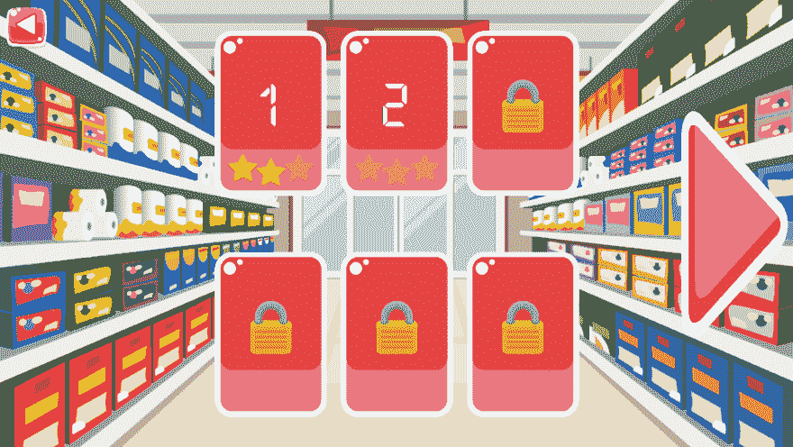
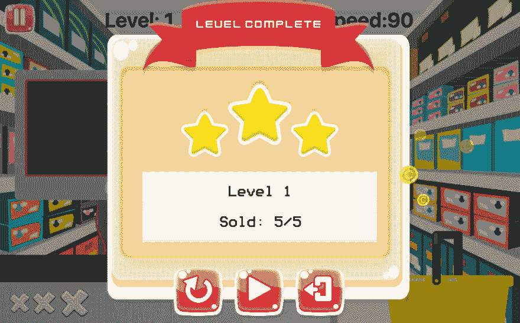
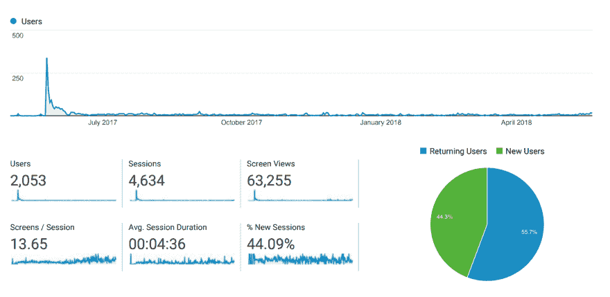
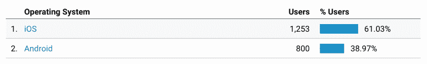
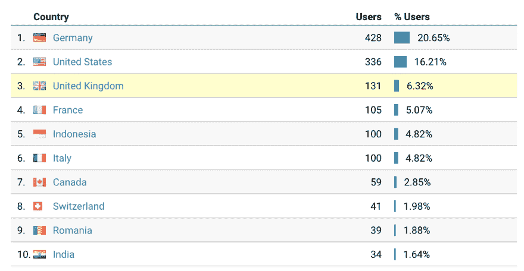
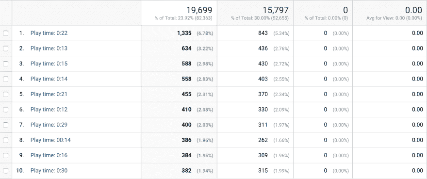

# 经验教训:我的第一款智能手机游戏

> 原文：<https://dev.to/mokkapps/lessons-learned-my-first-smartphone-game-591o>

2017 年，我发布了我的第一款智能手机游戏《超市挑战赛》,适用于 [iOS]((https://itunes.apple.com/de/app/supermarket-challenge/id1207665675)) 和 [Android](https://play.google.com/store/apps/details?id=de.mokkapps.supermarketchallenge) 。我在游戏开发过程中学到了很多东西，想和大家分享一下我的经验。

# 我为什么要开发一款游戏

我从小就喜欢玩电子游戏。此外，几年前我开始了我的软件开发生涯。因此，我决定结合我最大的爱好来开发我自己的视频游戏。幸运的是，我的第一个游戏也有了一个好主意。

# 游戏创意

我的计划是开发一款类似于 [Paper's Please](http://www.papersplea.se/) 的智能手机游戏，但是是在超市场景中。

看看下面的预告片，看看“纸的拜托”是怎么回事:

[https://www.youtube.com/embed/_QP5X6fcukM](https://www.youtube.com/embed/_QP5X6fcukM)

在我的游戏中，你将扮演一个贫穷的超市收银员，每天下班后都要把钱花在食物、药品、房租等等上面。

# 市场分析

第一步是分析类似的现有智能手机游戏的市场。我的发现发现了无穷无尽的超市主题游戏。这些游戏(大多面向儿童)的主要目标是拿走顾客的钱，并返还给他们正确的金额。我找到了两个游戏，其中包括我脑海中的游戏机制:

## 疯狂市场

[https://www.youtube.com/embed/f-ix_6lbkPM](https://www.youtube.com/embed/f-ix_6lbkPM)

基本上，这个游戏几乎符合我对超市收银台基本游戏机制的期望。但我不喜欢日本风格的主题、咄咄逼人的应用内购买和基于等级的方法。

## 结账挑战

[https://www.youtube.com/embed/SozFe1ES-S0](https://www.youtube.com/embed/SozFe1ES-S0)

结帐挑战不再可用，但提供了一个有趣的商场为重点的超市结帐游戏。

## 另一个灵感:水果忍者

[https://www.youtube.com/embed/a8z8XG6uThU](https://www.youtube.com/embed/a8z8XG6uThU)

我经常玩水果忍者，还和朋友一起玩了一次不错的高分挑战。对于我的游戏，我想获得和水果忍者一样的高分挑战感，并实现三个玩家的生活。

## 市场分析结论

总而言之，市场分析导致了这些决定:

*   游戏名应该是“超市挑战”(灵感来源于“结账挑战”)
*   这应该是一场 2D 的比赛
*   结合了《水果忍者》、《疯狂市场》和《结账挑战》的精华部分

# 原型开发

2016 年圣诞节我开始开发基于 [Unity](https://unity3d.com/) 引擎的第一个游戏原型。我在原型上投入了大约 80 个小时，包括 Unity 的培训时间。

第一个原型的游戏视频(右键单击下面的图片并选择“播放”):

[https://www.youtube.com/embed/6NDQV2u1IT0](https://www.youtube.com/embed/6NDQV2u1IT0)

我将游戏部署到我的智能手机和网络平台上，让朋友和家人尝试这个游戏。反应非常积极，所以我决定进一步开发一个可出版的游戏原型。

# 开发开始

2017 年 1 月，我在空闲时间开始了游戏开发，因为在整个开发过程中我都是全职工作。

作为第一步，我对最终结果设定了一些期望:

*   这个游戏应该是一个财务上的成功。
*   它应该会吸引大量的重复出现的游戏玩家。
*   游戏机制应该是可扩展的。第一版应该只包括基本游戏机制的街机模式。
*   它不应该看起来像一个低预算的游戏。
*   它应该包括最少量的广告。
*   第一版应该是免费的，没有应用内购买。
*   应用商店的首次发布应该在一年之内。
*   团队规模:1 名开发人员(我自己)和一名设计师(如果必要)

当我试图继续开发我的 Unity 原型时，我猛然醒悟:我的意大利面条式代码是不可维护和不可扩展的。

在我作为软件开发人员的全职工作中，我习惯于在没有 Unity 提供的成熟 IDE 的情况下开发基于文本的软件。在 Unity 中实现一个已知的软件架构模式对我来说非常困难，IDE 本身也非常复杂。

所以我决定开始研究更适合我需要的新游戏引擎。

# 新游戏引擎

由于我对新引擎有具体的期望，我的研究导致了[电晕](https://coronalabs.com/):

*   聚焦 2D 奥运会
*   跨平台(iOS、Android、桌面应用、智能电视)
*   免费(几乎没有限制)
*   基于文本，使用 Lua 作为脚本语言
*   包括一个具有实时测试功能的模拟器
*   良好的入门教程
*   整合广告的可能性

# 我的工具

在开发过程中，我使用了以下工具:

*   [原子](https://atom.io/)(后来的[视觉代码](https://code.visualstudio.com/))作为文本编辑
*   作为我的项目管理工具
*   用于图像编辑的 [Gimp](https://www.gimp.org/) 和 [Inkscape](https://inkscape.org/)
*   用于托管我的私有存储库的位存储桶

# 建筑

我基于场景和组件来构建我的代码:

```
scenes
  * game
    - lib
      scanner.lua
      supermarket-basket.lua
      item.lua
      ...
  * menu
    - images
    - sounds
    - menu.lua
  * game-over
  * ... 
```

Enter fullscreen mode Exit fullscreen mode

一个`scene`是游戏中可用的可视屏幕。`lib`文件夹包含在不同场景中重用的所有组件。

# 发展进度

下面的视频演示了游戏从第一个原型到最终版本的过程。

## 2017 年 1 月中旬

实现基本的游戏机制:

[https://www.youtube.com/embed/XI19bXruh3M](https://www.youtube.com/embed/XI19bXruh3M)

## 2017 年 2 月开始

UX 调整、教程、菜单等等:

[https://www.youtube.com/embed/UEgTW_pMIBY](https://www.youtube.com/embed/UEgTW_pMIBY)

## 2017 年 3 月中旬

我为大约 10 名测试者(朋友和家人)发布了第一个测试版。由于高难度和不一致的视觉设计，给予了负面反馈。因此，我请我的一个朋友在游戏的视觉方面支持和帮助我，这导致了一个更好的设计:

[https://www.youtube.com/embed/Dvcqtvyaq2o](https://www.youtube.com/embed/Dvcqtvyaq2o)

## 1.0 版本

2017 年 5 月初，我在 iOS 和 Android 上发布了第一版“超市挑战”。它只包括街机模式:

[https://www.youtube.com/embed/hTc560JcyKg](https://www.youtube.com/embed/hTc560JcyKg)

## 2.0 版本

我进一步开发了这个游戏，实现了一个新的关卡模式和一个更简单的街机模式。2017 年 12 月发布 2.0 版本。

[](https://res.cloudinary.com/practicaldev/image/fetch/s--ZLu65Mxv--/c_limit%2Cf_auto%2Cfl_progressive%2Cq_auto%2Cw_880/https://www.mokkapps.de/talks/my-first-smartphone-game/img/level-modus.png)
[T6】](https://res.cloudinary.com/practicaldev/image/fetch/s--kcq0-BCa--/c_limit%2Cf_auto%2Cfl_progressive%2Cq_auto%2Cw_880/https://www.mokkapps.de/talks/my-first-smartphone-game/img/level-mode-development.png)

# 结论

## 有趣的数字

*   投资时间:约 500 小时/约 21 天
*   费用:约 240 欧元(主要用于图形、库和许可证)
*   广告收入:约 1 欧元

## 谷歌分析

一些有趣的谷歌分析数据:

[](https://res.cloudinary.com/practicaldev/image/fetch/s--c9yuswxc--/c_limit%2Cf_auto%2Cfl_progressive%2Cq_auto%2Cw_880/https://www.mokkapps.de/blog/img/supermarket-challenge-analytics-overview.png)
[](https://res.cloudinary.com/practicaldev/image/fetch/s--OgceQlF1--/c_limit%2Cf_auto%2Cfl_progressive%2Cq_auto%2Cw_880/https://www.mokkapps.de/blog/img/supermarket-challenge-analytics-os.png)
[](https://res.cloudinary.com/practicaldev/image/fetch/s--qTVIkd7n--/c_limit%2Cf_auto%2Cfl_progressive%2Cq_auto%2Cw_880/https://www.mokkapps.de/blog/img/supermarket-challenge-analytics-countries.png)
[](https://res.cloudinary.com/practicaldev/image/fetch/s--nBkWW475--/c_limit%2Cf_auto%2Cfl_progressive%2Cq_auto%2Cw_880/https://www.mokkapps.de/blog/img/supermarket-challenge-analytics-play-time.png)

在我看来，尤其是像 play time 这样的自定义事件非常有趣。基于这些数字，我可以假设这个游戏仍然很难，因为大多数玩家在不到一分钟的游戏时间内就能在屏幕上看到这个游戏。

## 我的见解

*   保持简单:从小而现实的目标开始
*   自便，什么都学:游戏设计，写代码，图片编辑，...
*   使用免费资产:节省时间和金钱，尤其是在开始的时候
*   尽早开发原型
*   活跃于社交网络，建立一个活跃的社区。预告片和预告是让人们跟上时代的好方法。
*   对你的游戏引擎感到舒服，不要害怕改变它。

## 错过游戏成功的可能原因

*   应用图标在我看来并不理想
*   在应用商店中的糟糕排名
*   没有频繁的应用更新
*   高分挑战似乎不够吸引人
*   游戏的广告活动太少

## 最后的话

我真的从开发游戏中获得了很多乐趣，也学到了很多东西。不幸的是，这款游戏在经济上并不成功，但至少我发布了我的第一款视频游戏😜

# 链接

*   [在 iTunes 下载“超市挑战”](https://itunes.apple.com/de/app/supermarket-challenge/id1207665675)
*   [在 Google Play 下载“超市挑战”](https://play.google.com/store/apps/details?id=de.mokkapps.supermarketchallenge)