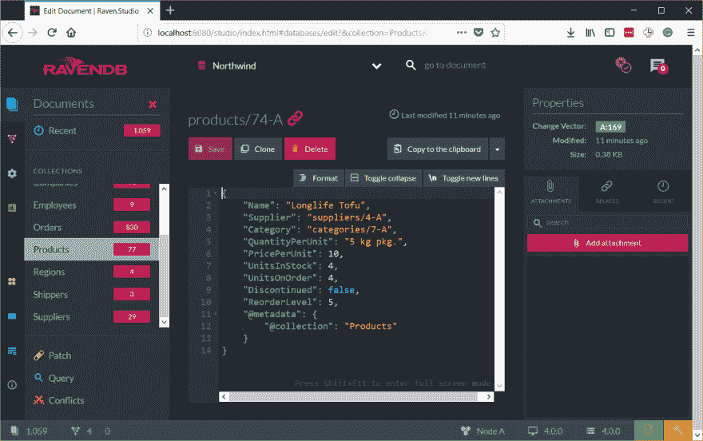

# 让我来帮助你开始使用 RavenDB4

> 原文：<https://dev.to/elemarjr/let-me-help-you-to-start-using-ravendb4-oa0>

是时候开始学习 RavenDB 4 了。即使你知道 RavenDB 以前的版本，你也可能会得到很好的惊喜，并学到一些新的技巧。例如，您知道 RavenDB 有社区(免费)许可证吗？

在这篇文章中，你将学习如何在你的电脑上安装并开始使用它。

## 启动并运行 RavenDB

在这篇文章中，我假设你是一名开发人员，试图在你的计算机上安装并运行一个 RavenDB 实例。我不会讨论如何处理生产场景(至少暂时不会)。如果您需要关于如何为生产设置 RavenDB 的信息，我建议您阅读在线文档。

### 运行在现场演示实例上

不想下载比特和字节？没问题！

不需要安装任何东西，你可以将浏览器指向[http://live-test.ravendb.net](http://live-test.ravendb.net)，然后访问我提供的公共演示实例。

使用现场演示版本对于快速检查和验证是有用的，但它并不意味着任何比这更严重的事情。显然，live 实例中的所有数据都是公开的，并且不保证可用性。我们使用这个实例来测试最新版本，所以您应该考虑到这一点。

### 运行在 Docker 上

使用 docker 是在您的计算机上开始使用 RavenDB 的快速方法。如果你安装了 Docker，你需要做的就是运行下面的命令:

```
docker run -e UNSECURED_ACCESS_ALLOWED=PublicNetwork -p 8080:8080 ravendb/ravendb 
```

Enter fullscreen mode Exit fullscreen mode

Docker 现在将获得最新的 RavenDB 版本，并构建一个新的容器来托管它。请注意，我们在开发人员模式下运行它，没有任何身份验证。

### 运行在 Windows、Linux 或 MacOS 上

要在 Windows、Linux 或 MacOS 上安装 RavenDB，你首先需要从[http://ravendb.net/download](http://ravendb.net/download)下载它(为你的平台选择正确的发行版)。您将获得一个压缩文件，您可以将它解压缩到您喜欢的文件夹中。

去做吧，我可以等。

完成了吗？！现在，您需要做的就是运行**。/Server/Raven。Server.exe 位于 RavenDB 文件夹中。这将在控制台应用程序中以交互模式启动控制台应用程序。此外，该脚本将打开您的浏览器并启动 RavenDB Management Studio**

默认情况下，RavenDB 会尝试使用**[http://localhost:8080](http://localhost:8080)**作为其端点。但是，如果有东西已经在使用端口 8080，RavenDB 将无法启动，并给出一个“地址正在使用”的错误(更确切地说，是 EADDRINUSE)。在这种情况下，您将需要配置 RavenDB(您可以[按照文档来完成](https://ravendb.net/docs/article-page/4.0/csharp/server/configuration/configuration-options))。

第一次运行 RavenDB 时，您需要做一些设置。你只需要回答问题就能完成。

## 你的第一个数据库

RavenDB 管理工作室完全重新设计。它看起来很漂亮，我们做了很多工作，使它比以往任何时候都更简单、更容易。[T2】](https://res.cloudinary.com/practicaldev/image/fetch/s--m9kvkDLE--/c_limit%2Cf_auto%2Cfl_progressive%2Cq_auto%2Cw_880/v1/media/d1ff71a639f63e04488b56706a91f423.png)

### 创建数据库

要创建您的第一个数据库:

1.  在左侧面板中选择`Database`选项。
2.  点击`New Database`按钮。
3.  为新数据库键入一个名称(对于本文，我推荐 Northwind)
4.  点击`Create`按钮

恭喜你！您刚刚创建了您的第一个 RavenDB 数据库…但是，它是空的。

[T2】](https://res.cloudinary.com/practicaldev/image/fetch/s--BnTvbxHX--/c_limit%2Cf_auto%2Cfl_progressive%2Cq_auto%2Cw_880/http://www.elemarjr.com/wp-content/uploads/2018/02/3f7ec9fbf9d626ebbe905e7a589e81ed.png)

### 加载样本数据

出于学习目的，让我们将一些样本数据加载到数据库中。

1.  选择左侧面板上的`Databases`
2.  在右侧面板中，单击您刚刚创建的数据库的名称(暂时为空)
3.  在左侧面板中，点击`settings`，然后点击`Create Sample Data`
4.  点击大`Create`按钮

[T2】](https://res.cloudinary.com/practicaldev/image/fetch/s--wJb_q3fj--/c_limit%2Cf_auto%2Cfl_progressive%2Cq_auto%2Cw_880/http://www.elemarjr.com/wp-content/uploads/2018/02/26de5d4d9b2cf6a0f8867677aa776b45.png)

> Northwind 数据库是 SQL Server 附带的示例数据库；几十年来，它一直被用作 Microsoft 社区中的示例数据库。我们选择这个数据库作为样本数据，因为您可能已经熟悉了它的关系格式。

进入`Documents`会话(左图)，你会看到 RavenDB 为你创建了很多文档。

[T2】](https://res.cloudinary.com/practicaldev/image/fetch/s--nlBuBJ3M--/c_limit%2Cf_auto%2Cfl_progressive%2Cq_auto%2Cw_880/http://www.elemarjr.com/wp-content/uploads/2018/02/3f24692d124b788b08cb11e49d8fb66f.png)

## 探索数据库

太好了。我们刚刚以交互模式启动了 RavenDB，创建了我们的第一个数据库并加载了一些样本数据。但是，等等！它看起来与您在关系数据库中看到的非常相似。对吗？数据以网格格式显示，表格在左侧。如果你点击任何“记录”，你将开始看到 NoSQL 魔术！

[T2】](https://res.cloudinary.com/practicaldev/image/fetch/s--H-8IYZj---/c_limit%2Cf_auto%2Cfl_progressive%2Cq_auto%2Cw_880/http://www.elemarjr.com/wp-content/uploads/2018/02/4bcc55018cd05b354a0d98c3ce7bcfb7.png)

是啊！所有 RavenDB 数据都存储为 JSON。

## 理解`Document`概念

使用`Go to document`功能(Studio 工具栏中的文本框)，转到文档`orders/101`。

```
{
    "Company": "companies/86",
    "Employee": "employees/4",
    "OrderedAt": "1996-11-07T00:00:00.0000000",
    "RequireAt": "1996-12-05T00:00:00.0000000",
    "ShippedAt": "1996-11-15T00:00:00.0000000",
    "ShipTo": {
        "Line1": "Adenauerallee 900",
        "Line2": null,
        "City": "Stuttgart",
        "Region": null,
        "PostalCode": "70563",
        "Country": "Germany"
    },
    "ShipVia": "shippers/2",
    "Freight": 0.78,
    "Lines": [
        {
            "Product": "products/1",
            "ProductName": "Chai",
            "PricePerUnit": 14.4,
            "Quantity": 15,
            "Discount": 0.15
        },
        {
            "Product": "products/23",
            "ProductName": "Tunnbröd",
            "PricePerUnit": 7.2,
            "Quantity": 25,
            "Discount": 0
        }
    ]
} 
```

Enter fullscreen mode Exit fullscreen mode

它与我们在关系数据库中所习惯的非常不同。

> 文档是一种自描述的分层树形数据结构，可以由映射、集合和标量值组成。

实际上，RavenDB 数据库存储的文档是普通的 JSON 格式的数据。因此，我们可以将相关信息聚合到一个公共对象中，就像在拥有所有运输信息的属性`ShipTo`的情况中一样。

在文档数据库中，文档被组织成集合。

## 理解`Collection`概念

集合提供了一种很好的组织方式。例如，保存客户数据的文档与保存产品信息的文档有很大的不同，您希望讨论它们的组。RavenDB 允许用一个字符串值来标记文档，这个字符串值将是文档类型的证据(比如“客户”和“产品”)。

注意，同一个集合中的文档可以有完全不同的结构，这很好，因为 RavenDB 是无模式的。

## 探索北风系列

1.  打开位于 [http://localhost:8080](http://localhost:8080) 的 RavenDB Management Studio
2.  打开罗斯文数据库
3.  在`Documents`会话中，浏览所有系列。

用户界面非常简单。熟悉它对你来说很重要。我强烈建议你尝试创建你的文档，编辑等等。您可以创建另一个数据库，加载示例数据(如果您愿意)。

不要害怕。考验自己！

## 最后的话…

厉害！您刚刚使用 RavenDB 4 迈出了第一步。如果你刚开始接触文档数据库，并想了解更多关于文档建模的知识，我们推荐你观看这个 [Ayende 的演讲](https://www.youtube.com/watch?v=FY0BiZaJwL4)。

封面: [unsplash-logo
泰勒·奎林](https://unsplash.com/@tylerdq?utm_medium=referral&utm_campaign=photographer-credit&utm_content=creditBadge)

帖子[让我帮你开始使用 RavenDB4](http://www.elemarjr.com/en/2018/02/its-time-to-start-using-ravendb-4/) 最早出现在 [Elemar JR](http://www.elemarjr.com/en) 上。