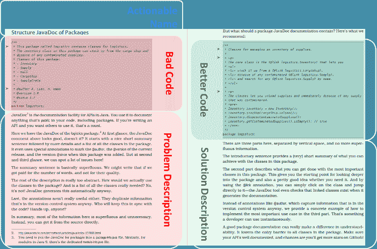

# 我们谈谈吧。关于问题。更少关于解决方案。

> 原文：<https://dev.to/simonharrer/let-s-talk-about-problems-less-about-solutions-2ffp>

前几天，我偶然发现了下面这条推文。

> 西蒙·马丁内利[@ simas _ ch](https://dev.to/simas_ch)向渴望学习的人解释“事情”很容易。但是你如何向不存在的人解释“事物”呢？2018 年 6 月 11 日上午 11:1302

这真的是发人深省。而我整理了下面这个回答，花了整整 12 分钟，一遍又一遍地重写了推文。

> 西蒙哈勒[@西蒙哈勒](https://dev.to/simonharrer)[@ simas _ ch](https://twitter.com/simas_ch)你就是不要。你必须让他们相信“东西”是值得学习的。在你说服他们之后，你就可以向他们解释“事情”了。通常，令人信服的部分才是真正的挑战。2018 年 6 月 11 日上午 11:2501

但是，这个话题并没有让我的思想自由。我突然意识到，这里面有非常非常重要的东西。所以我试着通过在这篇博客中写下我的想法来挣脱束缚。尽情享受吧！

我过去在大学教过很多东西。我合作教授的两门课程，即*高级 Java 编程*和*复杂和交互系统编程*是众所周知的时间密集型课程，并不是必修课。因此，最终参加这些课程的绝大多数学生确实有学习的动力，他们接受了他们需要做的大量工作——尽管有许多更简单的课程可供选择！对于那次经历，我感到很荣幸。教授这些课程通常属于“*的范畴，向渴望学习的人解释“事情”很容易。他们已经确信这些课程对自己真的很重要，不需要说服。*

但这不是全部真相。除了技术部分，我们还通过在课堂上、他们的家庭作业中，甚至在口试中的代码审查，将大量的注意力放在了[教授干净的代码](http://ceur-ws.org/Vol-2066/isee2018paper06.pdf)上。不是每个学生都像我们讲师一样对干净代码感兴趣。这些学生已经疲于应付课程工作量，只是希望他们的代码能够正确运行并取得好成绩。那很好。这种态度并没有错，然而，我们最终进入了另一个类别:“*向不急于学习的人解释“事情”*。作为理想主义的教师，我们想教好每一个学生。所以我们谈了很多为什么有些代码很难读懂，这会导致什么后果。每个学期，我们越来越强调为什么一个特定的代码难以阅读。它得到了回报。我们可以在这些年来作为学生作业评分的一部分而写的反馈中很好地看到这一点。它从一开始只谈论解决方案变成了以 50:50 的比例谈论问题和解决方案，给问题和解决方案同等的空间。我没有确凿的数据来支持我的论点，但是在我们切换到 50:50 的解释后，学生们不再抱怨干净代码的建议了。我认为这足以让学生们相信，尽管有额外的工作，他们还是多走了一英里。

我们根据问题和解决方案 50:50 的比例，进一步发展了这一经验，并通过比较写了我们的书 [Java。对于本书中的每一个比较，我们都将左边一页专门用于问题，右边一页用于解决方案。有很多关于干净代码的书关注解决方案，但据我所知，没有一本花这么多篇幅单独讨论这个问题。我认为这真的让我们的书与众不同，让它对初学者和专家都很有吸引力。你们自己去看看吧。](https://java.by-comparison.com/)

[T2】](https://res.cloudinary.com/practicaldev/image/fetch/s---qsPQbSD--/c_limit%2Cf_auto%2Cfl_progressive%2Cq_auto%2Cw_880/https://cdn-images-1.medium.com/max/768/1%2AR0dtpFG0cRnqlzNAHu-6TA.png)

让我概括一下这一点。对于我们这些喜欢分享我们所知道的东西的开发人员来说，谈论解决方案是很自然的。我们希望分享这种很酷新框架、编程语言、IDE、CLI 工具或库。我们想展示它是如何工作的，感觉有多酷。但是我们往往没有花足够的时间去思考为什么要从目前使用的框架、编程语言、IDE、CLI 工具或者库进行切换。我们已经确信，经常是强烈地确信，新的东西就是更好。但是我们往往会忘记，别人没有想过我们的想法，没有获得我们的经验，可能会因为他们当前的需要而得出完全不同的结论。

当你阅读下一篇文章，听下一次谈话，或者只是参加下一次会议时，想想花在问题和解决方案上的时间比例。你认为文章/谈话/会议如果多谈问题而少谈解决方案会更好吗？请在评论中让我知道。