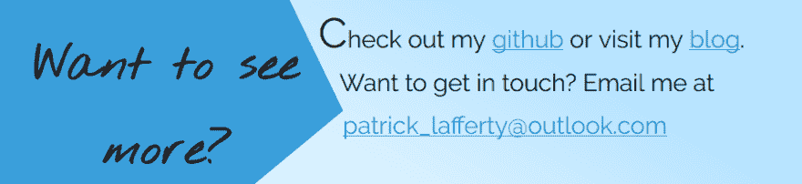

# 让那里有光

> 原文：<https://dev.to/patricklafferty/let-there-be-light-2h3l>

最初发布于[https://patricklafferty . ca/blog/2018/06/24/let-there-be-light/](https://patricklafferty.ca/blog/2018/06/24/let-there-be-light/)

最近，我决定重新访问我的个人网站，并彻底修改它的设计。这些是我学到的经验教训，新旧设计的逻辑，截图上的涂鸦，以及一般的建议。

# 第一课:要有光

我使用的每一个编辑器都是为深色设计的。当我大部分时间都在那种环境中度过时，我逐渐习惯了它，并更喜欢黑暗计划，这也是我个人设计的反映。事实证明，在阅读一般文本时，许多人更喜欢暗对亮的配色方案。对于大部分人来说，它可以不那么费力，也更容易阅读。考虑到这一点，我开始做一个完整的改造。

“之前”的图片:

[T2】](https://res.cloudinary.com/practicaldev/image/fetch/s--lnGaX2Y9--/c_limit%2Cf_auto%2Cfl_progressive%2Cq_auto%2Cw_880/https://i.imgur.com/jAgBUnv.png)

请注意它是如何从深蓝色背景变成更深的黑色文本背景的。“之后”的图片:

[T2】](https://res.cloudinary.com/practicaldev/image/fetch/s--s-fKqRVs--/c_limit%2Cf_auto%2Cfl_progressive%2Cq_auto%2Cw_880/https://i.imgur.com/dUMrlUi.png)

注意它是如何从浅蓝色背景变成几乎白色的文本背景的。文本几乎总是亮白色上的黑色，当亮蓝色上的黑色对比度较低时，我会确保字体大小较大以弥补差异。

看数字[1]，旧的深色设计的对比度为 5.48:1，而新的对比度从 12.97:1 到 17.51:1 不等。上面提到的蓝底黑字部分的对比度为 5.97:1，因此在各个方面都有显著的改善。

1:[https://webaim.org/resources/contrastchecker/](https://webaim.org/resources/contrastchecker/)

# 第二课:选择合适的调色板

我不太了解色彩理论，除了我喜欢蓝色，和一些现在不相关的关于光能传递的细节。我很清楚，你不能随意选择颜色，或者莫名其妙地使用大量的颜色。像 Paletton[2]这样的网站可以帮助你使用各种不同的方案，比如单色、三色和四色，来创建一个调色板。对于像我这样的非艺术家来说，花大量的时间来决定什么最适合你的设计，然后从它给你的少数几种颜色中选择一种，除了一些小的修饰。

2:paletton.com

# 第三课:首先为你的观众设计，其次为你自己

看看这个。

[T2】](https://res.cloudinary.com/practicaldev/image/fetch/s--K_e9A-tK--/c_limit%2Cf_auto%2Cfl_progressive%2Cq_auto%2Cw_880/https://i.imgur.com/IPjmzWd.png)

我为自己设计，为我认为看起来很酷的东西。但是结果很糟糕:300 像素分隔了每个菜单项，所以你的眼睛不得不从一个项目移到下一个项目。标题是 400 像素高，唯一的原因是为了适应更多的蓝色。太浪费空间了。

想想你要联系的人是谁。老实说，对我来说，现在主要是招聘人员。或者，如果不是招聘人员本身，那些在困境迫使他们进入漫无目的的流浪生活之前接受过工作培训的人。不管怎样，招聘人员(像所有人一样)都是大忙人。去拿。敬。的。点。

[T2】](https://res.cloudinary.com/practicaldev/image/fetch/s--aM6lrIQv--/c_limit%2Cf_auto%2Cfl_progressive%2Cq_auto%2Cw_880/https://i.imgur.com/rogKuPY.png)

没有废话，有一个典型的导航条通常在你期望的地方。此外，让你的博客的登录页面显示一个简短的摘录列表，而不是把它们都放在一个长页面上，这样人们可以很快看到他们是否对这篇文章感兴趣。差别是惊人的:

[T2】](https://res.cloudinary.com/practicaldev/image/fetch/s--adkICyHi--/c_limit%2Cf_auto%2Cfl_progressive%2Cq_auto%2Cw_880/https://i.imgur.com/5UGvyvz.png)

滚动旧网站花了这么长时间，我有点期待 MGS3 的天梯歌开始播放。我还用一个独特的彩色双边框标题分割了长格式文本，以帮助扫描。最后说重点。如果你知道你的读者在寻找关键的细节，不要把它们藏在段落里。把它们拉出来强调一下。仅花 5 秒钟阅读和比较:

[T2】](https://res.cloudinary.com/practicaldev/image/fetch/s--TcgVa8KM--/c_limit%2Cf_auto%2Cfl_progressive%2Cq_auto%2Cw_880/https://i.imgur.com/Ms2ATe1.png)

使用:

[T2】](https://res.cloudinary.com/practicaldev/image/fetch/s--q_hTwWca--/c_limit%2Cf_auto%2Cfl_progressive%2Cq_auto%2Cw_880/https://i.imgur.com/vVR8W8v.png)

在 5 秒钟内，你能在旧段落中找到任何有趣的东西吗？当它在半打其他段落的上面和下面的时候？如果你想让某人注意到什么，就帮助他们注意到它。让名字更突出，把关键信息直接放在屏幕左侧他们的眼睛自然会看到的地方。用颜色区分冷热内容。如果他们感兴趣，他们可以阅读更大的描述。

# 第四课:给空间呼吸

空白是整体外观中最重要的部分之一。一般来说，如果你有多余的空间，给自己足够的空间。让内容远离边界，让它舒适:想想下午两点和高峰时间的地铁。这让颜色出来，做他们的事情。注意你的行高，这样文本更容易阅读。

# 第五课:用形状和颜色引导眼睛

我很早就选定了一种简单的几何风格，带有双色对比。这让我可以在外形外部和裁剪路径上玩游戏(有点偏离第三课)，但是它也影响了用户体验。看每一个部分:有一个段落的部分有一个四边形，有一个大的粗体标题引导人们看文本(见上面的截图)。列表部分(经验、项目)有一个向下引导用户的形状。

[T2】](https://res.cloudinary.com/practicaldev/image/fetch/s--H7v7eU0R--/c_limit%2Cf_auto%2Cfl_progressive%2Cq_auto%2Cw_880/https://i.imgur.com/iJ6B1U3.png)

最重要的部分，行动号召，有一个指示用户行动的箭头。它符合整体的角度设计，但它也有一个功能。

[T2】](https://res.cloudinary.com/practicaldev/image/fetch/s--WP8iGlW4--/c_limit%2Cf_auto%2Cfl_progressive%2Cq_auto%2Cw_880/https://i.imgur.com/0PrU0Qi.png)

# 鳍

课程到此结束。如果你有任何问题或意见，纠正或建议，批评等等，我很乐意通过电子邮件或这里联系。我总是乐于学习新事物，纠正不好的事情。