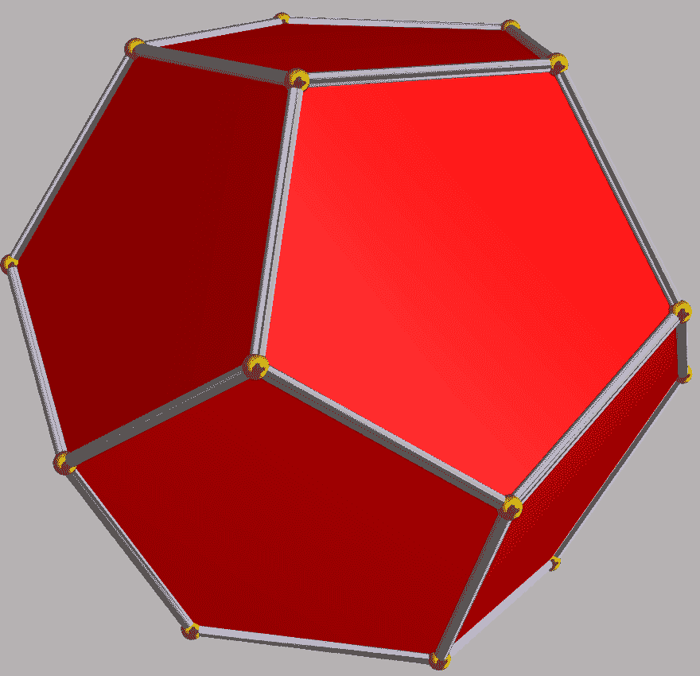

# 让我们建立一个锈前端与紫杉-第 2 部分

> 原文：<https://dev.to/deciduously/lets-build-a-rust-frontend-with-yew---part-2-1ech>

## **第二部**

在第一部分中，我们设置了我们的开发环境，并确保我们可以编译和运行我们的 webapp。这部分开始假设你的项目文件夹镜像[这个](https://github.com/deciduously/hunt-the-wumpus/tree/master/part1)。如果你还没有这样做，请从[第一部分](https://dev.to/deciduously/lets-build-a-rust-frontend-with-yew---part-1-3k2o)开始——或者你可以跳过这一部分，直接进入[第三部分](https://dev.to/deciduously/lets-build-a-rust-frontend-with-yew---part-3-ch3),但无论如何你都可能需要从这里回来。

现在我们可以开始模拟逻辑了。我们将从定义洞穴开始。传统游戏在一个洞穴中进行，每个房间都是正十二面体的一个顶点:

[T2】](https://res.cloudinary.com/practicaldev/image/fetch/s--oO7WuT9f--/c_limit%2Cf_auto%2Cfl_progressive%2Cq_auto%2Cw_880/https://upload.wikimedia.org/wikipedia/commons/3/33/Dodecahedron.png)

从每个房间，我们正好连接到另外三个房间。

为了对此建模，我们将简单地使用一个函数来将房间 id 映射到可用的出口。这将允许我们在洞穴周围穿行。在您的`Model`声明上方的`lib.rs`中放置以下内容:

```
fn room_exits(id: u8) -> Option<[u8; 3]> {
  match id {
    1 => Some([2, 5, 8]),
    2 => Some([1, 3, 10]),
    3 => Some([2, 4, 12]),
    4 => Some([3, 5, 14]),
    5 => Some([1, 4, 6]),
    6 => Some([5, 7, 15]),
    7 => Some([6, 8, 17]),
    8 => Some([1, 7, 11]),
    9 => Some([10, 12, 19]),
    10 => Some([2, 9, 11]),
    11 => Some([8, 10, 20]),
    12 => Some([3, 9, 13]),
    13 => Some([12, 14, 18]),
    14 => Some([4, 13, 15]),
    15 => Some([6, 14, 16]),
    16 => Some([15, 17, 18]),
    17 => Some([7, 16, 20]),
    18 => Some([13, 16, 19]),
    19 => Some([9, 18, 20]),
    20 => Some([11, 17, 19]),
    _ => None
  }
} 
```

Enter fullscreen mode Exit fullscreen mode

现在让我们将玩家的当前位置存储在`Model` :
中

```
pub struct Model {
  arrows: u8,
  current_room: u8,
} 
```

Enter fullscreen mode Exit fullscreen mode

不要忘记将它添加到我们的初始模型中:

```
 fn create(_: Self::Properties, _: ComponentLink<Self>) -> Self {
    Model {
      arrows: 5,
      current_room: 1,
    }
  } 
```

Enter fullscreen mode Exit fullscreen mode

现在，我们可以开始添加到我们的用户界面。我们需要一个新的组件来负责呈现控件。我喜欢把这些都放在一个文件夹里:

```
$ mkdir src/components
$ touch src/components/controls.rs 
```

Enter fullscreen mode Exit fullscreen mode

我们将从一个准系统组件开始:

```
use yew::prelude::*;

pub struct Controls {
    title: String,
    exits: [u8; 3],
}

pub enum Msg {}

#[derive(PartialEq, Clone)]
pub struct Props {
    pub exits: [u8; 3],
}

impl Default for Props {
    fn default() -> Self {
        Self { exits: [0, 0, 0] }
    }
}

impl Component for Controls {
    type Message = Msg;
    type Properties = Props;

    fn create(props: Self::Properties, _: ComponentLink<Self>) -> Self {
        Controls {
            title: "Controls".into(),
            exits: props.exits,
        }
    }

    fn update(&mut self, _msg: Self::Message) -> ShouldRender {
        true
    }
}

impl Renderable<Controls> for Controls {
    fn view(&self) -> Html<Self> {
        html! {
            <div class=("container", "container-controls"),>
                <div class="title",>{&self.title}</div>
                <div class="exits",>{format!("exits: {}, {}, {}", self.exits[0], self.exits[1], self.exits[2])}</div>
            </div>
        }
    }
} 
```

Enter fullscreen mode Exit fullscreen mode

与我们的顶级组件不同，这个组件接受一些道具——我们将通过出口进入玩家所在的房间。几个“陷阱”——看看`Renderable` impl 块中的`html!`宏。我们将两个类附加到顶层`div`——为此，您需要将它们包装在一个元组中，如图所示。此外，如果您在标签中使用类似于`<div class="title",>`的属性，您需要包含尾部逗号以便宏工作。如果不这样做，您可能会得到一个非常密集的错误消息——在死机之前检查这些逗号。Rust 宏倾向于生成非常不透明的错误信息——这是目前该技术的一个主要缺点。

同样值得注意的是——我们*必须*为我们的`Props`提供一个`Default` impl。我只是把它设置成`[0, 0, 0]`。

让我们把它放在我们的应用程序中。首先，我们必须组织我们的组件模块:

```
$ echo 'pub mod controls;' > src/components/mod.rs 
```

Enter fullscreen mode Exit fullscreen mode

当我们添加新组件时，不要忘记将声明添加到这个文件中。回到`lib.rs`，直接在你的`extern crate`声明后添加模块，并将其纳入
范围

```
mod components;

use self::components::controls::Controls; 
```

Enter fullscreen mode Exit fullscreen mode

现在我们可以将它附加到应用程序中。在`html!`宏中，让我们将组件添加到显示箭头的`<span>`元素的正下方。我们还将分割统计打印输出并显示当前房间。调整你的来匹配这个:

```
<div class="hunt",>
    <div class="header",>{"Hunt the Wumpus"}</div>
    <div class="body",>
      <div class=("container""container-stats"),>
        <span class="title",>{"Stats"}</span>
        <br/>
        <span class="arrows",>{&format!("Arrows: {}", self.arrows)}</span>
        <br/>
        <span class="current-room",>{&format!("Current Room: {}"self.current_room)}</span>
      </div>
      <Controls: exits=room_exits(self.current_room).unwrap(),/>
    </div>
</div> 
```

Enter fullscreen mode Exit fullscreen mode

重建完成后，返回浏览器并确认您看到的内容:

统计数据
**箭头:5**
当前房间:1
控制
出口:2，5，8

很简单，但正是我们想要的！在我们深入逻辑之前，让我们给自己一个类似布局的东西。这只是一个框架——我不是 CSS 专家。随意做你喜欢的，这应该足够让你开始了。

将`scss/hunt.scss`替换为以下内容:

```
.hunt {
  display: flex;
  flex-direction: column;
  align-items: center;
  justify-content: center;
  height: 100%;
  width: 100%;

  .header {
    flex: 0;
    font-size: 36px;
    font-weight: bold;
    text-align: center;
  }

  .window {
    display: flex;
    flex-direction: row;
  }

  .container {
      border: solid 1px #000;
      display: flex;
      flex-direction: column;
      overflow: hidden;
      margin: 10px;
      padding: 5px;

      >.title {
          border-bottom: dashed 1px #000;
          font-weight: bold;
          text-align: center;
      }
  }
} 
```

Enter fullscreen mode Exit fullscreen mode

别忘了运行`yarn build:style`来重新生成编译好的 CSS。

让我们继续，抓住机会将统计数据分解到它们自己的组件中。制作一个新文件`src/components/stats.rs` :

```
use yew::prelude::*;

pub struct Stats {
  title: String,
  arrows: u8,
  current_room: u8,
}

pub enum Msg {}

#[derive(PartialEq, Clone)]
pub struct Props {
  pub arrows: u8,
  pub current_room: u8,
}

impl Default for Props {
  fn default() -> Self {
    Self {
      arrows: 0,
      current_room: 0,
    }
  }
}

impl Component for Stats {
  type Message = Msg;
  type Properties = Props;

  fn create(props: Self::Properties, _: ComponentLink<Self>) -> Self {
    Stats {
      title: "Stats".into(),
      arrows: props.arrows,
      current_room: props.current_room,
    }
  }

  fn update(&mut self, _msg: Self::Message) -> ShouldRender {
    true
  }
}

impl Renderable<Stats> for Stats {
  fn view(&self) -> Html<Self> {
    html! {
      <div class=("container", "container-stats"),>
        <span class="title",>{&self.title}</span>
        <span class="stat",>{&format!("Arrows: {}", self.arrows)}</span>
        <br/>
        <span class="stat",>{&format!("Current Room: {}", self.current_room)}</span>
      </div>
    }
  }
} 
```

Enter fullscreen mode Exit fullscreen mode

新的我们只是把它加到`src/components/mod.rs` :

```
pub mod controls;
pub mod stats; 
```

Enter fullscreen mode Exit fullscreen mode

并将其包含在`lib.rs` :
中的顶级组件中

```
mod components;

use self::components::{controls::Controls, stats::Stats};

// down to the bottom...

impl Renderable<Model> for Model {
  fn view(&self) -> Html<Self> {
    html! {
        <div class="hunt",>
            <div class="header",>{"Hunt the Wumpus"}</div>
            <div class="window",>
              <Stats: arrows=self.arrows, current_room=self.current_room,/>
              <Controls: exits=room_exits(self.current_room).unwrap(),/>
            </div>
        </div>
    }
  }
} 
```

Enter fullscreen mode Exit fullscreen mode

这为我们提供了一个简单的 flexbox 布局，易于扩展。重新运行`yarn build:css-once`并在你的浏览器中重新加载`localhost:8000`以确保新的样式被选中。

现在我们已经准备好与它进行交互了。

我们的下一个任务是绕着洞穴移动。我们所有的实际更新逻辑都将发生在我们的顶级组件中。当我们第一次创建`lib.rs`的时候，我们只是做了一个空的`Msg`类型:

```
#[derive(Debug, Clone)]
pub enum Msg {} 
```

Enter fullscreen mode Exit fullscreen mode

为了切换`current_room`，我们将发送一个包含目标房间的`Msg`。先来添加一下变体:

```
#[derive(Debug, Clone)]
pub enum Msg {
  SwitchRoom(u8),
} 
```

Enter fullscreen mode Exit fullscreen mode

现在我们必须处理这个信息。在`impl Component for Model`块中，我们现在有一个`update()`的存根，返回`true`。现在让我们实际使用它接受的`Self::Message`参数:

```
 fn update(&mut self, msg: Self::Message) -> ShouldRender {
    match msg {
      Msg::SwitchRoom(target) => {
        self.current_room = target;
        true
      }
    }
  } 
```

Enter fullscreen mode Exit fullscreen mode

不要忘记删除参数列表中`_msg`的下划线！

对你的消息使用一个`enum`的好处是当你对它们使用`match`时，编译器不会让你错过任何东西——它必须是详尽的。我们也可以很容易地析构这个变体。这种模式与 Elm 提供的模式没有什么不同。你只需要确保每个匹配臂返回一个布尔值——或者如果你愿意，你可以简单地在`match`块后返回`true`。基于每个消息的控制可以允许更细粒度的性能控制——一些消息可能不需要重新呈现。

这条消息很简单——它只是切换`current_room`。接下来，我们需要生成这些消息。让我们回到`src/components/controls.rs`。我们可以使用`crate::Msg`来指代按钮将生成的顶层消息。

我们现在可以创建一个可以在这个组件中传递的消息:

```
pub enum Msg {
    ButtonPressed(crate::Msg)
} 
```

Enter fullscreen mode Exit fullscreen mode

我们还需要添加回调到我们的道具。紫杉有一种现成的类型:

```
pub struct Controls {
    title: String,
    exits: [u8; 3],
    onsignal: Option<Callback<crate::Msg>>,
}

#[derive(PartialEq, Clone)]
pub struct Props {
    pub exits: [u8; 3],
    pub onsignal: Option<Callback<crate::Msg>>,
}

impl Default for Props {
    fn default() -> Self {
        Self {
            exits: [0, 0, 0],
            onsignal: None,
        }
    }
} 
```

Enter fullscreen mode Exit fullscreen mode

最后，将其添加到我们的组件初始化:

```
fn create(props: Self::Properties, _: ComponentLink<Self>) -> Self {
    Controls {
        title: "Controls".into(),
        exits: props.exits,
        onsignal: props.onsignal,
    }
} 
```

Enter fullscreen mode Exit fullscreen mode

现在我们可以动态地创建按钮来生成我们的`crate::Msg`。我们已经有了进入组件的房间目标——我们只需要为每个目标创建一个不同的按钮。我们可以在我们的`view`函数:
中用一个局部闭包来抽象出这个逻辑

```
impl Renderable<Controls> for Controls {
    fn view(&self) -> Html<Self> {
        let move_button = |target: &u8| {
            use crate::Msg::*;
            let t = *target;
            html! {
                <span class="control-button",>
                    <button onclick=|_| Msg::ButtonPressed(SwitchRoom(t)),>{&format!("Move to {}", target)}</button>
                </span>
            }
        };
        html! {
            <div class=("container", "container-controls"),>
                <div class="title",>{&self.title}</div>
                <div class="exits",>{ for self.exits.iter().map(move_button) }</div>
            </div>
        }
    }
} 
```

Enter fullscreen mode Exit fullscreen mode

然后我们绘制本州出口的地图。另一个问题是——你必须在`html!`宏之外解引用`target`:`let t = *target`。如果我们的类型不是像`u8`那样的`Copy`，我们就需要在这里克隆它。

现在我们需要处理信息。让我们填写我们的`update` :

```
fn update(&mut self, msg: Self::Message) -> ShouldRender {
    match msg {
        Msg::ButtonPressed(msg) => {
            if let Some(ref mut callback) = self.onsignal {
                callback.emit(msg);
            }
        }
    }
    false
} 
```

Enter fullscreen mode Exit fullscreen mode

点击时无需重新渲染。当状态实际改变时，我们会处理它。我们返回`false`以确保我们不会在 exra 渲染上浪费时间。现在我们只需将道具添加到`lib.rs`，在`view`功能下:

```
<Controls: exits=room_exits(self.current_room).unwrap(), onsignal=|msg| msg,/> 
```

Enter fullscreen mode Exit fullscreen mode

当按钮被点击时，`msg`将被触发，我们的顶层`update`将处理状态的改变。现在我们可以通过回调传递任何我们想要的消息。

在全部工作之前，还有最后一个变化要做——我们需要告诉任何需要`Props`的组件，当这些道具改变时该做什么。在这些组件的`impl Component for <...>`模块中定义这些`change`功能:

第一，`controls.rs` :

```
fn change(&mut self, props: Self::Properties) -> ShouldRender {
    self.exits = props.exits;
    self.onsignal = props.onsignal;
    true
} 
```

Enter fullscreen mode Exit fullscreen mode

然后`stats.rs` :

```
fn change(&mut self, props: Self::Properties) -> ShouldRender {
  self.arrows = props.arrows;
  self.current_room = props.current_room;
  true
} 
```

Enter fullscreen mode Exit fullscreen mode

现在确保你的`yarn watch:rs`观察器正在运行并打开`localhost:8000`。您应该能够使用按钮来“探索”迷宫。

为了跟踪我们去过的地方，让我们为玩家显示一个跑步历史。首先，我们将在`lib.rs` :
中向顶层状态添加一个字段

```
pub struct Model {
  arrows: u8,
  current_room: u8,
  messages: Vec<String>,
}

impl Component for Model {
   // ..
    fn create(_: Self::Properties, _: ComponentLink<Self>) -> Self {
    Model {
      arrows: 5,
      current_room: 1,
      messages: Vec::new(),
    }
  }
  // ..
} 
```

Enter fullscreen mode Exit fullscreen mode

我们将在新文件`src/components/messages.rs` :
中添加一个新组件

```
use yew::prelude::*;

pub struct Messages {
  title: String,
  messages: Vec<String>,
}

pub enum Msg {}

#[derive(PartialEq, Clone)]
pub struct Props {
  pub messages: Vec<String>,
}

impl Default for Props {
  fn default() -> Self {
    Props {
      messages: Vec::new(),
    }
  }
}

impl Component for Messages {
  type Message = Msg;
  type Properties = Props;

  fn create(props: Self::Properties, _: ComponentLink<Self>) -> Self {
    Messages {
      title: "Messages".into(),
      messages: props.messages,
    }
  }

  fn update(&mut self, _msg: Self::Message) -> ShouldRender {
    true
  }

  fn change(&mut self, props: Self::Properties) -> ShouldRender {
    self.messages = props.messages;
    true
  }
}

impl Renderable<Messages> for Messages {
  fn view(&self) -> Html<Self> {
    let view_message = |message: &String| {
      html! {
          <li>{message}</li>
      }
    };
    html! {
        <div class=("container", "container-messages"),>
            <div class="title",>{&self.title}</div>
            <div class="scroller",>
                <ul>{ for self.messages.iter().rev().map(view_message) }</ul>
            </div>
        </div>
    }
  }
} 
```

Enter fullscreen mode Exit fullscreen mode

我们反向显示消息——否则，这与`controls.rs`没有太大区别。当我开始一个新的组件时，我使用了一个类似这样的片段！

别忘了加到`src/components/mod.rs` :

```
pub mod controls;
pub mod messages;
pub mod stats; 
```

Enter fullscreen mode Exit fullscreen mode

并将其添加到`lib.rs` :

```
use self::components::{controls::Controls, messages::Messages, stats::Stats};

// ..

impl Renderable<Model> for Model {
  fn view(&self) -> Html<Self> {
    html! {
        <div class="hunt",>
            <div class="header",>{"Hunt the Wumpus"}</div>
            <div class="window",>
              <Stats: arrows=self.arrows, current_room=self.current_room,/>
              <Controls: exits=room_exits(self.current_room).unwrap(), onsignal=|msg| msg,/>
            </div>
            <Messages: messages=&self.messages,/> // add it down here
        </div>
    }
  }
} 
```

Enter fullscreen mode Exit fullscreen mode

现在让我们在`scss/hunt.scss`中添加一点风格。在`.container`块内的`>.title`块下添加以下内容:

```
>.scroller {
    overflow: auto;
} 
```

Enter fullscreen mode Exit fullscreen mode

然后在末尾加上右:

```
.hunt {
// ..
  .container-messages {
    flex: 0 0 192px;
    ul {
      list-style-type: none;
    }
  }
} 
```

Enter fullscreen mode Exit fullscreen mode

要引入更改，运行`yarn build:style`。

现在让我们添加一些消息！当游戏在`lib.rs` :
开始时，我们可以迎接玩家可能的厄运

```
fn create(_: Self::Properties, _: ComponentLink<Self>) -> Self {
  let mut ret = Model {
    arrows: 5,
    current_room: 1,
    messages: Vec::new(),
  };
  ret.messages.push(
    "You've entered a clammy, dark cave, armed with 5 arrows.  You are very cold.".to_string(),
  );
  ret
} 
```

Enter fullscreen mode Exit fullscreen mode

我们还将记录每个动作:

```
 fn update(&mut self, msg: Self::Message) -> ShouldRender {
    match msg {
      Msg::SwitchRoom(target) => {
        self.current_room = target;
        self.messages.push(format!("Moved to room {}", target));
        true
      }
    }
  } 
```

Enter fullscreen mode Exit fullscreen mode

俏皮！不过，我们的洞穴并不十分有趣。这里有一些唾手可得的水果——肯定有一大堆可以猎取的！

加入我的[第 3 部分](https://dev.to/deciduously/lets-build-a-rust-frontend-with-yew---part-3-ch3)来用这个危险的十二洞穴做一个游戏。

为了比较，下面是完整的[第二部分](https://github.com/deciduously/hunt-the-wumpus/tree/master/part2)代码。