# 让我们用 React 构建一个销售仪表板

> 原文：<https://dev.to/progresstelerik/lets-build-a-sales-dashboard-with-react-41hn>

请跟随我们，用 KendoReact 的原生 React 组件模拟、设计和布置销售仪表板，包括响应网格、数据、图表等。

构建业务线 web 应用程序可能具有挑战性，即使使用 React 这样的现代框架也是如此。幸运的是，像 Kendo UI 这样的 UI 库可以让这变得更容易。在本教程中，我们将利用 [KendoReact](https://www.telerik.com/kendo-react-ui/components/) ，这是一个专门为 React 构建的原生 UI 组件库。如果您曾经使用过 Progress 的组件库，您将会对 KendoReact 如鱼得水。然而，如果你从未听说过剑道 UI，本教程将演示如何使用该库快速完成任务。

## 在 KendoReact 中构建销售仪表板

在本文中，我们将为一个虚构的公司构建一个销售仪表板。我们将使用 Github 上现有的用 KendoReact 构建的仪表板:[kendo-react-sales-dashboard](https://github.com/telerik/kendo-react-sales-dashboard)。我的目标是向您展示如何从头开始构建一个类似的仪表板。

[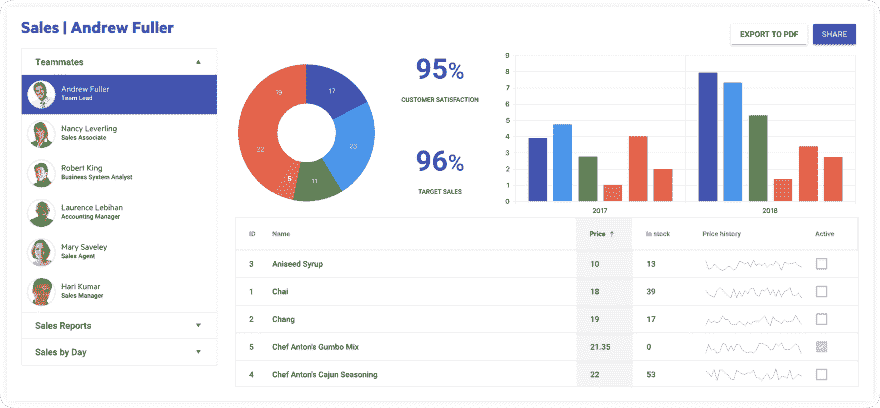T2】](https://res.cloudinary.com/practicaldev/image/fetch/s--e9QqPY_L--/c_limit%2Cf_auto%2Cfl_progressive%2Cq_auto%2Cw_880/https://i.imgur.com/4R9iyFL.png)

我们的销售仪表板将按月显示乡村商店每个季度最畅销的产品。我将在构建组件时介绍每个组件的数据。

该项目涵盖了 React 和 KendoReact 中非常基本的概念，使用本地 React 组件[创建 React 应用](https://www.telerik.com/blogs/hello-create-react-app-2.0)。我们还会用 HTML 和 CSS 做一些基本的布局，并希望在未来用更先进的概念来构建这个教程。

## 入门

我们需要确保[已经安装了](https://nodejs.org/en/download/)版本 7 或更高版本的 Node，因为最新版本的 [Create React App](https://github.com/facebook/create-react-app) 提出了这一要求。安装了节点后，我们就可以使用 npm 下载 Yarn Package Manager 了。如果你是创建 React 应用的新手，你可以通过这篇文章来了解最新消息:([你好，创建 React 应用！](https://www.telerik.com/blogs/hello-create-react-app-2.0))旨在帮助人们快速使用该工具，使用零配置创建 React 应用程序。

* * *

### 确保纱线安装完毕:

Yarn 被用作 Create React 应用程序中的默认包管理器。使用
进行安装

```
$ npm install yarnpkg -g 
```

如果你在 Windows 上安装 Yarn 有任何问题，只需在这里下载并运行`msi`安装程序[。](https://yarnpkg.com/en/docs/install#windows-stable)

* * *

```
$ npx create-react-app kendo-react-sales-dashboard
$ cd kendo-react-sales-dashboard
$ yarn start 
```

启动 Create React App 后，您可以在浏览器中查看我们的应用程序:

[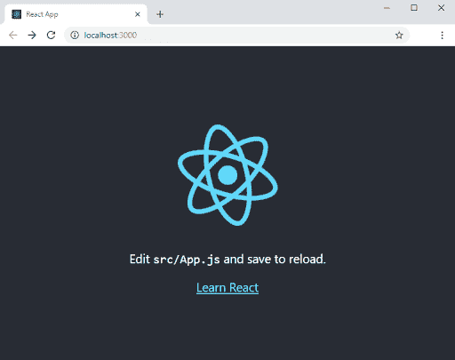T2】](https://res.cloudinary.com/practicaldev/image/fetch/s--0yAWITN4--/c_limit%2Cf_auto%2Cfl_progressive%2Cq_auto%2Cw_880/https://lh3.googleusercontent.com/A7gMYJS8ZIjHQf_2nYlS282sEw6Dktny0Yg9ybFQlROVSvUKmEJQVuB_pXdjoHNweue3rfHSoZF8bw)

现在，我们可以添加包来帮助创建仪表板的基本布局。KendoReact 有一个材料主题，我们可以将其作为一个包进行布局。我们还需要引入几个 KendoReact 按钮，这将让您了解将这些零碎的东西放进去开始使用是多么容易。由于 Create React 应用程序使用现成的 yarn，对我来说，它似乎比安装包要快一些，所以我将在本教程中使用所有的 yarn 命令:

```
$ yarn add @progress/kendo-theme-material
           @progress/kendo-react-layout
           @progress/kendo-react-buttons 
```

在我们走得太远之前，我想分享一下我对这个应用程序的想法，我已经使用一个叫做 [Balsamiq](https://balsamiq.com/) 的工具完成了一个基本草图，展示了组件布局将如何安排。

[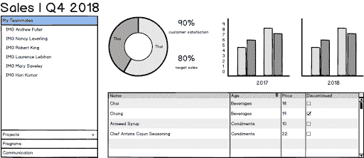T2】](https://res.cloudinary.com/practicaldev/image/fetch/s--CivxnDHT--/c_limit%2Cf_auto%2Cfl_progressive%2Cq_auto%2Cw_880/https://lh3.googleusercontent.com/tobYXIcPrCOpiEmk0Y0q9nW6ynQu33hOLca3uj3rp818eVVE9WBSdK3JBBnbZofL10WPKQOCZJahEA)

通常一个设计师和一个 UX 专家会开发一个设计原型，给开发者一个更好的设计方向，但是我们有一个 MVP 预算，所以为了我们教程的目的，这个 Balsamiq 模型将是我们的指南。我们使用的材质设计主题将不费吹灰之力给我们带来好看的字体和优美的 UI 风格。定制这些组件是可能的，但是我们将坚持使用默认组件。

一旦我有了这样的模型，我喜欢做的后续工作是概述每个组件，并将这些概述排列成行和列的友好表示。我将用它来理解我需要什么样的`<div>`元素和类的结构。在下面的布局中，我们有两行，第一行包含标题和按钮。其他的都将在下面的新行中。第二行被分成两列。在右列内将是另一组两行，第一行有三列，第二行只有一列。

[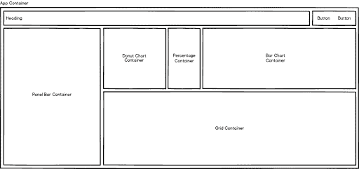T2】](https://res.cloudinary.com/practicaldev/image/fetch/s--IqhCejNC--/c_limit%2Cf_auto%2Cfl_progressive%2Cq_auto%2Cw_880/https://lh3.googleusercontent.com/OlY8bzpvztfqYkD9p2bhHtg2h6BPvdazUmf-JCFNQeh4dzv2pU_w2Zcd_hGfclKIWGc7Bqd8_ifAKA)

现在我们有了这些草图，我们可以使用`<div>`元素构建标记，并分配类来指示每列将组成多少个最大 12 个单元。在下一节中，我将向您介绍包含组件的标记结构。

## HTML

考虑到我们上面看到的布局，我以传统的*“12 列响应网格”*的方式创建了一个`div`的层次结构，每个层次都给定了一个`className`，并在视觉辅助中简化了这个想法。在 React 中，每当我们在 JSX 定义 CSS 类时，我们都使用属性`className`而不是`class`。为了简洁起见，我只引用了每个`<div>`的`xs`断点，但是要点是，我需要断点来确保我们的布局在调整页面大小时不会移动。

[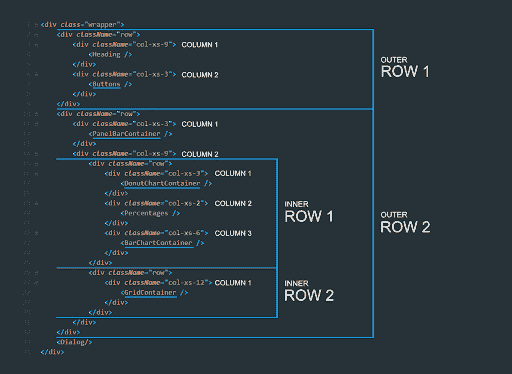T2】](https://res.cloudinary.com/practicaldev/image/fetch/s--gVL8J2te--/c_limit%2Cf_auto%2Cfl_progressive%2Cq_auto%2Cw_880/https://d585tldpucybw.cloudfront.net/sfimages/default-source/blogs/2018/2018-10/mockuphtml.png%3Fsfvrsn%3Dd3a8cfe2_0)

我在上面的图片中放置的每个自定义标签都只是用于可视化表示的占位符，所以不要逐字复制这个 HTML。同样，这只是为了帮助我们理解我们需要的结构。

您将在 HTML 中看到许多标记，我们最终会用我们需要的实际组件或 HTML 来替换它们。下面是我想让你复制到你的`App.js`页面的实际代码，让我们开始。

我还会给你一些 CSS 代码粘贴到你的`App.css`文件中。继续用下面的要点替换你的`App.css`文件中的 CSS。

最后，添加 bootstrap。为了简单起见，在`public/index.html`文件中添加一个到[引导 CDN](https://maxcdn.bootstrapcdn.com/bootstrap/4.0.0/css/bootstrap.min.css) 的链接。添加在**快捷图标** :
的正下方

```
<link rel="stylesheet" href="https://maxcdn.bootstrapcdn.com/bootstrap/4.0.0/css/bootstrap.min.css" /> 
```

它包含了一些样式，不仅仅是为了帮助我们刚刚粘贴进去的 HTML。你的页面现在看起来也有点疯狂，但实际上一切都准备好了，我们可以进入下一步，这需要准备一些数据并添加我们的第一个剑道 UI 组件(按钮)。

## 添加按钮

我们已经在页面上有几个按钮，但我们想改变这些剑道用户界面按钮，因为它将允许我们引入我们的第一个剑道用户界面组件和剑道用户界面材料主题。我们已经添加了依赖项，所以让我们进入`App.js page`，在`App.js`页面顶部的`import ReactDOM`行下面添加`Button` & `savePDF`导入:

```
import ReactDOM from 'react-dom';
import { Button } from '@progress/kendo-react-buttons';
import { savePDF } from '@progress/kendo-react-pdf'; 
```

我们可以连接**导出到 PDF** 按钮。让我们用纱线安装这些包来完成这项工作。

```
$ yarn add @progress/kendo-react-pdf
           @progress/kendo-drawing
           @progress/kendo-react-buttons 
```

现在将两个`<button>`标签(如下所示)改为使用大写的 B:

```
<Button>Share</Button>
<Button>Export to PDF</Button> 
```

如果尚未运行，使用`$ yarn start`运行应用程序。您现在至少应该可以看到文本和按钮了。

## 导出为 PDF

很多时候，我们只是希望用户能够将页面上的所有内容打印成 PDF 文件。为了做到这一点，我们可以使用刚刚导入的包来完成所有繁重的工作。

将以下代码添加到`App.js` :
中的应用程序组件类中

```
constructor(props) {
  super(props);
  this.appContainer = React.createRef();
}

handlePDFExport = () => {
  savePDF(ReactDOM.findDOMNode(this.appContainer), { paperSize: 'auto' });
} 
```

有了这些代码，我们需要将`this.appContainer`绑定到一个对象，这个对象是对 HTML 元素的引用，这个元素包含了我们想要打印成 PDF 的区域。

因为我们想要打印整个销售仪表板，所以我们将在 JSX 中最外面的`<div>`上放置一个`ref`属性。你可以通过它的 _ **类名** _: `app-container` :
找到它

```
<div className="app-container" ref={(el) => this.appContainer = el}> 
```

[`ref`属性](https://reactjs.org/docs/refs-and-the-dom.html)允许我们将一个代表其所在的`<div>`元素内容的`HTMLDivElement`赋值给一个本地属性。

接下来，我们将希望确保从`onClick`事件中调用`handlePDFExport()`函数。让我们暂时禁用另一个按钮。

```
<Button disabled>Share</Button>
<Button onClick={this.handlePDFExport}>Export to PDF</Button> 
```

现在让我们测试我们的按钮，以确保一切正常。当按下按钮时，您应该会得到下载 PDF 文件的提示。打开 PDF 后，您应该会看到我们页面的全部内容。您可以想象如果我们将这个属性放在页面中的另一个`<div>`上会发生什么。此时，按钮将只打印`<div>`元素的内容。一旦网格开始工作，我们将再次讨论这个想法，并创建一个只打印数据网格的按钮。

在继续之前，我想指出的一点是，在 React 中，当我们想像在`onClick`处理程序中那样调用 JSX 内部的函数时，我们只需将函数名赋给属性。不需要引号调用括号，只需要函数名如下:

```
onClick={this.handlePDFExport} 
```

但是等等？我们的按钮看起来都…嗯！我们忘了一些东西。我们需要引入剑道 UI 材质主题，因为我们实际上在页面上使用了一些剑道 UI 组件。一旦我们导入了正确的 CSS 文件，我们需要引入的所有其他组件也将受益于这种样式。

在`App.js`的底部导入材质主题，就在`App.css`的上方。

```
import '@progress/kendo-theme-material/dist/all.css'; 
```

让我们不要忘记，我们将需要拉在这个主题使用纱线，以便进口工作。

```
$ yarn add @progress/kendo-theme-material 
```

让我们也引入一个类，给我们的按钮一些空间。它已经在我们添加到`App.css`文件的样式中定义了。在按钮周围的 div 上，将`buttons-right`添加到`className`中。按钮及其包含的 div 现在应该是这样的:

```
<div className="col-xs-3 col-sm-3 col-md-3 col-lg-3 col-xl-3">
  <Button disabled>Share</Button>
  <Button onClick={this.handlePDFExport}>Export to PDF</Button>
</div> 
```

现在你应该看到你的按钮呈现出一种材质设计风格。

[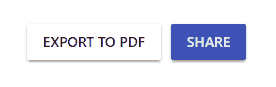T2】](https://res.cloudinary.com/practicaldev/image/fetch/s---iLhfOxY--/c_limit%2Cf_auto%2Cfl_progressive%2Cq_auto%2Cw_880/https://lh3.googleusercontent.com/lJXFzsVGDWWapYMRcOeQrjeuHrIc-uOorgq0HEHlwhH7e7KrfEUmcS_qfddDfaboTdZoDFKQV5uCbQ)

## 分享对话框

让我们现在连线共享按钮。在真实的生产应用程序中，这将与一个服务对话，该服务可用于向某人发送电子邮件以共享仪表板链接，但我们只是将它打印到控制台。

在我们的`App.js`文件的构造函数中，让我们创建一个对象来保存状态。这个状态对象被 React 理解为一个特殊对象。在引擎盖下，React 以不同的方式处理该对象。

```
constructor(props) {
  super(props);
  this.appContainer = React.createRef();
  this.state = {
    showDialog: false
  }
} 
```

让我们在`App`类中创建一个函数，在`handlePDFExport()`函数的下面。正如我提到的[反应状态](https://reactjs.org/docs/state-and-lifecycle.html)对象是特殊的，它们有一个专门用于与之交互的 API。例如，如果我们想以任何方式改变状态，我们不应该直接访问对象并赋予新的值。相反，我们使用`setState`方法来更新状态。这将安排更新组件的状态对象。当状态改变时，组件通过重新呈现来响应。

```
handleShare = () => {
  this.setState({
    showDialog: !this.state.showDialog
  })
} 
```

> _ **PRO 提示:** _ 要执行一个函数，或者验证状态更新是否正确，我们可以将一个函数作为第二个参数(回调)传递给`setState()`，一旦状态更新，函数就会被执行。了解更多信息并[浏览州](https://reactjs.org/docs/react-component.html#other-apis-1)的 React 文档。

```
handleShare = () => {
  this.setState({
    showDialog: !this.state.showDialog
  }, () => console.log(this.state))
} 
```

我们还需要更新按钮来使用这个功能。我们将通过将 primary 设置为`true`来进一步添加一个区别特征。在幕后，我们的组件获取那个`true`值，并赋予按钮一个`primary`样式:

```
<Button primary={true} onClick={this.handleShare}>Share</Button> 
```

所以这个按钮在我们的状态对象中切换一个布尔值，这通常是隐藏和显示页面的模态、弹出窗口或隐藏区域的好方法。但是我们需要创建一个隐藏的区域，当这个按钮被点击时，它会显示出来。正如我们从 setState 回调中看到的，每次我们按下 **Share 按钮**时，该值都会翻转。我们将要添加的这个 HTML 代码块应该替换为下面的代码:

```
<h4 style={{display : 'none'}}>Dialog Shown/Hidden with Logic</h4> 
```

替换为以下代码:

```
{this.state.showDialog &&
  <Dialog title={"Share this report"} onClose={this.handleShare}>
    <p>Please enter the email address/es of the recipient/s.</p>
    <Input placeholder="example@progress.com" />
    <DialogActionsBar>
      <Button primary={true} onClick={this.handleShare}>Share</Button>
      <Button onClick={this.handleShare}>Cancel</Button>
    </DialogActionsBar>
  </Dialog>
} 
```

让我们打开刚刚添加的内容:我们引入了一个名为`<Dialog>`的新的 KendoReact 组件，它被包装在一个表达式中，该表达式将根据被翻转的`state.showDialog`值隐藏或显示该区域。最好的理解是，我们的`<Dialog>`组件等同于一个真值。类似于说:

```
{ this.state.showDialog && true } 
```

因为它与`this.state.showDialog`成对出现，如果两者都为真，对话框就会显示。然而，如果`this.state.showDialog`为假，则`<Dialog>`组件的输出不会显示。同样，这只是一种思考这个陈述的方式，如果出于某种原因，它看起来很奇怪。

如果不从`react-dialogs`包中导入`<Dialog></Dialog>`组件，它将无法工作，所以让我们添加并导入:

```
$ yarn add @progress/kendo-react-dialogs
           @progress/kendo-react-inputs
           @progress/kendo-react-intl 
```

我们还会将这些包导入到我们的`App.js`中。我们的导入现在应该是这样的:

```
import React, { Component } from 'react';
import ReactDOM from 'react-dom';

import { Dialog, DialogActionsBar } from '@progress/kendo-react-dialogs';
import { Input } from '@progress/kendo-react-inputs';

import { Button } from '@progress/kendo-react-buttons';
import { savePDF } from '@progress/kendo-react-pdf';

import '@progress/kendo-theme-material/dist/all.css';
import './App.css'; 
```

当我点击我们的新按钮时，我发现少了一些东西。我过去工作过的材质设计 UI 在某些 UI 元素上利用了涟漪效应。按钮确实显示了这种连锁反应，但我在我们的产品上没有看到。这是因为 Kendo UI 将它作为一个单独的包提供，我认为这是一个好主意，因为如果我不想使用它，我可能希望也可能不希望将额外的代码带入 CSS 和 JavaScript。让我们添加并导入这个`<Ripple>`作为一个组件，它将包装我们的应用程序:

```
$ yarn add @progress/kendo-react-ripple 
```

完成后，你现在可以将`Ripple`导入到**对话框**和**对话框**上方的`App.js`页面中

```
import { Ripple } from '@progress/kendo-react-ripple'; 
```

接下来，我们想在`app-container`的`<div>`元素周围添加一个`<Ripple />`容器，这样所有的`Button`和其他组件都将得到作为`<Ripple />` :
子元素的涟漪效果

```
class App extends Component {
  constructor(props) { /* ... */ }
  handlePDFExport = () => { /* ... */ }

  render() {
    return (
      <Ripple>
        <div className="app-container" ref={(elem) => this.appContainer = elem}>
          { /* ... */ }
        </div>
      </Ripple>
    );
  }
}

export default App; 
```

现在，当您在按钮点击状态之外单击并拖动并释放时，您将体验到该效果，而不会激活按钮的`click`事件。

[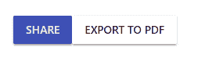T2】](https://res.cloudinary.com/practicaldev/image/fetch/s--MbHV4yHH--/c_limit%2Cf_auto%2Cfl_progressive%2Cq_auto%2Cw_880/https://lh3.googleusercontent.com/Z7FC6bPNAdyjgW32cvpuEG4KQ5Ghd4-_rtGRAynSFv4Udj-yJ1ZQZ_uNxSegDOjtXW8rJYp-Rsc7MQ)

## 嗯，甜甜圈图

我想开始引入`Chart`组件。它拥有最少的相关数据量，所以这是一个合乎逻辑的下一步，并且易于实现。

让我们添加组件(注释掉)，替换`<h4>`元素占位符。找到这样一行代码:

```
<h4>Donut Chart Container</h4> 
```

并替换为:

```
{/* <DonutChartContainer /> */} 
```

[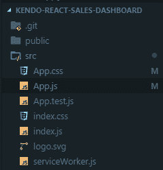T2】](https://res.cloudinary.com/practicaldev/image/fetch/s--_WeWZSLZ--/c_limit%2Cf_auto%2Cfl_progressive%2Cq_auto%2Cw_880/https://lh3.googleusercontent.com/RSBGY_xZE2KdOb--QLcmQNeluO76xbfoEWY_aAPTKxAA0_F0WOarv80XeQMgtdZ_6cAgppY-GBNiDQ)

接下来，让我们为所有容器组件添加一个目录，并将其命名为`components`，在其中创建我们的第一个容器组件，名为:`DonutChartContainer.js`。我们将继续为我们的每个 KendoReact 组件使用这种命名惯例。

我们还需要为 [KendoReact 图表](https://www.telerik.com/kendo-react-ui/components/charts/) :
带来包

```
$ yarn add @progress/kendo-react-charts 
```

接下来，将我从剑道 UI 文档中修改的代码复制到下面要点中的`DonutChartContainer.js`:

KendoReact 图表为构建丰富的数据可视化提供了大量的功能。要了解更多关于它们的信息，请随意查看图表 API 。

[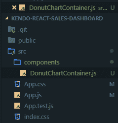T2】](https://res.cloudinary.com/practicaldev/image/fetch/s--se6IUG2k--/c_limit%2Cf_auto%2Cfl_progressive%2Cq_auto%2Cw_880/https://lh3.googleusercontent.com/nefnuKMuR7IHwbyWciU6xIoYXcGmXyJMs8PIOHFSTE7bgQWK86TH7Z3Op7KnHVXgO0__CaCcy3g_tg)

我们想为`Chart`创建的第一件事是一些虚拟数据。就像我之前说的，我们所有的组件都需要数据。让我们创建一个名为`data`的目录，作为我们的`components`目录的兄弟。在该目录中创建一个名为`appData.js`文件。

请记住，这个想法是为了显示第四季度售出的食品(按类别)的百分比。我们将使用该特定数据来填充圆环图。我们需要某种类型的标签和百分比值。

*   `foodType`第四季度在所有商店销售的食品类别
*   `percentSold`第四季度所有商店中以小数表示的销售百分比

将下面的代码复制到`appData.js`文件:

```
export const donutChartData = [
  { 'foodType': 'Beverages', 'percentSold': 16.5 },
  { 'foodType': 'Condiments', 'percentSold': 24 },
  { 'foodType': 'Produce', 'percentSold': 13 },
  { 'foodType': 'Meat/Poultry', 'percentSold': 16.5 },
  { 'foodType': 'Seafood', 'percentSold': 20 },
  { 'foodType': 'Other', 'percentSold': 10 }
]; 
```

在`App.js`文件中，我们需要添加一个导入:

```
import { DonutChartContainer } from './components/DonutChartContainer'; 
```

...并在 HTML 中取消对`{/* <DonutChartContainer /> */}`的注释。

```
<DonutChartContainer /> 
```

现在我们的组件应该工作了。让我们做一个更改，以便您了解我们如何设置圆环图的标签格式。现在我们只显示类别，因为我们在组件配置中指定了它。

在`DonutChartContainer.js`文件中，将`labelTemplate`函数改为:

```
const labelTemplate = (e) => (e.category + '\n'+ e.value + '%'); 
```

[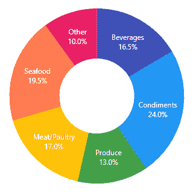T2】](https://res.cloudinary.com/practicaldev/image/fetch/s--7SsQLqiR--/c_limit%2Cf_auto%2Cfl_progressive%2Cq_auto%2Cw_880/https://lh3.googleusercontent.com/8Lb0skzqJZEsfgR7aHCqYCqYHSusicoGB-LLUsfhyOeYARnNLP2XUEkULYudNDas1g87z1EefvwQ7w)

这是我们漂亮的甜甜圈，看起来甚至很好吃！当我们使用圆环图时，我们与一个`<ChartSeriesLabels>`组件进行交互。`content`输入接受一个返回字符串的函数。就这么简单。它让每个部分(在我们的例子中是类别)都充满了美好。利用我们对 JavaScript 的了解，我们可以实现一些更好的格式化，我认为我们可能想要使用`e.percentage`而不是`e.value`。你可以在我们的[图表系列标签文档](https://www.telerik.com/kendo-react-ui/components/charts/api/ChartSeriesLabelsProps/#toc-content)中获得我们可以利用的领域的详细信息。

我修改了模板函数，以实现更理想的显示，通过选择百分比，我保证我将总是得到每个类别在总数中所占的份额。这是为了防止我们决定使用不等于 100 的数据作为所有值的总和。

```
const labelTemplate = (e) => (e.category + '\n' + (e.percentage*100) +'%'); 
```

这里显示没有变化，我只是想用`percentage`代替`value`。

## 提升条形图组件

下一个合乎逻辑的步骤是创建一个条形图`Chart`,表示从 2018 年第四季度开始每个月的百分比月度细分。甜甜圈`Chart`显示了整个季度的平均百分比，但我们的条形图将显示该季度的每个月。以下是我们需要添加到`appData.js`文件中的数据。您会注意到我们的数据也对应于圆环图，因此用户可以很容易地看到这种关系。

```
export const barChartQ4Months =['October', 'November', 'December'];
export const barChartMonthlyPercentages = [
  { name: 'Beverages', data: [14, 16, 19.5] },
  { name: 'Condiments', data: [24, 23.5, 24.5] },
  { name: 'Produce', data: [12.5, 12.5, 14] },
  { name: 'Meat/Poultry', data: [16, 18, 17] },
  { name: 'Seafood', data: [21.5, 20, 17] },
  { name: 'Other', data: [7, 12, 11] },
]; 
```

有了这些数据，我们可以向我们的`components`目录添加一个新的容器组件。创建一个名为`BarChartContainer.js`的文件。

替换`<h4>`元素占位符。找到这样一行代码:

```
<h4>Bar Chart Container</h4> 
```

并替换为:

```
{/* <BarChartContainer /> */} 
```

接下来，复制我从剑道 UI 文档示例中稍微修改过的代码，并将其放入下面要点中的`BarChartContainer.js`:

在页面顶部放置一个导入，就在`App.js` :
中 CSS 导入的上面

```
import { BarChartContainer } from './components/BarChartContainer'; 
```

...同样在`App.js`中，取消 HTML 中`{/* <BarChartContainer /> */}`的注释。

```
<BarChartContainer /> 
```

做一个快速的视觉确认，以确保您的条形图线条使用与圆环图相同的颜色。一切都应该对齐，因为我们每个图表的数据都是按相同的顺序排列的。如果您正在构建一个 API 来服务于这些数据，那么您会希望确保不会出错。

这可能是迄今为止最容易设置的一个。容器页面非常简单，因为我们不处理任何状态。尽管如此，我们仍然希望在我们的项目中有那层抽象。

我喜欢考虑这个组件的方式是，我看着我的数据形状。我们有一系列的月份，每个月份都会转化为条形图上的一个类别。我们也有一个对象数组。这些对象中的每一个都有一个与我们的食物类别相对应的`name`字段。它还将有一个数据字段。因此，对于每个月(条形图上的类别)，我们迭代每个数据字段数组的第一个索引。每次迭代都会构建一个高度对应于索引值的条形。这种情况每个月都会发生。

我给任何使用这个图表的人的建议是，以那个例子为例，熟悉一下`<Chart>`组件中的每个标签如何在我如何分解数据的故事中发挥作用。我们有一个[图例](https://www.telerik.com/kendo-react-ui/components/charts/api/ChartLegendProps/)，[图表类别轴&项目](https://www.telerik.com/kendo-react-ui/components/charts/api/ChartCategoryAxisItemProps/)，图表系列&项目，[图表值轴&项目](https://www.telerik.com/kendo-react-ui/components/charts/api/ChartValueAxisItemProps/)，当然还有包含组件，即[图表](https://www.telerik.com/kendo-react-ui/components/charts/series-types/bar/)本身。

在这些图表上，黑客攻击的机会肯定也在这里。查看这篇关于使用剑道 UI 的[数据可视化的文章，了解一些使用不同图表的非常酷的想法，包括我们的朋友条形图先生。暂时把它放在一边，让我们继续前进。](https://developer.telerik.com/featured/6-rules-for-awesome-data-visualizations-with-kendo-ui/)

## 添加网格组件

到目前为止，容器是剑道 UI 中最常用和最受欢迎的组件之一。

一个产品列表将作为我们网格的数据。我们将复制下面的要点并粘贴到`appData.js`中。这将作为第 4 季度的前 10 大产品，是我们构建控制面板的核心数据。在更高级的情况下，`Grid`可以通过带有自动完成功能的搜索来填充，并且可以过滤或搜索更多的产品，等等。我喜欢剑道 UI 的一点是，我能想到的大部分东西只需要很少的输入，几乎不需要任何布线。

在做任何事情之前，我想告诉你在使用`Grid` :
之前我添加了什么包

```
$ yarn add @progress/kendo-data-query
           @progress/kendo-react-dateinputs
           @progress/kendo-react-dropdowns
           @progress/kendo-react-grid
           @progress/kendo-react-inputs
           @progress/kendo-react-intl 
```

这应该涵盖了我们网格组件所需的所有项目。我们已经安装了其中的两个，但这只是因为 KendoReact 组件有时具有其他组件中也存在的依赖关系。再次运行安装程序没有坏处。

接下来，让我们将数据添加到我们的`appData.js`文件中:

查看数据，我们的数据对象中最重要的字段是产品的 ID、名称、类别、价格、库存和停产字段。我带来了比我们需要的多一点的数据。这是希望我能让您尝试显示不同的字段，并对网格本身进行实验。

KendoReact `Grid`的主要组件是实际的`<Grid>`元素，它包含子`<Column>`组件，每个组件都映射到数据对象中的一个特定字段。

我想给你一个这个组件的代码的快速视图，所以如果我只想显示我们的数据集中的 ID、名称和类别，我可以非常容易地并且几乎凭记忆构建这个组件:

```
<Grid style={{height:'300px'}} data={gridData}>
  <Column field="ProductID" title="ID" />
  <Column field="ProductName" title="Name" />
  <Column field="Category.CategoryName" title="Category Name" />
</Grid> 
```

在页面上看起来是这样的:

[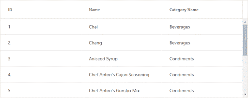T2】](https://res.cloudinary.com/practicaldev/image/fetch/s--8iTn3cCy--/c_limit%2Cf_auto%2Cfl_progressive%2Cq_auto%2Cw_880/https://lh3.googleusercontent.com/H00ow4ioymVwPBkvbhCO4MBCAynwUfAEOZufj_joXrExAM0ewToN0oz7PcE3MA_sB3xCFgBP0-78fA)

接下来，打开`App.js`文件，通过替换`<h4>`元素占位符来添加组件。找到这样一行代码:

```
<h4>Grid Container</h4> 
```

并替换为:

```
{/* <GridContainer /> */} 
```

实现`Grid`就是这么简单。在我们的项目中，我们将使用比你在上面的例子中看到的更多的属性和更多的列大小。从下面的要点中复制整个组件，并将其放入名为`GridContainer.js`的新文件中:

添加导入:

```
import { GridContainer } from './components/GridContainer'; 
```

现在取消对组件的引用的注释:

```
<GridContainer /> 
```

[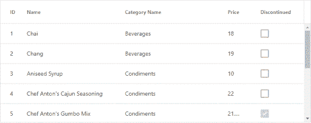T2】](https://res.cloudinary.com/practicaldev/image/fetch/s--Gnqlme5I--/c_limit%2Cf_auto%2Cfl_progressive%2Cq_auto%2Cw_880/https://lh3.googleusercontent.com/tdew-UBYtqoRjiXo5CtbUd7DYwy_dk86xyv25eIlpLyGpNwJEFtwaxWl4911k32YBrIqwT9lLHgiIA)

在这一点上，我们有了正在工作的`Grid`组件，但是我已经在考虑我想用这个`GridContainer.js`组件做的一些事情，它将涉及管理状态。尽管此时我不想引入任何类似 Redux 的东西，但我可能不得不从使用无状态功能组件切换到使用基于类的组件。但是在我们开始之前，我想指出，到目前为止，我们只使用了无状态功能组件来创建我们的组件。我想花点时间解释一下为什么，并给你一个在 React 中创建组件的两种方法的快速入门。

### 无状态功能组件

到目前为止，我们一直使用无状态的功能组件，或者换句话说，被定义为功能的组件。它们只接受单个 props 对象参数，并且不持有任何自己的状态——它们没有生命周期。到目前为止，我们还没有为容器组件要求任何本地状态。它们只是作为我们剑道 UI 组件的简单容器。分离对组织有好处，但仅此而已。我想快速向您展示使用 ES6 arrow 函数编写功能组件的另一种方式，这将允许我们省略关键字、`function`和`return`以及花括号。使用这种方法，组件可能看起来像这样:

```
const HelloContainer = ({ data}) => (<div>Hello, {data.name}!</div>); 
```

如果我们正在创建没有任何状态的简单容器组件，这是非常有用的，我应该注意，只要有可能，强迫自己使用这些类型的组件是你应该一直努力去做的事情。

### 类组件

类组件受益于能够拥有一个构造函数并管理它们自己的状态。语法如下:

```
class HelloContainer extends React.Component {
  render() {
    return <div>{this.props.name}</div>;
  }
} 
```

如果你想了解更多关于在 React 中创建组件的方法，这超出了本教程的范围，[看看这个来自陈宸的视频](https://www.youtube.com/watch?v=YaZg8wg39QQ)。

到目前为止，我们还没有对要求我们使用创建组件的类方法的`GridContainer.js`做任何特别的事情。让我向您展示我从知道我可以使用无状态功能组件，到意识到我需要一个基于类的组件来处理状态的过程。

### 嵌入迷你图作为网格列的内容

我想给这个组件添加一个新的`<Column />`，我想向你展示一个很酷的技巧，它将允许我们通过[定制 KendoReact 网格的`cell`](https://www.telerik.com/kendo-react-ui/components/grid/cells/) 内容来内嵌一个 [KendoReact 迷你图](https://www.telerik.com/kendo-react-ui/components/charts/sparkline/)。为此，我们需要创建一组随机数据用于`Sparkline`组件。然后，我们可以将随机数据数组插入到已经存在的每个项目的`gridData`对象中，并使其成为一个名为`PriceHistory`的属性。

让我们从将这个组件转换成基于类的组件并导入`Sparkline`组件开始。让我们根据以下要点替换我们的组件:

复制新代码，我们从使用`export const`到使用`export default class`，或者我们从无状态功能组件到基于类的组件。在这样做的时候，我们遇到了一个错误。我们需要更新我们在`App.js`的进口声明。

```
import GridContainer from './components/GridContainer'; 
```

[了解在 ES6](https://stackoverflow.com/questions/36795819/when-should-i-use-curly-braces-for-es6-import/36796281#36796281) 中导入时何时使用花括号。

我们添加了一些代码来修改数据并将随机数添加到数组中。为此，我们将创建一个函数`processData()`，并将其添加到`GridContainer` :

```
processData = (data) => {
  data.forEach((item) => {
    item.PriceHistory = Array.from({length: 40},() => Math.floor(Math.random()*100));
    return item;
  })
  return data;
} 
```

属性`PriceHistory`现在在呈现`Grid`时可用。我们可以通过在新函数的`return data;`行之前放置一个`debugger;`语句，然后打开 Chrome DevTools 并检查那个`data`对象来看到这一点。现在我们只需要一个可以使用新的`PriceHistory`属性的`Sparkline`。

我们将在我们的`GridContainer.js`文件中构建另一个组件，因为这个新组件将只在这个文件中使用。就在导入语句下，用下面的代码创建一个新的导出类:

```
class SparkLineChartCell extends React.Component {
  render() {
    return (<td><Sparkline data={this.props.dataItem.PriceHistory} /></td>)
  }
} 
```

接下来，将新列添加到`Grid`组件中，就在 discontinued 列的上方:

```
<Column field="PriceHistory" title="Price history" cell={SparkLineChartCell} /> 
```

以防你有任何问题，我已经为`GridContainer.js`创建了[要点](https://gist.github.com/httpJunkie/7a8a1f14e5d5fdc90065efe29d457ec0)，展示了它在这一点上应该是什么样子。就像这样，我们在每个`Grid`行的一列中有`Sparkline`组件渲染:

[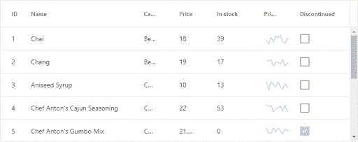T2】](https://res.cloudinary.com/practicaldev/image/fetch/s--Vxc_nGfY--/c_limit%2Cf_auto%2Cfl_progressive%2Cq_auto%2Cw_880/https://lh3.googleusercontent.com/wG4ku4srR2hDsF-JnfuAZ2v0eWWl4yXCqZtO3FXIGanh_eQANCLds_HGLzNP54SaWVcv5Y9b1jEf0w)

## 添加 PanelBar 导航

在开始之前，我们需要安装一个包:

```
$ yarn add @progress/kendo-react-layout 
```

数据非常直观。让我们将它复制到`appData.js`文件中。数据的形状是一个具有两个顶层节点的对象，节点包含数组作为值。

让我们添加`PanelBarContainer`组件。一旦它完全实现，我们将能够用它来影响应用程序中的一些其他状态，以展示一些交互性。但首先我们需要让组件工作，我们需要为队友的部分带来一些额外的风格。复制这个要点中的代码，并将其添加到`App.css`页面的底部:

现在我们只需要复制下面的要点并粘贴到我们的`PanelBarContainer.js`组件中:

一旦复制到`PanelBarContainer.js`中，我们需要为`PanelBarContainer` :
添加到`App.js`的导入

```
import PanelBarContainer from './components/PanelBarContainer'; 
```

并将`PanelBarContainer`的`<h4>`元素替换为

```
<PanelBarContainer /> 
```

我们还需要为每个团队成员添加一些个人资料图像，我已经创建了一个小 zip 文件，其中有一些图像已经正确调整大小，您可以使用:`profile_images.zip`。

下载完这些图像后，将它们添加到项目中的一个`public/img`目录中，作为任何静态文件，如徽标、图形、图像等。公共目录是这些的合适位置。

我们的新组件应该如下所示:

[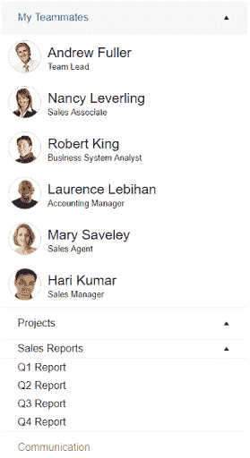T2】](https://res.cloudinary.com/practicaldev/image/fetch/s--qV_i-4gA--/c_limit%2Cf_auto%2Cfl_progressive%2Cq_auto%2Cw_880/https://lh3.googleusercontent.com/OyymscEafIoYJqMHI9UUdTj-3kV-e3iIm1cXMWnPTbwdhw89WeA2O4A8HsczsVPi1bo0EisZiEgjmA)

在这一点上，我们已经做了很多工作，仪表板的布局方式在中大型屏幕(960 像素及以上)上看起来不错。它还可以对较低分辨率的屏幕进行一些调整，但团队成员部分尤其可以使用一些额外的媒体查询来帮助适应较低的分辨率。

我们可以做一些事情来扩展这个演示，增加一些交互性，或者重构以使用 Redux，我们还可以构建一个 API 来提供我们的数据。我恳请您探索这些选项，并在评论部分告诉我们您对我们组件的看法。另外，如果您想进一步了解我们可以构建的更高级的概念，请告诉我们。

### 试用 KendoReact

我们在 [KendoReact](https://www.telerik.com/kendo-react-ui/) 的帮助下完成了这一切，我们已经用原生 UI 组件从头开始构建了它，因此您可以快速构建漂亮的 React 应用程序。今天就免费下载[30 天免费试用版](https://www.telerik.com/download-login-v2-kendo-react-ui)，探索 KendoReact 能做的一切。

[开始我的 KendoReact 试验](https://www.telerik.com/download-login-v2-kendo-react-ui)