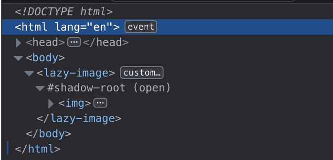
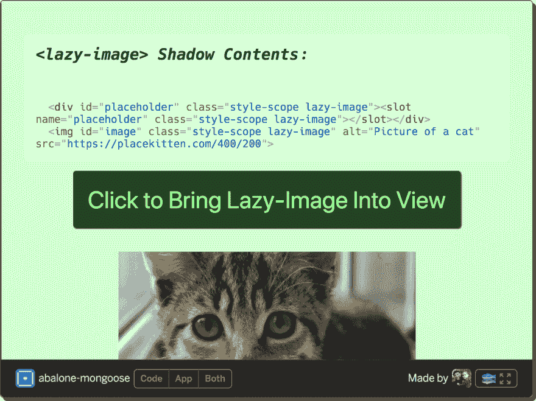
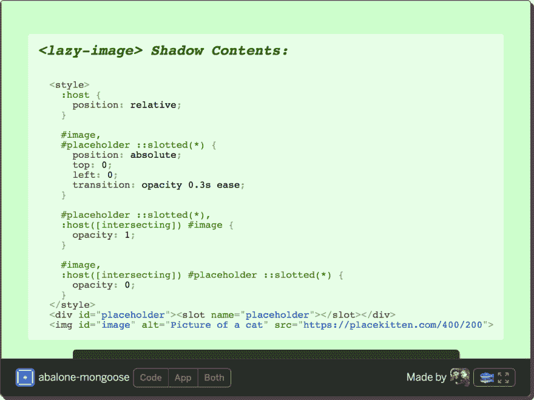

# 让我们构建 Web 组件！第 3 部分:普通组件

> 原文：<https://dev.to/bennypowers/lets-build-web-components-part-3-vanilla-components-4on3>

基于组件的 UI 最近非常流行。您知道 web 有自己的本地组件模块，不需要使用任何库吗？真实故事！你可以编写、发布和重用单文件组件，这些组件可以在任何好的浏览器 [*](https://caniuse.com/#feat=shadowdomv1) 和任何框架[中工作(如果那是你的包的话)。](https://custom-elements-everywhere.com/)

在我们的[上一篇文章](https://dev.to/bennypowers/lets-build-web-components-part-2-the-polyfills-dkh)中，我们了解了 JavaScript polyfills，它允许我们将组件发送到不支持该规范的浏览器。

[](/bennypowers) [## 让我们构建 Web 组件！第 2 部分:聚合填料

### 本尼·鲍尔斯🇮🇱🇨🇦9 月 29 日 1812 分钟阅读

#webcomponents #javascript #html #polyfill](/bennypowers/lets-build-web-components-part-2-the-polyfills-dkh)

今天，我们变得实际了👷‍♂️，我们将构建一个没有任何库或框架代码的单文件 web 组件。我们将编写一个元素来延迟加载图像，这样浏览器只在图像出现(或即将出现)在屏幕上时才读取图像。我们将使我们的元素**可访问**，并利用 web <abbr title="application programmer interface">API</abbr> 如`IntersectionObserver`使其**轻量级**和**高性能**。如果我们喜欢，我们甚至可以添加一些额外的铃铛和哨子。

*   [自定义元素类](#the-custom-element-class)
*   [生命周期回调](#lifecycle-callbacks)
    *   [`constructor`](#the-constructor)
    *   [`connectedCallback`](#the-connectedCallback)
    *   [`attributeChangedCallback`](#the-attributeChangedCallback)
    *   [`disconnectedCallback`](#the-disconnectedCallback)
    *   [`adoptedCallback`](#the-adoptedCallback)
    *   [页面生命周期](#the-page-lifecycle)
*   [惰性加载](#lazy-loading)
*   [设计我们的组件](#styling-our-component)
    *   [`:host`和`<slot>`](#host-and-slot)
    *   [CSS 自定义属性](#css-custom-properties)
*   [可访问性](#accessibility)
    *   [扩展内置元素](#extending-built-in-elements)
    *   [无障碍自主元素](#accessible-autonomous-elements)
*   [结论](#conclusions)

我们开始吧！打开你的编辑器，创建一个名为`lazy-image.js`的文件，这个文件将包含我们的组件。

## 自定义元素类

正如我们在关于 web 组件标准的第一篇文章中看到的，我们的第一步将是初始化和注册一个定制元素类，并为它提供一个基本模板。稍后我们将改进模板，添加我们的自定义行为。

```
const tagName = 'lazy-image';
const template = document.createElement('template');
template.innerHTML = ``;

class LazyImage extends HTMLElement {
  connectedCallback() {
    if (!this.shadowRoot) {
      this.attachShadow({mode: 'open'});
      this.shadowRoot.appendChild(template.content.cloneNode(true));
    }
  }
}

const register = () => customElements.define(tagName, LazyImage);
window.WebComponents ? window.WebComponents.waitFor(register) : register(); 
```

Enter fullscreen mode Exit fullscreen mode

好吧。如果你一直在关注我们之前的帖子，这些应该都很熟悉，但是稍微回顾一下是有必要的:

1.  我们创建一个模板元素，并在其中定义元素的 shadow <abbr title="document object model">DOM</abbr> 。
2.  我们在`class`中定义自定义元素的行为。
3.  我们的元素的`connectedCallback`方法创建了一个影子根，并将模板戳入其中。

把它放进你的文档，然后给出:

```
<!doctype html>
<html lang="en">
  <head>
    <script src="https://unpkg.com/@webcomponents/webcomponentsjs/webcomponents-loader.js"></script>
    <script type="module" src="./lazy-image.js"></script>
  </head>
  <body>
    <lazy-image></lazy-image>
  </body>
</html> 
```

Enter fullscreen mode Exit fullscreen mode[https://glitch.com/embed/#!/embed/sunset-sink?sidebarCollapsed=true&path=index.html](https://glitch.com/embed/#!/embed/sunset-sink?sidebarCollapsed=true&path=index.html)

很刺激，对吧？好吧，这是一个卑微的开始，但至少它的工作。如果我们用开发工具检查我们的元素，我们可以看到它包含我们的影子 DOM，并且与我们的自定义元素类相关联。

[T2】](https://res.cloudinary.com/practicaldev/image/fetch/s--7OcQJBYY--/c_limit%2Cf_auto%2Cfl_progressive%2Cq_auto%2Cw_880/https://thepracticaldev.s3.amazonaws.com/i/831jg8zg9zs8jy4cl3hd.png)

这个小徽章是 Firefox 告诉我们这是一个自定义元素的方式。如果您单击徽章，调试器将弹出打开您的元素的定义。做得好，火狐开发工具团队！

在下一部分，我们将真正开始烹饪。

## 生命周期回调

自定义元素有四种特殊的实例方法，它们将在不同的时间运行:

1.  [`connectedCallback`](#the-connectedCallback) ，
2.  [`attributeChangedCallback`](#the-attributeChangedCallback) ，
3.  [`disconnectedCallback`](#the-disconnectedCallback) ，
4.  [`adoptedCallback`](#the-adoptedCallback) ，

所有默认定义为`null`。这些以及 [`constructor`](#the-constructor) ，都是定制元素生命周期回调。

## `constructor`

第一个是构造函数。每当创建元素时，在将元素附加到文档之前，它都会运行。

```
// CustomElement's constructor runs
const el = document.createElement('custom-element'); 
```

Enter fullscreen mode Exit fullscreen mode

自定义元素的构造函数不能有任何参数，它必须在主体的第一行调用`super()`，以便将行为委托给`HTMLElement`、`Node`等。；并将`this`绑定到元素实例。构造函数不应返回除`undefined`或`this`之外的任何值；

```
// Don't do this
class BustedElement extends HTMLElement {
  constructor(bar) {
    this.foo = bar;
    return bar;
  }
}

// Do This
class DecentElement extends HTMLElement {
  constructor() {
    super();
    if (!window.bar) return;
    this.foo = window.bar;
  }
} 
```

Enter fullscreen mode Exit fullscreen mode

您可能想要访问元素的属性`parentNode`、子元素等。但是不要屈服于诱惑:如果您的元素没有连接(即附加)到 DOM 树，那么它还没有升级，这意味着它还没有任何子元素或属性。如果在定义元素之前已经在文档中定义了元素，那么您的代码将会工作，但是如果 JavaScript 创建了元素，那么您的代码将会失败。

在构造函数中附加影子根并向其追加元素也是可以的。但是由于 polyfills 必须向 light DOM 添加类，并且元素可能还没有连接，所以我们将在本教程的`connectedCallback`中一直这样做，

由于这些原因，最好将构造函数的活动限制在设置内部状态，包括默认值，以及在使用聚合填充时，附加阴影根并调用`connectedCallback`中的`styleElement`。只要确保检查`shadowRoot`是否已经存在，否则下次你的元素连接时(例如通过`document.body.append(myLazyImage)`)将抛出一个错误。

```
// Don't do this
class BustedImage extends HTMLElement {
  constructor() {
    super();
    this.attachShadow({mode: 'open'});
    this.shadowRoot.appendChild(template.content.cloneNode(true));
    this.shadowImage = this.shadowRoot.getElementById('image');
    // OOPS! Light DOM attributes may not yet exist!
    this.shadowImage.src = this.getAttribute('src');
  }
}

// Do This
class LazyImage extends HTMLElement {
  constructor() {
    super();
    // Set default values of properties, as needed.
    this.src = '';
    // In order to work well with the polyfill,
    // We'll set up the DOM later on, when the element connects.
  }
} 
```

Enter fullscreen mode Exit fullscreen mode

## `connectedCallback`

每次元素连接到 DOM 时，包括第一次升级时，都会触发`connectedCallback`。这是一个建立影子孩子和属性的好时机。

```
const lazyImage = document.createElement('lazy-image'); // constructor runs
document.appendChild(lazyImage); // connectedCallback runs

const container = document.getElementById('container');
container.appendChild(lazyImage); // connectedCallback runs again 
```

Enter fullscreen mode Exit fullscreen mode

```
class LazyImage extends HTMLElement {
  constructor() {
    super();
    this.src = '';
    this.alt = '';
  }

  connectedCallback() {
    // Initialize properties that depend on light DOM
    this.src = this.getAttribute('src') || this.src;
    this.alt = this.getAttribute('alt') || this.alt;
    // Check if shadowRoot exists first
    if (!this.shadowRoot) {
      this.attachShadow({mode: 'open'});
      this.shadowRoot.appendChild(template.content.cloneNode(true));
      this.shadowImage = this.shadowRoot.getElementById('image')
    }
    // Set the shadow img attributes.
    this.shadowImage.src = this.src;
    this.shadowImage.alt = this.alt;
  }
} 
```

Enter fullscreen mode Exit fullscreen mode[https://glitch.com/embed/#!/embed/adaptable-order?previewSize=100&path=index.html](https://glitch.com/embed/#!/embed/adaptable-order?previewSize=100&path=index.html)

嗯，这是令人鼓舞的。我们已经设置了我们的影子 DOM，并实现了一些基本的管道，这些管道根据升级时在我们的元素上找到的属性来设置我们的内部`img`元素的`src`和`alt`属性。

我们希望我们的`shadowImage`的`src`属性与我们的元素的属性同步，我们还希望这些属性与`src` DOM 属性同步。在`attributeChangedCallback`和一些课程设置者的帮助下，我们会实现它。

## `attributeChangedCallback`

当您更改普通``元素的`src`属性时，浏览器通过获取并显示新图像 <abbr title="uniform resource locator">URL</abbr> 来做出响应。类似地，当您使用 JavaScript 在该元素的 DOM 对象上设置`src`属性时，新值会反映在属性中。我们希望我们的元素以同样的方式运行。HTML 规范为这些类型的使用提供了`attributeChangedCallback`。

只要元素的属性发生变化，回调就会以属性名、旧值和新值作为参数运行。但是浏览器不会观察任何属性。您必须通过在名为`observedAttributes` :
的静态属性中定义一个属性名称列表来预先指定您想要对哪些属性做出反应

```
static get observedAttributes() {
  return ['src', 'alt'];
} 
```

Enter fullscreen mode Exit fullscreen mode

有了这个定义，无论任何一个`src`或`alt`属性改变，你的元素的`attributeChangedCallback`都会运行。现在，我们只是将值作为属性转发。

```
attributeChangedCallback(name, oldVal, newVal) {
  this[name] = newVal
} 
```

Enter fullscreen mode Exit fullscreen mode

我们还希望我们的元素通过更新它的 shadowImage 并通过将新值反映到属性来对属性变化做出反应。我们将为此使用 setter:

```
class LazyImage extends HTMLElement {
  /**
   * Guards against loops when reflecting observed attributes.
   * @param  {String} name Attribute name
   * @param  {any} value
   * @protected
   */
  safeSetAttribute(name, value) {
    if (this.getAttribute(name) !== value) this.setAttribute(name, value);
  }

  /**
   * Image URI.
   * @type {String}
   */
  set src(value) {
    this.safeSetAttribute('src', value);
    // Set image src
    if (this.shadowImage) this.shadowImage.src = value;
  }

  get src() {
    return this.getAttribute('src')
  }

  /**
   * Image Alt tag.
   * @type {String}
   */
  set alt(value) {
    this.safeSetAttribute('alt', value);
    // Set image alt
    if (this.shadowImage) this.shadowImage.alt = value;
  }

  get alt() {
    return this.getAttribute('alt')
  }

  static get observedAttributes() {
    return ['src', 'alt'];
  }

  connectedCallback() {
    this.src = this.getAttribute('src');
    this.alt = this.getAttribute('alt');
    if (!this.shadowRoot) {
      this.attachShadow({mode: 'open'});
      this.shadowRoot.appendChild(template.content.cloneNode(true));
      this.shadowImage = this.shadowRoot.getElementById('image');
    }
  }

  attributeChangedCallback(name, oldVal, newVal) {
    this[name] = newVal;
  }
} 
```

Enter fullscreen mode Exit fullscreen mode[https://glitch.com/embed/#!/embed/guttural-tarsier?previewSize=100&path=index.html](https://glitch.com/embed/#!/embed/guttural-tarsier?previewSize=100&path=index.html)

按下按钮会更新定制元素及其阴影子元素上的`src`和`alt`属性。

[T2】](https://res.cloudinary.com/practicaldev/image/fetch/s--l7AZurJu--/c_limit%2Cf_auto%2Cfl_progressive%2Cq_auto%2Cw_880/https://thepracticaldev.s3.amazonaws.com/i/zvwg1ew0c9x96wvw4lds.png)

我们的元素现在透明地公开了本机``元素的主要功能。下一步是添加我们的延迟加载特性。但在此之前，让我们简要讨论一下规范中的最后两个生命周期回调。

### `disconnectedCallback`

每当你的元素需要在从 DOM 中移除之前做一些清理工作时，定义一个`disconnectedCallback`来处理你的清理工作。

```
disconnectedCallback() {
  /* do cleanup stuff here */
} 
```

Enter fullscreen mode Exit fullscreen mode

当我们为元素的每个实例创建一个`IntersectionObserver`时，这对我们很方便。现在，我们将把它作为存根。

### `adoptedCallback`

定制元素也有一个`adoptedCallback`，每当您对另一个文档或文档片段中的定制元素调用`adoptNode`时，它就会运行。在这种情况下，当元素与原始文档断开连接时，首先会运行元素的`disconnectedCallback`，然后是`adoptedCallback`，最后是连接到文档时的`connectedCallback`。

[T2】](https://res.cloudinary.com/practicaldev/image/fetch/s--JaHzMcYi--/c_limit%2Cf_auto%2Cfl_progressive%2Cq_auto%2Cw_880/https://emojipedia-us.s3.dualstack.us-west-1.amazonaws.com/thumbs/240/facebook/138/man-shrugging_1f937-200d-2642-fe0f.png)

我认为这主要是针对已经失效的 HTML 导入规范的。如果[或者](https://github.com/w3c/webcomponents/blob/gh-pages/proposals/html-modules-proposal.md)[HTML 模块](https://github.com/w3c/webcomponents/issues/645)的提议被采纳，它很可能变得更加相关。如果你对用例有任何想法，我们会在评论区看到你。

### 页面生命周期

因此，您的页面生命周期可能如下所示:

1.  获取关键资源，包括聚合填充
2.  构造 DOM
3.  获取延迟的脚本和模块，包括`lazy-image.js`
4.  DOMContentLoaded -文档已完成解析
5.  Polyfills 完成设置，`WebComponents.waitFor`调用其回调
6.  定制元素被升级——文档中的每个`<lazy-image>`实例都被升级为定制元素。`constructor`和`connectedCallback`跑。
7.  如果 JavaScript 创建了一个`<lazy-image>`的实例，构造函数就会运行。当实例连接到 DOM 树时，`connectedCallback`将会运行。
8.  如果 JavaScript 从 DOM 中删除了一个`<lazy-image>`实例，那么`disconnectedCallback`将会运行。

## 懒装

我们将使用 [`IntersectionObserver` API](https://developer.mozilla.org/en-US/docs/Web/API/Intersection_Observer_API) 进行延迟加载。当图像与一个略大于屏幕的矩形相交时，我们将开始加载它，希望当图像滚动到视图中时，它将被完全加载。是做那项工作的最好地方。

首先，让我们在模块作用域的根处定义一个快速谓词:

```
// isIntersecting :: IntersectionObserverEntry -> Boolean
const isIntersecting = ({isIntersecting}) => isIntersecting 
```

Enter fullscreen mode Exit fullscreen mode

然后我们可以在元素实例化时设置观察者:

```
constructor() {
  super();
  // Bind the observerCallback so it can access the element with `this`.
  this.observerCallback = this.observerCallback.bind(this);
}

connectedCallback() {
  // initialize pre-upgrade attributes
  this.src = this.getAttribute('src')
  this.alt = this.getAttribute('alt')
  // Set up shadow root.
  if (!this.shadowRoot) {
    this.attachShadow({mode: 'open'});
    this.shadowRoot.appendChild(template.content.cloneNode(true));
    this.shadowImage = this.shadowRoot.getElementById('image');
  }
  // If IntersectionObserver is available, initialize it.
  // otherwise, simply load the image.
  if ('IntersectionObserver' in window) this.initIntersectionObserver()
  else this.intersecting = true
}

/**
 * Sets the `intersecting` property when the element is on screen.
 * @param  {[IntersectionObserverEntry]} entries
 * @protected
 */
observerCallback(entries) {
  // The observer simply sets a property
  if (entries.some(isIntersecting)) this.intersecting = true
}

/**
 * Initializes the IntersectionObserver when the element instantiates.
 * @protected
 */
initIntersectionObserver() {
  if (this.observer) return;
  // Start loading the image 10px before it appears on screen
  const rootMargin = '10px';
  this.observer =
    new IntersectionObserver(this.observerCallback, { rootMargin });
  this.observer.observe(this);
} 
```

Enter fullscreen mode Exit fullscreen mode

当观察者触发并设置`intersecting`属性时，让我们将其反映为一个属性，并开始加载图像。因为这个观察者只需要发射一次，所以一旦完成，我们就可以断开并卸载它。

```
/**
 * Whether the element is on screen.
 * @type {Boolean}
 */
set intersecting(value) {
  if (value) {
    this.shadowImage.src = this.src;
    this.setAttribute('intersecting', '');
    this.disconnectObserver();
  } else {
    this.removeAttribute('intersecting')
  }
}

get intersecting() {
  return this.hasAttribute('intersecting')
}

/**
 * Disconnects and unloads the IntersectionObserver.
 * @protected
 */
disconnectObserver() {
  this.observer.disconnect();
  this.observer = null;
  delete this.observer;
} 
```

Enter fullscreen mode Exit fullscreen mode

如果从 DOM 中移除了元素，我们需要卸载观察者，否则我们可能会泄漏内存。我们可以使用`disconnectedCallback`来实现。

```
disconnectedCallback() {
  this.disconnectObserver()
} 
```

Enter fullscreen mode Exit fullscreen mode

## 造型我们的组件

现在，一旦图像出现在屏幕上，我们就可以轻松地加载它，但是我们希望我们的元素也能提供一个漂亮的 <abbr title="user experience">UX</abbr> ，例如，通过内嵌加载一个占位符图像。为此，我们将通过在元素的影子根中添加一个`<style>`标签来设置组件的样式。

```
const tagName = 'lazy-image';
const template = document.createElement('template');
template.innerHTML = `
  <style>
    :host {
      position: relative;
    }

    #image,
    #placeholder ::slotted(*) {
      position: absolute;
      top: 0;
      left: 0;
      transition: opacity 0.3s ease;
    }

    #placeholder ::slotted(*),
    :host([intersecting]) #image {
      opacity: 1;
    }

    #image,
    :host([intersecting]) #placeholder ::slotted(*) {
      opacity: 0;
    }
  </style>

  <div id="placeholder">
    <slot name="placeholder"></slot>
  </div>

  
`;

window.ShadyCSS && window.ShadyCSS.prepareTemplate(template, tagName); 
```

Enter fullscreen mode Exit fullscreen mode

### `:host`和`<slot>`

哦哦！新*好东西*！`:host` <abbr title="cascading style sheets">CSS</abbr> 选择器指的是影子主机，即`<lazy-image>`元素本身。这不仅仅是一个伪元素，也是一个函数，正如我们在`:host([intersecting])`中看到的，如果它是从影子根之外选择的，那么它就相当于`lazy-image[intersecting]`。

元素及其相关的 CSS 函数是规范的一部分，让我们将 DOM 从光线树传递到阴影树。你在阴影树里面使用`<slot>`，就像我们在上面看到的。然后你从光线 DOM 中传递内容，就像影子树一样:

```
<!-- light DOM -->

  <defs>
    <g id="placeholder-svg">
      <!-- ... -->
    </g>
  </defs>


<lazy-image alt="Picture of a cat" src="https://placekitten.com/400/200">
  <use xlink:href="#placeholder-svg"/>
</lazy-image> 
```

Enter fullscreen mode Exit fullscreen mode

注意这里我们是如何记住多填充的[限制，并将`<slot>`包装在`<div>`中，然后在 CSS 中为那个`<div>`的子元素选择。](https://dev.to/bennypowers/lets-build-web-components-part-2-the-polyfills-dkh#writing-custom-elements-that-work-with-the-polyfills)

`<slot>`实际上并不移动或添加开槽元素，它只是显示它们，就像它们在影子根中一样。因此，应用于外部文档中开槽内容的样式在开槽时仍然适用。借助于`::slotted()` CSS 函数，您的元素可以将自己的样式添加到开槽内容中。

```
::slotted(svg) {
  /* applies to any slotted svg element */
}

::slotted(img) {
  /* applies to any slotted img element */
} 
```

Enter fullscreen mode Exit fullscreen mode

**注意好** : `::slotted(*)`只为*元素选择*，不选择文本节点。它还只选择顶层节点，而不选择子节点:

```
/* Don't do this */
.wrapper ::slotted(.outer .inner) { /*...*/ }
.wrapper ::slotted(.inner) { /*...*/ }

/* Do this */
.wrapper ::slotted(.outer) { /*...*/ } 
```

Enter fullscreen mode Exit fullscreen mode

这是一种浏览器性能优化，在某些情况下，它可能会令人讨厌，但通过创造性的 DOM 工作和智能应用程序分解，它可以得到处理。

插槽可以是命名的，也可以是匿名的。通过在阴影 DOM 中赋予一个`name="slotname"`属性来命名一个槽，并通过在光照 DOM 中指定`<div slot="slotname"></div>`来使用它。如果您希望提供多个特定的可定制功能，命名插槽会很有帮助。在我们的例子中，为了清晰起见，我们使用了一个已命名的`<slot name="placeholder"></slot>`，但是我们也可以使用一个匿名的`<slot></slot>`。

```
<!-- shadow DOM template -->

<style>
  #title-container ::slotted(*) {
    /* styles for title element */
  }
  #content-container ::slotted(*) {
    /* styles for body content */
  }
</style>
<article>
  <div id="title-container">
    <!-- named slot -->
    <slot name="title"></slot>
  </div>

  <div id="content-container">
    <!-- anonymous slot -->
    <slot></slot>
  </div>
</article>

<!-- light DOM -->
<super-article>
  <h2 slot="title">I'm the article title</h2>
  <p>I'm the article content</p>
  <p>I get slotted into the anonymous slot, too</p>
</super-article> 
```

Enter fullscreen mode Exit fullscreen mode

现在我们已经将光线 DOM 占位符传递到了阴影树中，让我们更新类的方法来处理占位符:

```
set intersecting(value) {
  if (value) {
    // Wait to apply the `intersecting` attribute until the image
    // finishes loading, then update the styles for polyfill browsers
    this.shadowImage.onload = this.setIntersecting;
    this.shadowImage.src = this.src;
    this.disconnectObserver();
  } else {
    this.removeAttribute('intersecting');
  }
}

constructor() {
  super();
  this.setIntersecting = this.setIntersecting.bind(this);
}

/**
 * Sets the intersecting attribute and reload styles if the polyfill is at play.
 * @protected
 */
setIntersecting() {
  this.setAttribute('intersecting', '');
  this.updateShadyStyles();
}

connectedCallback() {
  this.updateShadyStyles();
  /* etc. */
}

/**
 * When the polyfill is at play, ensure that styles are updated.
 * @protected
 */
updateShadyStyles() {
  window.ShadyCSS && window.ShadyCSS.styleElement(this);
} 
```

Enter fullscreen mode Exit fullscreen mode[https://glitch.com/embed/#!/embed/abalone-mongoose?previewSize=100&path=index.html](https://glitch.com/embed/#!/embed/abalone-mongoose?previewSize=100&path=index.html)

😎不错！我们自主的、可重复使用的、单文件的定制元素在屏幕上加载图像，然后从一个有槽的占位符淡入淡出。

顺便说一下，这是一个近距离观察 polyfills 如何工作的好机会。如果在支持的浏览器上加载此页面，您将在元素的阴影树中看到一个样式标签，但是如果在 Edge 或 Firefox 62 等多填充浏览器上加载，您将看不到任何样式，因为 ShadyCSS 多填充将阴影样式提升到文档的头部。

| 多填充 | 当地的 |
| --- | --- |
|  |  |

### CSS 自定义属性

Shadow DOM 将我们的样式与文档的其他部分隔离开来，但这意味着用户很难定制我们的组件。幸运的是，CSS 自定义属性穿透了阴影边界，因此我们可以使用它们在元素上显示可自定义的样式。

我们只要用自定义属性定义我们的样式就可以了。自定义属性的语法允许在分配默认值时使用声明变量:

```
.selector {
  rule: var(--custom-property-name, default);
} 
```

Enter fullscreen mode Exit fullscreen mode

所以我们可以用合理的默认值来设计我们的元素，同时仍然给用户一些灵活性:

```
#image,
#placeholder ::slotted(*) {
  position: absolute;
  top: 0;
  left: 0;
  transition:
    opacity
    var(--lazy-image-fade-duration, 0.3s)
    var(--lazy-image-fade-easing, ease);
  object-fit: var(--lazy-image-fit, contain);
  width: var(--lazy-image-width, 100%);
  height: var(--lazy-image-height, 100%);
} 
```

Enter fullscreen mode Exit fullscreen mode

然后我们可以通过在我们的文档样式中定义这些变量来调整这些样式，无论是全局的还是特定的元素:

```
/* applies to the whole document. */
html {
  --lazy-image-width: 400px;
  --lazy-image-height: 200px;
}

/* applies to specific elements */
lazy-image:last-of-type {
  width: 400px;
  height: 200px;
  --lazy-image-width: 100%;
  --lazy-image-height: 100%;
  --lazy-image-fade-duration: 2s;
  --lazy-image-fade-easing: linear;
} 
```

Enter fullscreen mode Exit fullscreen mode

## 可达性

在我们发布我们的组件之前，让我们确保它尊重我们所有的用户。你不会提供美味的烤排骨(还有人饿吗？)而不修剪掉挂在钻头和软骨上的多余部分。没人想嚼那个！让我们从组件的 <abbr title="accessibility">a11y</abbr> 树上去掉脂肪。

### 扩展内置元素

定制元素规范为[提供定制内置元素](https://html.spec.whatwg.org/multipage/custom-elements.html#customized-built-in-element)。作为参考，定制的内置元素看起来是这样的:

```
<script>
  customElements.define(
    'lazy-image',
    class LazyImage extends HTMLImageElement {/*...*/},
    { extends: 'img' }
  );
</script>

 
```

Enter fullscreen mode Exit fullscreen mode

这看起来很棒，可以解决许多与可访问性相关的问题，但是在撰写本文时，苹果的官方立场是他们不会实现它，所以我们将暂时编写自主定制元素。

### 无障碍自主元素

因为我们的组件包装了``元素，而不是扩展它，所以我们应该尽量使所有的包装 DOM 对屏幕阅读器透明。首先，我们将更新起始标记，以便占位符显示在 a11y 树中，而不是图像中。

```
<div id="placeholder" aria-hidden="false" role="presentation">
  <slot name="placeholder"></slot>
</div>

 
```

Enter fullscreen mode Exit fullscreen mode

接下来，我们将设置`presentation`角色，以便屏幕阅读器忽略我们元素的包装，而支持它的内容。

```
connectedCallback() {
  // Remove the wrapping `<lazy-image>` element from the a11y tree.
  this.setAttribute('role', 'presentation');
  /* etc. */
  this.shadowPlaceholder = this.shadowRoot.getElementById('placeholder');
} 
```

Enter fullscreen mode Exit fullscreen mode

最后，一旦图像加载，我们将交换阴影图像和占位符上的`aria-hidden`属性。

```
setIntersecting() {
  /* etc. */
  this.shadowImage.setAttribute('aria-hidden', 'false')
  this.shadowPlaceholder.setAttribute('aria-hidden', 'true')
} 
```

Enter fullscreen mode Exit fullscreen mode

现在我们的 a11y 树非常漂亮整洁，我们的屏幕阅读器用户不会被无关的 DOM 所困扰。

[T2】](https://res.cloudinary.com/practicaldev/image/fetch/s--qDEJDcuJ--/c_limit%2Cf_auto%2Cfl_progressive%2Cq_auto%2Cw_880/https://thepracticaldev.s3.amazonaws.com/i/xom3p4i5xruc4w49xp1c.png)

[https://glitch.com/embed/#!/embed/cream-art?previewSize=100&path=index.html](https://glitch.com/embed/#!/embed/cream-art?previewSize=100&path=index.html)

黑仔。这是我们的完整模块:

```
const isIntersecting = ({isIntersecting}) => isIntersecting;

const tagName = 'lazy-image';
const template = document.createElement('template');
template.innerHTML = `
  <style>
    :host {
      position: relative;
    }

    #image,
    #placeholder ::slotted(*) {
      position: absolute;
      top: 0;
      left: 0;
      transition:
        opacity
        var(--lazy-image-fade-duration, 0.3s)
        var(--lazy-image-fade-easing, ease);
      object-fit: var(--lazy-image-fit, contain);
      width: var(--lazy-image-width, 100%);
      height: var(--lazy-image-height, 100%);
    }

    #placeholder ::slotted(*),
    :host([intersecting]) #image {
      opacity: 1;
    }

    #image,
    :host([intersecting]) #placeholder ::slotted(*) {
      opacity: 0;
    }
  </style>
  <div id="placeholder" aria-hidden="false">
    <slot name="placeholder"></slot>
  </div>
  
`;

window.ShadyCSS && window.ShadyCSS.prepareTemplate(template, tagName);

class LazyImage extends HTMLElement {
  /**
   * Guards against loops when reflecting observed attributes.
   * @param  {String} name Attribute name
   * @param  {any} value
   * @protected
   */
  safeSetAttribute(name, value) {
    if (this.getAttribute(name) !== value) this.setAttribute(name, value);   
  }

  static get observedAttributes() {
    return ['src', 'alt'];
  }

  /**
   * Image URI.
   * @type {String}
   */
  set src(value) {
    this.safeSetAttribute('src', value);
    if (this.shadowImage && this.intersecting) this.shadowImage.src = value;
  }

  get src() {
    return this.getAttribute('src');
  }

  /**
   * Image alt-text.
   * @type {String}
   */
  set alt(value) {
    this.safeSetAttribute('alt', value);
    if (this.shadowImage) this.shadowImage.alt = value;
  }

  get alt() {
    return this.getAttribute('alt');
  }

  set intersecting(value) {
    if (value) {
      this.shadowImage.onload = this.setIntersecting;
      this.shadowImage.src = this.src;
      this.disconnectObserver();
    } else {
      this.removeAttribute('intersecting');
    }
  }

  /**
   * Whether the element is on screen.
   * @type {Boolean}
   */
  get intersecting() {
    return this.hasAttribute('intersecting');
  }

  constructor() {
    super();
    this.observerCallback = this.observerCallback.bind(this);
    this.setIntersecting = this.setIntersecting.bind(this);
  }

  connectedCallback() {
    this.setAttribute('role', 'presentation');
    this.updateShadyStyles();
    if (!this.shadowRoot) {
      this.attachShadow({mode: 'open'});
      this.shadowRoot.appendChild(template.content.cloneNode(true));
      this.shadowImage = this.shadowRoot.getElementById('image');
      this.shadowPlaceholder = this.shadowRoot.getElementById('placeholder');
      this.src = this.getAttribute('src');
      this.alt = this.getAttribute('alt');
      this.placeholder = this.getAttribute('placeholder');
    }
    if ('IntersectionObserver' in window) this.initIntersectionObserver();
    else this.intersecting = true;
  }

  attributeChangedCallback(name, oldVal, newVal) {
    this[name] = newVal;
  }

  disconnectedCallback() {
    this.disconnectObserver();
  }

  /**
   * When the polyfill is at play, ensure that styles are updated.
   * @protected
   */
  updateShadyStyles() {
    window.ShadyCSS && window.ShadyCSS.styleElement(this);
  }

  /**
   * Sets the intersecting attribute and reload styles if the polyfill is at play.
   * @protected
   */
  setIntersecting(event) {
    this.shadowImage.removeAttribute('aria-hidden');
    this.shadowPlaceholder.setAttribute('aria-hidden', 'true');
    this.setAttribute('intersecting', '');
    this.updateShadyStyles();
  }

  /**
   * Sets the `intersecting` property when the element is on screen.
   * @param  {[IntersectionObserverEntry]} entries
   * @protected
   */
  observerCallback(entries) {
    if (entries.some(isIntersecting)) this.intersecting = true;
  }

  /**
   * Initializes the IntersectionObserver when the element instantiates.
   * @protected
   */
  initIntersectionObserver() {
    if (this.observer) return;
    // Start loading the image 10px before it appears on screen
    const rootMargin = '10px';
    this.observer = new IntersectionObserver(this.observerCallback, { rootMargin });
    this.observer.observe(this);
  }

  /**
   * Disconnects and unloads the IntersectionObserver.
   * @protected
   */
  disconnectObserver() {
    this.observer.disconnect();
    this.observer = null;
    delete this.observer;
  }
}

const register = () => customElements.define(tagName, LazyImage);
window.WebComponents ? window.WebComponents.waitFor(register) : register(); 
```

Enter fullscreen mode Exit fullscreen mode

通过从 [npm](https://www.npmjs.com/package/@power-elements/lazy-image) 安装或者从 [unpkg](https://unpkg.com/@power-elements/lazy-image/lazy-image.js) 加载，你可以在你的项目中使用`<lazy-image>`。

```
npm i -S @power-elements/lazy-image 
```

Enter fullscreen mode Exit fullscreen mode

```
<script type="module" src="https://unpkg.com/@power-elements/lazy-image/lazy-image.js"></script> 
```

Enter fullscreen mode Exit fullscreen mode

欢迎在 GitHub 上投稿。

## 结论

我们已经完成了我们的目标，编写了一个光滑的、可重用的、可访问的、无依赖性的、单文件的、延迟加载的图像组件。而且只压缩了 1.94kb，总共 4.50kb。我们学到了什么？

### 香草成分利弊

| 赞成的意见 | 骗局 |
| --- | --- |
| 不需要依赖。您的代码是面向未来的，因为它基于 web 标准而不是库变动。 | 你需要提供自己的助手。将属性与属性同步可能会变得很麻烦。 |
| 因为不需要额外的库代码往返，所以加载占用空间小 | 0-dep 组件不利用 mixins 或助手库来减少大型项目中的文件大小。 |
| 不需要学习、维护或适应非标准的 API。只是网络而已。 | 低级 web 原语有时会很麻烦。 |
| 低级别的权力给你控制和灵活性。您可以按照自己的意愿分解组件。 | 您必须尽力支持 polyfill 浏览器，而有了库，polyfill 的限制和已知问题都被抽象掉了。 |

自己卷肯定有利有弊。看起来我们可以大致确定这个一般规则:如果您正在构建一个简单的、可重用的、独立的定制元素来公开一些特定的功能；香草是不错的选择；但是对于更大的项目和团队来说，库(现成的或定制的)的好处很快就会显现出来。

需要考虑的一件事是，一些框架实施统一性。对于一些团队来说，这是一个优势，但是组件模型允许脱离的团队独立地处理更小的抽象，同时对更大的团队隐藏那些种类的实现细节。在任何大型项目中，在为一个组件或一组组件选择适当的抽象级别时，都必须考虑这些事情。

在接下来的几篇文章中，我们将探索一些库、工具和优化策略，它们可以简化您的 web 组件开发过程和应用程序性能。我们从 <abbr title="originally grokked">OG</abbr> web 组件库开始:聚合物。

见你便了

您想就此处涉及的任何主题进行一对一的辅导吗？[T2】](https://www.codementor.io/bennyp?utm_source=github&utm_medium=button&utm_term=bennyp&utm_campaign=github)

## 鸣谢

感谢 John Teague、Westbrook Johnson、 [@ruphin](https://github.com/ruphin) 、Matt Gawarecki 和 Daniel Turner 的建议和更正，排名不分先后。

## 勘误表

*   10 月 5 日，边缘队(！)[提出了自己版本的 HTML 模块](https://github.com/w3c/webcomponents/blob/gh-pages/proposals/html-modules-proposal.md)
*   自从这篇文章发表以来，[微软已经开始在 Edge](https://developer.microsoft.com/en-us/microsoft-edge/platform/status/customelements/) 中开发 web 组件标准。派对时间！

查看本系列的下一篇文章

[](/bennypowers) [## 让我们构建 Web 组件！第 4 部分:聚合物库

### 本尼·鲍尔斯🇮🇱🇨🇦10 月 14 日 1816 分钟阅读

#webcomponents #customelements #polymer #javascript](/bennypowers/lets-build-web-components-part-4-polymer-library-4dk2)