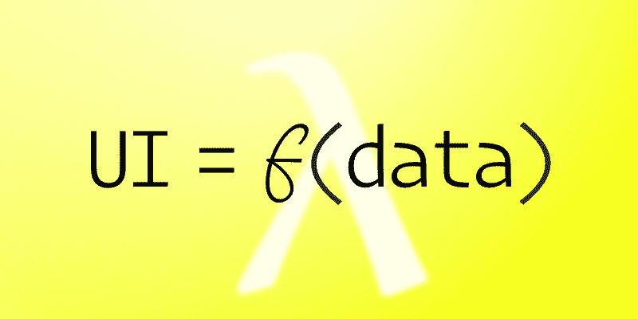
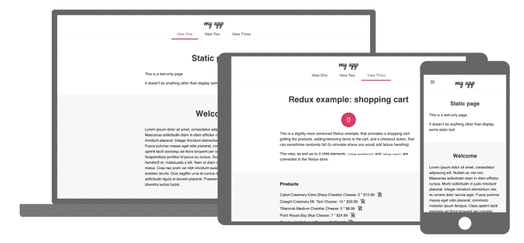

# 让我们来构建 Web 组件！第五部分:文学元素

> 原文：<https://dev.to/bennypowers/lets-build-web-components-part-5-litelement-906>

基于组件的 UI 最近非常流行。您知道 web 有自己的本地组件模块，不需要使用任何库吗？真实故事！你可以编写、发布和重用单文件组件，这些组件可以在任何好的浏览器 [*](https://caniuse.com/#feat=shadowdomv1) 和任何框架[中工作(如果那是你的包的话)。](https://custom-elements-everywhere.com/)

在我们的[上一篇文章](https://dev.to/bennypowers/lets-build-web-components-part-4-polymer-library-4dk2)中，我们了解了聚合物库及其数据绑定和应用组合的独特方法。

[](/bennypowers) [## 让我们构建 Web 组件！第 4 部分:聚合物库

### 本尼·鲍尔斯🇮🇱🇨🇦10 月 14 日 1816 分钟阅读

#webcomponents #customelements #polymer #javascript](/bennypowers/lets-build-web-components-part-4-polymer-library-4dk2)

今天我们将使用`LitElement`基类实现`<lit-lazy-image>`。与 Polymer 相比，`LitElement`采用了一种完全不同的模板化方法，这种方法更符合反应式编程风格，这种风格在过去几年里在前端已经变得非常普遍。有了单向数据流、用于绑定数据和事件监听器的声明性语法，以及基于[标准](https://dev.to/bennypowers/lets-build-web-components-part-1-the-standards-3e85)的高效 <abbr title="document object model">DOM</abbr> 更新方法，`LitElement`性能良好，编写起来也很愉快。

*   [T2`lit-html`](#lit-html)
    *   [功能界面](#functional-UI)
    *   [数据绑定](#data-binding)
    *   [指令](#directives)
*   [T2`LitElement`](#litelement)
*   [T2`<lit-lazy-image>`](#lit-lazy-image)
*   [属性和特性](#attributes-and-properties)
    *   [将属性反映到属性](#reflecting-properties-to-attributes)
    *   [控制序列化](#controlling-serialization)
    *   [确定属性何时改变](#determining-when-a-property-has-changed)
*   [`LitElement`生命周期](#litelement-lifecycle)
    *   [T2`shouldUpdate`](#shouldupdate)
    *   [T2`update`](#update)
    *   [`firstUpdated`和`updated`](#firstupdated-and-updated)
    *   [T2`requestUpdate`](#requestupdate)
    *   [T2`updateComplete`](#updatecomplete)
*   [用`LitElement`](#factoring-apps-with-litelement) 保理应用

但是在我们开始之前，让我们花点时间来探索一下`lit-html`库，它是`LitElement`的基础

## `lit-html`

是一个由谷歌工程师 Justin Fagnani 开发的新库(目前处于预发布阶段)。您可以用它在 JavaScript 中编写动态的、富于表现力的 DOM 模板。如果你和 React 的 JSX 一起工作过，你肯定也写过类似的模板。与 JSX 不同，`lit-html`利用浏览器内置的 <abbr title="HyperText Markup Language">HTML</abbr> 解析器，以及像 [`<template>`](https://dev.to/bennypowers/lets-build-web-components-part-1-the-standards-3e85#template-elements) 元素和[标记模板文字](https://developer.mozilla.org/en-US/docs/Web/JavaScript/Reference/Template_literals#Tagged_templates)这样的标准来有效地更新 DOM，而没有任何“虚拟 DOM”开销。

### 功能界面

[T2】](https://res.cloudinary.com/practicaldev/image/fetch/s--DVF5KsWB--/c_limit%2Cf_auto%2Cfl_progressive%2Cq_auto%2Cw_880/https://thepracticaldev.s3.amazonaws.com/i/q9ov8dv9v0ibfddg8a66.png)

有了模板，我们进入了 JavaScript 的函数式编程世界。我们将在本文中大量使用“纯”和“不纯”函数这样的术语，因此，为了介绍或复习函数概念，请查阅布莱恩·朗斯多夫的《函数编程基本指南》，但出于我们的目的，我们将对几个基本概念感兴趣:

*   **纯函数**:接受输入并返回输出的函数，不引用或影响任何其他数据。
*   **不纯函数**:产生副作用的函数。
*   **副作用**:除了立即计算一些输入的结果之外发生的任何事情，例如写入`console.log`或`document`，或者访问全局变量。

因此，当我们说“UI 作为数据的函数”时，我们的意思是，不需要使用除我们的数据之外的任何东西，我们就可以计算一个 UI。

```
import { html, render } from 'lit-html';

/* lit-html: UI as a pure function of data */
const view = ({ content, title }) =>
  html`<h1>${title}</h1>${content}`;

/* Compose templates from other templates */
const title = 'View as a Pure Function of Data';
const content = html`
  <p>Composable templates are flexible and powerful. They let you define
  complex views from simple building blocks.</p>
  <p>Using composition, you can hide implementation details of your
  app. This makes your work easier to test, reason about, and debug.</p>`;

/* Everything up to now has been pure. By calling `render`,
 * we pull the trigger on the impure part of our app and
 * actually write our view to the screen. */
render(view({ content, title }), document.body); 
```

Enter fullscreen mode Exit fullscreen mode

`html`函数(模板文字标签只是函数)返回一个称为`TemplateResult`的特殊类型，它知道其模板文字中的静态部分和动态部分(或插值表达式，即变化的`${someExpression}`部分)。`render`函数使用一个`TemplateResult`和一个包含节点来动态更新 DOM。通过在 DOM 中存储可能对模板中表达式值的变化做出反应的位置，`lit-html`可以在每次渲染调用时有效地更新 DOM 的这些部分，而不必重新渲染整个树。

这在实践中与 React 的 JSX 非常相似，但让我们后退一步来欣赏它们的差异，这样我们就可以做出更明智的选择。以下是上一段中提到或间接提到的所有 web 标准的非详尽列表:

*   [模板文字](http://www.ecma-international.org/ecma-262/6.0/#sec-template-literals) -具有强大插值特性的 JavaScript 字符串
*   [标记的模板文字](http://www.ecma-international.org/ecma-262/6.0/#sec-tagged-templates) -专门编写的函数，专门作用于模板文字
*   [模板标签知道它们的静态和动态部分](http://www.ecma-international.org/ecma-262/6.0/#sec-gettemplateobject)这不是一个定制的库特性，`lit-html`利用了标准
*   [WeakMap](https://www.ecma-international.org/ecma-262/6.0/#sec-weakmap-objects) 保存模板部件到其相关节点的映射

由于`lit-html`完全依赖于标准，它直接在浏览器中运行。它不需要任何构建步骤、编译、转换或类似事情。事实上，我已经用 lit-html 分解了许多应用程序，只使用了`.js`文件-只需点击保存和刷新！

因此，`lit-html`库的 *存在的理由* 是使用已建立的浏览器本地 web 标准，让开发人员编写动态的、富有表现力的 HTML-in-JS，同时在后台处理高效的 DOM 更新。

对于这方面的独家新闻，让我们听听来自马嘴的消息:

[https://www.youtube.com/embed/ruql541T7gc?start=466](https://www.youtube.com/embed/ruql541T7gc?start=466)

### 数据绑定

在`lit-html`模板中，可以插入 JavaScript 表达式来代替任何节点，或者作为任何属性的值。让我们设想一个假想的产品页面，我们想从 API 中获取一组产品对象，然后为每个对象输出一个 HTML 模板。

我们可以用任何我们想要的数据插入属性值:

```
const star = value => html`
  <meter class="star-rating"
      min="0" max="5"
      value="${value}"
  ></meter>`; 
```

Enter fullscreen mode Exit fullscreen mode

我们可以通过用特殊的`@event-type`绑定语法传入一个函数来声明性地定义事件监听器。我们将想象一个例子，它使用一些`analytics`函数(可能是从别处引入的)来报告我们的产品图像何时加载到屏幕上。

```
const lazyThumbnail = ({ id, alt, thumbnail }) => html`
  <lazy-image
      src="${`https://product-cdn.awesomeshop.cimg/${thumbnail}`}"
      alt="${alt}"
      @loaded-changed="${event => analytics('thumbnail-viewed', { event, id })}"
  ></lazy-image>`; 
```

Enter fullscreen mode Exit fullscreen mode

为了更好地控制监听器行为，我们可以传入一个特殊的监听器描述符对象。这也更节省内存，因为它不会为每个渲染创建一个新的 lambda(即匿名箭头函数:

```
const listener = {
  handleEvent: event =>
    analytics('thumbnail-viewed', {
      event, id: event.target.dataset.productId
    }),
  passive: true,
  once: true,
};

const lazyThumbnail = ({ id }) => html`
  <lazy-image
      data-product-id="${id}"   
      @loaded-changed="${listener}"
  ></lazy-image>`; 
```

Enter fullscreen mode Exit fullscreen modeNaturally, you could just define the lambda outside your templates as well, you don't need to build a special listener descriptor.

如果我们想绑定到一个元素的 DOM 属性，而不是它的 HTML 属性，我们可以使用`.property`绑定语法。

```
html``; 
```

Enter fullscreen mode Exit fullscreen mode

*注意*与昂贵的属性更新不同，属性更新只在值实际改变时运行，属性分配发生在每次渲染时，无论值是否改变。所以要小心叫有副作用的 setters。

我们还可以使用特殊的`?attribute`语法:
来取消/设置布尔属性

```
const stockBadge = ({ inventory }) => html`
  <aside class="badge" ?hidden="${inventory > 0}">
    Out of stock!
  </aside>`; 
```

Enter fullscreen mode Exit fullscreen mode

这样，我们创建了一个显示‘缺货！’的`stockBadge`模板库存较低时的消息，一个`lazyThumbnail`徽章，它延迟加载产品图像，并在它出现在屏幕上时通知我们的分析服务，以及一个`star`模板，它通过`<meter>`内置元素显示特殊的星级评定。

现在我们可以一起构建我们的产品模板:

```
const product = ({ id, rating, thumbnail, alt, url, inventory }) => html`
  <article class="product" data-product-id="${id}"> ${stockBadge({ inventory })}  ${lazyThumbnail({ id, alt, thumbnail })}  ${star(rating)} <a class="btn-link" href="${url}">Read More</a>
  </article>`; 
```

Enter fullscreen mode Exit fullscreen mode

有了所有这些，生成一整页的`TemplateResult` s 就很简单了:

```
const productPage = products => products.map(product); 
```

Enter fullscreen mode Exit fullscreen mode

然后，在我们的应用程序的不纯部分，我们勇敢的元素来获取和呈现我们的数据。

```
const handleAsJson = response => response.json();

const renderToProductContainer = templateResult =>
  render(templateResult, document.getElementById('products'))

fetch('/api/products?page=1')     // Fetch the array of products
  .then(handleAsJson)             // Parse the response as JSON
  .then(productPage)              // Map `product` over the array,
                                  // converting it to an array of TemplateResults.
  .then(renderToProductContainer) // Render the templates to the DOM. 
```

Enter fullscreen mode Exit fullscreen mode

### 指令

`lit-html`附带了各种模板助手函数，称为**指令**。它们应该在模板定义中被调用。它们与计算`TemplateResults`的内部`lit-html` <abbr title="Application Programmer Interface">API</abbr> 交互，通常是为了提高渲染性能。

```
import { repeat } from 'lit-html/directives/repeat.js';
import { ifDefined } from 'lit-html/directives/if-defined.js';

const getId = ({ id }) => id;

const stooges = [
  { id: 1, name: 'Larry', img: 'images/larry.jpg' },
  { id: 2, name: 'Curly' },
  { id: 3, name: 'Moe', img: 'image/moe.jpg' }
];

const stoogeTpl = ({ id, name, img }) => html`
  <li data-stooge="${id}">
    
  </li>`;

const stoogesTpl = html`<ul>${repeat(stooges, getId, stoogeTpl)}</ul>`; 
```

Enter fullscreen mode Exit fullscreen mode

像`Array#map`一样使用`repeat`指令从数组中生成模板列表。在撰写本文时，似乎对于大多数用例来说，`Array#map`并不比`repeat`更有性能。但是如果你要改变一个有自己 id 的大列表的顺序，`repeat`就是它的用处。

`ifDefined`用于检查在输出相关 DOM 之前是否定义了一个值。当你只想在你的值存在的情况下应用一个属性时，这是很有用的，就像我们对上面的``所做的那样。

`until`指令可以用来等待一个承诺，同时显示一些默认内容。

```
html`<h1>${until({
  this.userPromise.then(user => user.name),
  'Loading User...'
})}</h1>`; 
```

Enter fullscreen mode Exit fullscreen mode

`when`指令的功能就像三元(`x ? y : z`)表达式一样，但是它很懒惰。你传递了一个表达式和两个函数，这两个函数为某个表达式的真值和假值返回`TemplateResult`,它们只在需要的时候被求值。

```
const postTpl = ({ title, summary }) => html`
  <dt>${title}</dt>
  <dd>${summary}</dd>`

const userPostsTpl = ({ name, posts = [] }) => html`
  <h1>${name}'s Posts</h1>
  <dl>${posts.map(postTpl)}</dl>`

const loggedOutTpl = () => html`
  <h1>Log in to see your posts</h1>
  <mwc-button @click="${login}">Login</mwc-button>`

const userPageTpl = (user = { loggedIn: false }) => html`
  <header> ${when(user.loggedIn, () => userPostsTpl(user), loggedOutTpl)} </header>`; 
```

Enter fullscreen mode Exit fullscreen mode

在表达式的标识改变之前,`guard`指令防止重新渲染(也就是说，如果您将表达式从一个原语更改为另一个原语，或者从一个对象引用更改为另一个对象引用，即使对象的内容是等效的)

`classMap`和`styleMap`指令帮助你以更有效的方式在你的组件上设置类和样式

```
// Because of lit-html internals, this is inefficient.
const userTpl = ({ token, name }) =>
  html`<div class="user ${ token ? 'loggedIn' : '' }">${name}</div>`;

// Using `classMap` instead keeps your templates efficient.
const userTpl = ({ token, name }) =>
  html`<div class="${classMap({ loggedIn: token, user: true })}">${name}</div>`; 
```

Enter fullscreen mode Exit fullscreen mode

指令 API 是在 ye olde big 1.0 发布之前最后完成的一部分，所以请通过查看[自述文件](https://github.com/Polymer/lit-html)和[文档](https://polymer.github.io/lit-html/guide/writing-templates#directives)来了解最新信息

## `LitElement`

您可以也应该在您的项目中单独使用`lit-html`。但是我们在这里讨论的是 web 组件。碰巧的是，`LitElement`基类是使用`lit-html`的官方定制元素类。

如果说`lit-html`是关于用纯函数计算用户界面，那么`LitElement`就是将这种机制与一个非常面向对象的`customElement`类联系起来。当您从它扩展并提供一个返回一个`TemplateResult`的`render()`方法时，`LitElement`会为您处理批处理 DOM 更新。

```
import { LitElement, html } from 'lit-element';

const superlativeTpl = superlative =>
  html`<li>So <em>${superlative}</em>!!</li>`

class SoLit extends LitElement {
  static get properties() {
    return {
      title: { type: String },
      superlatives: { type: {
        fromAttribute: attr => attr.split(','),
        toAttribute: xs => xs.join(),
      } },
    }
  }

  render() {
    return html`
      <h1>${this.title}</h1>
      <p>Proof:</p>
      <ul>${this.superlatives.map(superlativeTpl)}</ul>
    `;
  }
} 
```

Enter fullscreen mode Exit fullscreen mode

简单介绍了`lit-html`和`LitElement`带来的新热点后，我们准备开始重构`<lazy-image>`。

## `<lit-lazy-image>`

就像上周的[一样，我们的第一步将是导入我们的依赖项并重命名组件。](https://dev.to/bennypowers/lets-build-web-components-part-4-polymer-library-4dk2) 

```
import { LitElement, html } from 'lit-element';

const isIntersecting = ({isIntersecting}) => isIntersecting;

const tagName = 'lit-lazy-image';

class LitLazyImage extends LitElement {/*..*/}

customElements.define(tagName, LitLazyImage); 
```

Enter fullscreen mode Exit fullscreen mode

接下来我们将定义我们的渲染方法，使用`<polymer-lazy-image>`作为模板(双关语！)，但是用 <abbr title="JavaScript">JS</abbr> 表达式替换静态绑定表达式字符串，并调整绑定语法。所有的样式都将和我们在`<polymer-lazy-image>`中使用的一样。

```
render() {
  return html`
    <style>/*...*/</style>

    <div id="placeholder" aria-hidden="${String(!!this.intersecting)}">
      <slot name="placeholder"></slot>
    </div>

    
  `;
} 
```

Enter fullscreen mode Exit fullscreen mode*Note* that we could have used `ifDefined` here, but for such a simple component, with such a simple usage, I think the performance gains of using directives would be outweighed by the cost of loading more JS.

因为我们可以插入实际的 JavaScript 表达式，所以我们不需要基于聚合物的实现中的任何计算绑定方法。我们同样不需要 vanilla 版本的属性 getters 和 setters，因为 LitElement 有自己的管理属性的机制。稍后我们将更深入地讨论 LitElement 的属性系统。。现在，在一个静态 getter 中定义我们观察到的属性就足够了:

```
static get properties() {
  return {
    alt: { type: String },
    intersecting: { type: Boolean },
    src: { type: String },
    loaded: {
      type: Boolean,
      reflect: true,
    },
  }
} 
```

Enter fullscreen mode Exit fullscreen mode

真的，基本上就是这样。我做的一个小改动是当图像加载时显式触发一个`loaded-changed`事件，以保持与聚合物风格的模板系统的兼容性:

```
onLoad(event) {
  this.loaded = true;
  // Dispatch an event that supports Polymer two-way binding.
  this.dispatchEvent(
    new CustomEvent('loaded-changed', {
      bubbles: true,
      composed: true,
      detail: {
        value: true,
      },
    })
  );
} 
```

Enter fullscreen mode Exit fullscreen mode

我趁机重构了`initIntersectionObserver`来处理它自己的特性检测:

```
initIntersectionObserver() {
  // if IntersectionObserver is unavailable,
  // simply load the image.
  if (!('IntersectionObserver' in window)) {
    return this.intersecting = true;
  }
  // ...
} 
```

Enter fullscreen mode Exit fullscreen mode

但事实是，多亏了`lit-html`，我们删除的比我们在这里添加的要多得多。

这是我们完成的组件，检查一下[的差异](http://www.mergely.com/BUNgerD7/?wl=1&ws=1&cs=1&vp=1)，从`<polymer-lazy-image>`的 160 和`<lazy-image>`的 195:
下降到 140 <abbr title="Lines of Code">的 LOC</abbr>

```
import { LitElement, html } from 'lit-element';

const isIntersecting = ({isIntersecting}) => isIntersecting;

const tagName = 'lit-lazy-image';

class LitLazyImage extends LitElement {
  render() {
    return html`
      <style>
        :host {
          position: relative;
        }

        #image,
        #placeholder ::slotted(*) {
          position: absolute;
          top: 0;
          left: 0;
          transition:
            opacity
            var(--lazy-image-fade-duration, 0.3s)
            var(--lazy-image-fade-easing, ease);
          object-fit: var(--lazy-image-fit, contain);
          width: var(--lazy-image-width, 100%);
          height: var(--lazy-image-height, 100%);
        }

        #placeholder ::slotted(*),
        :host([loaded]) #image {
          opacity: 1;
        }

        #image,
        :host([loaded]) #placeholder ::slotted(*) {
          opacity: 0;
        }
      </style>

      <div id="placeholder" aria-hidden="${String(!!this.intersecting)}">
        <slot name="placeholder"></slot>
      </div>

      
    `;
  }

  static get properties() {
    return {
      /**
       * Image alt-text.
       * @type {String}
       */
      alt: { type: String },

      /**
       * Whether the element is on screen.
       * @type {Boolean}
       */     
      intersecting: { type: Boolean },

      /**
       * Image URI.
       * @type {String}
       */
      src: { type: String },

      /**
       * Whether the image has loaded.
       * @type {Boolean}
       */
      loaded: {
        type: Boolean,
        reflect: true,
      },
    }
  }

  constructor() {
    super();
    this.observerCallback = this.observerCallback.bind(this);
    this.intersecting = false;
    this.loading = false;
  }

  connectedCallback() {
    super.connectedCallback();
    // Remove the wrapping `<lazy-image>` element from the a11y tree.
    this.setAttribute('role', 'presentation');
    // if IntersectionObserver is available, initialize it.
    this.initIntersectionObserver();
  }

  disconnectedCallback() {
    super.disconnectedCallback();
    this.disconnectObserver();
  }

  /**
   * Sets the `intersecting` property when the element is on screen.
   * @param  {[IntersectionObserverEntry]} entries
   * @protected
   */
  observerCallback(entries) {
    if (entries.some(isIntersecting)) this.intersecting = true;
  }

  /**
   * Sets the `loaded` property when the image is finished loading.
   * @protected
   */
  onLoad(event) {
    this.loaded = true;
    // Dispatch an event that supports Polymer two-way binding.
    const bubbles = true;
    const composed = true;
    const detail = { value: true };
    this.dispatchEvent(new CustomEvent('loaded-changed', { bubbles, composed, detail }));
  }

  /**
   * Initializes the IntersectionObserver when the element instantiates.
   * @protected
   */
  initIntersectionObserver() {
    // if IntersectionObserver is unavailable, simply load the image.
    if (!('IntersectionObserver' in window)) return this.intersecting = true;
    // Short-circuit if observer has already initialized.
    if (this.observer) return;
    // Start loading the image 10px before it appears on screen
    const rootMargin = '10px';
    this.observer = new IntersectionObserver(this.observerCallback, { rootMargin });
    this.observer.observe(this);
  }

  /**
   * Disconnects and unloads the IntersectionObserver.
   * @protected
   */
  disconnectObserver() {
    this.observer.disconnect();
    this.observer = null;
    delete this.observer;
  }
}

customElements.define(tagName, LitLazyImage); 
```

Enter fullscreen mode Exit fullscreen mode[https://glitch.com/embed/#!/embed/lit-lazy-image?previewSize=100&path=index.html](https://glitch.com/embed/#!/embed/lit-lazy-image?previewSize=100&path=index.html)

关于`LitElement`,还有比我们简单的延迟加载例子所展示的更多的东西需要学习。让我们深入 API，看看我们能看到什么。

## 属性和特性

`LitElement`具有定义属性和属性描述符的能力。这些与我们上周使用的`PolymerElement`类似，但是`LitElement`的功能更强大，也更灵活。

静态`properties` getter 中定义的任何属性都将被添加到`observedAttributes`的列表中(关于这一点的更多信息，请参见我们在 [vanilla web components](https://dev.to/bennypowers/lets-build-web-components-part-3-vanilla-components-4on3#the-attributeChangedCallback) 上的文章)。对于简单的情况，您可以只传递属性的类型构造函数。

```
/**
 * When the `simple` attribute is set,
 * it will also set the `simple` property
 */
simple: { type: String }, 
```

Enter fullscreen mode Exit fullscreen mode

### 反映属性归属性

如果您想将对属性的更改反映为一个属性，请在属性描述符中标记`reflect`布尔值。

```
/**
 * Just like `simple`, but it will also set the `reflecting`
 * attribute when the `reflecting` property is set.
 */
reflecting: {
  type: Number, // defaults to `String`
  reflect: true,
}, 
```

Enter fullscreen mode Exit fullscreen mode

您还可以设置`attribute`描述符来指定*与哪个*属性同步。

```
/**
 * Like `string` and `reflect`, but this time syncs to the
 * `special-attribute` attribute. If `attribute` is not specified,
 * it will sync with the lowercase property name
 * i.e. `definedattr`
 */
definedAttr: {
  type: String,
  attribute: 'special-attribute', // defaults to `true`
  reflect: true,
}, 
```

Enter fullscreen mode Exit fullscreen mode

`attribute`描述符可以是`false`，在这种情况下属性不会被观察到(但是设置 DOM 属性仍然会运行`LitElement`效果)；`true`，这种情况下会观察到 ascii 小写的属性名；或字符串，在这种情况下，将针对该属性观察特定的字符串。

### 控制序列化

序列化意味着将数据(如数字、数组或对象)转换成一种可以可靠地一次发送一部分的格式，如字符串。碰巧所有的 HTML 属性值都是字符串，所以当我们谈论序列化 <abbr title="with respect to">w.r.t.</abbr> DOM 属性时，我们说的是字符串化。

如果您想控制该进程在您的元素中如何工作，您可以在`type`描述符中指定一个函数来处理序列化(默认为`String`构造函数)。为了对流程进行细粒度的控制，将`type`设置为一个具有属性`fromAttribute`和`toAttribute`的函数的对象。

```
<super-serializer serialized="a|b|c|d"></super-serializer>

<script type="module">
  import { LitElement } from 'lit-element';

  class extends LitElement {
    static get properties() {
      return {
        serialized: {
          type: {
            fromAttribute: x => x.split('|')
            toAttribute: xs => xs.join('|')
          }
        }
      }
    }
  };

  customElements.define('super-serializer', SuperSerializer);

  const el = document.querySelector('super-serializer');

  (async () => {
    console.log(el.serialized); // ["a", "b", "c", "d"]

    el.serialized = [1, 2, 3, 4];

    await el.updateComplete;

    console.log(el.serialized); // [1, 2, 3, 4]
    console.log(el.getAttribute('serialized')) // "1|2|3|4"
  })();
</script> 
```

Enter fullscreen mode Exit fullscreen mode

### 确定属性何时改变

通过将属性描述符的`hasChanged`属性设置为谓词函数(即返回布尔值的函数)，可以控制元素对属性更改的反应。当你的属性是像`Object`或`Array`这样的引用类型时，这将非常有用。

`hasChanged`函数的签名是`(newVal, oldVal) -> Boolean`，所以你可以这样做:

```
const userType = {
  fromAttribute: id => getUserSync(users, id),
  toAttribute: ({ id }) => id,
};

const userHasChanged = (
  { id, avatar, name } = {},
  { id: oldId, avatar: oldAvatar, name: oldName } = {}
) => (
  id !== oldId ||
  avatar !== oldAvatar ||
  name !== oldName
);

static get properties() {
  return {
    user: {
      type: userType,
      hasChanged: userHasChanged,
    }
  }
} 
```

Enter fullscreen mode Exit fullscreen mode

您可以使用`hasChanged`在每个属性的基础上对元素的生命周期进行细粒度控制。还有许多方法可以在元素中实现，以影响生命周期的变化。

### `LitElement`生命周期

除了[标准的定制元素生命周期回调](https://dev.to/bennypowers/lets-build-web-components-part-3-vanilla-components-4on3#lifecycle-callbacks)，`LitElement`提供了许多特定的方法，帮助你控制元素呈现的方式和时间。

#### `shouldUpdate`

为了控制你的元素是否重新呈现，实现`shouldUpdate`函数，该函数接受一个修改过的属性的`Map`，该属性引用旧的值。

```
shouldUpdate(changedProperties) {
  return !changedProperties.has('dataOnlyProp') || changed;
} 
```

Enter fullscreen mode Exit fullscreen mode

默认情况下，`shouldUpdate`返回`true`。

#### `update`

我们已经看到了`render`方法，它决定了元素的模板。`render`由`update`方法调用，像`shouldUpdate`一样，该方法需要一个改变属性的`Map`。您可能会使用`update`来执行与 DOM 无关的副作用。不要在这里操作属性，因为设置它们不会触发另一次更新。

```
update(changedProperties) {
  // Don't forget this or your element won't render!
  super.update(changedProperties);
  if (changedProperties.get('loggedIn') && !this.loginReported) {
    Analytics.report('Logged In', this.user.id)
    this.loginReported = true;
  }
} 
```

Enter fullscreen mode Exit fullscreen mode

#### `firstUpdated`和`updated`

但是如果你想执行与 DOM 相关的副作用，比如获取对阴影子对象的引用或者设置光子对象属性，你应该使用`firstUpdated`或者`updated` :

```
/**
 * firstUpdated runs once after the element renders for
 * the first time. It's ideal for capturing references to
 * shadow children, etc.
 * @param  {Map<string, any>} changedProperties
 */
firstUpdated(changedProperties) {
  // Capture references to shadow children.
  this.player = this.shadowRoot.querySelector('video');
  // Setting observed properties here will trigger an update.
  this.loaded = true;
}

/**
 * Updated runs every time the element renders, so it's well-
 * suited for managing light DOM children, or anything else that you
 * don't directly control in your template.
 * @param  {Map<string, any>} changedProperties
 */
updated(changedProperties) {
  this.children.forEach(child => setAttribute('updated', new Date()))
  super.updated(changedProperties);
} 
```

Enter fullscreen mode Exit fullscreen mode

在`firstUpdated`或`updated`中设置观察到的属性将触发重新渲染。

#### `requestUpdate`

将明确导致元素更新和重新呈现的`requestUpdate`方法。您可以用两种方式之一调用此方法。不带参数调用只会重新呈现元素。例如，当您想要基于属性之外的东西来设置一些元素状态时，这是很有用的，比如 light DOM 子元素。

```
// Get a DOM reference to your element
const myLitEl = document.querySelector('my-lit-element');

// When the element's light DOM mutates, call `requestUpdate`
const onMutation = ([{target}]) => target.requestUpdate();

const observer = new MutationObserver(onMutation);

observer.observe(myLitEl, {
  attributes: false,
  childList: true,
  subtree: true,
}); 
```

Enter fullscreen mode Exit fullscreen mode

当您使用特定的属性和值调用`requestUpdate`时，`LitElement`将运行为该属性配置的副作用，例如反映其属性。如果已经为属性实现了 setters，就应该这样做。

```
set customProp(value) {
  // Do your thing, we try not to judge - honest!
  weirdSideEffect(value);
  // Make sure LitElement has its house in order.
  this.requestUpdate('customProp', this.customProp)
} 
```

Enter fullscreen mode Exit fullscreen mode

#### `updateComplete`

`updateComplete`属性(**注意:不是方法！！**)是一个在渲染完成时结算的承诺。你会注意到我们在之前的例子中使用过它。当您想要访问更新的 DOM 时，请等待这个承诺。

```
class MouseMachine extends LitElement {
  static get properties() {
    return {
      meaning: {
        type: String,
        attribute: 'life-the-universe-and-everything',
      },
    };
  }
};

customElements.define('mouse-machine', MouseMachine);

const mm = document.createElement('mouse-machine');

document.body.append(mm);

(async () => {
  mm.meaning = 42;

  await mm.updateComplete;

  console.log(myLitEl.getAttribute('life-the-universe-and-everything'));
}); 
```

Enter fullscreen mode Exit fullscreen mode

## 保理应用与`LitElement`

与具有双向绑定模板的聚合元素不同，lit 元素特别适合 React/Redux 模式和其他模式流行的单向数据流类型。您可以创建或导入将您的元素连接到您的中央商店并更新其属性的混合类。事实上，我已经发布了一组基类，它们从`LitElement`扩展而来，将您的组件连接到 Apollo GraphQL 客户端缓存。看看这个:

##  [阿波罗——元素](https://github.com/apollo-elements) / [阿波罗——元素](https://github.com/apollo-elements/apollo-elements)

### 🚀🌛使用发射平台👩‍🚀👨‍🚀

<article class="markdown-body entry-content container-lg" itemprop="text">[](https://github.com/apollo-elements/apollo-elements./docs/logo.svg)

# <g-emoji class="g-emoji" alias="rocket" fallback-src="https://github.githubassets.cimg/icons/emoji/unicode/1f680.png">🚀</g-emoji>阿波罗元素<g-emoji class="g-emoji" alias="woman_astronaut" fallback-src="https://github.githubassets.cimg/icons/emoji/unicode/1f469-1f680.png">👩‍🚀</g-emoji>

**<g-emoji class="g-emoji" alias="new_moon" fallback-src="https://github.githubassets.cimg/icons/emoji/unicode/1f311.png">🌑</g-emoji>自定义元素符合阿波罗 GraphQL <g-emoji class="g-emoji" alias="last_quarter_moon_with_face" fallback-src="https://github.githubassets.cimg/icons/emoji/unicode/1f31c.png">🌜</g-emoji>**

**<g-emoji class="g-emoji" alias="woman_astronaut" fallback-src="https://github.githubassets.cimg/icons/emoji/unicode/1f469-1f680.png">👩‍🚀</g-emoji>这是开发者的一小步，网络平台的一大步！<g-emoji class="g-emoji" alias="man_astronaut" fallback-src="https://github.githubassets.cimg/icons/emoji/unicode/1f468-1f680.png">👨‍🚀</g-emoji>**

[](https://open-wc.org)[](https://github.com/apollo-elements/apollo-elements/issues)[](https://github.com/apollo-elements/apollo-elements/blob/master/LICENCE.md)[](https://codeclimate.com/github/apollo-elements/apollo-elements/maintainability)[](https://codeclimate.com/github/apollo-elements/apollo-elements/test_coverage)[](https://github.com/apollo-elements/apollo-elements/actions)

Apollo Elements 提供了基于各种底层 web 组件创作库的包。你可以选择一个适合你的项目，以保持你的应用程序小。

```
npm init @apollo-elements
```

Enter fullscreen mode Exit fullscreen mode

## <g-emoji class="g-emoji" alias="robot" fallback-src="https://github.githubassets.cimg/icons/emoji/unicode/1f916.png">🤖</g-emoji>演示

*   [`#leeway`](https://leeway.apolloelements.dev) 是一个聊天 PWA 的例子，它使用`lit-apollo`使你更容易避免做实际工作。[源库](https://github.com/apollo-elements/leeway)
*   [`LaunchCTL`](https://launchctl.apolloelements.dev) 是一个简单的 PWA，显示关于 [SpaceX](https://spacex.com) 发射的信息。它使用非官方的 [spacex.land](https://spacex.land) GraphQL API。[源代码库](https://github.com/apollo-elements/launchctl)

## <g-emoji class="g-emoji" alias="world_map" fallback-src="https://github.githubassets.cimg/icons/emoji/unicode/1f5fa.png">🗺</g-emoji>指南和文档

如果你只是想看 API 文档，可以在 [apolloelements.dev](https://apolloelements.dev) 查看我们所有的包

*   [<g-emoji class="g-emoji" alias="avocado" fallback-src="https://github.githubassets.cimg/icons/emoji/unicode/1f951.png">🥑</g-emoji>核心](https://apolloelements.dev/api/core/)
*   [<g-emoji class="g-emoji" alias="bricks" fallback-src="https://github.githubassets.cimg/icons/emoji/unicode/1f9f1.png">🧱</g-emoji> 组件](https://apolloelements.dev/api/components/)
*   [<g-emoji class="g-emoji" alias="cocktail" fallback-src="https://github.githubassets.cimg/icons/emoji/unicode/1f378.png">🍸</g-emoji>混血儿](https://apolloelements.dev/api/libraries/mixins/)
*   [<g-emoji class="g-emoji" alias="fire" fallback-src="https://github.githubassets.cimg/icons/emoji/unicode/1f525.png">🔥</g-emoji>点燃](https://apolloelements.dev/api/libraries/lit-apollo/)
*   [<g-emoji class="g-emoji" alias="checkered_flag" fallback-src="https://github.githubassets.cimg/icons/emoji/unicode/1f3c1.png">🏁</g-emoji>快](https://apolloelements.dev/api/libraries/fast/)
*   [<g-emoji class="g-emoji" alias="ghost" fallback-src="https://github.githubassets.cimg/icons/emoji/unicode/1f47b.png">👻</g-emoji>闹鬼](https://apolloelements.dev/api/libraries/haunted/)
*   [<g-emoji class="g-emoji" alias="atom_symbol" fallback-src="https://github.githubassets.cimg/icons/emoji/unicode/269b.png">原子</g-emoji>](https://apolloelements.dev/api/libraries/atomico/)
*   [<g-emoji class="g-emoji" alias="unicorn" fallback-src="https://github.githubassets.cimg/icons/emoji/unicode/1f984.png">🦄</g-emoji>混血儿](https://apolloelements.dev/api/libraries/hybrids/)
*   [<g-emoji class="g-emoji" alias="microscope" fallback-src="https://github.githubassets.cimg/icons/emoji/unicode/1f52c.png">🔬</g-emoji>胶子](https://apolloelements.dev/api/libraries/gluon/)
*   [<g-emoji class="g-emoji" alias="dna" fallback-src="https://github.githubassets.cimg/icons/emoji/unicode/1f9ec.png">🧬</g-emoji> 聚合物](https://apolloelements.dev/api/libraries/polymer/)

## 用于任何

…</article>

[View on GitHub](https://github.com/apollo-elements/apollo-elements)

PWA 初学者工具包是一个完全实现的带有`LitElement`和`Redux`的应用程序的例子。

##  [聚合物](https://github.com/Polymer) / [ pwa-starter-kit](https://github.com/Polymer/pwa-starter-kit)

### 用于从 web 组件构建全功能渐进式 Web 应用程序的入门模板。

<article class="markdown-body entry-content container-lg" itemprop="text">

[ ](https://github.com/Polymer/pwa-starter-kit "Built with pwa–starter–kit") [ ](https://travis-ci.org/Polymer/pwa-starter-kit)

> ## 状态:不再开发
> 
> 这个项目已经不再开发了。
> 
> 如果您对继续使用 PWA 初学者工具包感兴趣，可以随意派生和修改它。
> 
> 如果您想使用 LitElement 开始一个新的应用程序项目，那么 [open-wc 应用程序支架生成器](https://open-wc.org/init/)是一个很好的起点。

# PWA 入门套件

这个示例应用程序是构建 PWAs 的起点。开箱即用的模板为您提供了以下功能:

*   所有 PWA 的优点(明显的，服务人员)
*   反应灵敏的布局
*   应用程序主题化
*   使用 Redux 进行状态管理的示例
*   office 用户界面
*   简单路由解决方案
*   通过 PRPL 模式快速进行交互和首次喷漆
*   轻松部署到 prpl 服务器或静态主机
*   单元和集成测试起点
*   关于其他高级模式的文档。

### <g-emoji class="g-emoji" alias="book" fallback-src="https://github.githubassets.cimg/icons/emoji/unicode/1f4d6.png">📖</g-emoji>前往[文档网站](https://pwa-starter-kit.polymer-project.org/)了解更多详情或查看[如何开始](https://pwa-starter-kit.polymer-project.org/setup)！

[T2】](https://user-images.githubusercontent.com/1369170/39715580-a1be5126-51e2-11e8-8440-96b07be03a3c.png)

## 托德斯

*   在…上设置 Safari 测试

</article>

[View on GitHub](https://github.com/Polymer/pwa-starter-kit)

但是由于 lit-elements 只是 DOM，所以您可以用普通的 JavaScript 设置它们的属性，这意味着您可以使用任何使用 JavaScript 的状态管理解决方案，无论是预制的还是定制的。

未来的帖子将更详细地介绍基于 web 组件的应用程序的分解选项，敬请关注！

## 结论

| 赞成的意见 | 骗局 |
| --- | --- |
| 具有 lit-html 和 LitElement 的功能性 UI | 来自聚合物的双向绑定，这是一个范式的变化。 |
| 基于 web 标准，不需要 babel、typescript 或长工具链。 | 一个非标准的用法是 bare 说明符，需要捆绑器或服务器端转换。 |
| 与许多流行库熟悉的模式和语法保持一致 | 尽管这个社区正在发展壮大，但它还没有其他图书馆那么大，那么受欢迎(至少，亲爱的读者，直到你参与进来) |

`LitElement`被设定为大多数项目的首选自定义元素基类，但它远不是唯一的游戏。下周加入我们来看看 Gluon，这是一个精简的简单定制元素框架，它为您提供了关键的特性，而没有臃肿。

再见😊

您想就此处涉及的任何主题进行一对一的辅导吗？[T2】](https://www.codementor.io/bennyp?utm_source=github&utm_medium=button&utm_term=bennyp&utm_campaign=github)

## 鸣谢

再次感谢 [@ruphin](https://github.com/ruphin) 分享他对`lit-html`和 web 组件标准的见解，感谢聚合物社区 slack 的 Amit Merin 和 morbidick 的校对工作。

## 勘误表

*   自本帖最初发布以来， [lit-html 1.0 和 lit-element 2.0 stable 相继发布](https://www.polymer-project.org/blog/2019-02-05-lit-element-and-lit-html-release)。利弊表已经更新，以反映这一点。

查看本系列的下一篇文章

[](/bennypowers) [## 让我们来构建 Web 组件！第六部分:胶子

### 本尼·鲍尔斯🇮🇱🇨🇦10 月 28 日 186 分钟阅读

#webcomponents #gluon #javascript #html](/bennypowers/lets-build-web-components-part-6-gluon-27ll)