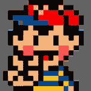

# 让我们来构建 Web 组件！第六部分:胶子

> 原文：<https://dev.to/bennypowers/lets-build-web-components-part-6-gluon-27ll>

基于组件的 UI 最近非常流行。您知道 web 有自己的本地组件模块，不需要使用任何库吗？真实故事！你可以编写、发布和重用单文件组件，这些组件可以在任何好的浏览器 [*](https://caniuse.com/#feat=shadowdomv1) 和任何框架[中工作(如果那是你的包的话)。](https://custom-elements-everywhere.com/)

在我们的[上一篇文章](https://dev.to/bennypowers/lets-build-web-components-part-5-litelement-906)中，我们了解了来自 Google 的新功能 UI 库`lit-html`，以及它相关的自定义元素基类`LitElement`。

[](/bennypowers) [## 让我们来构建 Web 组件！第五部分:文学元素

### 本尼·鲍尔斯🇮🇱🇨🇦10 月 22 日 1818 分钟阅读

#webcomponents #functional #lithtml #javascript](/bennypowers/lets-build-web-components-part-5-litelement-906)

今天我们将使用 [@ruphin](https://github.com/ruphin) 的胶子库来实现`<gluon-lazy-image>`。像`LitElement`一样，胶子组件使用`lit-html`来定义它们的模板，但胶子基类更“接近金属”:它更喜欢保持轻量级，将观察到的或键入的属性等花哨功能留给用户。

如果你没有看到上周关于 lit-html 和 LitElement 的[文章，在我们深入讨论之前，现在就来看看吧。](https://dev.to/bennypowers/lets-build-web-components-part-5-litelement-906)

*   [T2`<gluon-lazy-image>`](#gluon-lazy-image)
*   [元素模板](#element-template)
*   [特性和属性](#properties-and-attributes)
*   [渲染和生命周期](#rendering-and-lifecycle)
*   [其他细节](#other-niceties)
*   [完成组件](#complete-component)

## `<gluon-lazy-image>`

正如你所料，我们对`<gluon-lazy-image>`的重构将是上周的香草`<lazy-image>`组件和`<lit-lazy-image>`的混搭。让我们从导入依赖项和定义类开始。

```
import { GluonElement, html } from '/node_modules/@gluon/gluon/gluon.js';

class GluonLazyImage extends GluonElement {/*..*/}

customElements.define(GluonLazyImage.is, GluonLazyImage); 
```

Enter fullscreen mode Exit fullscreen mode

马上注意到的一个小便利是，Gluon 为我们准备了一个静态的`is` getter，它返回骆驼大小写的类名。这是一个小小的善意，但是如果我们决定改变元素的名称，将会使重构变得更容易。当然，如果我们想覆盖元素名，我们可以只覆盖静态 getter。

接下来，我们将在实例 getter 中定义模板:

## 元素模板

```
class GluonLazyImage extends GluonElement {
  get template() {
    return html`<!-- template copied from LitLazyImage -->`;
  }
} 
```

Enter fullscreen mode Exit fullscreen mode

## 属性和属性

对于属性，我们将自己实现`observedAttributes`和属性设置器，就像我们对普通`<lazy-image>` :
所做的一样

```
static get observedAttributes() {
  return ['alt', 'src'];
}

/**
 * Implement the vanilla `attributeChangedCallback`
 * to observe and sync attributes.
 */
attributeChangedCallback(name, oldVal, newVal) {
  switch (name) {
    case 'alt': return this.alt = newVal
    case 'src': return this.src = newVal
  }
} 
```

Enter fullscreen mode Exit fullscreen mode

注意我们是如何在 setter 中强制值的，而不是静态地声明类型，这就是你用 Gluon 处理类型化属性的方式。

```
/**
 * Whether the element is on screen.
 * @type {Boolean}
 */     
get intersecting() {
  return !!this.__intersecting;
} 
```

Enter fullscreen mode Exit fullscreen mode

就像在 vanilla `<lazy-image>`中一样，我们将使用受保护的属性设置器来反映属性。

```
/**
 * Image alt-text.
 * @type {String}
 */
get alt() {
  return this.getAttribute('alt');
}

set alt(value) {
  if (this.alt != value) this.setAttribute('alt', value);
  this.render();
} 
```

Enter fullscreen mode Exit fullscreen mode

## 渲染和生命周期

Gluon 元素有一个`render()`方法，您可以调用它来更新元素的 DOM。没有自动渲染，所以应该在属性设置器中调用`render()`。`render()`无参数调用时批处理并推迟 DOM 更新，所以非常便宜。

```
set intersecting(value) {
  this.__intersecting = !!value;
  this.render();
}

set src(value) {
  if (this.src != value) this.setAttribute('src', value);
  this.render();
} 
```

Enter fullscreen mode Exit fullscreen mode

`render()`回报承诺。你也可以用`render({ sync: true })`强制同步渲染。

组件生命周期的概念也同样被简化了。如果你想管理你的元素的 DOM 等，你只需要等待`render()`的承诺，而不是像`LitElement`那样引入新的回调。

```
const lazyImage = document.querySelector('gluon-lazy-image');

(async () => {
  // Force and wait for a render.
  await lazyImage.render();
  // Do whatever you need to do with your element's updated DOM.
  console.log(lazyImage.$.image.readyState);
})(); 
```

Enter fullscreen mode Exit fullscreen mode

## 其他细微之处

在第一次渲染时，Gluon 会将你的元素的`$`属性与阴影根中 id 元素的引用打包在一起。所以在我们的例子中，如果我们需要内部图像或占位符元素的引用，我们可以得到`lazyImage.$.image`或`lazyImage.$.placeholder`。

同样，像`LitElement`一样，你可以覆盖`createRenderRoot`类方法来控制你的组件如何呈现。返回`this`来渲染你的组件的 DOM 到光照 DOM 而不是阴影根:

```
class LightElement extends GluonElement {
  get template() {
    return html`Lightness: <meter min="0" max="1" value="1"></meter>`;
  }

  createRenderRoot() {
    return this;
  }
} 
```

Enter fullscreen mode Exit fullscreen mode

## 完成组件

[https://glitch.com/embed/#!/embed/gluon-lazy-image?previewSize=100&path=index.html](https://glitch.com/embed/#!/embed/gluon-lazy-image?previewSize=100&path=index.html)

```
import { GluonElement, html } from 'https://unpkg.com/@gluon/gluon/gluon.js?module';

const isIntersecting = ({isIntersecting}) => isIntersecting;

class GluonLazyImage extends GluonElement {
  get template() {
    return html`
      <style>
        :host {
          position: relative;
        }

        #image,
        #placeholder ::slotted(*) {
          position: absolute;
          top: 0;
          left: 0;
          transition:
            opacity
            var(--lazy-image-fade-duration, 0.3s)
            var(--lazy-image-fade-easing, ease);
          object-fit: var(--lazy-image-fit, contain);
          width: var(--lazy-image-width, 100%);
          height: var(--lazy-image-height, 100%);
        }

        #placeholder ::slotted(*),
        :host([loaded]) #image {
          opacity: 1;
        }

        #image,
        :host([loaded]) #placeholder ::slotted(*) {
          opacity: 0;
        }
      </style>

      <div id="placeholder" aria-hidden="${String(!!this.intersecting)}">
        <slot name="placeholder"></slot>
      </div>

      
    `;
  }

  static get observedAttributes() {
    return ['alt', 'src'];
  }

  /**
   * Implement the vanilla `attributeChangedCallback`
   * to observe and sync attributes.
   */
  attributeChangedCallback(name, oldVal, newVal) {
    switch (name) {
      case 'alt': return this.alt = newVal
      case 'src': return this.src = newVal
    }
  }

  /**
   * Whether the element is on screen.
   * Note how we coerce the value,
   * this is how you do typed properties with Gluon.
   * @type {Boolean}
   */     
  get intersecting() {
    return !!this.__intersecting;
  }

  set intersecting(value) {
    this.__intersecting = !!value;
    this.render();
  }

  /**
   * Image alt-text.
   * @type {String}
   */
  get alt() {
    return this.getAttribute('alt');
  }

  set alt(value) {
    if (this.alt != value) this.setAttribute('alt', value);
    this.render();
  }

  /**
   * Image URI.
   * @type {String}
   */
  get src() {
    return this.getAttribute('src');
  }

  set src(value) {
    if (this.src != value) this.setAttribute('src', value);
    this.render();
  }

  /**
   * Whether the image has loaded.
   * @type {Boolean}
   */
  get loaded() {
    return this.hasAttribute('loaded');
  }

  set loaded(value) {
    value ? this.setAttribute('loaded', '') : this.removeAttribute('loaded');
    this.render();
  }

  constructor() {
    super();
    this.observerCallback = this.observerCallback.bind(this);
    this.intersecting = false;
    this.loading = false;
  }

  connectedCallback() {
    super.connectedCallback();
    this.setAttribute('role', 'presentation');
    this.initIntersectionObserver();
  }

  disconnectedCallback() {
    super.disconnectedCallback();
    this.disconnectObserver();
  }

  /**
   * Sets the `intersecting` property when the element is on screen.
   * @param  {[IntersectionObserverEntry]} entries
   * @protected
   */
  observerCallback(entries) {
    if (entries.some(isIntersecting)) this.intersecting = true;
  }

  /**
   * Sets the `loaded` property when the image is finished loading.
   * @protected
   */
  onLoad(event) {
    this.loaded = true;
    // Dispatch an event that supports Polymer two-way binding.
    this.dispatchEvent(new CustomEvent('loaded-changed', {
      bubbles: true,
      composed: true,
      detail: { value: true },
    }));
  }

  /**
   * Initializes the IntersectionObserver when the element instantiates.
   * @protected
   */
  initIntersectionObserver() {
    // if IntersectionObserver is unavailable, simply load the image.
    if (!('IntersectionObserver' in window)) return this.intersecting = true;
    // Short-circuit if observer has already initialized.
    if (this.observer) return;
    // Start loading the image 10px before it appears on screen
    const rootMargin = '10px';
    this.observer = new IntersectionObserver(this.observerCallback, { rootMargin });
    this.observer.observe(this);
  }

  /**
   * Disconnects and unloads the IntersectionObserver.
   * @protected
   */
  disconnectObserver() {
    this.observer.disconnect();
    this.observer = null;
    delete this.observer;
  }
}

customElements.define(GluonLazyImage.is, GluonLazyImage); 
```

Enter fullscreen mode Exit fullscreen mode

该文件位于 190 LOC ( [diff](http://www.mergely.com/gZ3wFE9I/?ws=1) )，相当于普通组件，考虑到 Gluon 的放手方式，这是有意义的。

## 结论

如果您正在寻找一个定制元素基类，它不会让您束手无策，但会为您提供 lit-html 的模板功能，`Gluon`是一个很好的选择！

| 赞成的意见 | 骗局 |
| --- | --- |
| 超轻和非个人化 | 您需要自己实现许多高级功能 |
| 基于 web 组件标准，所以需要学习的特定 API 很少 | 过于简单的生命周期模型意味着存在大量重复的可能性。 |

我们已经看到了 Gluon 组件如何跨越完全普通的低级 API 和库便利性之间的边界。下次请加入我们，了解与众不同的*，我们将深入到迄今为止最引人入胜的 web 组件库之一- `hybrids`。*

 *再见😊

您想就此处涉及的任何主题进行一对一的辅导吗？[T2】](https://www.codementor.io/bennyp?utm_source=github&utm_medium=button&utm_term=bennyp&utm_campaign=github)

## 鸣谢

很高兴再次感谢 [@ruphin](https://github.com/ruphin) 为这个博客系列，尤其是这篇文章贡献了他的时间和精力。

查看本系列的下一篇文章

[](/bennypowers) [## 让我们来构建 Web 组件！第 7 部分:混合动力车

### 本尼·鲍尔斯🇮🇱🇨🇦1 月 3 日 1911 分钟阅读

#webcomponents #javascript #hybrids #functional](/bennypowers/lets-build-web-components-part-7-hybrids-187l)*