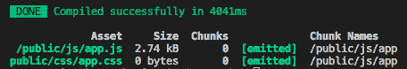

# 让我们让 Masonite 框架和 Laravel Mix 一起工作

> 原文：<https://dev.to/nioperas06/lets-make-masonite-framework-and-laravel-mix-work-together--3lbj>

**[Masonite](https://github.com/MasoniteFramework/masonite)** 是一个为 Python 精心制作的 Web 框架。我们通常使用 CSS、JavaScript 和图像文件等被称为 **Web 资产**的文件来使我们的 Web 应用程序看起来很棒。

在本文中，我将向您展示如何使用 **[Laravel Mix](https://github.com/JeffreyWay/laravel-mix) 处理和编译资产**到您的 **[Masonite](https://github.com/MasoniteFramework/masonite)** web 应用程序中。

# 什么是 Laravel Mix？

**[Laravel Mix](https://github.com/JeffreyWay/laravel-mix)** 使得**资产编译**变得异常容易。
使用 **[Laravel 混合](https://github.com/JeffreyWay/laravel-mix)** 与 **[Masonite](https://github.com/MasoniteFramework/masonite)** 真是一个简单的任务。我们走吧！

# 创建新的 Masonite 项目

在我们开始之前，创建一个新的 Masonite 项目。只需安装 Masonite 的 CLI 名为 **craft** 。

```
$ pip install masonite-cli
$ craft new masonite_laravel_mix
$ cd masonite_laravel_mix
$ craft install 
```

Enter fullscreen mode Exit fullscreen mode

# 安装并设置 Laravel Mix

Laravel Mix 可以用于任何类型的应用程序，而不仅仅是 Laravel 应用程序。要开始，只需安装 laravel-mix 作为我们的项目依赖项。

```
$ npm install laravel-mix 
```

Enter fullscreen mode Exit fullscreen mode

将 webpack 配置文件放入我们的项目根目录。

```
$ cp node_modules/laravel-mix/setup/webpack.mix.js . 
```

Enter fullscreen mode Exit fullscreen mode

然后，像 [Laravel](https://github.com/laravel/laravel/blob/master/webpack.mix.js) 一样将这个示例脚本添加到 webpack.mix.js 中。

```
mix.js('resources/assets/js/app.js', 'public/js')
   .sass('resources/assets/sass/app.scss', 'public/css'); 
```

Enter fullscreen mode Exit fullscreen mode

这是我们资产管道的定义。是时候添加一些 **npm 脚本**了。

```
"scripts": {
    "dev": "npm run development",
    "development": "cross-env NODE_ENV=development node_modules/webpack/bin/webpack.js --progress --hide-modules --config=node_modules/laravel-mix/setup/webpack.config.js",
    "watch": "npm run development -- --watch",
    "watch-poll": "npm run watch -- --watch-poll",
    "hot": "cross-env NODE_ENV=development node_modules/webpack-dev-server/bin/webpack-dev-server.js --inline --hot --config=node_modules/laravel-mix/setup/webpack.config.js",
    "prod": "npm run production",
    "production": "cross-env NODE_ENV=production node_modules/webpack/bin/webpack.js --no-progress --hide-modules --config=node_modules/laravel-mix/setup/webpack.config.js"
} 
```

Enter fullscreen mode Exit fullscreen mode

我只是再次从 [Laravel 库](https://github.com/laravel/laravel/blob/master/package.json)复制了这个 npm 脚本😅。
这个脚本有助于开发或生产的资产编译。
如你所见，你需要安装 cross-env 才能让它正常工作。

```
$ npm install cross-env 
```

Enter fullscreen mode Exit fullscreen mode

现在我们已经完成了所有的艰苦工作，让我们继续和一个简单的 html 文件。

```
...
<link rel="stylesheet" href="/public/css/app.css">
...
<script src="/public/js/app.js"></script>
... 
```

Enter fullscreen mode Exit fullscreen mode

让所有这些工作的简单的事情是创建一个模板别名。所有针对静态文件的配置都可以在`config/storage.py`中找到。
在这个文件中，我们将向 STATICFILES 添加一个常量，它只是一个字典:

```
STATICFILES = {
    # folder  # template alias
    'public': 'public/'
} 
```

Enter fullscreen mode Exit fullscreen mode

我们做到了🎉 🎉 🎉！您应该会看到类似如下的屏幕:

[T2】](https://res.cloudinary.com/practicaldev/image/fetch/s--j27wtpIK--/c_limit%2Cf_auto%2Cfl_progressive%2Cq_auto%2Cw_880/https://thepracticaldev.s3.amazonaws.com/i/i2q894fghtwrwzfu5krz.png)

您可以观看这个[存储库](https://github.com/nioperas06/masonite-laravel-mix)，我在其中添加了 Bootstrap 作为依赖项，并将其用作示例！

##  [尼奥珀拉 06 ](https://github.com/nioperas06) / [梅森内特-拉勒韦尔-米克斯](https://github.com/nioperas06/masonite-laravel-mix)

### 🎨Masonite 和 Laravel 混合用于处理和编译资产

<article class="markdown-body entry-content container-lg" itemprop="text">

# Masonite - Laravel Mix

> 让我们让 Laravel Mix 和 Masonite 框架一起工作。

这个应用程序演示了如何使用 Laravel Mix 来处理和编译资产。

查看教程:[链接](https://dev.to/nioperas06/lets-make-masonite-framework-and-laravel-mix-work-together--3lbj)

内置于:

*   Masonite -现代的以开发者为中心的 Python Web 框架。
*   Laravel Mix -一个优雅的 Webpack 包装器，适用于 80%的用例。

</article>

[View on GitHub](https://github.com/nioperas06/masonite-laravel-mix)

# 结论

希望这篇文章能够帮助您理解 Masonite 和 Laravel Mix 如何一起用于处理和编译资产。如果你想为 Masonite 的开发做出贡献或者对其感兴趣，那么一定要加入 GitHub 上 Masonite 的库 [Slack](http://slack.masoniteproject.com/) 或 star [。](https://github.com/MasoniteFramework/masonite)