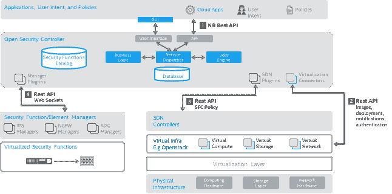
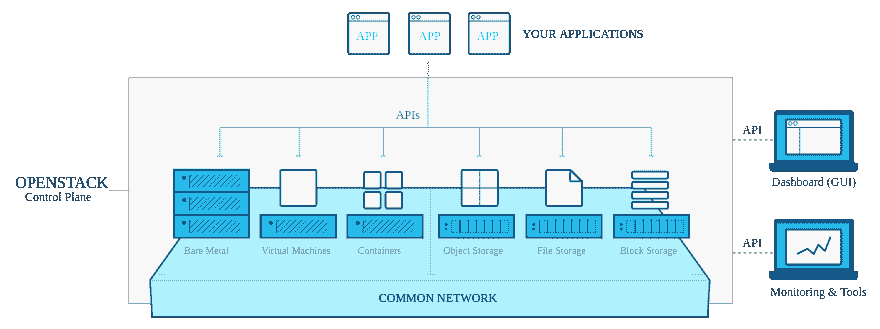

# 来说说 OSC 吧

> 原文：<https://dev.to/terceranexus6/lets-talk-about-osc-2gbi>

好久不见！自从我在这里写关于安全性的文章已经有一段时间了，我想回到我的安全性冲刺阶段。这一次，我要说的是我最近一直在阅读和研究的东西，开放网络的开放安全控制器。

[T2】](https://res.cloudinary.com/practicaldev/image/fetch/s--vC_zENjf--/c_limit%2Cf_auto%2Cfl_progressive%2Cq_auto%2Cw_880/https://raw.githubusercontent.com/opensecuritycontroller/osc-core/mastimg/OSC_logo.jpg)

网络控制器类似于可以管理网络的大脑。它由多个物理或虚拟交换机和路由器组成。网络控制器知道网络中的所有端点，并对底层网络设备进行编程以实现端点之间的通信。

开放式安全控制器允许我们自动部署虚拟化网络安全功能，如 *vIPS* (虚拟入侵防御)或 *vNGFW* (虚拟下一代防火墙)。该项目本身是在 [Linux 基金会](https://www.linuxfoundation.org/)的推动下进行的。

它使安全管理员和开发团队之间的职责分离成为可能，允许安全团队独立工作。OSC 在概念上介于安全管理器和多个虚拟化环境(如 OpenStack、容器、SDN 控制器、编排引擎)之间...)和安全功能。尽管 OSC 并不意味着(当然)取代数据中心中的物理安全设备，但它的目标是专门将安全纳入多样化的**虚拟化环境**。这些安全功能旨在被部署来保护安全组中包含的资产。

哦！OSC 通过一个 GUI 和一个 API 进行计数，允许安全管理员定义策略。但无论如何，让我们来看看官方文档提供的架构:

[T2】](https://res.cloudinary.com/practicaldev/image/fetch/s--wBw9rzN2--/c_limit%2Cf_auto%2Cfl_progressive%2Cq_auto%2Cw_880/https://raw.githubusercontent.com/opensecuritycontroller/opensecuritycontroller.org/master/overviewandarchitectuimg/osc_architecture_details.png)

正如我们所看到的，它与 SDN 控制器协同工作(实现 SDN 控制器插件来实现这种集成)，而不是取代它。我们开始吧。

为了使用 OSC，我们需要与其他服务进行通信。SDN 控制器实施流量重定向，安全管理器通过在虚拟化环境中应用安全功能来实施策略。现在，这就是我们进入 [OpenStack](https://www.openstack.org/software/) 的地方，因为我们需要一个虚拟化提供商。OpenStack 是一个云操作系统

[T2】](https://res.cloudinary.com/practicaldev/image/fetch/s--zNnh9vZJ--/c_limit%2Cf_auto%2Cfl_progressive%2Cq_auto%2Cw_880/https://www.openstack.org/softwaimg/diagram/overview-diagram.svg)

OpenStack 的网络服务包括标准安全工具(更多信息请参见[open stack Mitaka release](https://www.openstack.org/software/mitaka/))但是不要忘记我们这里的要点，OSC。或者，OSC 可以通过使用 Kubernetes API 的代理在 [Kubernetes](https://kubernetes.io/) 的容器化工作负载中使用。

关于这方面的更多信息，请看一下官方的[要求](https://www.opensecuritycontroller.org/documentation/gettingstarted/requirements/)。一旦我们进入这一阶段，我们就可以在 [Openstack 或 Kubernetes](https://www.opensecuritycontroller.org/documentation/tutorials/tutorials/) 上执行工作负载保护。我仍在[试验这最后一个选项](https://www.opensecuritycontroller.org/documentation/tutorials/k8s_workload/)。

我希望你们发现关于这个工具的有用的学习。

另外，我在这里留下一点概念帮助；)