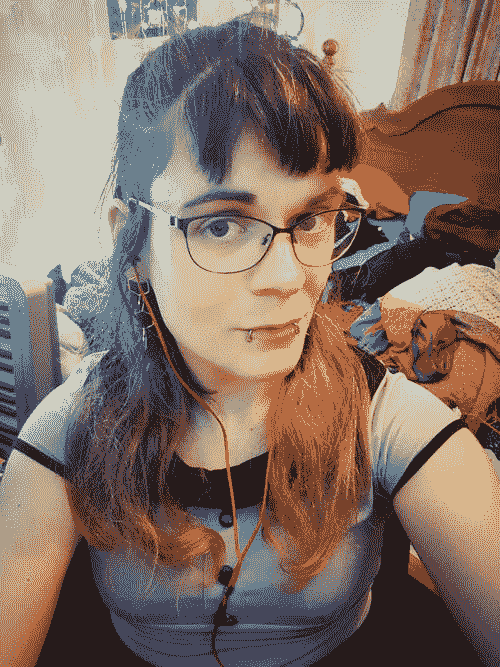

# 莱克萨·弗兰西斯谈游戏制作

> 原文：<https://dev.to/samjarman/lexa-francis-on-making-games-245a>

Dev Chats 第二季又回来了！在这一系列中，我大约每周都会与一位出色的开发人员或技术人员交谈。你可以在这里阅读更多。如果你知道下一个我应该和谁聊天，请告诉我。

[T2】](https://res.cloudinary.com/practicaldev/image/fetch/s--YA3AkrJo--/c_limit%2Cf_auto%2Cfl_progressive%2Cq_auto%2Cw_880/https://static1.squarespace.com/static/58bfb8c059cc68cc36914ea9/t/5b9c4c2dc2241b943db04f85/1536969875567/lexa.png%3Fformat%3D1000w)

### 自我介绍！你是谁？你在哪里工作？

我是莱克萨，我在墨尔本的强力游戏公司工作。我在游戏行业全职工作了三年半，在此之前，我在一所大学担任各种研究项目的程序员。在我的业余时间，除了个人项目，我还帮助管理一个澳大利亚游戏开发者的 Discord 社区。我是一个吵闹的同性恋者，并尽我所能鼓励本地行业的开放和支持文化。

### 谁或什么让你进入游戏编程？

编程(最初是在 Hypercard 上，在家用 Mac 上)是我童年最早的爱好之一，我童年时一直梦想成为一名游戏开发者，远在我理解这意味着什么之前。我只知道我喜欢游戏和编程，并且有很多想法。我小时候做过一些简单的点击式冒险，十几岁的时候开始改装逃逸速度和马拉松。高中毕业时，由于压力，我转向了其他创造性兴趣，并发誓放弃技术追求。我当时并不认为游戏开发是一条现实的道路，因为沿着这些路线的大学课程并不存在，这感觉就像是我童年的一个梦想。

快到 20 岁的时候，我正在寻找一份新的职业，对技术职业的想法感到更舒服，这时我碰巧在一个酒吧里遇到一些人，他们正在完成他们的游戏设计学位。我们成了朋友，在接下来的几个月里，我童年的梦想又变成了现实。在最后一刻，我将大学申请偏好改为游戏编程，并等待着“我做了一个可怕的决定”的实现。从来没有发生过！

高中毕业后，我主修语言学，这种热情至今犹存。它涉及一种思维，涉及有机问题的逻辑解决。游戏编程让我头脑中的相同部分发痒——我想知道如何使用优雅的技术解决方案来实现创造性的梦想，并可以在构建它的过程中锻炼我自己的创造力。这是一个有趣而多样的职业，涉及到许多相邻的创意领域——艺术、声音和设计。

### 在小工作室工作，你喜欢什么？你有没有在大型工作室里看到过自己？人们看待游戏职业会有很大的不同吗？

我自己没有在大型工作室工作过，所以我在这里的回答会基于听到别人的经历。到目前为止，我最喜欢的一件事是，我有很大的独立性，以我认为最好的方式设计和构建系统。通常，我是我所从事项目的唯一或者主要的程序员。它给了我很大的空间在我的代码中发挥创造力，学习新的做事方式，并与许多不同的系统一起工作，同时也带来了更多的责任。我也喜欢和其他学科的人直接接触，一起把他们的作品融入到游戏中，我不认为这在一个更大的工作室会如此频繁。

有一天我可能会在一个大工作室结束。在澳大利亚，这样的公司并不多，所以如果发生的话，要么是在海外，要么是在一个已经随着时间的推移发生了很大变化的本地行业。我这样做的意愿在很大程度上取决于工作室文化和我正在进行的项目的规模——我绝对不希望成为一台巨大机器中的一个齿轮。

进入本地游戏的人没有太多的选择，因为两个规模的工作室通常都没有太多的职位，但较小的工作室(我认为小于 30 人左右)可能会在这里进行大量的招聘。我要说的是，对于这个领域的新人来说，最大的不同是专业化——在一个大型工作室，在较低的级别，你往往会有更严格定义的角色，个人责任较低。工作室越小，你会遇到越多的机会进行归纳，设计输入和技能多样化，这将适合不同类型的人。较大的电影公司通常会提供更好的报酬和潜在的更大的稳定性，这取决于公司。

### 澳大利亚(以及新西兰)的游戏市场是什么样的——你觉得它在世界舞台上竞争激烈吗？

我们的游戏产业目前正在向独立工作室倾斜，此前许多由海外出版商资助的大型 AAA 工作室在全球金融危机使它们无利可图时关闭了大门。我们现在拥有的是土生土长、自给自足的独立企业，它们拥有强大的反紧缩文化，并渴望不再重复过去的错误——这是一个很好的环境，但与过去相比，现在的职位仍然较少。

我们已经从专注于主机和 PC 游戏转向移动游戏，因为这一领域已经变得越来越受欢迎，可以说，对于独立公司来说，凭借原创知识产权和对生产价值的不同预期，在这一领域更容易保持竞争力。虽然我们不像以前那样以同样的规模生产 AAA 游戏，但我要说，当考虑到经济变化时，这个行业确实竞争得很好，找到了运作良好的利基市场。

### 你认为游戏行业在未来几年会有什么变化，这对你的角色会有什么影响？

那真的不好说！市场一直在变化，但不可预测，我远不是这方面的专家。在澳大利亚，我们似乎有一个健康、规模虽小但稳定增长的行业，专注于独立游戏，我认为那里的情况不太可能发生剧烈变化。随着 Switch 的流行和 AAA 游戏经常出现在移动平台上，世界范围内似乎正在发生市场融合。纯移动市场份额越来越被分析驱动的免费游戏所主导，这使得较小的工作室和个人开发者专注于通过独特的体验来区分自己。我觉得我们的工作室，以及其他类似规模的工作室，如果需要的话，可以很好地转向更可靠的市场，但我认为事情暂时会稳定下来。

今年游戏开发者大会的一个有趣的事情是推动工会化，这在全世界引起了涟漪。游戏开发商非常希望拥有与其他行业相同的保护和保障，而在一个跨学科程度更高、变化比大多数行业更快的行业，要实现这一点还需要做很多工作。但工会化可能会让许多潜在的游戏开发者对以此为职业更有安全感。

### 迄今为止，在你的软件生涯中，你学到的最难的一课是什么？

嗯。这没什么大不了的，但也许对我来说，这就是“你必须接受别人做事的方式”。用软件实现同样的目标有很多方法，我的代码对其他人来说从来没有我想的那么清楚，我们对代码和开发管道的概念都有所不同。我喜欢在我的个人项目中以自己的方式做事，但也许我还没有学会最好的做事方式——即使我学会了，如果你在代码结构、程序和沟通方面保持一致，这也有助于团队中的每个人完成工作，不管这是哪一页。

这不是我在一个事件中学到的一课，而只是一个观察和过去几年我在自己身上改变的一些东西。作为一名开发人员，我总是发现团队合作在我所做的几乎所有事情中发挥作用的更多方式。

### 对于成功的软件职业生涯，你的第一条建议是什么？

我不一定代表整个软件开发，因为我觉得游戏开发是它自己特有的野兽。但是对于我自己的行业，我认为最重要的事情是培养学习新事物的热情，并建立一个投资组合。软件一直在变化。工具、范例、游戏引擎、语言和平台都来来去去。C++一直是大型工作室中引擎编程的安全赌注，但除此之外，如果你能证明自己适应性强，能在任何环境中解决问题并实现愿景，这对未来的雇主来说都会很好。将不同类型的工作放在一起将会显示出这一点，并展示出在大学课程等结构化环境之外学习和保持竞争力的意愿。

### 工作之外，你有什么爱好吗？你认为它们对你的科技事业有任何帮助吗？

我的主要爱好是建造类似游戏的玩具，比如沙箱和视觉实验。这对我在日常工作中可以使用的技能有直接影响，因为我经常不得不寻找或创造新的算法来解决问题，我从这些创造中学到了很多关于优化和复杂性的知识。除了编码，我还涉足歌曲创作和音乐制作多年，虽然这与编程没有太大的关系，但对我参与的游戏中的声音系统有所帮助，并有助于理解声音在数学上和感知上的工作方式。

特别是在独立游戏中，拥有数字艺术的经验非常有益，因为它允许程序员填写资产——占位符或最终资产——否则必须由专门的艺术家来完成。即使在我的日常工作中，我也发现我过去作为摄影师的 Photoshop 经验有助于解决艺术资产的技术问题，并根据需要弥补缺失的 UI 元素，而不必等待艺术家。

### 你会向那些想走上与你相似道路的人推荐哪些书籍/资源？

对于一般信息和对游戏开发状态的感受， [Gamasutra](http://gamasutra.com/) 是一个面向游戏开发人员的流行新闻网站，它总是值得关注行业动态和关于前沿开发技术的文章。在 [GDC Vault](https://www.gdcvault.com/free) 也有大量的免费内容(以及更多的付费内容)，它存储了年度游戏开发者大会上各种游戏开发主题的演示文稿。我没有特别推荐的书，但是有很多书(以及在线教程)是给那些希望涉足游戏领域的新手的，他们可以根据自己对什么游戏感兴趣或者已经掌握了什么技能来看看这个领域是什么样的。在过去，[简陋的捆绑包](https://www.humblebundle.com/)已经做了一些专注于游戏开发包的软件和电子书捆绑包，所以这总是值得关注的！

### 最后，做出你的大喊！你想让读者去看什么？

我有两个助手——一个是我帮助澳大利亚游戏开发者运行的 GDAU Discord 服务器。这是一个新的、活跃的、受欢迎的社区，有各种技能水平的成员，有些远程工作，还有许多新人，希望建立联系。

我们 Twitter 账户的一个链接是[这里](https://twitter.com/GDAU_/status/1009583930431827968)。

其次...我的好朋友 Fae 是当地一所大学的游戏和网页开发讲师，他今年早些时候写了一个名为[“倒影”](https://twitter.com/callieRansom/status/990491503964307457)的小型网页游戏，讲述了变性的快乐和痛苦经历。它的目标是那些对跨性别者的经历感到好奇的人，旨在创造共鸣，对我来说这是非常个人化和特别的。很生很对抗，但是很美，玩的时间不长。我想通过游戏这种独特的媒介看到更多这种体验。