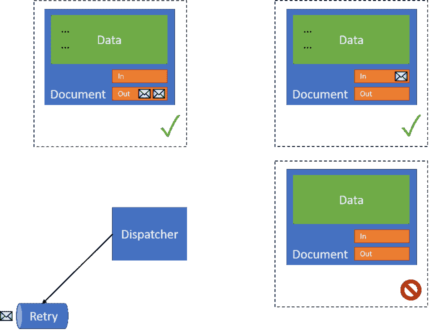
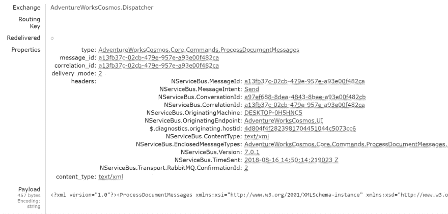

# 分布式事务之外的生活:叛教者的实现——失败与重试

> 原文：<https://dev.to/jbogard/life-beyond-distributed-transactions-an-apostates-implementation---failures-and-retries-2lpe>

此系列中的帖子:

*   [一个引子](https://dev.to/jbogard/life-beyond-distributed-transactions-an-apostates-implementation---a-primer-2po6-temp-slug-8261948)
*   [文件协调](https://dev.to/jbogard/life-beyond-distributed-transactions-an-apostates-implementation---document-coordination-leb-temp-slug-1009285)
*   [文档示例](https://dev.to/jbogard/life-beyond-distributed-transactions-an-apostates-implementation---document-example-4fpk-temp-slug-5917155)
*   [调度示例](https://dev.to/jbogard/life-beyond-distributed-transactions-an-apostates-implementation---dispatching-example-31i6-temp-slug-684211)
*   [失败和重试](https://jimmybogard.com/life-beyond-distributed-transactions-an-apostates-implementation-failures-and-retries/)
*   [故障恢复](https://jimmybogard.com/life-beyond-distributed-transactions-an-apostates-implementation-dispatcher-failure-recovery/)
*   [传奇故事](https://jimmybogard.com/life-beyond-distributed-transactions-sagas/)
*   [关系资源](https://jimmybogard.com/life-beyond-distributed-transactions-an-apostates-implementation-relational-resources/)

[本系列的示例代码](https://github.com/jbogard/adventureworkscosmos)

在上一篇文章中，我们看了一个使用中央调度程序将文档消息调度给其他文档的例子。我们的例子在快乐路径场景中运行良好，但是当出现问题时会发生什么呢？我们当然不希望由于发送消息失败而导致整个请求失败，但是这对我们来说意味着什么呢？

我们描述了一个通用的解决方案，使用队列和消息传递将调度工作放在一边，有效地说“是的，调度失败了，所以让我们把它放在一边，以后再看”。这将允许整个主请求完成:

[T2】](https://res.cloudinary.com/practicaldev/image/fetch/s--F3oQbtfw--/c_limit%2Cf_auto%2Cfl_progressive%2Cq_auto%2Cw_880/https://jimmybogardsblog.blob.core.windows.net/jimmybogardsblog/7/2018/Picture0051.png)

我们最初的例子还假设我们将在相同请求的上下文中立即分发我们的消息*,这不是一个坏的缺省，但可能并不总是理想的。让我们首先看看立即调度的场景，以及失败可能意味着什么。*

 *### 描述我们的失败

调度失败可能有多种原因，但我通常认为是连续的:

*   短暂的
*   延时的
*   永久的

我的失败通常与某种时间因素有关。短暂的失败可能意味着，如果我只是立即再次尝试该操作，它可能会工作。这通常会导致对数据库的某种并发冲突。

延迟失败有点不同，如果我立即尝试，我不会成功，但如果我等待一段时间，我会成功。

永久性故障意味着存在不可恢复的故障，无论重试多少次都无法使操作成功。

当然，我们可以简单地忽略失败，但是我们的业务和客户可能不同意这种方法。我们如何处理每一种失败？

### 短暂性故障

如果出现问题，我们可以简单地重试操作吗？这看起来相当简单——但是我们不想重试*太多次。我们可以实现一些简单的策略，或者用硬编码的重试次数，或者使用类似于 [Polly Project](http://www.thepollyproject.org/) 的东西来重试一个动作。*

为了简单起见，我们可以有一个策略来解决最常见的暂时性失败——乐观并发问题。我们首先要[启用 OCC 检查](https://docs.microsoft.com/en-us/azure/cosmos-db/faq#how-does-the-sql-api-provide-concurrency)，当然:

```
public async Task<Document> UpdateItemAsync(T item)  
{
    var ac = new AccessCondition
    {
        Condition = item.ETag,
        Type = AccessConditionType.IfMatch
    };

    return await _client.ReplaceDocumentAsync(
        UriFactory.CreateDocumentUri(DatabaseId, CollectionId, item.Id.ToString()),
        item,
        new RequestOptions { AccessCondition = ac });
} 
```

当我们遇到并发冲突时，这会导致一个带有特殊状态代码的`DocumentClientException`(万岁 HTTP！).我们需要某种方法来包装我们的请求，并在必要时重试——是时候执行另一个 MediatR 行为了！这个将重试我们的动作若干次:

```
public class RetryUnitOfWorkBehavior<TRequest, TResponse>  
    : IPipelineBehavior<TRequest, TResponse>
{
    private readonly IUnitOfWork _unitOfWork;

    public RetryUnitOfWorkBehavior(IUnitOfWork unitOfWork) 
        => _unitOfWork = unitOfWork;

    public Task<TResponse> Handle(
        TRequest request, 
        CancellationToken cancellationToken,
        RequestHandlerDelegate<TResponse> next)
    {
        var retryCount = 0;

        while (true)
        {
            try
            {
                return next();
            }
            catch (DocumentClientException e)
            {
                if (e.StatusCode != HttpStatusCode.PreconditionFailed)
                    throw;

                if (retryCount >= 5)
                    throw;

                _unitOfWork.Reset();

                retryCount++;
            }
        }
    }
} 
```

如果我们的操作文件是由于并发性问题，我们需要清除我们的工作单元的标识图，然后再试一次:

```
public void Reset()  
{
    _identityMap.Clear();
} 
```

然后，我们只需要像最初的工作单元行为一样，将我们的行为注册到容器中，就万事俱备了。我们当然可以修改我们最初的行为来增加重试——但是我想把它们分开，因为它们确实是不同的关注点。

这适用于即时故障，但是我们仍然没有在消息分派中看到故障。为此，我们需要传递一些信息。

### 通过消息传递和 NServiceBus 延迟调度

立即重试可以处理请求过程中的暂时失败，但是如果有更深层次的问题，我们希望将文档消息调度推迟到将来的某个时间。为了让我的生活更轻松，并且不用自己实现半本[企业集成模式书](https://www.enterpriseintegrationpatterns.com/)，我将利用 [NServiceBus](https://particular.net/nservicebus) 来管理我的消息传递。

我们最初的调度程序循环遍历我们工作单元的标识图，以查找包含需要调度的消息的文档。我们希望增强该行为以捕捉任何故障，并离线发送这些消息:

```
public interface IOfflineDispatcher  
{
    Task DispatchOffline(DocumentBase document);
} 
```

我们的工作单元的`Complete`方法现在将接受这些失败的分派，并指示我们的离线分派器离线分派这些:

```
public async Task Complete()  
{
    var toSkip = new HashSet<DocumentBase>(DocumentBaseEqualityComparer.Instance);

    while (_identityMap
            .Except(toSkip, DocumentBaseEqualityComparer.Instance)
        .Any(a => a.Outbox.Any()))
    {
        var document = _identityMap
            .Except(toSkip, DocumentBaseEqualityComparer.Instance)
            .FirstOrDefault(a => a.Outbox.Any());

        if (document == null)
            continue;

        var ex = await _dispatcher.Dispatch(document);
        if (ex != null)
        {
            toSkip.Add(document);

            await _offlineDispatcher.DispatchOffline(document);
        }
    }
} 
```

这是一个有点幼稚的实现——它不允许部分文档消息处理。如果一个文档有 3 条消息，我们标记重试整个文档，而不是每次重试一条消息。我们可以通过在文档中包含一个“重试”集合来更精细地管理它。但是这引入了更多的问题——在发送之后，我们仍然可能有一些系统故障，我们的文档消息永远不会重试。

当我们的事务范围是单个操作而不是整个请求时，我们必须假设每个实例在*失败，并检查可能出错的地方。*

离线调度程序使用 NServiceBus 发送持久消息:

```
public class UniformSessionOfflineDispatcher  
    : IOfflineDispatcher
{
    private readonly IUniformSession _uniformSession;

    public UniformSessionOfflineDispatcher(IUniformSession uniformSession)
        => _uniformSession = uniformSession;

    public Task DispatchOffline(DocumentBase document)
        => _uniformSession.Send(ProcessDocumentMessages.New(document));
} 
```

NServiceBus 中的 [`IUniformSession`片段](https://docs.particular.net/nservicebus/messaging/uniformsession)用于从任何上下文(在 web 应用程序、后端服务等中)发送消息。).我们的消息只包括文档 ID 和类型:

```
public class ProcessDocumentMessages : ICommand  
{
    public Guid DocumentId { get; set; }
    public string DocumentType { get; set; }

    // For NSB
    public ProcessDocumentMessages() { }

    private ProcessDocumentMessages(Guid documentId, string documentType)
    {
        DocumentId = documentId;
        DocumentType = documentType;
    }

    public static ProcessDocumentMessages New<TDocument>(
        TDocument document)
        where TDocument : DocumentBase
    {
        return new ProcessDocumentMessages(
            document.Id, 
            document.GetType().AssemblyQualifiedName);
    }
} 
```

我们可以使用这些信息从存储库中加载我们的文档。有了这个消息，我们现在需要将*接收*我们的消息的组件。对于这一点，它将真正取决于我们的部署，但现在我将只制作一个. NET 核心控制台应用程序，它包括我们的 NServiceBus 宿主部分和该消息的处理程序:

[T2】](https://res.cloudinary.com/practicaldev/image/fetch/s--AfYcNIh1--/c_limit%2Cf_auto%2Cfl_progressive%2Cq_auto%2Cw_880/https://jimmybogardsblog.blob.core.windows.net/jimmybogardsblog/7/2018/Picture0052.png)

我不会深入研究 NServiceBus 配置，因为它真的没有那么密切的关系，但是让我们来看一下该消息的处理程序:

```
public class ProcessDocumentMessagesHandler  
    : IHandleMessages<ProcessDocumentMessages>
{
    private readonly IDocumentMessageDispatcher _dispatcher;

    public ProcessDocumentMessagesHandler(IDocumentMessageDispatcher dispatcher) 
        => _dispatcher = dispatcher;

    public Task Handle(ProcessDocumentMessages message, IMessageHandlerContext context)
        => _dispatcher.Dispatch(message);
} 
```

也不是很刺激！NServiceBus 将持久消息发送到这个类。对于我们这个简单的例子，我使用的是 RabbitMQ，所以如果出现问题，我们的消息会进入一个队列:

[T2】](https://res.cloudinary.com/practicaldev/image/fetch/s--EzyQsrYJ--/c_limit%2Cf_auto%2Cfl_progressive%2Cq_auto%2Cw_880/https://jimmybogardsblog.blob.core.windows.net/jimmybogardsblog/7/2018/Picture0053.png)

我们的处理程序接收这个消息并进行处理。dispatcher 略有不同，因为它需要处理消息而不是实际的文档，所以它需要首先加载它:

```
public async Task Dispatch(ProcessDocumentMessages command)  
{
    var documentType = Type.GetType(command.DocumentType);
    var repository = GetRepository(documentType);
    var document = await repository.FindById(command.DocumentId);

    if (document == null)
    {
        return;
    }

    foreach (var message in document.Outbox.ToArray())
    {
        var handler = GetHandler(message);

        await handler.Handle(message, _serviceFactory);

        document.ProcessDocumentMessage(message);

        await repository.Update(document);
    }
} 
```

这种分派方法的另一个关键区别是，我们没有用任何类型的`try-catch`包装任何东西来报告错误。在进程内调度模式下，我们仍然希望主请求成功。在脱机处理模式下，我们只处理文档分发。由于我们使用 NServiceBus，我们可以依靠它的[内置的可恢复性行为](https://docs.particular.net/nservicebus/recoverability/)，通过立即和延迟重试，最终将消息移动到错误队列。

有了这一点，我们可以提出一个乐观的、立即尝试的策略，但是如果我们的即时调度出现问题，就要依靠持久的消息传递。它不是防弹的，在下一篇文章中，我将研究我们如何实现某种末日场景，在这种场景中，我们在调度失败和排队重试消息之间有一个失败。*