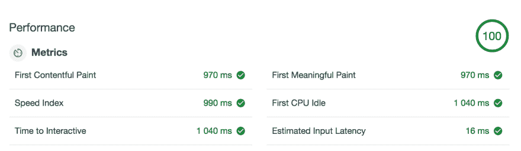

# Lighthouse 3.0 发布了:Drupal 8.5 拥有杀手级的性能

> 原文：<https://dev.to/fgm/lighthouse-3-0-is-out-drupal-8-5-has-killer-performance-3gl7>

灯塔 3.0 问世:Drupal 8.5 拥有杀手级性能 Frederic MarandSun，2018-08-05 18:08

[计算](https://blog.riff.org/topic/computing)

*   [DRUPAL-8](https://blog.riff.org/tags/drupal8)
*   [性能](https://blog.riff.org/tags/performance)
*   [铬合金](https://blog.riff.org/tags/chrome)

如果你是这里的常客，你可能已经注意到了，我刚刚把这个网站的主题更新为基于 Bartik 的自定义主题。由于 Chrome 刚刚更新，我进行了最新的性能审计。

[T2】](https://res.cloudinary.com/practicaldev/image/fetch/s--UpqlX-_5--/c_limit%2Cf_auto%2Cfl_progressive%2Cq_auto%2Cw_880/https://blog.riff.org/sites/default/files/2018-08/Drupal8-Lighthouse3-100.png)

还有什么好说的？