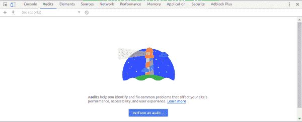
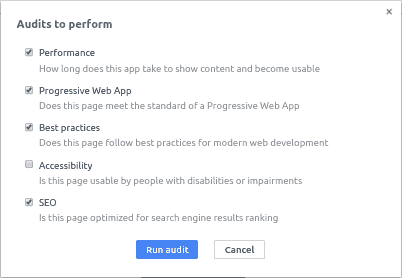
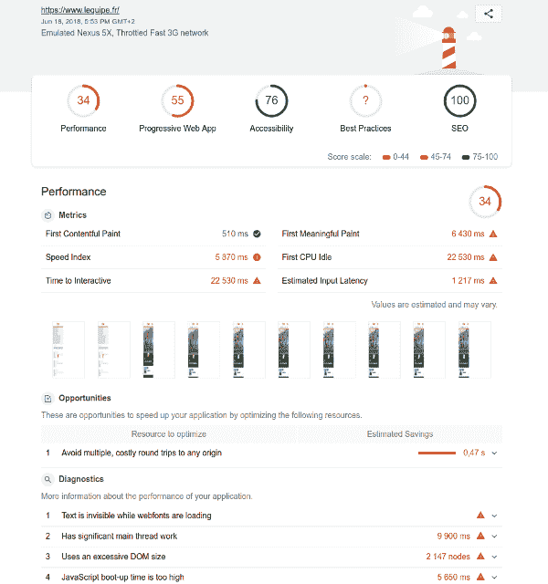
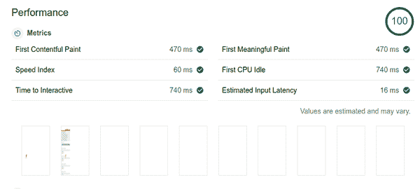
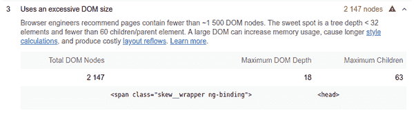

# light house:Chrome 和 DevTools 中包含的强大工具

> 原文：<https://dev.to/damienjubeau/lighthouse-a-powerful-tool-included-in-chrome-and-devtools-a64>

*这篇文章最初见于 [Dareboost 的博客](https://blog.dareboost.com/en/2018/06/lighthouse-tool-chrome-devtools/)。*

* * *

Lighthouse 于 2016 年作为 Chrome 扩展发布，现在也可以通过“审计”标签直接在 Chrome DevTools 中使用。对于对 web 性能和质量感兴趣的开发人员来说，Lighthouse 是一个很好的资源。

## 灯塔，快速概览

如果你熟悉 Chrome DevTools，用 Lighthouse 审计一个网页是非常简单的。浏览到 Chrome 页面，打开 DevTools (Ctrl+Shift+i 或⌥+⌘+i，取决于你的系统)，然后进入“审计”部分。
 
点击“执行审计”将允许您根据自己的兴趣(性能、搜索引擎优化、可访问性等)配置审计级别。).
 
您将能够看到页面正在加载和重新加载，过一会儿，一个新窗口将显示您的审计报告。

如果您的 Chrome 版本低于 69(撰写本文时的当前版本是 67)，这个操作将触发 Lighthouse 2。你可以使用 Chrome 商店上的 Lighthouse 扩展来测试 Lighthouse 3。在这个测试中，我们使用了扩展。因此，下文提到了灯塔 3。[T2】](https://res.cloudinary.com/practicaldev/image/fetch/s--YjMrzSUn--/c_limit%2Cf_auto%2Cfl_progressive%2Cq_auto%2Cw_880/https://blog.dareboost.com/wp-content/uploads/2018/06/lighthouse-audit-report-1.png)

*注意:在我们使用 **Lighthouse** 3.0.0-beta.0 的测试中，截图并不符合预期的视图，可能会影响速度指数的计算。*

当 Lighthouse 完成对您的页面的评估后，您会得到一份审计报告，该报告以几个分数开始(分数与审计配置期间选择的类别一样多)。

性能分数是根据您的速度测试结果计算出来的，将您的网站速度与其他网站进行比较。获得 100 分意味着测试的网页比 98%或更多的网页都快。50 分意味着网页比 75%的网页快。[ [来源](https://developers.google.com/web/tools/lighthouse/v3/scoring#perf)

其他分数取决于页面与相关最佳实践的一致性(您可能会注意到一个“最佳实践”类别:这个名称有点误导，因为其他类别也提供一些最佳实践，“杂项”可能更合适)。

在我们的例子中，显示的是一个问号而不是分数。当一些相关的测试没有被正确执行并被标记为“错误！”时，您会得到这种行为。

在分数概述之后，您会发现 6 个指标的性能结果，工具提示提供了快速解释:

*   **第一次内容绘制:**第一次内容绘制标记第一个文本/图像被绘制的时间。
*   **第一次有意义的绘画:**第一次有意义的绘画测量页面的主要内容何时可见。
*   **速度指数:**速度指数显示了网页内容的可视化填充速度。
*   **第一次 CPU 空闲:**第一次 CPU 空闲标志着页面的主线程第一次安静到足以处理输入。
*   **交互时间:**交互标记页面完全交互的时间。
*   **估计输入延迟:**上面的分数是在页面加载最繁忙的 5s 窗口内，你的应用程序响应用户输入所需时间的估计值，以毫秒为单位。如果你的延迟超过 50 毫秒，用户可能会认为你的应用程序滞后。

请注意，其中一些指标仍处于非常早期的阶段。例如，如其[初始规范](https://docs.google.com/document/d/1BR94tJdZLsin5poeet0XoTW60M0SjvOJQttKT-JK8HI/view#)中所述:第一个有意义的油漆[..]在 198 页的 77%中匹配用户感知的第一幅有意义的绘画。收集的指标在灯塔 V2 和 V3 之间发生了显著变化。我们将在下一篇文章中详细介绍这一点。不过，如果你渴望知道，你可以[查看更新公告](https://developers.google.com/web/updates/2018/05/lighthouse3#scoring)。

在报告中，你接下来会发现一个幻灯片:页面加载的一步一步的图像。这对于确保页面按预期加载特别有用。例如，在我们的基准测试中，我们得到了一个有差异的报告。多亏了电影胶片，我们已经能够确认出了问题:
 
不幸的是，我们无法了解出了什么问题。当使用 Lighthouse 进行复杂的工作时，人们可能会对缺乏细节感到遗憾。如果不能访问页面负载瀑布，您就无法更深入地了解这里发生了什么。

完成性能概述后，您将获得每个类别的最佳实践。大多数提示都非常专业，在报告中没有详细介绍，但是您可以在“了解更多”链接中找到非常有价值的资源。
 
让 Lighthouse 成为一个伟大的审计工具的还有自动化控件的数量:大约一百个。Lighthouse 还强调了一些“需要手动检查的附加项目”，这将是宝贵的提醒(例如，在可访问性类别“页面有一个逻辑 tab 键顺序”)。

请注意，一些最佳实践在几个类别中重复出现，例如，与[混合内容](https://blog.dareboost.com/en/2015/04/chrome-firefox-and-google-search-https-forcing-its-way#mixed-content)相关的控件出现在“渐进式 Web 应用”类别以及“最佳实践”类别中。

## 权力越大，责任越大

Lighthouse 绝对是一个很好的资源，因为它可以提供性能指标和质量控制，因为它可以直接在 Chrome 中获得。这最后的优势也可能是你最大的敌人！
在您的台式计算机上进行性能测试时，您依赖于本地环境中的大量参数，很难获得足够稳定的结果:

*   **互联网连接:**你确定没有任何消耗带宽的后台应用？如果你和其他人分享这种联系，你确定没有人在抄袭你的测试吗？如果你的互联网服务提供商提供的连接足够稳定？
*   **CPU:** 你确定你的其他电脑使用情况没有影响到你的跑步测试吗？
*   Chrome 扩展:正如艾门鲁基尔[指出的那样](https://twitter.com/LoukilAymen/status/1001823010544898048?s=20)它们会深深影响你的搜索结果。要特别小心与广告拦截相关的扩展！
*   **用户状态:**你确定你的 Lighouse 测试是以干净的状态开始的吗？你的 cookies 呢，你的本地存储的状态，打开的套接字(你可以在 chrome://net-internals/# sockets 上查看)等等。
*   灯塔版本:自从你上次报告后，灯塔可能已经更新了，你检查过变更日志了吗？注意扩展是默认自动更新的，通过 DevTools 可以获得的版本会在更新 Chrome 时更新。

前两点由最新的 Lighthouse 版本(3.0)处理，一个新的模式“*模拟性能审计的节流(更快)*”。Lighthouse 不再依赖 Chrome DevTools 进行流量整形，而是使用了一个新的内部审计引擎:Lantern。它的目标是在不损失太多准确性的情况下减少性能指标的可变性。这种方法非常有趣。对于进一步的细节，一个公开的[概述](https://docs.google.com/presentation/d/1EsuNICCm6uhrR2PLNaI5hNkJ-q-8Mv592kwHmnf4c6U)以及一个[详细分析](https://docs.google.com/document/d/1ktXDwJkF_7w0MPLSKFZqmKdMs5TLZqc7em45XkOObAg)是可用的。让我们看看将来它在规模上能有多可靠！
无论你使用的是什么版本的 Lighthouse，都要记住当地环境和条件的影响。

Dareboost 作为[合成监控解决方案](https://www.dareboost.com/en/tool/website-monitoring)尤其清楚这些利害关系。对于 Dareboost 上的每一次测试，我们都在创建一个新的干净的 Chrome 用户档案，并打开一个新的 Chrome 实例。我们的每个测试区域都使用完全相同的基础设施和网络条件。我们不会在我们的虚拟机上并行测试，以避免任何相互依赖或瓶颈。

如果您还不相信需要一个专用环境来运行您的性能测试，我们已经运行了一个小实验。

我们从办公室对 Apache.org 进行了 3 次灯塔审计(光纤连接-到 Apache.org 的平均 ping 值为 40 毫秒)。以下是 Lighthouse 结果的中值:

| 绩效得分 | 第一幅令人满意的画 | 速度指数 | 互动时间到了 |
| --- | --- | --- | --- |
| eighty-five | One thousand six hundred and ninety | One thousand seven hundred and thirty | Five thousand three hundred and eighty |

同样的练习，但是通过我们的连接增加了 500 毫秒的延迟(使用 tc Unix 命令):

| 绩效得分 | 第一幅令人满意的画 | 速度指数 | 互动时间到了 |
| --- | --- | --- | --- |
| Sixty-seven | Two thousand seven hundred and eighty | Three thousand eight hundred and eighty | Seven thousand three hundred and twenty |

我们的性能得分有 21%的变化，而速度指数在第二种情况下增加了一倍多。我们使用 Lantern 模式(模拟灯塔节流)获得这些结果，该模式实际上旨在减轻本地网络的可变性。

希望您自己的网络延迟不会有如此大的变化。但是请记住，延迟只是您的本地环境中许多可变参数中的一个！

对于临时需求，Dareboost 提供了一个免费版本，以受益于稳定可靠的环境，每月最多 5 次性能测试。[试试看](https://www.dareboost.com/en)！

当使用 Lighthouse 时，如果您希望比较几个报告，请记住您的上下文和相关偏见的易变性！

## 一些额外的专业技巧

*   Lighthouse 是一个开源项目，可以在 [Github 库](https://github.com/GoogleChrome/lighthouse/issues?utf8=%E2%9C%93&q=is%3Aissue+is%3Aopen+capture)上获得。你可以深入研究代码以了解更多，bug 追踪器将会非常有用。
*   该工具还可以通过命令行界面执行。
*   您可以通过使用 [HTTP Archive](https://httparchive.org/) 在数千页上收集数据，在 web 的规模上探索 Lighthouse 结果。
*   如果您使用的是 Lighthouse v2(节流连接，而不是 Lantern 仿真)，请记住您使用的是 Chrome DevTools 流量整形功能。延迟是在 HTTP 级别注入的，不像 Dareboost 或 WebPageTest 是在 TCP 级别注入的。因此，Chrome DevTools 不会增加 TCP 连接和 SSL 握手的延迟。

* * *

总之，Lighthouse 是一个有用且有前途的工具。像之前测试的另外两个谷歌工具一样，它可以提供谷歌速度更新策略的线索。